# AQS

***

## Java并发编程：AQS（AbstractQueuedSynchronizer）

***

### 1. 概述与定义 🌟

**AbstractQueuedSynchronizer（AQS）** 是Java并发包中的一个抽象类，位于`java.util.concurrent.locks`包下，为构建锁和同步器提供了一个通用框架。它通过管理一个共享的同步状态（state）和一个先进先出（FIFO）的等待队列，协调多线程间的同步行为。AQS的核心思想是将锁的获取、释放和线程排队等复杂逻辑抽象出来，开发者只需继承AQS并实现少量方法（如`tryAcquire`和`tryRelease`），即可创建自定义的同步工具。

AQS的核心组件包括：

- 一个`volatile int`类型的`state`变量，表示同步状态。
- 一个基于CLH（Craig, Landin, and Hagersten）队列的双向链表，用于管理等待线程。
- CAS（Compare-And-Swap）操作和线程的park/unpark机制，用于高效更新状态和调度线程。

形象地说，AQS就像一个“锁的工厂”，提供了锁的骨架和流水线，具体锁的特性（如可重入性、公平性）由子类决定。常见的并发工具如`ReentrantLock`、`Semaphore`、`CountDownLatch`和`ReentrantReadWriteLock`都基于AQS实现。理解AQS不仅能帮助你掌握这些工具的底层原理，还能在面试中展示对并发安全的深刻理解。

***

### 2. 主要特点 📌

AQS作为Java并发编程的核心组件，具有以下几个显著特点，面试中可以快速抓住这些要点展示专业性：

- **通用性**：AQS支持独占模式（如锁）和共享模式（如信号量），适用于多种同步场景。
- **高效性**：基于CAS和park/unpark机制，减少线程切换开销，提升高并发性能。
- **灵活性**：支持中断、超时和公平性选择，满足复杂需求。
- **可扩展性**：通过继承和方法重写，开发者可轻松实现自定义同步器。
- **线程安全**：使用volatile和CAS保证状态更新的原子性和可见性。

为了更直观地对比AQS与传统`synchronized`，我整理了以下表格：

| **特性**​ | **AQS**​    | **synchronized**​ |
| ------- | ----------- | ----------------- |
| 实现方式    | 基于CAS和队列的框架 | 基于Monitor的JVM内置锁  |
| 灵活性     | 高，支持自定义逻辑   | 低，行为固定            |
| 性能      | 高，减少阻塞开销    | 早期重量级，后优化         |
| 中断支持    | 支持          | 不支持               |
| 超时支持    | 支持          | 不支持               |
| 公平性     | 可选（公平/非公平）  | 非公平               |

**表格说明**：此表格展示了AQS在灵活性和性能上的优势。面试中可以用它说明：“AQS通过队列和CAS实现高效同步，比synchronized更灵活，尤其在高并发场景下性能更优。”

***

### 3. 应用目标 🎯

AQS在Java并发编程中的应用目标明确，以下几点是其核心价值，也是面试中常被考察的重点：

- **简化同步工具开发**：提供通用框架，降低实现锁和同步器的复杂度。
- **提升并发性能**：通过高效的状态管理和线程调度，减少锁竞争开销。
- **支持多样化同步模式**：包括独占模式、共享模式和条件等待，适应不同场景。
- **增强灵活性**：支持中断、超时和公平性配置，提升用户体验。
- **统一并发工具实现**：为Java并发包中的工具提供一致的底层支持。

**示例**：`ReentrantLock`是AQS的典型应用，支持可重入锁：

```java 
import java.util.concurrent.locks.ReentrantLock;

public class ReentrantLockDemo {
    private final ReentrantLock lock = new ReentrantLock();

    public void method() {
        lock.lock();
        try {
            System.out.println("线程 " + Thread.currentThread().getName() + " 获取锁");
        } finally {
            lock.unlock();
        }
    }
}
```


**说明**：`ReentrantLock`通过AQS的独占模式实现锁的获取和释放，`state`记录重入次数，支持灵活的锁行为。

***

### 4. 主要内容及其组成部分 📚

AQS包含多个核心组成部分，以下逐一展开，确保内容详尽且易于背诵。

#### 4.1 同步状态（state）

- **定义**：AQS维护一个`volatile int`类型的`state`变量，表示同步状态。
- **作用**：`state`的含义由子类定义。例如，在`ReentrantLock`中，`state=0`表示无锁，`state>0`表示锁被持有且记录重入次数；在`Semaphore`中，`state`表示可用许可数。
- **操作**：通过`getState()`、`setState()`和`compareAndSetState()`方法访问和修改，CAS确保原子性。
- **补充说明**：`volatile`保证`state`的可见性，线程修改后立即对其他线程可见。

#### 4.2 等待队列（CLH队列）

- **定义**：AQS使用一个FIFO双向链表（CLH队列）管理等待锁的线程。
- **节点结构**：每个节点（`Node`）包含：
  - `thread`：等待的线程引用。
  - `prev`：前驱节点。
  - `next`：后继节点。
  - `waitStatus`：等待状态（如CANCELLED、SIGNAL）。
- **入队**：线程获取锁失败时，封装为Node加入队列尾部。
- **出队**：锁释放时，唤醒队列头部的线程。

**队列结构图**：


**图表说明**：此图展示AQS等待队列的结构，Head和Tail是哨兵节点，Node1和Node2是等待线程。面试中可以用此图解释线程如何排队等待锁。

#### 4.3 独占模式与共享模式

- **独占模式**：一次只有一个线程能获取锁，典型实现如`ReentrantLock`。
  - `tryAcquire`：尝试获取锁。
  - `tryRelease`：尝试释放锁。
- **共享模式**：多个线程可同时获取锁，典型实现如`Semaphore`。
  - `tryAcquireShared`：尝试共享获取锁。
  - `tryReleaseShared`：尝试共享释放锁。
- **实现**：子类重写这些方法定义具体逻辑，AQS负责队列管理和线程调度。

**示例**：自定义独占锁：

```java 
public class SimpleLock extends AbstractQueuedSynchronizer {
    @Override
    protected boolean tryAcquire(int arg) {
        return compareAndSetState(0, 1);
    }

    @Override
    protected boolean tryRelease(int arg) {
        setState(0);
        return true;
    }

    public void lock() { acquire(1); }
    public void unlock() { release(1); }
}
```


**说明**：`state=0`表示锁空闲，`state=1`表示锁被持有，CAS确保原子性。

#### 4.4 条件队列（Condition）

- **定义**：AQS通过`ConditionObject`支持条件等待。
- **作用**：线程获取锁后可等待特定条件，如`await()`和`signal()`。
- **流程**：
  1. `await()`：线程释放锁，加入条件队列，状态变为WAITING。
  2. `signal()`：将条件队列中的线程移回等待队列，等待重新获取锁。
- **补充说明**：条件队列与等待队列分离，支持多个条件变量。

**示例**：

```java 
import java.util.concurrent.locks.*;

public class ConditionDemo {
    private final ReentrantLock lock = new ReentrantLock();
    private final Condition condition = lock.newCondition();

    public void await() throws InterruptedException {
        lock.lock();
        try {
            System.out.println("等待条件");
            condition.await();
        } finally {
            lock.unlock();
        }
    }

    public void signal() {
        lock.lock();
        try {
            System.out.println("发送信号");
            condition.signal();
        } finally {
            lock.unlock();
        }
    }
}
```


**说明**：`Condition`提供类似`wait()`和`notify()`的协作机制，但更灵活。

#### 4.5 核心方法

- **acquire(int arg)**：独占模式获取锁，失败则入队等待。
- **release(int arg)**：独占模式释放锁，唤醒队列头部线程。
- **acquireShared(int arg)**：共享模式获取锁。
- **releaseShared(int arg)**：共享模式释放锁。
- **tryAcquire(int arg)**：子类实现的独占获取逻辑。
- **tryRelease(int arg)**：子类实现的独占释放逻辑。

***

### 5. 原理剖析 🔍

#### 5.1 同步状态的原子性

AQS通过`Unsafe`类的CAS操作（如`compareAndSetState`）更新`state`，确保多线程下的原子性。CAS是乐观锁的核心，基于硬件指令（cmpxchg）实现，避免传统锁的开销。

#### 5.2 等待队列的实现

- **入队流程**：
  1. 创建Node节点，封装当前线程。
  2. 使用CAS将Node加入队列尾部（tail）。
  3. 若失败，自旋重试。
- **出队流程**：
  1. 锁释放时，检查队列头部节点。
  2. 调用`LockSupport.unpark()`唤醒线程。
- **线程状态**：
  - `CANCELLED`：线程取消。
  - `SIGNAL`：等待唤醒。
  - `CONDITION`：在条件队列中。

#### 5.3 park/unpark机制

- **park()**：`LockSupport.park()`挂起线程，底层调用操作系统原语（如pthread\_cond\_wait）。
- **unpark()**：`LockSupport.unpark()`唤醒线程，比`synchronized`的Monitor更轻量。
- **优势**：支持精确唤醒特定线程，避免`synchronized`中`notify()`的随机性。

#### 5.4 独占与共享模式的区别

- **独占模式**：`state`从0变为1，标记锁被占用。
- **共享模式**：`state`表示可用资源数，允许多线程同时持有。

**状态转换图**：

```mermaid 
stateDiagram-v2
    [*] --> TryAcquire : 尝试获取锁
    TryAcquire --> Running : 获取成功
    TryAcquire --> Queued : 获取失败
    Queued --> Blocked : park()
    Blocked --> TryAcquire : unpark()
    Running --> Released : release()
    Released --> [*]
```




**图表说明**：此图展示线程在AQS中获取和释放锁的状态转换。面试中可以用它解释线程如何排队和唤醒。

***

### 6. 应用与拓展 🌐

- **ReentrantLock**：可重入锁，支持公平性和非公平性。
- **Semaphore**：信号量，控制并发访问资源。
- **CountDownLatch**：倒计数器，等待多线程完成。
- **线程池**：`ThreadPoolExecutor`使用AQS管理工作线程状态。

**示例**：自定义计数器：

```java 
public class CustomLatch extends AbstractQueuedSynchronizer {
    public CustomLatch(int count) {
        setState(count);
    }

    @Override
    protected int tryAcquireShared(int arg) {
        return getState() == 0 ? 1 : -1;
    }

    @Override
    protected boolean tryReleaseShared(int arg) {
        for (;;) {
            int state = getState();
            if (state == 0) return false;
            if (compareAndSetState(state, state - 1)) return true;
        }
    }

    public void countDown() { releaseShared(1); }
    public void await() throws InterruptedException { acquireSharedInterruptibly(1); }
}
```


**说明**：此计数器类似`CountDownLatch`，`state`减到0时唤醒等待线程。


