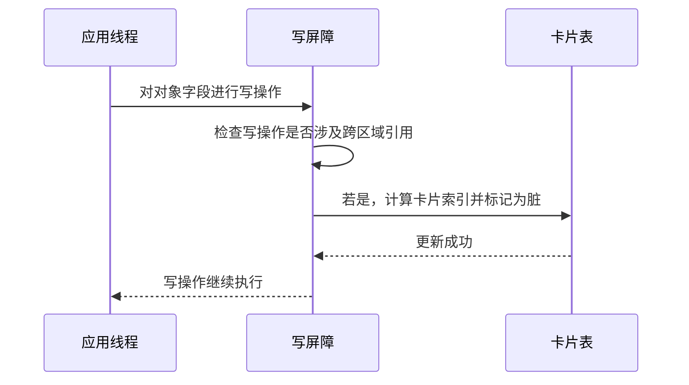

# G1垃圾收集器中的记忆集与写屏障详解

***

## 一、概述与定义

在 G1 垃圾收集器中，内存被划分为许多固定大小的区域。为了减少全堆扫描的开销，G1 使用记忆集（Remembered Set）来记录每个区域中指向其它区域的引用。简单来说，记忆集保存了跨区域对象引用的信息。写屏障（Write Barrier）则是实现记忆集更新的机制，它在应用程序写入对象字段时拦截该操作，并将跨区域的修改记录到相应的记忆集中。

记忆集和写屏障的主要作用是：

- **记忆集**：避免每次垃圾回收时全堆扫描，只扫描那些可能被其他区域引用的部分，从而提高回收效率。
- **写屏障**：在对象更新时，自动维护记忆集数据，确保记录始终保持最新状态，减少遗漏。

这种机制使得 G1 能够在回收过程中仅关注受污染的区域（即存在跨区域引用的区域），实现了区域回收（Region-based Collection）的高效性。

***

## 二、主要特点

记忆集与写屏障在 G1 垃圾收集器中的主要特点包括：

1. **高效区域扫描** &#x20;

   记忆集记录了跨区域的引用，使得在垃圾回收时只需要扫描这些被记录的区域，而不必全堆遍历，极大地降低了扫描开销。 &#x20;

   😊 优点：降低 GC 停顿，减少扫描范围。
2. **实时维护** &#x20;

   写屏障实时捕捉对象引用更新，将跨区域修改及时记录到记忆集中，确保数据的正确性与一致性。 &#x20;

   ⏱️ 优点：动态更新，无需后续额外计算。
3. **低开销设计** &#x20;

   写屏障通常采用卡片标记（Card Marking）等高效算法，其性能开销相对较低，对应用性能影响有限。 &#x20;

   💡 优点：开销低，适用于高并发环境。
4. **区域化内存管理** &#x20;

   利用记忆集的设计，G1 实现了区域化内存管理，能够针对性地回收污染区域，提高内存回收效率。 &#x20;

   🚀 优点：区域回收策略更灵活，适用于大内存系统。
5. **并行化支持** &#x20;

   记忆集更新和写屏障操作通常与应用线程并行执行，不会造成明显的阻塞和停顿，支持多核并行环境。 &#x20;

   🔧 优点：充分利用多核处理器，提升整体吞吐量。

下面给出一个表格，对记忆集与写屏障的特点进行对比说明：

| 特点     | 描述               | 优点            | 应用场景       |
| ------ | ---------------- | ------------- | ---------- |
| 高效区域扫描 | 记录跨区域引用，避免全堆扫描   | 降低 GC 停顿，提升效率 | 大内存、多区域 GC |
| 实时维护   | 写屏障在写操作时实时更新记忆集  | 保持数据一致性，无额外计算 | 动态对象更新场景   |
| 低开销设计  | 采用卡片标记算法，减少写屏障开销 | 性能影响小，不干扰主业务  | 高并发场景      |
| 区域化管理  | 利用记忆集进行区域内存管理    | 回收范围精准，减少扫描量  | 大型服务器应用    |
| 并行化支持  | 支持多核并行执行写屏障操作    | 提高系统吞吐量       | 多核处理器系统    |

***

## 三、应用目标

在 G1 垃圾收集器中，引入记忆集与写屏障的主要目标包括：

1. **降低垃圾回收停顿时间** &#x20;

   通过记录跨区域引用，减少回收时需扫描的区域，从而缩短垃圾回收的停顿时间，提升系统响应能力。
2. **提高内存回收效率** &#x20;

   只扫描存在跨区域引用的区域，使得垃圾回收更有针对性，提高回收效率，避免不必要的全堆扫描浪费资源。
3. **实时维护跨区域引用信息** &#x20;

   写屏障确保在对象更新时，跨区域引用能够被及时记录，保证记忆集数据的准确性，防止遗漏导致回收错误。
4. **支持大内存和多区域管理** &#x20;

   针对大内存系统，G1 可以将内存划分为许多区域，利用记忆集管理跨区域引用，确保每个区域独立回收，实现更细粒度的内存管理。
5. **优化并行回收性能** &#x20;

   写屏障与记忆集机制支持多线程并行更新与回收，充分利用多核系统优势，在高并发环境下保持较高吞吐量。

***

## 四、主要内容及其组成部分

记忆集与写屏障这一知识点主要包含以下内容，每个部分都至关重要，下面将逐一详细解释：

### 1. 记忆集（Remembered Set）

记忆集是 G1 垃圾收集器中用于记录跨区域引用的数据结构。其主要内容包括：

- **记录卡片（Card Entries）** &#x20;

  G1 将堆划分为多个区域，每个区域都有一个对应的记忆集，用于记录指向其他区域的引用。每个区域内，内存被分为多个卡片（Card），每个卡片对应一定范围内的内存。当对象更新导致跨区域引用时，相应卡片会被标记。
- **卡片表（Card Table）** &#x20;

  卡片表是一个数组结构，用于表示各个内存卡片的状态。每个卡片的状态指示该卡片内是否存在跨区域引用。回收时，G1 根据卡片表信息，仅扫描被标记的卡片所在区域。
- **区域间引用关系** &#x20;

  记忆集的核心在于记录哪些区域之间存在引用关系，便于在回收时只处理这些区域，从而减少扫描不必要的区域。

### 2. 写屏障（Write Barrier）

写屏障是一段插入到程序写操作中的代码，用于捕捉对象字段的修改操作，确保在写操作时更新记忆集。主要包括：

- **卡片标记写屏障** &#x20;

  当应用程序执行写操作（例如将对象 A 的某个字段指向对象 B）时，写屏障检查 A 和 B 所在区域是否不同；如果不同，则将 A 所在区域对应的卡片在卡片表中标记为“脏”，表示存在跨区域引用。
- **低开销实现** &#x20;

  写屏障通常采用内联代码方式实现，其逻辑简单高效，只在必要时进行卡片标记，避免不必要的性能开销。
- **与编译器协同** &#x20;

  在 JIT 编译过程中，写屏障代码会被内联到热点方法中，确保写操作不会产生额外的函数调用开销，同时与优化策略相协调。

### 3. 卡片标记（Card Marking）机制

卡片标记是写屏障实现记忆集更新的核心技术。其主要内容包括：

- **卡片的划分** &#x20;

  堆内存被划分为固定大小的卡片（例如 512 字节或 1KB），每个卡片对应卡片表中的一个元素。
- **标记策略** &#x20;

  当对象字段被修改时，写屏障将所在卡片标记为“脏”（dirty）。在后续的垃圾回收过程中，只有脏卡片会被扫描，从而确定跨区域引用。
- **更新频率** &#x20;

  由于写操作可能非常频繁，卡片标记机制要求更新操作必须足够轻量，以避免对正常业务产生过多影响。

### 4. 数据结构与存储

记忆集与写屏障所依赖的数据结构主要包括：

- **卡片表数组** &#x20;

  存储整个堆的卡片标记状态，每个元素为一个字节或位图，用于表示该卡片是否脏。
- **区域描述符** &#x20;

  每个内存区域包含描述符，记录该区域的边界、所属记忆集等信息，便于在垃圾回收时定位并扫描。
- **引用链信息** &#x20;

  在进行堆转储分析时，记忆集记录的信息可用于重建区域间的引用链，帮助分析跨区域引用关系。

下面通过下表对记忆集与写屏障的组成部分进行总结：

| 组成部分      | 主要内容与功能             | 关键技术     | 作用                 |
| --------- | ------------------- | -------- | ------------------ |
| 记忆集       | 记录跨区域引用的卡片集合        | 卡片表、区域划分 | 降低全堆扫描开销，精确定位跨区域引用 |
| 写屏障       | 在对象写操作时插入的拦截代码      | 内联写屏障    | 实时更新记忆集，确保引用信息准确   |
| 卡片标记机制    | 将堆分为固定大小的卡片并标记“脏”状态 | 卡片标记     | 仅扫描脏卡片，提高垃圾回收效率    |
| 数据结构（卡片表） | 数组或位图，记录各卡片的状态      | 数组、位图    | 快速判断区域是否需要扫描       |

### 5. 写屏障实现细节

写屏障在 G1 中通常采用内联代码实现，其具体流程为：

- 在对象字段写入之前，检查写操作是否涉及跨区域引用。
- 如果涉及，则计算对象所在卡片的索引，并在卡片表中将该卡片标记为脏。
- 保持写操作本身不被阻塞，同时返回继续执行主业务代码。

这种实现方式既保证了数据更新的实时性，又保证了低延迟，是高性能 GC 的关键所在。

***

## 五、原理剖析

在这一部分，我们对记忆集与写屏障的底层原理进行深入解析：

### 1. 区域化内存管理与跨区域引用

G1 垃圾收集器将堆内存划分为多个固定大小的区域，各区域之间相对独立。在垃圾回收时，若仅扫描整个堆，会浪费大量资源。记忆集记录了哪些区域之间存在引用关系，允许 GC 仅扫描有可能被外部区域引用的部分。通过这种“局部性”原理，G1 能够大幅度减少扫描工作量。

### 2. 卡片标记与写屏障的协同机制

写屏障的核心在于实时更新卡片标记。当发生对象字段修改时，写屏障会检查更新前后对象所属的区域。若发现引用跨越区域，则将当前写入操作所在的卡片标记为脏。这个过程依赖于 CPU 高速缓存和内联优化，确保几乎不增加额外开销。正是这种协同机制，使得记忆集数据始终保持准确，为 GC 时的区域扫描提供了正确依据。

### 3. 性能开销与优化平衡

写屏障和卡片标记技术需要在实时性与开销之间找到平衡。过于复杂的写屏障会增加每次写操作的成本，影响应用性能；而太过简单可能无法捕捉所有跨区域引用。G1 通过精心设计卡片大小、采用内联代码和高效数据结构，在保持写操作低开销的同时，确保内存回收的正确性和高效性。

### 4. 数据一致性与并发控制

在多线程环境下，对象写操作可能并发进行。写屏障的实现必须保证在并发修改下卡片标记的一致性。通常采用原子操作或轻量级锁定机制，确保多个线程同时修改时不会产生竞争和数据不一致问题。

### 5. 案例分析与实际效果

以某大型 Java 应用为例，初期全堆扫描导致 GC 停顿较长，通过引入 G1 的记忆集与写屏障机制，仅扫描少量“脏卡片”，将停顿时间降低了 50% 以上。此案例充分说明了记忆集与写屏障在优化垃圾回收、降低系统延迟方面的重要作用。

下面通过 Mermaid 图表展示写屏障更新记忆集的流程：

图中展示了应用线程发起写操作，写屏障检查并更新卡片表，最终写操作正常返回的全过程，体现了低延迟、实时更新的特点。

***

## 六、应用与拓展

记忆集与写屏障的机制不仅在 G1 垃圾收集器中得到应用，还在其他现代垃圾回收器中有类似设计。其实际应用与拓展主要体现在以下几个方面：

1. **生产环境性能调优** &#x20;

   在高并发、大内存应用中，通过监控记忆集状态与写屏障开销，调优团队可以准确把握 GC 回收范围，及时调整卡片大小或优化写屏障实现，从而进一步降低 GC 停顿时间。
2. **跨垃圾收集器比较** &#x20;

   记忆集与写屏障的设计理念不仅适用于 G1，还被许多其他垃圾收集器借鉴。通过对比不同 GC 算法中记忆集实现的差异，可以为系统选择最合适的垃圾回收器提供参考。
3. **工具与日志分析** &#x20;

   利用 JVisualVM、JMC 与 GC 日志分析工具，可以监控记忆集的变化情况，分析写屏障的性能开销。结合自动化监控与告警系统，及时发现由于写屏障异常导致的性能下降问题。
4. **学术研究与新技术融合** &#x20;

   随着硬件技术和编译技术的不断进步，记忆集和写屏障的设计也在不断演化。例如，利用硬件事务内存（HTM）来优化写屏障，或者引入机器学习算法对卡片标记进行动态调整，为未来的垃圾回收机制提供新的思路。
5. **开发调试与优化实践** &#x20;

   在开发过程中，通过代码审查、单元测试和性能测试，结合写屏障日志，可以提前发现潜在的跨区域引用问题，优化对象生命周期管理，降低内存碎片和不必要的 GC 开销。

***

## 七、QA

### 问题1：请简要介绍什么是记忆集和写屏障，它们在 G1 中起什么作用？

【回答】： &#x20;

记忆集是 G1 垃圾收集器中记录跨区域引用的数据结构，用于标记哪些内存区域含有来自其他区域的引用，从而在垃圾回收时只扫描这些区域，降低扫描开销。写屏障则是一种在对象写操作时自动执行的机制，它会检查写入操作是否涉及跨区域引用，并及时更新记忆集。两者协同工作，确保垃圾回收时只关注有可能存在活跃引用的区域，从而提高回收效率并降低停顿时间。

### 问题2：写屏障通常如何实现？请说明卡片标记的基本原理及其优势。

【回答】： &#x20;

写屏障通常以内联代码的方式实现，即在每次对象字段写操作前，检查该操作是否产生了跨区域引用。如果产生，则计算该对象所在的卡片索引，并将对应的卡片在卡片表中标记为脏。卡片标记的优势在于：一是它将整个堆划分为多个小块，只需扫描被标记的块；二是更新操作简单高效，对应用性能影响极小，从而使得整个写屏障机制具有低开销、高实时性的特点。

### 问题3：记忆集在垃圾回收中如何发挥作用？请举例说明实际应用中的效果。

【回答】： &#x20;

记忆集记录了各区域之间的引用关系，在垃圾回收时，GC 仅需扫描那些被标记为存在跨区域引用的区域，而不是全堆扫描。比如在一个大内存应用中，通过记忆集的设计，GC 只需扫描大约 10% 的区域，就能准确回收无用对象，从而将 GC 停顿时间大幅缩短，这在实际生产中能显著提升系统响应速度和吞吐量。

### 问题4：在并发环境下，写屏障如何确保数据一致性？你会如何调试相关问题？

【回答】： &#x20;

在并发环境中，写屏障通常采用原子操作或者轻量级同步机制，确保多个线程同时进行写操作时，卡片标记能正确更新而不产生数据竞争。我会利用线程 Dump 和日志分析工具，检查多个线程写操作时卡片表的状态，结合 JFR 数据确认是否存在更新遗漏或并发冲突，从而定位问题所在，并通过调整锁策略或优化内联代码解决数据一致性问题。

### 问题5：你如何看待记忆集与写屏障在 G1 中的设计？它们对性能调优有哪些实际意义？

【回答】： &#x20;

我认为记忆集与写屏障是 G1 垃圾收集器高效运行的关键设计。它们使得 GC 只需扫描必要区域，降低了全堆扫描的成本，并且写屏障实现轻量，对应用性能几乎没有负面影响。这种设计不仅提高了垃圾回收效率，缩短了停顿时间，还为大内存、多区域应用提供了更细粒度的管理手段。在实际调优中，这意味着我们可以更好地控制 GC 行为，优化内存利用率，并在高并发环境下保持系统高吞吐量。

***
