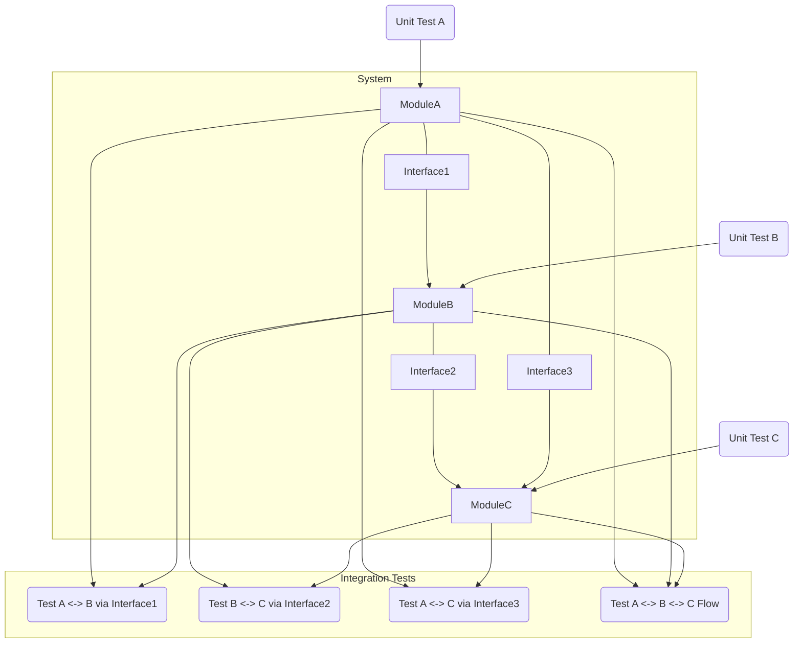

# 二、 测试方法 (Test Methods)

测试执行的具体技术。

### Q：黑盒测试的方法有哪些？

不关心内部实现，只关注输入输出。

- **等价类划分 (Equivalence Partitioning):** 将输入划分为有效/无效等价类，选代表测试。
- **边界值分析 (Boundary Value Analysis):** 测试等价类边界及附近的值。
- **判定表 (Decision Table):** 处理复杂条件组合的输入和预期输出。

*示例：* 支付方式与用户等级折扣
| condition    | Rule 1 | Rule 2 | Rule 3 | Rule 4 |
| ----------- | ------ | ------ | ------ | ------ |
| 支付方式 = 信用卡  | T      | T      | F      | F      |
| 用户等级 = VIP  | T      | F      | T      | F      |
| 动作 (Action)|
| 折扣 = 10%    | X      |        | X      |        |
| 折扣 = 5%     |        | X      |        |        |
| 无折扣         |        |        |        | X      |

- **状态迁移测试 (State Transition Testing):** 基于对象状态变化路径设计测试。
```mermaid
graph LR
    A(Logged Out) -- Login --> B(Logged In);
    B -- View Profile --> C(Profile Page);
    C -- Edit --> D(Editing Profile);
    D -- Save --> C;
    D -- Cancel --> C;
    B -- Logout --> A;
    C -- Logout --> A;
  ```

- **错误猜测 (Error Guessing):** 基于经验预测易错点。
- **因果图 (Cause-Effect Graphing):** 图形化表示输入输出逻辑关系。
- **场景法 (Use Case / Scenario Testing):** 模拟用户实际操作流程。

### Q：白盒测试的方法有哪些？

需要了解代码内部结构。

- **语句覆盖 (Statement Coverage):** 每条可执行语句至少执行一次。
- **判定覆盖 / 分支覆盖 (Decision/Branch Coverage):** 每个判断的真/假分支至少执行一次。
- **条件覆盖 (Condition Coverage):** 每个判断中的 *子条件* 真/假至少执行一次。
- **判定/条件覆盖 (Decision/Condition Coverage):** 同时满足判定和条件覆盖。
- **条件组合覆盖 (Multiple Condition Coverage):** 判断中所有子条件 *组合* 至少执行一次。
- **路径覆盖 (Path Coverage):** 所有可能的执行路径至少执行一次。

**示例 (Python):**

```python
def process_data(a, b):
    # Statement 1
    result = 0
    # Statement 2 (Decision)
    if a > 10 and b < 5:
        # Statement 3 (Branch 1)
        result = a + b
    else:
        # Statement 4 (Branch 2)
        result = a - b
    # Statement 5
    return result

# 测试用例:
# 1. a=15, b=3  -> 覆盖 S1, S2(True), S3, S5 (语句覆盖ok, 判定覆盖50%, 条件覆盖部分)
# 2. a=5, b=8   -> 覆盖 S1, S2(False), S4, S5 (结合1, 语句/判定覆盖ok)

# 条件覆盖需要:
# a>10 (True), b<5 (True)  -> Case 1 (a=15, b=3)
# a>10 (True), b<5 (False) -> e.g., a=15, b=8
# a>10 (False), b<5 (True) -> e.g., a=5, b=3
# a>10 (False), b<5 (False) -> Case 2 (a=5, b=8)
```


> **开发者视角:** 单元测试是实践白盒测试的主要阵地。代码覆盖率工具 (JaCoCo, [Coverage.py](http://Coverage.py "Coverage.py")) 可以衡量白盒覆盖程度。

### Q：什么是单元测试？

- **定义:** 针对软件 **最小可测试单元** (函数/方法/类) 的测试。
- **目的:** 验证单元代码逻辑的正确性，**尽早** 发现 Bug。
- **特点:**
- 通常由 **开发者** 编写。
- 粒度小，执行 **快**。
- 需要 **隔离** 被测单元，依赖项使用 **Mock/Stub** 替代。
- 是 TDD 基础，CI 流水线第一道防线。
- **常用框架:** JUnit (Java), pytest (Python), NUnit (.NET), Jest (JS)。

**示例 (Java - JUnit & Mockito):**

```java
import org.junit.jupiter.api.Test;
import static org.mockito.Mockito.*;
import static org.junit.jupiter.api.Assertions.*;

// 假设有一个依赖外部服务的类
interface ExternalService {
    String getData(int id);
}

class MyService {
    private ExternalService externalService;

    public MyService(ExternalService externalService) {
        this.externalService = externalService;
    }

    public String process(int id) {
        String data = externalService.getData(id);
        if ("ERROR".equals(data)) {
            return "Processed Error";
        }
        return "Processed: " + data;
    }
}

// 单元测试
class MyServiceTest {
    @Test
    void testProcessSuccess() {
        // 1. Arrange: 创建 Mock 对象
        ExternalService mockService = mock(ExternalService.class);
        // 定义 Mock 对象的行为
        when(mockService.getData(anyInt())).thenReturn("SomeData");

        MyService service = new MyService(mockService);

        // 2. Act: 执行被测方法
        String result = service.process(123);

        // 3. Assert: 验证结果和交互
        assertEquals("Processed: SomeData", result);
        // 验证 externalService.getData(123) 是否被调用了一次
        verify(mockService, times(1)).getData(123);
    }

     @Test
    void testProcessError() {
        ExternalService mockService = mock(ExternalService.class);
        when(mockService.getData(404)).thenReturn("ERROR"); // 模拟错误情况

        MyService service = new MyService(mockService);
        String result = service.process(404);

        assertEquals("Processed Error", result);
        verify(mockService, times(1)).getData(404);
    }
}
```


### Q：什么是集成测试？

- **定义:** 将多个 **已单独测试** 的单元 (模块/服务) 组合起来，测试它们之间的 **接口和交互**。
- **目的:** 验证模块间数据传递、调用关系、协作是否符合预期。
- **时机:** 单元测试之后，系统测试之前。
- **方式:** 两两集成、增量集成、大爆炸集成 (不推荐)。
- **常见形式:** **API 测试** 就是典型的集成测试。




> **开发者视角:** 你写的 Service 调用了另一个同事写的 Service 或 DAO 层，测试这个调用链路就是集成测试。

### Q：测试用例怎么编写与设计？

1. **理解需求:** PRD、用户故事、设计文档是基础。
2. **确定范围:** 明确测哪些功能/模块/场景。
3. **选择方法:** 运用等价类、边界值、判定表、场景法等。
4. **设计测试点:** 将需求细化为具体可验证的点。
5. **编写用例:** 包含清晰的步骤和预期结果 (见下题要素)。
6. **评审用例:** 与开发、产品、其他测试交叉评审。

**设计原则 (CLEAR):**

- **C**lear (清晰): 步骤、预期无歧义。
- **L**egal (合法/准确): 准确反映需求。
- **E**conomic (经济/有效): 非冗余，高覆盖。
- **A**ttainable (可执行): 步骤具体可行。
- **R**eproducible & **R**eusable (可复现/可重用): 结果稳定，易于复用。

### Q：什么是灰盒测试？

- **定义:** 介于黑盒和白盒之间。测试人员 **了解部分** 内部实现（如数据库结构、关键算法、接口定义），但 **不深入代码细节**。
- **目的:** 结合外部视角和内部信息，设计更 **精准、深入** 的测试用例。
- **示例:** 测试一个注册功能。
- 黑盒：只看界面输入和提示。
- 灰盒：知道注册成功会在 `user` 表插入一条记录，会设计用例去 **查询数据库** 验证数据是否正确落库，字段是否符合预期。
- 白盒：阅读注册功能的源代码，设计用例覆盖代码分支。

***
