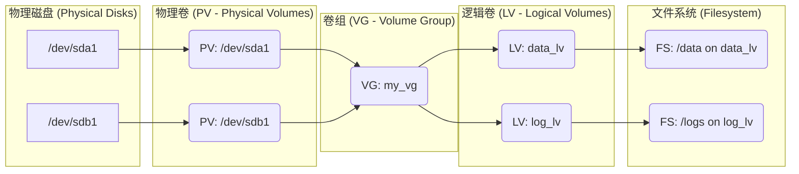
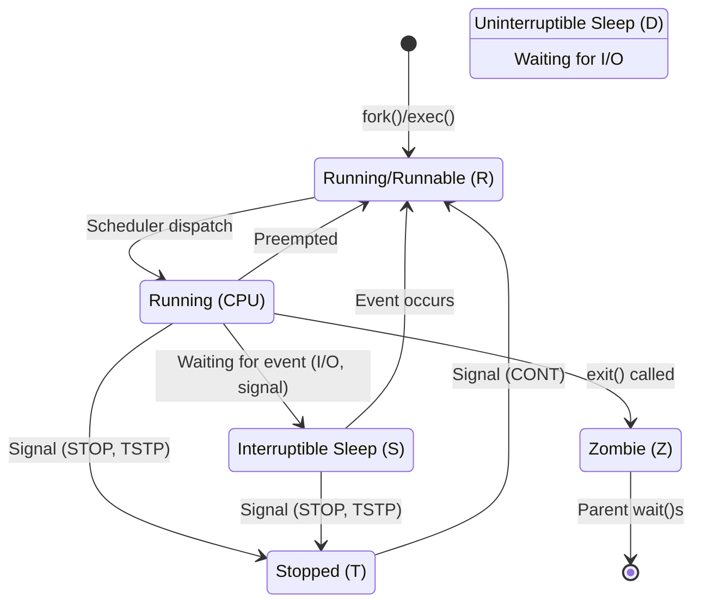
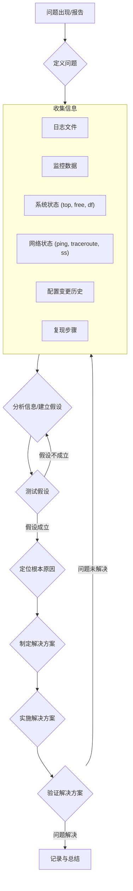

# Linux 运维核心知识笔记

## 目录

1.  [基础概念与常用命令](#1-基础概念与常用命令)
2.  [用户与权限管理](#2-用户与权限管理)
3.  [文件系统与磁盘管理](#3-文件系统与磁盘管理)
4.  [软件包管理](#4-软件包管理)
5.  [进程管理](#5-进程管理)
6.  [系统服务管理 (Systemd)](#6-系统服务管理-systemd)
7.  [网络配置与管理](#7-网络配置与管理)
8.  [系统监控与日志分析](#8-系统监控与日志分析)
9.  [Shell 脚本基础](#9-shell-脚本基础)
10. [安全基础](#10-安全基础)
11. [常用工具与技巧](#11-常用工具与技巧)
12. [故障排查思路](#12-故障排查思路)

---

## 1. 基础概念与常用命令

### 1.1 Linux 目录结构 (FHS)

| 目录路径 | 主要用途描述                                  |
| :------- | :-------------------------------------------- |
| `/bin`   | 基础可执行命令 (供所有用户)                   |
| `/sbin`  | 系统管理员命令 (通常仅 root 可执行)           |
| `/etc`   | 系统范围的配置文件                            |
| `/dev`   | 设备文件                                      |
| `/proc`  | 内核与进程信息 (虚拟文件系统)                 |
| `/var`   | 可变数据 (如日志、邮件、缓存)                 |
| `/tmp`   | 临时文件 (重启后可能清空)                     |
| `/usr`   | 用户安装的程序与数据 (Unix Software Resource) |
| `/home`  | 用户家目录                                    |
| `/boot`  | 启动加载器相关文件 (内核, initrd)             |
| `/lib`   | 系统核心库文件                                |
| `/opt`   | 可选的应用软件包                              |
| `/mnt`   | 临时文件系统挂载点                            |
| `/media` | 可移动介质挂载点 (如 U 盘, CD-ROM)            |
| `/srv`   | 服务相关数据 (Service data)                   |

(注意: `/usr` 目录下通常还有 `bin`, `sbin`, `lib` 等子目录，存放非系统启动必需的用户软件和库)

了解标准的 Linux 文件系统层次结构（Filesystem Hierarchy Standard）至关重要。

### 1.2 常用基础命令

| 命令            | 功能描述                   | 常用选项                                         | 示例                              |
| :-------------- | :------------------------- | :----------------------------------------------- | :-------------------------------- |
| `ls`            | 列出目录内容               | `-l`, `-a`, `-h`                                 | `ls -alh /home`                   |
| `cd`            | 切换目录                   |                                                  | `cd /var/log`                     |
| `pwd`           | 显示当前工作目录           |                                                  | `pwd`                             |
| `cp`            | 复制文件或目录             | `-r`, `-p`, `-a`                                 | `cp -r /data /backup`             |
| `mv`            | 移动或重命名文件/目录      | `-f`, `-i`                                       | `mv old.txt new.txt`              |
| `rm`            | 删除文件或目录             | `-r`, `-f`                                       | `rm -rf /tmp/useless_dir`         |
| `mkdir`         | 创建目录                   | `-p`                                             | `mkdir -p /data/app/logs`         |
| `rmdir`         | 删除空目录                 |                                                  | `rmdir empty_dir`                 |
| `touch`         | 创建空文件或更新时间戳     |                                                  | `touch new_file.log`              |
| `cat`           | 查看文件内容（适合小文件） | `-n`                                             | `cat /etc/passwd`                 |
| `less/more`     | 分页查看文件内容           |                                                  | `less /var/log/syslog`            |
| `head/tail`     | 查看文件开头/结尾          | `-n` (行数), `-f`                                | `tail -n 100 -f app.log`          |
| `grep`          | 文本搜索                   | `-i`, `-v`, `-r`                                 | `grep -i 'error' /var/log/*`      |
| `find`          | 按条件查找文件             | `-name`, `-type`, `-user`                        | `find / -name "*.log" -size +10M` |
| `man`           | 查看命令手册页             |                                                  | `man ls`                          |
| `history`       | 查看历史命令               |                                                  | `history`                         |
| `tar`           | 打包与解包                 | `c`, `x`, `v`, `f`, `z`, `j`                     | `tar -czvf archive.tar.gz /data`  |
| `gzip/gunzip`   | 压缩/解压 .gz 文件         |                                                  | `gzip file.txt`                   |
| `bzip2/bunzip2` | 压缩/解压 .bz2 文件        |                                                  | `bzip2 file.txt`                  |
| `xz/unxz`       | 压缩/解压 .xz 文件         |                                                  | `xz file.txt`                     |
| `chmod`         | 修改文件/目录权限          | `u`, `g`, `o`, `a`, `+`, `-`, `=`, `r`, `w`, `x` | `chmod 755 script.sh`             |
| `chown`         | 修改文件/目录所有者        | `-R`                                             | `chown -R user:group /data`       |
| `chgrp`         | 修改文件/目录所属组        | `-R`                                             | `chgrp -R www-data /var/www`      |

---

## 2. 用户与权限管理

### 2.1 相关文件

- `/etc/passwd`: 存储用户信息（用户名、UID、GID、家目录、Shell）
- `/etc/shadow`: 存储用户密码（加密）和密码策略
- `/etc/group`: 存储用户组信息（组名、GID、组成员）
- `/etc/sudoers`: Sudo 权限配置文件 (使用 `visudo` 编辑)

### 2.2 常用命令

| 命令       | 功能描述                           | 示例                                   |
| :--------- | :--------------------------------- | :------------------------------------- |
| `useradd`  | 创建新用户                         | `useradd -m -s /bin/bash john`         |
| `usermod`  | 修改用户属性                       | `usermod -aG sudo john` (添加到sudo组) |
| `userdel`  | 删除用户                           | `userdel -r john` (同时删除家目录)     |
| `groupadd` | 创建新用户组                       | `groupadd developers`                  |
| `groupmod` | 修改用户组属性                     | `groupmod -n devs developers` (重命名) |
| `groupdel` | 删除用户组                         | `groupdel developers`                  |
| `passwd`   | 设置或修改用户密码                 | `passwd john`                          |
| `su`       | 切换用户                           | `su - john` (切换并加载环境变量)       |
| `sudo`     | 以其他用户（默认root）身份执行命令 | `sudo apt update`                      |
| `chown`    | 更改文件/目录所有者                | `chown user:group file.txt`            |
| `chgrp`    | 更改文件/目录所属组                | `chgrp group file.txt`                 |
| `chmod`    | 更改文件/目录权限                  | `chmod 750 script.sh`                  |
| `id`       | 显示用户/组 ID 信息                | `id john`                              |
| `groups`   | 显示用户所属的组                   | `groups john`                          |

### 2.3 文件权限 (rwx)

权限分为三组：所有者 (User)、所属组 (Group)、其他人 (Others)。

- `r` (Read): 读权限 (4)
- `w` (Write): 写权限 (2)
- `x` (Execute): 执行权限 (1)

**数字表示法:** 将每组的 r, w, x 权限对应数字相加。

- `rwx` = 4 + 2 + 1 = 7
- `rw-` = 4 + 2 + 0 = 6
- `r-x` = 4 + 0 + 1 = 5
- `r--` = 4 + 0 + 0 = 4

**示例:** `chmod 754 file.txt` 表示：

- 所有者: `rwx` (7)
- 所属组: `r-x` (5)
- 其他人: `r--` (4)

**特殊权限:**

- **SUID (Set User ID):** (4) 执行文件时，进程具有文件所有者的权限。(`chmod u+s file`)
- **SGID (Set Group ID):** (2) 执行文件时，进程具有文件所属组的权限；应用于目录时，目录下新建文件/目录继承父目录的所属组。(`chmod g+s file/dir`)
- **Sticky Bit:** (1) 通常用于 `/tmp` 等目录，只有文件所有者或 root 才能删除该目录下的文件。(`chmod o+t dir` 或 `chmod 1777 dir`)

---

## 3. 文件系统与磁盘管理

### 3.1 常用命令

| 命令     | 功能描述                    | 示例                            |
| :------- | :-------------------------- | :------------------------------ |
| `df`     | 显示磁盘分区使用情况        | `df -hT` (人类可读, 显示类型)   |
| `du`     | 显示目录或文件大小          | `du -sh /path` (汇总, 人类可读) |
| `lsblk`  | 列出块设备信息 (磁盘, 分区) | `lsblk`                         |
| `fdisk`  | 磁盘分区工具 (MBR)          | `fdisk /dev/sda`                |
| `parted` | 磁盘分区工具 (MBR/GPT)      | `parted /dev/sdb`               |
| `mkfs`   | 创建文件系统 (格式化)       | `mkfs.ext4 /dev/sda1`           |
|          |                             | `mkfs.xfs /dev/sdb1`            |
| `mount`  | 挂载文件系统                | `mount /dev/sdb1 /data`         |
| `umount` | 卸载文件系统                | `umount /data`                  |
| `blkid`  | 显示块设备的 UUID 和类型    | `blkid`                         |
| `fsck`   | 文件系统检查与修复          | `fsck /dev/sda1` (需先卸载)     |

### 3.2 /etc/fstab

此文件定义了系统启动时自动挂载的文件系统。
格式: `<device> <mount_point> <filesystem_type> <options> <dump> <pass>`

- **device:** 设备名 (如 `/dev/sda1`) 或 UUID (`UUID=xxx`) 或 LABEL (`LABEL=xxx`)
- **mount_point:** 挂载点 (如 `/data`)
- **filesystem_type:** 文件系统类型 (如 `ext4`, `xfs`, `nfs`)
- **options:** 挂载选项 (如 `defaults`, `rw`, `ro`, `noatime`)
- **dump:** `0` 或 `1`，是否备份 (通常为 `0`)
- **pass:** `0`, `1`, `2`，启动时 fsck 检查顺序 (`0` 不检查, `1` 优先, `2` 其次)

### 3.3 LVM (逻辑卷管理)

LVM 提供了更灵活的磁盘管理方式。



**常用 LVM 命令:**

- `pvcreate /dev/sdxN`: 创建物理卷
- `vgcreate my_vg /dev/sdxN /dev/sdyN`: 创建卷组
- `lvcreate -L size[G|M] -n my_lv my_vg`: 创建逻辑卷
- `lvextend -L +size[G|M] /dev/my_vg/my_lv`: 扩展逻辑卷
- `resize2fs /dev/my_vg/my_lv` (ext3/4) 或 `xfs_growfs /mount/point` (xfs): 扩展文件系统
- `pvdisplay`, `vgdisplay`, `lvdisplay`: 显示 PV/VG/LV 信息

---

## 4. 软件包管理

根据不同的 Linux 发行版，使用不同的包管理器。

### 4.1 Debian/Ubuntu (apt)

| 命令                     | 功能描述                       |
| :----------------------- | :----------------------------- |
| `apt update`             | 更新可用软件包列表             |
| `apt upgrade`            | 升级所有已安装的软件包         |
| `apt install <pkg_name>` | 安装软件包                     |
| `apt remove <pkg_name>`  | 卸载软件包（保留配置文件）     |
| `apt purge <pkg_name>`   | 彻底卸载软件包（包括配置文件） |
| `apt search <keyword>`   | 搜索软件包                     |
| `apt show <pkg_name>`    | 显示软件包详细信息             |
| `apt list --installed`   | 列出已安装的软件包             |
| `apt autoremove`         | 移除不再需要的依赖包           |
| `apt-get` (旧版, 仍可用) | 功能类似 `apt`                 |
| `dpkg -i <deb_file>`     | 安装本地 .deb 文件             |
| `dpkg -l`                | 列出已安装的包 (dpkg 层面)     |

### 4.2 CentOS/RHEL/Fedora (yum/dnf)

- `dnf` 是新一代包管理器，推荐使用。`yum` 在老版本 CentOS/RHEL 中使用，命令基本兼容。

| 命令 (dnf/yum)             | 功能描述                      |
| :------------------------- | :---------------------------- |
| `dnf check-update`         | 检查可更新的软件包            |
| `dnf update`               | 升级所有已安装的软件包        |
| `dnf install <pkg_name>`   | 安装软件包                    |
| `dnf remove <pkg_name>`    | 卸载软件包                    |
| `dnf search <keyword>`     | 搜索软件包                    |
| `dnf info <pkg_name>`      | 显示软件包详细信息            |
| `dnf list installed`       | 列出已安装的软件包            |
| `dnf autoremove`           | 移除不再需要的依赖包          |
| `dnf provides <file_path>` | 查找哪个包提供了指定文件      |
| `rpm -i <rpm_file>`        | 安装本地 .rpm 文件            |
| `rpm -qa`                  | 列出所有已安装的包 (rpm 层面) |
| `rpm -qf <file_path>`      | 查询文件属于哪个 rpm 包       |

---

## 5. 进程管理

### 5.1 常用命令

| 命令      | 功能描述                                | 常用选项                                                      | 示例                     |
| :-------- | :-------------------------------------- | :------------------------------------------------------------ | :----------------------- |
| `ps`      | 显示当前进程快照                        | `aux`, `ef`                                                   | `ps aux \| grep nginx`   |
| `top`     | 实时显示进程动态                        | `Shift+M`(内存排序), `Shift+P`(CPU排序), `k`(kill), `q`(退出) | `top`                    |
| `htop`    | 交互式进程查看器 (通常需额外安装)       |                                                               | `htop`                   |
| `kill`    | 发送信号给进程 (默认 TERM)              | `-9` (强制终止)                                               | `kill <PID>`             |
| `pkill`   | 按名称或其他属性杀死进程                | `-9`                                                          | `pkill -9 nginx`         |
| `killall` | 按进程名杀死所有同名进程                | `-9`                                                          | `killall -9 httpd`       |
| `jobs`    | 显示后台运行的任务                      | `-l`                                                          | `jobs`                   |
| `bg`      | 将暂停的任务转到后台运行                |                                                               | `bg %1`                  |
| `fg`      | 将后台任务转到前台运行                  |                                                               | `fg %1`                  |
| `nohup`   | 使命令在退出终端后继续运行              |                                                               | `nohup ./my_script.sh &` |
| `pstree`  | 以树状图显示进程关系                    | `-p` (显示PID)                                                | `pstree -p`              |
| `lsof`    | 列出打开的文件 (网络连接也是文件)       | `-i` (网络), `-p` (进程)                                      | `lsof -i :80`            |
| `nice`    | 以指定优先级启动进程 (值越小优先级越高) | `-n <value>`                                                  | `nice -n 10 ./cpu_task`  |
| `renice`  | 修改运行中进程的优先级                  | `-n <value> -p <PID>`                                         | `renice -n 5 -p 12345`   |

### 5.2 进程状态



- **R (Running/Runnable):** 进程正在运行或在运行队列中等待。
- **S (Interruptible Sleep):** 进程在等待某个事件（如 I/O、信号），可以被信号中断。
- **D (Uninterruptible Sleep):** 进程在等待 I/O，通常是磁盘 I/O，不可被信号中断。
- **T (Stopped):** 进程被暂停（例如通过 `Ctrl+Z` 或 SIGSTOP 信号）。
- **Z (Zombie):** 进程已终止，但其父进程尚未读取其退出状态。

---

## 6. 系统服务管理 (Systemd)

`systemd` 是现代 Linux 发行版（如 CentOS 7+, Ubuntu 16.04+, Debian 8+）中主流的初始化系统和服务管理器。

### 6.1 常用命令 (`systemctl`)

| 命令                                       | 功能描述                                 |
| :----------------------------------------- | :--------------------------------------- |
| `systemctl start <service_name>`           | 启动服务                                 |
| `systemctl stop <service_name>`            | 停止服务                                 |
| `systemctl restart <service_name>`         | 重启服务                                 |
| `systemctl reload <service_name>`          | 重新加载服务配置 (不中断)                |
| `systemctl status <service_name>`          | 查看服务状态                             |
| `systemctl enable <service_name>`          | 设置服务开机自启                         |
| `systemctl disable <service_name>`         | 禁止服务开机自启                         |
| `systemctl is-enabled <service_name>`      | 检查服务是否开机自启                     |
| `systemctl list-units --type=service`      | 列出所有活动的 service 单元              |
| `systemctl list-unit-files --type=service` | 列出所有已安装的 service 单元            |
| `systemctl daemon-reload`                  | 重新加载 systemd 配置 (修改 unit 文件后) |
| `journalctl -u <service_name>`             | 查看指定服务的日志                       |

### 6.2 Unit 文件

`systemd` 管理的对象称为 "Unit"，常见的 Unit 类型有 `service`, `socket`, `target`, `timer` 等。Unit 配置文件通常位于：

- `/usr/lib/systemd/system/`: 软件包安装的 unit 文件
- `/etc/systemd/system/`: 系统管理员自定义或修改的 unit 文件 (优先级更高)

一个典型的 `.service` 文件结构：

```ini
[Unit]
Description=My Application Service
After=network.target mysql.service # 依赖关系

[Service]
User=appuser
Group=appgroup
WorkingDirectory=/opt/myapp
ExecStart=/usr/bin/java -jar /opt/myapp/app.jar # 启动命令
Restart=on-failure # 失败时重启策略
Environment="JAVA_HOME=/usr/lib/jvm/java-11-openjdk"

[Install]
WantedBy=multi-user.target # 在哪个 target 下启用
```

---

## 7. 网络配置与管理

### 7.1 常用命令

| 命令         | 功能描述                            | 示例                            |
| :----------- | :---------------------------------- | :------------------------------ |
| `ip addr`    | 显示/管理 IP 地址和网络接口         | `ip addr show`                  |
| `ip link`    | 显示/管理网络接口状态               | `ip link set eth0 up`           |
| `ip route`   | 显示/管理路由表                     | `ip route show`                 |
| `ping`       | 测试网络连通性 (ICMP)               | `ping 8.8.8.8`                  |
| `traceroute` | 追踪数据包到达目标的路径            | `traceroute google.com`         |
| `mtr`        | 结合 `ping` 和 `traceroute`         | `mtr google.com`                |
| `ss`         | 显示网络连接、监听端口、socket 信息 | `ss -tulnp` (常用选项)          |
| `netstat`    | (旧版) 显示网络连接等信息           | `netstat -tulnp` (常用选项)     |
| `nslookup`   | DNS 查询工具                        | `nslookup www.baidu.com`        |
| `dig`        | 更强大的 DNS 查询工具               | `dig @8.8.8.8 www.google.com A` |
| `hostname`   | 显示或设置系统主机名                | `hostname`                      |
| `ifconfig`   | (旧版) 配置网络接口                 | `ifconfig eth0`                 |
| `route`      | (旧版) 显示/管理路由表              | `route -n`                      |

### 7.2 网络配置文件

- **Debian/Ubuntu:** `/etc/network/interfaces` (旧) 或 `/etc/netplan/*.yaml` (新, 使用 `netplan apply` 生效)
- **CentOS/RHEL:** `/etc/sysconfig/network-scripts/ifcfg-<interface>` (如 `ifcfg-eth0`)
- **通用:**
  - `/etc/resolv.conf`: DNS 服务器配置
  - `/etc/hosts`: 本地主机名到 IP 地址映射
  - `/etc/hostname`: 主机名

### 7.3 防火墙

- **iptables:** 传统的 Linux 防火墙工具，基于内核 netfilter。
  - `iptables -L -n -v`: 查看规则
  - `iptables -A INPUT -p tcp --dport 80 -j ACCEPT`: 允许入站 80 端口 TCP 连接
  - `iptables-save > /etc/iptables.rules`: 保存规则
  - `iptables-restore < /etc/iptables.rules`: 加载规则
- **firewalld:** (CentOS/RHEL 7+ 默认) 基于 zone 的动态防火墙管理工具。
  - `firewall-cmd --list-all`: 查看当前 zone 配置
  - `firewall-cmd --zone=public --add-port=80/tcp --permanent`: 永久允许 public zone 的 80/tcp 端口
  - `firewall-cmd --reload`: 重新加载配置
- **ufw:** (Ubuntu 默认) 简单的防火墙前端。
  - `ufw status`: 查看状态
  - `ufw allow 22/tcp`: 允许 22/tcp 端口
  - `ufw enable`: 启用防火墙

---

## 8. 系统监控与日志分析

### 8.1 系统资源监控

| 命令      | 主要监控内容              |
| :-------- | :------------------------ |
| `top`     | CPU, 内存, 进程 (实时)    |
| `htop`    | 增强版 `top` (实时)       |
| `vmstat`  | 虚拟内存, 进程, IO (间隔) |
| `iostat`  | CPU, 磁盘 I/O (间隔)      |
| `mpstat`  | 多核 CPU 统计 (间隔)      |
| `free`    | 内存和 Swap 使用情况      |
| `sar`     | 系统活动报告 (历史和实时) |
| `dstat`   | 多功能实时状态统计        |
| `iftop`   | 按接口实时监控网络流量    |
| `nethogs` | 按进程实时监控网络带宽    |
| `iotop`   | 按进程实时监控磁盘 I/O    |

### 8.2 日志文件

关键日志通常位于 `/var/log` 目录下：

- `/var/log/messages` 或 `/var/log/syslog`: 系统主日志文件
- `/var/log/auth.log` 或 `/var/log/secure`: 认证和安全相关日志
- `/var/log/kern.log`: 内核日志
- `/var/log/dmesg`: 内核启动信息
- `/var/log/boot.log`: 系统启动日志
- `/var/log/cron`: 定时任务日志
- `/var/log/<application>/`: 各应用程序日志 (如 `nginx/`, `mysql/`)

### 8.3 journald (Systemd 日志)

`journalctl` 命令用于查询 `systemd` 收集的日志。

| 命令                                       | 功能描述                                    |
| :----------------------------------------- | :------------------------------------------ |
| `journalctl`                               | 显示所有日志                                |
| `journalctl -f`                            | 实时跟踪新日志 (类似 `tail -f`)             |
| `journalctl -u <service_name>`             | 查看指定服务的日志                          |
| `journalctl -k`                            | 查看内核日志 (同 `dmesg`)                   |
| `journalctl --since "YYYY-MM-DD HH:MM:SS"` | 查看指定时间点之后的日志                    |
| `journalctl --until "..."`                 | 查看指定时间点之前的日志                    |
| `journalctl _PID=<PID>`                    | 查看指定进程 ID 的日志                      |
| `journalctl -p err..alert`                 | 查看错误级别及以上的日志 (err, crit, alert) |
| `journalctl --disk-usage`                  | 查看日志占用的磁盘空间                      |
| `journalctl --vacuum-size=1G`              | 清理旧日志，保留最近 1G                     |
| `journalctl --vacuum-time=2weeks`          | 清理旧日志，保留最近 2 周                   |

---

## 9. Shell 脚本基础

自动化运维任务的基础。

### 9.1 基本结构

```bash
#!/bin/bash
# Shebang: 指定解释器

# 注释

# 变量定义 (无需声明类型)
LOG_FILE="/var/log/myapp.log"
MAX_RETRIES=3

# 读取用户输入
# read -p "Enter your name: " name
# echo "Hello, $name"

# 条件判断
if [ -f "$LOG_FILE" ]; then
  echo "Log file exists."
else
  echo "Log file not found."
fi

# 函数定义
check_service() {
  service_name=$1 # 函数参数
  if systemctl is-active --quiet "$service_name"; then
    echo "$service_name is running."
    return 0 # 返回值 (0 代表成功)
  else
    echo "$service_name is not running."
    return 1 # 返回值 (非 0 代表失败)
  fi
}

# 函数调用
check_service "nginx"
status=$? # 获取上一个命令的退出状态码

# 循环
echo "Counting to 3:"
for i in {1..3}; do
  echo $i
  sleep 1
done

echo "Listing files:"
while read -r line; do
  echo "Found: $line"
done < <(ls -1) # 进程替换

# 脚本参数
echo "Script name: $0"
echo "First argument: $1"
echo "Second argument: $2"
echo "All arguments: $@"
echo "Number of arguments: $#"

exit 0 # 脚本退出状态码
```

### 9.2 常用技巧

- **命令替换:** `$(command)` 或 `` `command` `` (推荐前者)
  ```bash
  current_date=$(date +%Y-%m-%d)
  echo "Today is $current_date"
  ```
- **算术运算:** `$((expression))`
  ```bash
  count=$((1 + 2))
  echo "Count is $count"
  ```
- **字符串操作:** `${variable...}` (截取、替换等)
- **数组:** `my_array=(item1 item2 "item 3")`, `${my_array[index]}`, `${my_array[@]}`
- **重定向:** `>`, `>>`, `<`, `2>`, `&>`
- **管道:** `|`

---

## 10. 安全基础

- **最小权限原则:** 用户和进程只拥有完成其任务所必需的最小权限。
- **SSH 安全:**
  - 禁用 root 远程登录 (`PermitRootLogin no` in `/etc/ssh/sshd_config`)。
  - 使用密钥对认证，禁用密码认证 (`PasswordAuthentication no`)。
  - 修改默认 SSH 端口 (有争议，但能减少自动扫描)。
  - 使用 `fail2ban` 等工具防止暴力破解。
- **sudo 配置:** 使用 `visudo` 编辑 `/etc/sudoers`，精细控制用户可执行的命令。
- **防火墙:** 启用并配置防火墙 (iptables/firewalld/ufw)，只开放必要的端口。
- **定期更新:** 及时安装系统和应用程序的安全补丁 (`apt update && apt upgrade` 或 `dnf update`)。
- **日志审计:** 定期检查系统日志和安全日志 (`/var/log/auth.log`, `journalctl`)。
- **强密码策略:** 设置复杂密码要求，定期更换密码。
- **禁用不必要的服务:** `systemctl disable <service_name>`。
- **文件权限:** 确保敏感文件和目录权限设置正确。

---

## 11. 常用工具与技巧

- **`screen` / `tmux`:** 终端复用器，保持会话不中断，窗口管理。
- **`rsync`:** 文件同步工具，高效、灵活。
  ```bash
  # 本地同步
  rsync -avz --delete /source/dir/ /destination/dir/
  # 远程同步 (推)
  rsync -avz -e ssh /local/dir/ user@remote:/remote/dir/
  # 远程同步 (拉)
  rsync -avz -e ssh user@remote:/remote/dir/ /local/dir/
  ```
- **`curl` / `wget`:** HTTP/HTTPS/FTP 等协议的数据传输工具。
  ```bash
  curl -O http://example.com/file.zip # 下载文件
  curl -I http://example.com # 获取 HTTP 头
  wget https://example.com/page.html # 下载网页
  ```
- **`awk` / `sed`:** 强大的文本处理工具。
  - `awk`: 按列处理文本。`awk '{print $1, $3}' file.txt`
  - `sed`: 流编辑器，用于文本替换、删除等。`sed 's/old/new/g' file.txt`
- **`git`:** 版本控制系统，用于管理配置文件、脚本等。
- **`nc` (netcat):** 网络工具瑞士军刀，用于端口扫描、传输文件、网络调试。
- **`tcpdump`:** 网络抓包工具。
  ```bash
  tcpdump -i eth0 -nn -s0 port 80 # 抓取 eth0 接口 80 端口的包
  ```
- **`jq`:** JSON 命令行处理工具。
- **快捷键:** `Ctrl+C` (中断), `Ctrl+D` (EOF), `Ctrl+Z` (暂停), `Ctrl+L` (清屏), `Tab` (补全), `Ctrl+R` (搜索历史)。

---

## 12. 故障排查思路

遇到问题时，遵循系统性的排查方法。



**排查步骤:**

1.  **清晰定义问题:** 现象是什么？何时开始？影响范围？是否有规律？
2.  **收集信息:**
    - 查看相关日志 (`/var/log`, `journalctl`)。
    - 检查系统资源使用情况 (CPU, 内存, 磁盘, 网络)。
    - 检查相关服务状态 (`systemctl status`)。
    - 检查网络连通性 (`ping`, `traceroute`, `ss`, `curl`)。
    - 检查配置文件。
    - 询问最近是否有变更。
3.  **建立假设:** 根据收集到的信息，推测可能的原因。
4.  **逐一验证假设:** 通过修改配置、执行命令、观察现象等方式验证推测。一次只验证一个假设。
5.  **定位根因:** 找到导致问题的根本原因。
6.  **制定并实施解决方案:** 修复问题，可能需要修改配置、重启服务、回滚变更等。
7.  **验证修复:** 确认问题已解决，系统恢复正常。
8.  **记录和总结:** 记录问题现象、排查过程、解决方案和根本原因，方便日后参考和预防。

**常用排查工具回顾:** `ping`, `traceroute`, `mtr`, `ss`, `netstat`, `lsof`, `top`, `htop`, `vmstat`, `iostat`, `free`, `df`, `du`, `journalctl`, `dmesg`, `tcpdump`, `strace` (跟踪系统调用)。
