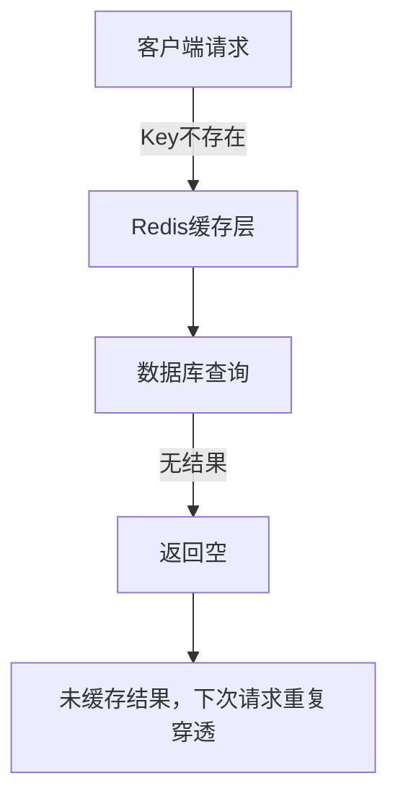

# 1. 缓存三兄弟

# Java面试八股文：Redis缓存三兄弟（穿透、击穿、雪崩）深度解析

***

## 1. 概述与定义

Redis作为Java开发中高频使用的缓存中间件，其核心作用是提升系统性能、减少数据库压力。但在实际应用中，缓存的三大问题（**缓存穿透、缓存击穿、缓存雪崩**）常成为面试考察的重点，需要开发者深入理解其原理、解决方案及优化策略。 &#x20;

⚠️ **关键定义**： &#x20;

- **缓存穿透**：查询一个不存在的数据，缓存和数据库均无记录，导致每次请求都穿透到数据库。 &#x20;
- **缓存击穿**：热点数据缓存失效（如超时或被删除），大量请求直接访问数据库。 &#x20;
- **缓存雪崩**：大量缓存集中在同一时间失效，瞬间引发数据库雪崩式请求。

***

## 2. 原理剖析

### 2.1 缓存穿透的原理

**流程图示例（Mermaid语法）**： &#x20;




**核心问题**： &#x20;

- **恶意攻击**：如通过随机Key频繁查询，耗尽数据库资源。 &#x20;
- **设计缺陷**：未对空值进行缓存或拦截非法请求。

***

### 2.2 缓存击穿的原理

**场景示例**： &#x20;

假设一个商品ID为`1001`的热门商品缓存超时（如秒杀活动），此时大量请求（如`1000+`并发）直接访问数据库。 &#x20;

**问题根源**： &#x20;

- **热点数据失效**：单个Key失效导致数据库瞬间压力剧增。 &#x20;
- **缓存雪崩的前兆**：若多个热点Key同时失效，则可能引发雪崩。

***

### 2.3 缓存雪崩的原理

**时间轴示例（Mermaid语法）**： &#x20;

```mermaid 
gantt
    title 缓存雪崩时间轴
    dateFormat  HH:mm:ss
    section 缓存失效时间
    Key_A    :a1, 10:00:00, 1d
    Key_B    :a2, 10:00:00, 1d
    Key_C    :a3, 10:00:00, 1d
    section 数据库压力
    DB_Load  : 10:00:00, 0.5d
```




**核心问题**： &#x20;

- **批量失效**：大量缓存Key设置相同过期时间（如统一在凌晨更新）。 &#x20;
- **连锁反应**：数据库因无法承受高并发请求而崩溃。

***

## 3. 应用目标

- **缓存穿透**：拦截非法请求，减少数据库无用查询。 &#x20;
- **缓存击穿**：保护热点数据，避免瞬时流量冲击数据库。 &#x20;
- **缓存雪崩**：分散缓存失效时间，提升系统容错能力。

***

## 4. 主要特点对比（表格）

| **问题类型**​ | **触发条件**​ | **核心风险**​  | **典型场景**​    |
| --------- | --------- | ---------- | ------------ |
| 缓存穿透      | 查询不存在的数据  | 数据库被无效请求耗尽 | 黑客随机Key攻击    |
| 缓存击穿      | 热点Key失效   | 瞬时数据库负载激增  | 秒杀活动商品库存查询   |
| 缓存雪崩      | 大量Key同时失效 | 数据库雪崩式崩溃   | 缓存统一设置的过期时间点 |

***

## 5. 主要内容及其组成部分

### 5.1 缓存穿透解决方案

#### 5.1.1 布隆过滤器（Bloom Filter）

- **原理**：通过哈希算法预存可能存在的Key，快速判断请求是否合法。 &#x20;
- **示例代码**： &#x20;
  ```java 
  // 使用Guava的BloomFilter实现
  BloomFilter<CharSequence> filter = BloomFilter.create(Funnels.stringFunnel(Charset.defaultCharset()), 10000);
  filter.put("validKey");
  boolean mayContain = filter.mightContain("invalidKey"); // 返回false
  ```

- **优点**：低内存占用，快速拦截非法请求。 &#x20;
- **缺点**：存在误判率（需权衡空间与精度）。

#### 5.1.2 空值缓存

- **原理**：对查询结果为`null`的Key设置短暂缓存（如5分钟）。 &#x20;
- **Redis命令示例**： &#x20;
  ```text 
  SETNX not_exists_key "NULL" EX 300
  ```

- **优点**：简单有效，防止重复穿透。 &#x20;
- **缺点**：可能掩盖真实业务问题（如数据未及时同步）。

***

### 5.2 缓存击穿解决方案

#### 5.2.1 互斥锁（Mutex Lock）

- **原理**：利用Redis的`SETNX`命令加锁，仅允许一个线程更新缓存。 &#x20;
- **实现步骤**： &#x20;
  ```java 
  String lockKey = "lock_" + key;
  if (redis.setnx(lockKey, "locked") == 1) { // 获取锁成功
      try {
          // 查询数据库并设置缓存
          Object value = queryDB(key);
          redis.set(key, value, expireTime);
      } finally {
          redis.del(lockKey); // 释放锁
      }
  } else {
      // 等待重试或返回旧缓存
      Thread.sleep(50);
  }
  ```

- **优化**：结合`expire`避免死锁，或使用Redisson的分布式锁。

#### 5.2.2 逻辑过期时间

- **原理**：缓存值中携带逻辑过期时间，延长热点数据的“续命”周期。 &#x20;
- **数据结构示例**： &#x20;
  ```json 
  {
    "data": "商品详情",
    "logicalExpire": 1704624000 // Unix时间戳
  }
  ```

- **流程**： &#x20;
  ```java 
  // 假设当前时间戳为1704623000
  Object cached = redis.get(key);
  if (cached != null && !isLogicalExpired(cached)) {
      return cached;
  }
  // 否则更新缓存
  ```


***

### 5.3 缓存雪崩解决方案

#### 5.3.1 随机过期时间

- **原理**：为每个Key的过期时间增加随机偏移量（如±10%）。 &#x20;
- **Redis命令示例**： &#x20;
  ```text 
  SET key value EX 3600 + (RANDOM 0 360) // 过期时间在3240到3960秒之间
  ```

- **优点**：分散失效时间，避免集中冲击。

#### 5.3.2 备用数据机制

- **原理**：在缓存失效时，先读旧数据，异步更新新数据。 &#x20;
- **实现代码**： &#x20;
  ```java 
  Object oldValue = redis.get(key);
  if (oldValue != null) {
      // 返回旧值并异步更新
      executorService.submit(() -> {
          Object newValue = queryDB(key);
          redis.set(key, newValue, expireTime);
      });
      return oldValue;
  }
  ```


***

## 6. 应用与拓展

### 6.1 实际案例：电商秒杀系统

- **问题**：秒杀开始时，商品库存Key可能被大量请求击穿。 &#x20;
- **解决方案**： &#x20;
  1. 使用Redis的`INCR`命令实现分布式锁。 &#x20;
  2. 对库存Key设置短时间缓存（如1分钟），结合数据库最终一致性保证。 &#x20;

### 6.2 技术演进

- **Redis 6.x**：支持本地缓存（RedisBloom模块）和更高效的布隆过滤器实现。 &#x20;
- **云原生方案**：结合阿里云的RedisProxy实现自动流量调度，避免雪崩。

***

## 7. 面试问答（模拟回答）

### Q1：如何解决缓存穿透？

**回答**： &#x20;

缓存穿透通常通过两种方式解决： &#x20;

1. **布隆过滤器**：将合法Key预先存储在布隆过滤器中，对非法请求直接拦截。例如，使用Guava的`BloomFilter`，误判率可控制在0.1%以下。 &#x20;
2. **空值缓存**：对查询结果为空的Key设置短暂缓存（如5分钟），避免重复穿透。例如，用`SETNX key NULL EX 300`命令实现。 &#x20;

***

### Q2：缓存击穿和雪崩的区别？

**回答**： &#x20;

- **击穿**：单个热点Key失效，导致瞬时流量冲击数据库。例如，秒杀商品Key失效时，大量请求直接访问库存表。 &#x20;
- **雪崩**：大量Key同时失效（如统一过期时间），导致数据库负载瞬间飙升。例如，凌晨2点所有缓存Key统一过期，引发数据库崩溃。 &#x20;

**解决方案差异**： &#x20;

- 击穿：使用互斥锁或逻辑过期时间。 &#x20;
- 雪崩：通过随机过期时间分散失效时间。

***

### Q3：Redis的互斥锁如何防止击穿？

**回答**： &#x20;

通过`SETNX`命令实现分布式锁，确保同一时间只有一个线程更新缓存： &#x20;

```java 
// 假设key为"item:1001"
String lockKey = "lock:item:1001";
if (redis.setnx(lockKey, "locked") == 1) {
    try {
        // 查询数据库并重置缓存
    } finally {
        redis.del(lockKey); // 释放锁
    }
} else {
    // 等待或返回旧缓存
}
```


**注意**：需结合`EXPIRE`防止死锁，或使用Redisson的`RLock`更安全。

***

### Q4：如何用布隆过滤器实现穿透防护？

**回答**： &#x20;

1. **初始化布隆过滤器**：预加载所有合法Key到布隆过滤器中。 &#x20;
2. **查询时校验**：在访问缓存前，先检查布隆过滤器。例如： &#x20;
   ```java 
   if (!bloomFilter.mightContain(key)) {
       return "非法请求，拒绝访问"; // 直接返回，不查询数据库
   }
   ```

3. **动态更新**：定期将新Key同步到布隆过滤器，或使用Redis的BF.ADD命令。

***

### Q5：缓存雪崩时如何设计降级策略？

**回答**： &#x20;

1. **限流**：使用Redis的`Lua脚本`或令牌桶算法限制QPS。 &#x20;
2. **降级逻辑**： &#x20;
   ```java 
   Object cache = redis.get(key);
   if (cache == null) {
       // 返回默认值或静态数据
       return "当前系统繁忙，请稍后再试";
   }
   ```

3. **熔断机制**：通过Hystrix或Spring Cloud Circuit Breaker监控数据库状态，触发熔断后直接返回预设值。

***

## 总结

Redis缓存三兄弟（穿透、击穿、雪崩）是Java面试中高频且深入考察的领域。掌握其原理、解决方案及实际应用，不仅能体现技术深度，更能展现解决复杂问题的工程思维。在回答时，结合代码示例和场景分析，可有效提升面试官对你的认可度！ 🚀
