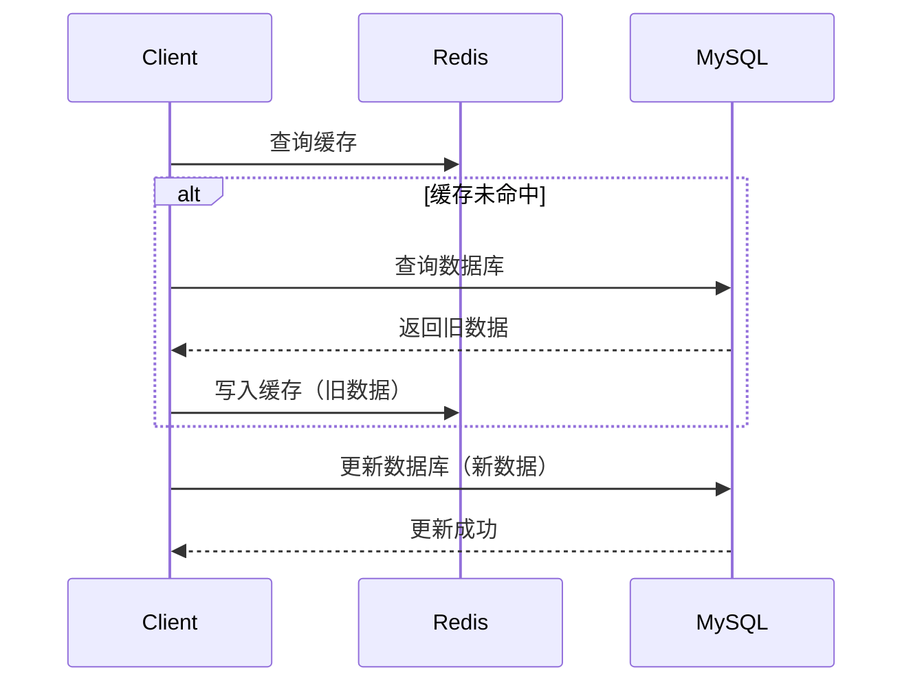
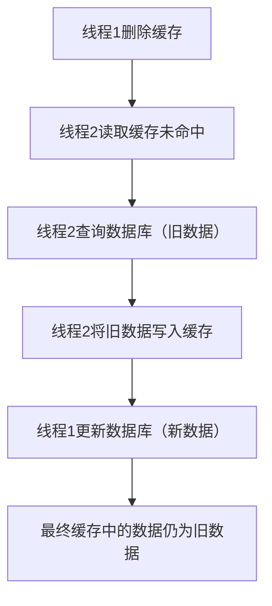
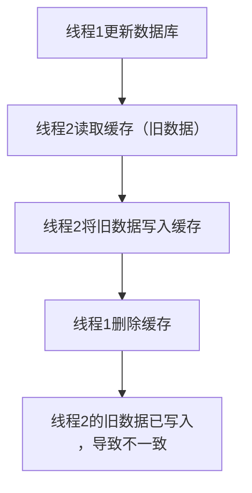
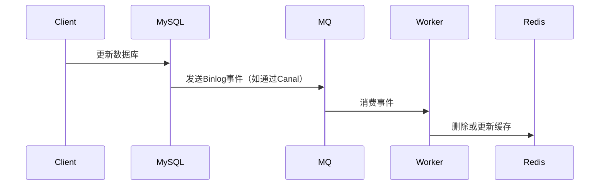

# 2. 双写一致性

***

# Java面试八股文：Redis双写一致性深度解析 &#x20;

***

## 1. 概述与定义 &#x20;

**双写一致性**是指在分布式系统中，当数据同时存在于缓存（如Redis）和数据库（如MySQL）时，任何一方的数据更新必须确保另一方同步更新，以保持数据的一致性。 &#x20;

⚠️ **核心问题**： &#x20;

- **缓存与数据库的不一致**：例如，更新数据库成功但缓存未更新，导致后续查询缓存时读取旧数据。 &#x20;
- **高并发场景下的数据冲突**：多线程操作时，缓存和数据库的更新顺序可能导致脏数据。 &#x20;

***

## 2. 原理剖析 &#x20;

### 2.1 为什么存在双写一致性问题？ &#x20;

**场景示例（Mermaid语法）**： &#x20;




**问题根源**： &#x20;

- **操作顺序冲突**：先更新数据库再删除缓存，或先删除缓存再更新数据库，均可能导致中间态不一致。 &#x20;
- **并发操作**：多线程同时操作时，缓存和数据库的更新可能交错执行。 &#x20;

***

### 2.2 典型场景分析 &#x20;

#### 2.2.1 先删除缓存，再更新数据库 &#x20;

**流程图（Mermaid语法）**： &#x20;




**风险**：缓存被覆盖为旧数据，与数据库不一致。 &#x20;

#### 2.2.2 先更新数据库，再删除缓存 &#x20;

**流程图（Mermaid语法）**： &#x20;




**风险**：缓存可能被旧数据覆盖，延迟更新。 &#x20;

***

## 3. 应用目标 &#x20;

- **强一致性**：要求数据在任何时刻都一致（如金融交易）。 &#x20;
- **最终一致性**：允许短暂不一致，但最终会同步（如电商商品库存）。 &#x20;

***

## 4. 主要特点对比（表格） &#x20;

| **方案**​        | **一致性类型**​ | **性能开销**​ | **适用场景**​    | **典型缺陷**​   |
| -------------- | ---------- | --------- | ------------ | ----------- |
| 延时双删           | 最终一致       | 中         | 低频更新、允许短暂不一致 | 需调参，存在小概率失败 |
| 分布式锁           | 强一致        | 高         | 高价值数据（如支付）   | 并发性能差，易成为瓶颈 |
| 异步通知（MQ/Canal） | 最终一致       | 低         | 高并发场景（如秒杀）   | 依赖消息队列，可能延迟 |

***

## 5. 主要内容及其组成部分 &#x20;

### 5.1 解决方案详解 &#x20;

#### 5.1.1 延时双删（双删+延迟） &#x20;

**原理**：先删除缓存，更新数据库，**延迟一段时间后再次删除缓存**，确保旧数据无法写回。 &#x20;

- **示例代码**： &#x20;
  ```java 
  public void updateData() {  
      // 1. 删除缓存  
      redis.del("key");  
      // 2. 更新数据库  
      boolean success = updateMySQL();  
      if (success) {  
          // 3. 延迟后再次删除（避免旧数据写回）  
          new Thread(() -> {  
              try {  
                  Thread.sleep(3000); // 延迟3秒  
                  redis.del("key");  
              } catch (InterruptedException e) {  
                  Thread.currentThread().interrupt();  
              }  
          }).start();  
      }  
  }  
  ```

- **关键点**： &#x20;
  - 延迟时间需覆盖缓存重建的最长时间。 &#x20;
  - 可能因线程挂起导致失败，需结合超时机制。 &#x20;

***

#### 5.1.2 分布式锁（强一致性） &#x20;

**实现方式**： &#x20;

1. **互斥锁（Mutex Lock）**：通过Redis的`SETNX`实现。 &#x20;
   ```java 
   // 获取锁  
   if (redis.setnx("lock_key", "locked", "EX", "10") == 1) {  
       try {  
           // 更新数据库和缓存  
       } finally {  
           redis.del("lock_key"); // 释放锁  
       }  
   } else {  
       // 重试或返回错误  
   }  
   ```

2. **读写锁（Redisson）**： &#x20;
   ```java 
   RReadWriteLock lock = redisson.getReadWriteLock("lock_key");  
   lock.writeLock().lock();  
   try {  
       // 更新操作  
   } finally {  
       lock.writeLock().unlock();  
   }  
   ```


- **优缺点**： &#x20;
  - **优点**：保证强一致性，逻辑简单。 &#x20;
  - **缺点**：高并发下性能差，可能引发死锁。 &#x20;

***

#### 5.1.3 异步通知（MQ/Canal） &#x20;

**流程**： &#x20;




- **示例（Canal实现）**： &#x20;
  ```java 
  // Canal监听器  
  @CanalEntry  
  public void onBinlogEvent(BinlogEvent event) {  
      String key = generateKey(event);  
      redis.del(key); // 或更新缓存  
  }  
  ```

- **优缺点**： &#x20;
  - **优点**：解耦、高并发下性能好。 &#x20;
  - **缺点**：依赖消息队列，存在延迟风险。 &#x20;

***

### 5.2 边界场景处理 &#x20;

#### 5.2.1 缓存过期后重建 &#x20;

- **问题**：缓存过期后，多个线程可能同时重建缓存。 &#x20;
- **方案**：结合**缓存空值机制**或**本地缓存**。 &#x20;
  ```java 
  public Object getData() {  
      Object cache = redis.get("key");  
      if (cache != null) return cache;  

      // 加本地锁，防止重复重建  
      synchronized ("key") {  
          cache = redis.get("key");  
          if (cache == null) {  
              cache = queryDB();  
              redis.set("key", cache, "EX", "300");  
          }  
      }  
      return cache;  
  }  
  ```


***

## 6. 应用与拓展 &#x20;

### 6.1 电商秒杀场景 &#x20;

- **问题**：秒杀时，库存更新需保证数据库与缓存一致。 &#x20;
- **方案**： &#x20;
  1. **互斥锁+本地事务**： &#x20;
     ```java 
     // 使用Redis分布式锁保证唯一扣减  
     if (redis.setnx("seckill_lock", "locked", "NX", "EX", "5") == 1) {  
         try {  
             int stock = queryStock();  
             if (stock > 0) {  
                 updateStock(stock - 1); // 数据库扣减  
                 redis.set("stock", stock - 1); // 更新缓存  
             }  
         } finally {  
             redis.del("seckill_lock");  
         }  
     }  
     ```


### 6.2 云原生方案 &#x20;

- **Redis Cluster**：通过分片减少单点锁竞争。 &#x20;
- **Redis 7.x**：支持**延迟删除（Lazy Deletion）**，优化延时双删的实现。 &#x20;

***

## 7. 面试问答（模拟回答） &#x20;

### Q1：如何保证缓存与数据库的双写一致性？ &#x20;

**回答**： &#x20;

双写一致性可通过以下方案实现： &#x20;

1. **延时双删**：先删除缓存，更新数据库，再延迟删除缓存，防止旧数据写回。 &#x20;
2. **分布式锁**：通过Redis的`SETNX`或Redisson保证操作原子性。 &#x20;
3. **异步通知**：通过MQ或Canal监听数据库变更，异步更新缓存。 &#x20;

**选择依据**： &#x20;

- **强一致性场景**（如支付）：优先用分布式锁。 &#x20;
- **高并发场景**（如秒杀）：用异步通知或延时双删。 &#x20;

***

### Q2：延时双删为什么能解决不一致问题？ &#x20;

**回答**： &#x20;

延时双删通过两次删除操作避免中间态： &#x20;

1. **第一次删除**：清除旧缓存，防止旧数据被读取。 &#x20;
2. **延迟后第二次删除**：即使其他线程在第一次删除后重建缓存，第二次删除会覆盖其结果，确保最终数据来自最新数据库。 &#x20;

**示例**： &#x20;

```text 
假设延迟3秒：  
- 线程A删除缓存 → 更新数据库（新值） → 延迟3秒后再次删除缓存。  
- 线程B在第一次删除后读取数据库旧值 → 写入缓存 → 被第二次删除覆盖。  
```


***

### Q3：分布式锁如何避免死锁？ &#x20;

**回答**： &#x20;

1. **设置超时时间**：如`SETNX`设置10秒过期，避免因线程挂起导致锁永久占用。 &#x20;
2. **使用Redisson的**\*\*`tryLock`\*\*： &#x20;
   ```java 
   boolean locked = lock.tryLock(0, 5, TimeUnit.SECONDS);  
   if (locked) {  
       try {  
           // 执行操作  
       } finally {  
           lock.unlock();  
       }  
   }  
   ```

3. **监控锁状态**：通过监控工具检测锁持有时间，及时清理异常锁。 &#x20;

***

### Q4：异步通知方案的缺陷是什么？ &#x20;

**回答**： &#x20;

1. **依赖消息队列**：若MQ宕机，缓存可能长时间不更新。 &#x20;
2. **数据延迟**：数据库更新后，缓存可能延迟数秒同步，导致短暂不一致。 &#x20;
3. **消息重复消费**：需处理幂等性，例如通过唯一ID去重。 &#x20;

***

### Q5：如何选择双写一致性方案？ &#x20;

**回答**： &#x20;

- **强一致性要求**： &#x20;
  - **场景**：金融交易、订单支付。 &#x20;
  - **方案**：分布式锁或数据库事务+本地锁。 &#x20;
- **最终一致性可接受**： &#x20;
  - **场景**：商品库存、用户积分。 &#x20;
  - **方案**：延时双删或异步通知。 &#x20;
- **性能敏感场景**： &#x20;
  - **方案**：异步通知+本地缓存预热（如通过热点数据预加载）。 &#x20;

***

## 总结 &#x20;

Redis双写一致性是Java面试中的高频考点，需结合场景选择方案。掌握延时双删、分布式锁、异步通知等核心方案的原理、实现及边界处理，才能在面试中展现深度思考能力！ 🚀
