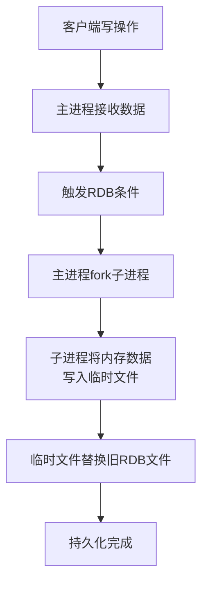
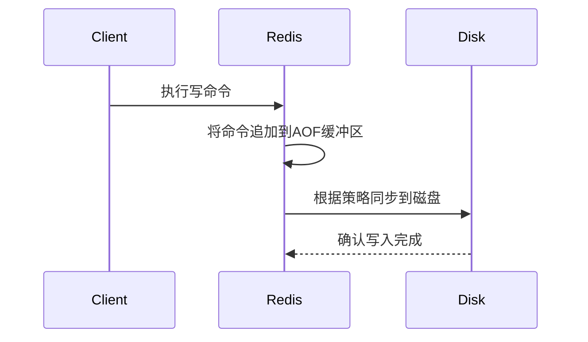

# 3. 持久化

***

# Java面试八股文：Redis持久性机制深度解析 &#x20;

***

## 1. 概述与定义 &#x20;

**Redis持久化**是指将内存中的数据定期保存到磁盘的过程，以防止因服务器宕机、重启或意外断电导致数据丢失。Redis提供了两种持久化方式： &#x20;

- **RDB（Redis Database Backup）**：基于快照的持久化，将内存数据以二进制格式保存到磁盘文件（默认`dump.rdb`）。 &#x20;
- **AOF（Append Only File）**：基于日志的持久化，将每个写操作追加到日志文件（默认`appendonly.aof`）。 &#x20;

⚠️ **核心目标**： &#x20;

- **数据可靠性**：确保数据在异常情况下可恢复。 &#x20;
- **性能平衡**：在持久化开销与系统吞吐量之间取得平衡。 &#x20;

***

## 2. 原理剖析 &#x20;

### 2.1 RDB机制原理 &#x20;

**流程图示例（Mermaid语法）**： &#x20;




**关键步骤**： &#x20;

1. **fork子进程**：父进程继续处理请求，子进程负责持久化（利用操作系统的COW机制，避免内存复制开销）。 &#x20;
2. **数据序列化**：子进程将内存数据序列化为二进制格式写入临时文件。 &#x20;
3. **原子替换**：临时文件生成后，用它替换旧的RDB文件（`rename`操作确保原子性）。 &#x20;

**优点**： &#x20;

- **高性能**：主进程无阻塞，适合大规模数据恢复。 &#x20;
- **紧凑格式**：二进制文件体积小，适合备份和灾难恢复。 &#x20;

**缺点**： &#x20;

- **数据丢失风险**：最后一次快照后的数据可能丢失。 &#x20;

***

### 2.2 AOF机制原理 &#x20;

**流程图示例（Mermaid语法）**： &#x20;




**核心流程**： &#x20;

1. **命令追加**：每个写操作（如`SET`、`DEL`）被追加到AOF缓冲区。 &#x20;
2. **同步策略**：通过`appendfsync`参数控制写入磁盘的时机： &#x20;
   - `always`：每次操作后立即同步（安全性高，性能低）。 &#x20;
   - `everysec`：每秒同步一次（默认，平衡安全与性能）。 &#x20;
   - `no`：由操作系统决定（性能高，但可能丢失数据）。 &#x20;
3. **日志重写**：定期通过`BGREWRITEAOF`合并冗余命令（如多次`SET key`操作）。 &#x20;

**优点**： &#x20;

- **数据安全性高**：即使崩溃，最多丢失1秒的数据（`everysec`模式）。 &#x20;
- **可读性好**：文本文件可手动修复（如删除无效命令）。 &#x20;

**缺点**： &#x20;

- **文件体积大**：相同数据集下，AOF文件通常比RDB大。 &#x20;
- **恢复速度慢**：需逐行解析日志重放命令。 &#x20;

***

## 3. 应用目标 &#x20;

- **RDB**：适用于需要快速恢复和大规模数据备份的场景（如电商秒杀前的全量数据备份）。 &#x20;
- **AOF**：适用于对数据安全性要求高（如金融交易）的场景，容忍一定性能损耗。 &#x20;
- **混合模式**：结合两者的优点（如Redis 6.0+支持混合持久化）。 &#x20;

***

## 4. 主要特点对比（表格） &#x20;

| **特性**​     | **RDB**​      | **AOF**​               |
| ----------- | ------------- | ---------------------- |
| **持久化方式**​  | 快照（周期性全量）     | 日志追加（增量）               |
| **数据丢失风险**​ | 快照间隔内数据可能丢失   | 最多丢失1秒数据（\`everysec\`） |
| **文件体积**​   | 较小（二进制压缩）     | 较大（文本格式，需重写）           |
| **恢复速度**​   | 快（直接加载二进制）    | 慢（需逐行解析日志）             |
| **性能影响**​   | 主进程无阻塞（子进程处理） | 频繁同步可能影响性能             |

***

## 5. 主要内容及其组成部分 &#x20;

### 5.1 RDB配置与触发 &#x20;

#### 5.1.1 自动触发配置 &#x20;

- \*\*`save`\*\***指令**： &#x20;
  ```text 
  save 900 1     // 900秒内至少1次写操作触发  
  save 300 10    // 300秒内至少10次写操作触发  
  save 60 10000  // 60秒内至少10000次写操作触发  
  ```

- **禁用RDB**：注释所有`save`行，或设置`save ""`。 &#x20;

#### 5.1.2 手动触发 &#x20;

- \*\*`SAVE`\*\***命令**：阻塞主进程，直到持久化完成（慎用）。 &#x20;
- \*\*`BGSAVE`\*\***命令**：异步触发，适合生产环境。 &#x20;

#### 5.1.3 文件控制 &#x20;

- **`dbfilename`**：指定RDB文件名（默认`dump.rdb`）。 &#x20;
- **`dir`**：设置存储目录（默认当前目录）。 &#x20;
- **`rdbcompression`**：启用LZF压缩（默认`yes`）。 &#x20;

***

### 5.2 AOF配置与触发 &#x20;

#### 5.2.1 启用AOF &#x20;

- **配置参数**： &#x20;
  ```text 
  appendonly yes       // 启用AOF  
  appendfilename "appendonly.aof"  
  appendfsync everysec // 同步策略  
  ```


#### 5.2.2 日志重写 &#x20;

- **自动触发**： &#x20;
  ```text 
  auto-aof-rewrite-percentage 100 // 文件体积超过原文件100%时触发  
  auto-aof-rewrite-min-size 64mb  // 最小触发文件大小  
  ```

- **手动触发**：`BGREWRITEAOF`命令。 &#x20;

#### 5.2.3 格式升级 &#x20;

- **Redis 2.4+**：AOF支持“无损”格式（`aof-use-rdb-preamble`），结合RDB头信息加速恢复。 &#x20;

***

### 5.3 混合持久化（Redis 6.0+） &#x20;

**原理**： &#x20;

- **AOF与RDB结合**：日志文件头部包含RDB格式的数据库状态快照，后续追加增量操作。 &#x20;
- **优势**： &#x20;
  - **恢复速度快**：先加载RDB快照，再重放增量日志。 &#x20;
  - **空间效率高**：避免全量日志存储。 &#x20;

***

## 6. 应用与拓展 &#x20;

### 6.1 场景选择建议 &#x20;

| **场景**​    | **推荐方案**​              | **理由**​   |
| ---------- | ---------------------- | --------- |
| 高吞吐、低延迟    | RDB + \`everysec\` AOF | 平衡性能与安全性  |
| 金融交易（强一致性） | AOF（\`always\`模式）      | 数据丢失容忍度极低 |
| 大规模数据恢复    | RDB                    | 快速加载二进制文件 |

### 6.2 常见问题处理 &#x20;

- **RDB文件损坏**： &#x20;
  ```text 
  redis-check-dump dump.rdb // 检查并修复RDB文件  
  ```

- **AOF文件过大**： &#x20;
  ```text 
  redis-cli config set auto-aof-rewrite-percentage 50 // 缩小触发阈值  
  redis-cli bgrewriteaof   // 手动触发重写  
  ```


### 6.3 高可用架构 &#x20;

- **主从复制+持久化**： &#x20;
  ```text 
  主节点：RDB+AOF混合模式  
  从节点：仅加载主节点的RDB文件，同步后续AOF日志  
  ```

- **集群部署**：通过哨兵或Redis Cluster实现多副本持久化。 &#x20;

***

## 7. 面试问答（模拟回答） &#x20;

### Q1：RDB和AOF的区别是什么？ &#x20;

**回答**： &#x20;

RDB和AOF是Redis的两种持久化方式，核心区别如下： &#x20;

1. **机制不同**： &#x20;
   - **RDB**：周期性生成内存数据的快照（二进制文件）。 &#x20;
   - **AOF**：记录每个写操作的日志，按行追加到文件。 &#x20;
2. **数据丢失风险**： &#x20;
   - RDB丢失最后一次快照后的数据，AOF最多丢失1秒数据（`everysec`模式）。 &#x20;
3. **性能与恢复**： &#x20;
   - RDB文件小、恢复快，但需权衡快照频率。 &#x20;
   - AOF安全性高，但文件体积大且恢复慢。 &#x20;

**示例**： &#x20;

```text 
RDB适合电商大促前的全量备份，AOF适合支付系统保障数据不丢失。  
```


***

### Q2：为什么RDB使用fork子进程？ &#x20;

**回答**： &#x20;

RDB通过`fork`创建子进程实现持久化，原因如下： &#x20;

1. **避免阻塞主进程**：父进程继续处理请求，子进程负责写盘。 &#x20;
2. **COW机制优化**：子进程共享父进程内存，仅在写操作时复制修改的页（节省内存）。 &#x20;
3. **原子性保证**：子进程生成临时文件后，用`rename`原子替换旧文件，避免不完整快照。 &#x20;

***

### Q3：AOF的`appendfsync`策略如何选择？ &#x20;

**回答**： &#x20;

根据业务需求选择： &#x20;

- **`always`**：每次操作同步，安全性最高但性能最低。适用于金融交易等关键场景。 &#x20;
- **`everysec`**（默认）：每秒同步，平衡安全与性能。适合大多数应用。 &#x20;
- **`no`**：依赖OS刷盘，性能最高但可能丢失数据。适用于允许短暂不一致的场景。 &#x20;

**示例配置**： &#x20;

```text 
# 推荐配置（平衡型）  
appendfsync everysec  
```


***

### Q4：AOF日志重写的目的是什么？ &#x20;

**回答**： &#x20;

AOF重写的目的是： &#x20;

1. **减少文件体积**：合并冗余命令（如多次`SET key`操作）。 &#x20;
2. **提升恢复速度**：重写后文件更紧凑，解析更快。 &#x20;

**触发方式**： &#x20;

- 自动触发：文件体积超过阈值（如原文件100%且≥64MB）。 &#x20;
- 手动触发：`BGREWRITEAOF`命令。 &#x20;

**示例**： &#x20;

```text 
原始日志：  
SET key 1  
SET key 2  
SET key 3  
重写后：  
SET key 3  
```


***

### Q5：Redis 6.0的混合持久化如何工作？ &#x20;

**回答**： &#x20;

Redis 6.0引入的混合持久化（AOF+RDB）： &#x20;

1. **AOF文件头部**：包含一个RDB格式的数据库快照。 &#x20;
2. **后续日志**：仅追加快照后的增量操作。 &#x20;
3. **优势**： &#x20;
   - **恢复快**：先加载RDB快照，再重放少量增量日志。 &#x20;
   - **体积小**：避免全量日志存储。 &#x20;

**示例**： &#x20;

```text 
假设数据库有1000万条数据，混合AOF文件可能仅包含快照后的新增/修改操作。  
```


***

## 总结 &#x20;

Redis持久化是面试高频考点，需深入理解RDB与AOF的原理、配置及适用场景。掌握混合持久化、日志重写等进阶机制，结合实际案例（如电商、金融场景）说明选择依据，可有效展示技术深度与工程思维！ 🚀
