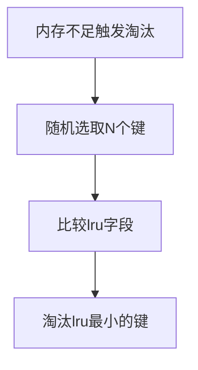

# 5. 数据淘汰策略

***

# Java面试八股文：Redis数据淘汰策略深度解析 &#x20;

***

## 1. 概述与定义 &#x20;

**Redis数据淘汰策略**（Eviction Policies）是当Redis内存达到`maxmemory`阈值时，用于选择性删除键以释放内存的机制。其核心目标是**在内存不足时，根据预设规则平衡数据保留与系统性能**。 &#x20;

Redis提供**8种淘汰策略**，分为以下两类： &#x20;

- **全局淘汰**：从所有键中选择淘汰对象（如`allkeys-lru`）。 &#x20;
- **局部淘汰**：仅从设置了过期时间的键中选择（如`volatile-lfu`）。 &#x20;
- **无淘汰**：内存不足时直接拒绝写操作（`noeviction`）。 &#x20;

⚠️ **关键问题**： &#x20;

- 如何在高并发场景下高效选择淘汰键？ &#x20;
- 如何根据业务需求选择策略（如热点数据、冷数据）？ &#x20;

***

## 2. 原理剖析 &#x20;

### 2.1 淘汰策略分类 &#x20;

**表格对比（策略分类）**： &#x20;

| **策略类型**​     | **适用场景**​ | **淘汰范围**​ | **核心逻辑**​                              |
| ------------- | --------- | --------- | -------------------------------------- |
| **全局淘汰**​     | 未设置过期时间的键 | 所有键       | \`allkeys-lru\`/\`allkeys-lfu\`等       |
| **局部淘汰**​     | 已设置过期时间的键 | 过期键       | \`volatile-lru\`/\`volatile-ttl\`等     |
| **随机淘汰**​     | 需快速释放内存   | 全局或局部     | \`allkeys-random\`/\`volatile-random\` |
| **无淘汰（默认）** ​ | 严格保证数据完整性 | 无         | 内存不足时返回错误                              |

***

### 2.2 核心算法原理 &#x20;

#### 2.2.1 近似LRU算法（`allkeys-lru`/`volatile-lru`） &#x20;

**原理**： &#x20;

- **记录时间戳**：每个键的`RedisObject`中记录最近访问时间（`lru`字段）。 &#x20;
- **随机采样**：每次淘汰时随机选取`maxmemory-samples`个键，比较它们的`lru`值，淘汰最久未使用的键。 &#x20;
- **参数配置**： &#x20;
  ```text 
  config set maxmemory-samples 3 // 默认3，取样3个键  
  ```


**流程图（Mermaid语法）**： &#x20;




#### 2.2.2 近似LFU算法（`allkeys-lfu`/`volatile-lfu`） &#x20;

**原理**： &#x20;

- **统计访问次数**：键的`RedisObject`中使用8位记录访问频率（`lfu_counter`），16位记录时间（`lru`）。 &#x20;
- **淘汰逻辑**：优先淘汰访问次数最少的键，若次数相同则按LRU规则。 &#x20;

**示例**： &#x20;

```text 
// 假设键A访问10次，键B访问5次  
// 淘汰键B（次数更少）  
```


#### 2.2.3 TTL优先（`volatile-ttl`） &#x20;

**原理**： &#x20;

- **优先删除**：剩余生存时间（TTL）最短的键。 &#x20;
- **示例配置**： &#x20;
  ```text 
  config set maxmemory-policy volatile-ttl  
  ```


***

### 2.3 算法优化：近似实现 &#x20;

Redis的LRU和LFU为近似算法，原因： &#x20;

1. **性能优化**： &#x20;
   - 精确LRU需维护链表，开销大（空间与时间）。 &#x20;
   - 近似算法通过**随机采样**降低复杂度。 &#x20;
2. **公平性**： &#x20;
   - 通过`maxmemory-samples`控制采样数量（默认3），平衡精度与性能。 &#x20;

***

## 3. 应用目标 &#x20;

- **内存管理**：避免OOM（内存溢出）导致服务崩溃。 &#x20;
- **数据优先级**：保留高频访问或近期活跃的数据。 &#x20;
- **场景适配**： &#x20;
  - **热点数据**：使用`allkeys-lru`保留最近访问数据。 &#x20;
  - **长尾数据**：使用`allkeys-lfu`保留高频访问数据。 &#x20;
  - **临时数据**：对过期键使用`volatile-ttl`优先清理。 &#x20;

***

## 4. 主要特点对比（表格） &#x20;

| **策略名称**​           | **淘汰范围**​ | **核心逻辑**​   | **适用场景**​  | **性能影响**​ |
| ------------------- | --------- | ----------- | ---------- | --------- |
| \`noeviction\`      | 无         | 不淘汰         | 数据完整性优先    | 低（仅返回错误）  |
| \`allkeys-lru\`     | 全局        | 近似最近最少使用    | 热点数据场景     | 中（采样开销）   |
| \`allkeys-lfu\`     | 全局        | 近似最少访问次数    | 长期高频访问场景   | 高（需维护计数器） |
| \`allkeys-random\`  | 全局        | 随机删除        | 需快速释放内存    | 低         |
| \`volatile-lru\`    | 过期键       | 近似最近最少使用    | 过期键优先清理    | 中         |
| \`volatile-lfu\`    | 过期键       | 近似最少访问次数    | 高频访问的过期键场景 | 高         |
| \`volatile-ttl\`    | 过期键       | 优先删除剩余时间短的键 | 避免过期键占内存   | 低         |
| \`volatile-random\` | 过期键       | 随机删除        | 简单释放过期键内存  | 低         |

***

## 5. 主要内容及其组成部分 &#x20;

### 5.1 全局淘汰策略 &#x20;

#### 5.1.1 `allkeys-lru` &#x20;

- **实现细节**： &#x20;
  - 淘汰时随机选取`maxmemory-samples`个键，选择`lru`最小的键。 &#x20;
- **示例配置**： &#x20;
  ```text 
  config set maxmemory-policy allkeys-lru  
  ```


#### 5.1.2 `allkeys-lfu` &#x20;

- **实现细节**： &#x20;
  - 记录访问次数（`lfu_counter`）和最近访问时间（`lru`）。 &#x20;
  - 访问次数少的优先淘汰，次数相同时按`lru`决定。 &#x20;
- **示例代码片段**： &#x20;
  ```java 
  // LFU比较逻辑伪代码  
  if (key1.lfu < key2.lfu) {  
      return key1;  
  } else if (key1.lfu == key2.lfu) {  
      return key_with_smaller_lru(key1, key2);  
  }  
  ```


***

### 5.2 局部淘汰策略 &#x20;

#### 5.2.1 `volatile-ttl` &#x20;

- **触发时机**： &#x20;
  - 内存不足时，优先删除剩余时间最短的过期键。 &#x20;
- **示例场景**： &#x20;
  ```text 
  # 设置键过期时间  
  set key1 value1 ex 60  
  set key2 value2 ex 300  
  # 当内存不足时，优先淘汰key1（剩余时间短）  
  ```


#### 5.2.2 `volatile-lru` &#x20;

- **实现细节**： &#x20;
  - 仅在设置了过期时间的键中，按`lru`值淘汰。 &#x20;

***

### 5.3 随机淘汰策略 &#x20;

#### 5.3.1 `allkeys-random` &#x20;

- **特点**： &#x20;
  - 完全随机选择键，无需维护额外数据结构，**性能最优**。 &#x20;
- **适用场景**： &#x20;
  ```text 
  # 需快速释放内存，不关心数据价值  
  config set maxmemory-policy allkeys-random  
  ```


***

### 5.4 特殊策略：`noeviction` &#x20;

- **行为**： &#x20;
  - 内存不足时返回错误，**不删除任何键**。 &#x20;
- **适用场景**： &#x20;
  - 数据完整性要求极高（如金融交易）。 &#x20;
- **配置示例**： &#x20;
  ```text 
  config set maxmemory-policy noeviction  
  ```


***

## 6. 应用与拓展 &#x20;

### 6.1 场景选择建议 &#x20;

| **场景**​       | **推荐策略**​        | **理由**​         |
| ------------- | ---------------- | --------------- |
| 高频读写（如电商商品库存） | \`allkeys-lru\`  | 保留近期访问数据，减少缓存穿透 |
| 短视频热点推荐       | \`allkeys-lfu\`  | 保留长期高频访问的热点数据   |
| 临时会话数据        | \`volatile-ttl\` | 优先清理即将过期的临时数据   |

***

### 6.2 性能调优参数 &#x20;

- **`maxmemory-samples`**： &#x20;
  ```text 
  config set maxmemory-samples 5 // 增大采样数提高淘汰精度  
  ```

- **`maxmemory`**： &#x20;
  ```text 
  config set maxmemory 2gb // 设置内存阈值  
  ```


***

### 6.3 淘汰与过期策略的协同 &#x20;

- **过期键优先级**： &#x20;
  - 过期键在定期删除（`active-expire-cycle`）中会被优先清理，但内存不足时淘汰策略可能提前删除未过期键。 &#x20;
- **示例流程**： &#x20;
  ```text 
  // 假设键A未过期但被内存淘汰策略选中  
  // 淘汰策略会删除A，即使它还有1小时过期  
  ```


***

## 7. 面试问答（模拟回答） &#x20;

### Q1：Redis的淘汰策略有哪些？如何选择？ &#x20;

**回答**： &#x20;

Redis提供8种淘汰策略，分为全局、局部和随机淘汰： &#x20;

1. **全局淘汰**： &#x20;
   - `allkeys-lru`：淘汰最近最少使用的键（适合热点数据）。 &#x20;
   - `allkeys-lfu`：淘汰访问次数最少的键（适合长尾数据）。 &#x20;
   - `allkeys-random`：随机删除（快速释放内存）。 &#x20;
2. **局部淘汰**： &#x20;
   - 仅针对设置了过期时间的键，如`volatile-ttl`优先清理剩余时间短的键。 &#x20;
3. **无淘汰**：`noeviction`直接返回错误。 &#x20;

**选择依据**： &#x20;

- **高频热点数据**：`allkeys-lru`。 &#x20;
- **长期高频访问**：`allkeys-lfu`。 &#x20;
- **临时数据**：`volatile-ttl`。 &#x20;

***

### Q2：Redis的近似LRU算法如何实现？ &#x20;

**回答**： &#x20;

Redis的近似LRU通过以下步骤实现： &#x20;

1. **记录时间**：每个键的`RedisObject`存储最近访问时间（`lru`字段）。 &#x20;
2. **随机采样**：每次淘汰时随机选取`maxmemory-samples`个键（默认3）。 &#x20;
3. **比较淘汰**：选择`lru`最小的键删除，避免维护链表的开销。 &#x20;

**示例**： &#x20;

```text 
// 假设选取3个键：A（lru=100）、B（lru=50）、C（lru=200）  
// 淘汰B（lru最小）  
```


***

### Q3：`volatile-lfu`与`allkeys-lfu`的区别？ &#x20;

**回答**： &#x20;

| **策略**​          | **淘汰范围**​ | **核心逻辑**​    |
| ---------------- | --------- | ------------ |
| \`volatile-lfu\` | 设置过期时间的键  | 淘汰访问次数最少的过期键 |
| \`allkeys-lfu\`  | 所有键       | 淘汰访问次数最少的全局键 |

- **`volatile-lfu`**：适合清理过期但访问较少的临时数据。 &#x20;
- **`allkeys-lfu`**：适用于长期缓存的高频访问数据。 &#x20;

***

### Q4：为什么Redis使用近似LRU而非精确LRU？ &#x20;

**回答**： &#x20;

精确LRU需维护链表结构，存在以下问题： &#x20;

1. **空间开销**：每个键需额外存储指针，占用内存。 &#x20;
2. **性能损耗**：频繁移动链表节点会导致CPU负载升高。 &#x20;

**近似LRU的优势**： &#x20;

- **低开销**：仅需记录时间戳，随机采样即可快速淘汰。 &#x20;
- **可调精度**：通过`maxmemory-samples`平衡精度与性能。 &#x20;

***

### Q5：`maxmemory-samples`参数的作用是什么？ &#x20;

**回答**： &#x20;

`maxmemory-samples`控制淘汰时的随机采样数量： &#x20;

- **值越大**：淘汰决策越精确（接近真实LRU/LFU），但性能开销增加。 &#x20;
- **值越小**：淘汰更快，但可能因随机性导致偏差。 &#x20;

**推荐设置**： &#x20;

- 默认3足够多数场景，高精度场景可调至5-10。 &#x20;

***

## 总结 &#x20;

Redis数据淘汰策略是面试高频考点，需深入理解各策略的实现原理、适用场景及参数调优。结合实际案例（如电商、社交场景）说明选择逻辑，可充分展示技术深度与工程思维！ 🚀
