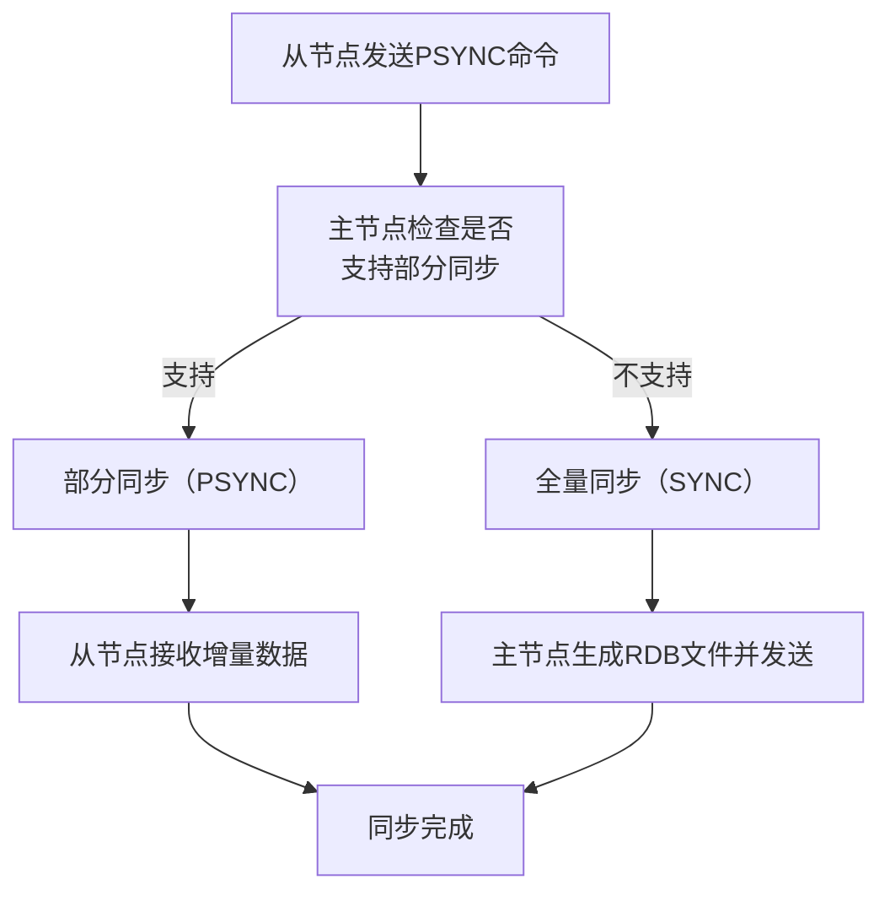

# 1. 主从复制

***

# Java面试八股文：Redis集群主从复制深度解析 &#x20;

***

## 1. 概述与定义 &#x20;

**Redis主从复制**（Master-Slave Replication）是Redis实现数据冗余、高可用和读写分离的核心机制。其核心是**通过主节点（Master）将数据同步到从节点（Slave）**，实现数据备份和负载均衡。 &#x20;

**关键术语**： &#x20;

- **Master**：主节点，负责处理写操作。 &#x20;
- **Slave**：从节点，复制主节点数据，可处理读操作（读写分离）。 &#x20;
- **全量同步**：主从首次连接或断开时间过长后，主节点将全量数据发送给从节点。 &#x20;
- **部分同步**：基于PSYNC协议，从节点断开后可从指定位置继续同步，避免全量传输。 &#x20;

***

## 2. 原理剖析 &#x20;

### 2.1 主从复制流程 &#x20;

**步骤**： &#x20;

1. **从节点连接主节点**： &#x20;
   ```text 
   slaveof <master-ip> <master-port> // 从节点配置  
   ```

2. **全量同步**： &#x20;
   - 主节点创建RDB快照，并将快照发送给从节点。 &#x20;
   - 从节点加载RDB文件，同步主节点数据。 &#x20;
3. **增量同步**： &#x20;
   - 主节点将后续的写操作通过\*\* replication backlog\*\*（复制积压缓冲区）发送给从节点。 &#x20;

**流程图（Mermaid语法）**： &#x20;




***

### 2.2 同步方式对比 &#x20;

| **方式**​   | **触发条件**​    | **数据一致性**​ | **性能影响**​   |
| --------- | ------------ | ---------- | ----------- |
| **全量同步**​ | 首次连接或主从断开时间长 | 高（全量数据）    | 高（生成RDB开销大） |
| **部分同步**​ | 主从断开时间较短     | 高（基于积压缓冲区） | 低（仅增量数据）    |

***

### 2.3 数据传播机制 &#x20;

#### 2.3.1 Replication Backlog &#x20;

- **作用**：主节点维护一个固定大小的缓冲区（默认1MB），记录最近的写操作。 &#x20;
- **配置参数**： &#x20;
  ```text 
  repl-backlog-size 1mb // 缓冲区大小  
  ```

- **工作流程**： &#x20;
  - 从节点断开后，若主节点的缓冲区包含从节点缺失的写操作，可直接发送增量数据。 &#x20;
  - 否则触发全量同步。 &#x20;

#### 2.3.2 PSYNC协议 &#x20;

- **版本1**：仅支持全量同步。 &#x20;
- **版本2**（Redis 2.8+）：支持部分同步，通过`runid`和`offset`标识同步进度。 &#x20;
- **示例命令**： &#x20;
  ```text 
  PSYNC <runid> <offset> // 从节点请求同步  
  ```


***

### 2.4 异步与同步复制 &#x20;

Redis默认采用**异步复制**： &#x20;

- **特点**：主节点写入后立即响应，无需等待从节点确认。 &#x20;
- **风险**：主节点故障可能导致数据丢失（未同步的写操作）。 &#x20;
- **解决方案**： &#x20;
  - 使用**Redis Sentinel**实现主从切换和监控。 &#x20;
  - 或采用半同步模式（需自定义逻辑）。 &#x20;

***

## 3. 应用目标 &#x20;

- **高可用**：主节点故障时，从节点可接管服务。 &#x20;
- **读写分离**：从节点分担读请求，提升系统吞吐量。 &#x20;
- **数据冗余**：防止数据丢失（主节点崩溃）。 &#x20;

***

## 4. 主要特点 &#x20;

| **特性**​    | **说明**​         | **优势**​    |
| ---------- | --------------- | ---------- |
| **异步复制**​  | 主节点无需等待从节点确认    | 性能高，延迟低    |
| **自动重连**​  | 从节点断开后自动尝试重新连接  | 高可用性保障     |
| **多从节点**​  | 单主节点可挂载多个从节点    | 扩展性强，支持多副本 |
| **只读从节点**​ | 从节点默认禁用写操作（可配置） | 防止数据不一致    |

***

## 5. 主要内容及其组成部分 &#x20;

### 5.1 主从节点配置 &#x20;

#### 5.1.1 主节点配置 &#x20;

- **默认**：无需额外配置（主节点角色由从节点指定）。 &#x20;
- **优化参数**： &#x20;
  ```text 
  requirepass myMasterPass // 设置主节点密码  
  masterauth mySlavePass   // 从节点认证密码（非必须）  
  ```


#### 5.1.2 从节点配置 &#x20;

- **基本配置**： &#x20;
  ```text 
  slaveof <master-ip> <master-port>  
  masterauth <password> // 若主节点设置了密码  
  ```

- **高级参数**： &#x20;
  ```text 
  repl-timeout 60 // 同步超时时间  
  slave-serve-stale-data yes // 允许从节点在未连接主节点时响应请求  
  ```


***

### 5.2 同步流程详解 &#x20;

#### 5.2.1 全量同步（Full Resync） &#x20;

1. **主节点生成RDB**： &#x20;
   ```text 
   BGSAVE // 生成RDB文件  
   ```

2. **传输RDB**：主节点将RDB文件发送给从节点。 &#x20;
3. **从节点加载RDB**：清空现有数据，加载RDB文件。 &#x20;
4. **开始增量同步**：主节点后续写操作通过缓冲区传递。 &#x20;

#### 5.2.2 部分同步（Partial Sync） &#x20;

1. **从节点发送PSYNC命令**：携带上次同步的`offset`和`runid`。 &#x20;
2. **主节点检查缓冲区**： &#x20;
   - 若缓冲区包含所需数据，返回增量数据。 &#x20;
   - 否则触发全量同步。 &#x20;

***

### 5.3 监控与维护 &#x20;

#### 5.3.1 监控命令 &#x20;

- **查看主从状态**： &#x20;
  ```text 
  info replication // 主节点执行查看从节点信息  
  ```

- **从节点信息示例**： &#x20;
  ```text 
  role:slave  
  master_host:127.0.0.1  
  master_link_status:up  
  ```


#### 5.3.2 故障恢复 &#x20;

- **自动故障转移**：依赖Redis Sentinel或Cluster。 &#x20;
- **手动切换**： &#x20;
  ```text 
  SLAVEOF NO ONE // 将从节点转为主节点  
  ```


***

### 5.4 安全与认证 &#x20;

- **密码配置**： &#x20;
  ```text 
  masterauth <password> // 从节点配置连接主节点的密码  
  requirepass <password> // 主节点设置访问密码  
  ```

- **风险**：未配置密码可能导致未授权访问。 &#x20;

***

## 6. 应用与拓展 &#x20;

### 6.1 读写分离实践 &#x20;

**场景**：电商系统中，订单查询需分担主节点压力。 &#x20;

**实现步骤**： &#x20;

1. 配置多个从节点。 &#x20;
2. 客户端轮询主节点和从节点： &#x20;
   ```java 
   JedisPoolConfig config = new JedisPoolConfig();  
   JedisPool masterPool = new JedisPool(config, "master-host", 6379);  
   JedisPool slavePool = new JedisPool(config, "slave-host", 6379);  

   public String get(String key) {  
       try (Jedis jedis = slavePool.getResource()) {  
           return jedis.get(key);  
       }  
   }  
   ```


***

### 6.2 与Sentinel的结合 &#x20;

**Redis Sentinel**： &#x20;

- **作用**：监控主从节点状态，实现自动故障转移。 &#x20;
- **配置示例**： &#x20;
  ```text 
  sentinel monitor mymaster 127.0.0.1 6379 2  
  sentinel down-after-milliseconds mymaster 5000  
  sentinel failover-timeout mymaster 60000  
  ```


***

### 6.3 主从复制的局限性 &#x20;

| **问题**​    | **解决方案**​                      |
| ---------- | ------------------------------ |
| 数据丢失风险     | 使用Sentinel实现快速主从切换             |
| 网络延迟导致同步延迟 | 增大\`repl-backlog-size\`和优化网络拓扑 |
| 多主节点数据不一致  | 避免手动切换主节点，依赖Sentinel自动决策       |

***

## 7. 面试问答（模拟回答） &#x20;

### Q1：Redis主从复制如何实现？ &#x20;

**回答**： &#x20;

Redis主从复制通过以下步骤实现： &#x20;

1. **从节点连接主节点**：配置`slaveof`指向主节点。 &#x20;
2. **全量同步**：主节点生成RDB文件并发送给从节点。 &#x20;
3. **增量同步**：主节点通过`replication backlog`将后续写操作发送给从节点。 &#x20;
4. **部分同步**：若从节点断开时间较短，可基于PSYNC协议从缓冲区继续同步。 &#x20;

**示例命令**： &#x20;

```text 
// 主节点配置无需改动  
// 从节点配置  
slaveof 192.168.1.100 6379  
```


***

### Q2：主从复制的全量同步与部分同步有何区别？ &#x20;

**回答**： &#x20;

| **同步方式**​                                              | **触发条件**​    | **数据传输内容**​ | **性能影响**​   |
| ------------------------------------------------------ | ------------ | ----------- | ----------- |
| 全量同步                                                   | 首次连接或主从断开时间长 | 主节点的完整RDB文件 | 高（生成RDB开销大） |
| 部分同步                                                   | 主从断开时间较短     | 缓冲区的增量数据    | 低（仅传输差量）    |
| \*\*PSYNC协议\*\*：通过\`runid\`和\`offset\`标识同步进度，决定使用哪种方式。 |              |             |             |

***

### Q3：主从复制的异步性可能导致哪些问题？如何解决？ &#x20;

**回答**： &#x20;

**问题**： &#x20;

- **数据丢失**：主节点故障时，未同步的写操作可能丢失。 &#x20;

**解决方案**： &#x20;

1. **Redis Sentinel**：监控主节点，故障时选举从节点为新主节点。 &#x20;
2. **半同步机制**：通过自定义逻辑等待从节点确认（需牺牲性能）。 &#x20;
3. **增大缓冲区**：`repl-backlog-size`越大，部分同步成功率越高。 &#x20;

***

### Q4：如何配置Redis主从复制？ &#x20;

**回答**： &#x20;

**步骤**： &#x20;

1. **启动主节点**：默认无需配置。 &#x20;
2. **配置从节点**： &#x20;
   ```text 
   // 在从节点的redis.conf中添加：  
   slaveof <master-ip> <master-port>  
   masterauth <password> // 若主节点设置了密码  
   ```

3. **验证状态**： &#x20;
   ```text 
   // 在从节点执行：  
   info replication  
   ```


***

### Q5：主从复制如何实现读写分离？ &#x20;

**回答**： &#x20;

1. **客户端路由**：将读请求分发到从节点，写请求发送到主节点。 &#x20;
2. **示例代码（Java）**： &#x20;
   ```java 
   public class RedisClient {  
       private JedisPool masterPool;  
       private JedisPool slavePool;  

       public String get(String key) {  
           try (Jedis jedis = slavePool.getResource()) {  
               return jedis.get(key);  
           }  
       }  

       public String set(String key, String value) {  
           try (Jedis jedis = masterPool.getResource()) {  
               return jedis.set(key, value);  
           }  
       }  
   }  
   ```

3. **负载均衡**：可配置多个从节点，通过轮询或随机选择。 &#x20;

***

## 总结 &#x20;

Redis主从复制是面试高频考点，需深入理解同步流程、PSYNC协议、Sentinel集成及应用场景。结合电商读写分离、故障转移等案例，能够清晰展示技术深度与工程实践能力！ 🚀🔒
