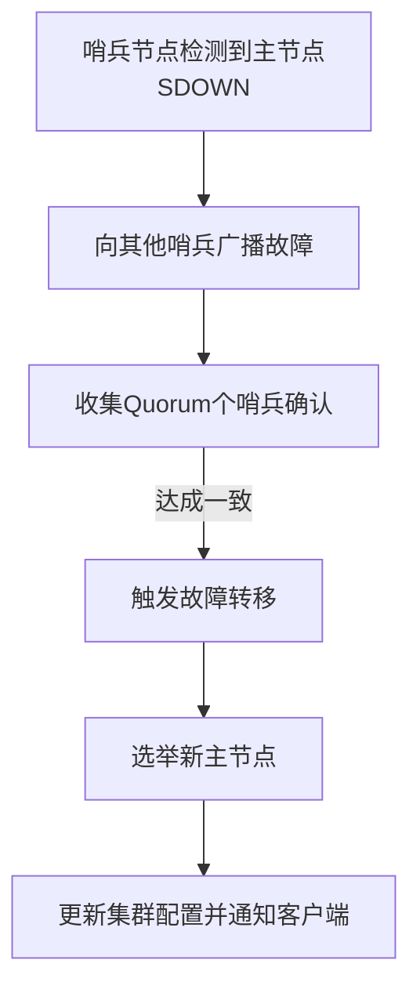

# 2. 哨兵模式

***

# Java面试八股文：Redis哨兵模式深度解析 &#x20;

***

## 1. 概述与定义 &#x20;

**Redis哨兵模式（Redis Sentinel）** 是Redis的高可用性解决方案，通过**监控、选主和通知**机制，实现主从集群的自动故障转移和配置管理。其核心目标是**保证主节点故障时快速选举新主节点，避免服务中断**。 &#x20;

**关键术语**： &#x20;

- **Sentinel节点**：负责监控Redis实例，执行故障检测和自动切换。 &#x20;
- **Quorum**：哨兵节点间达成一致的最小数量，用于决策是否触发故障转移。 &#x20;
- **Down After Milliseconds**：哨兵判定实例主观下线的超时时间。 &#x20;

***

## 2. 原理剖析 &#x20;

### 2.1 哨兵核心机制 &#x20;

#### 2.1.1 监控（Monitoring） &#x20;

- **心跳检测**： &#x20;
  - 每个哨兵节点定期向主从节点发送`PING`命令，检测其状态。 &#x20;
  - 若连续失败超过`down-after-milliseconds`阈值，标记为**主观下线（SDOWN）**。 &#x20;
- **主客观下线**： &#x20;
  - 若至少`Quorum`个哨兵节点报告主节点SDOWN，则标记为**客观下线（ODOWN）**。 &#x20;

#### 2.1.2 选主（Failover） &#x20;

1. **选举新主节点**： &#x20;
   - 从健康的从节点中选择一个晋升为主节点。 &#x20;
2. **数据同步**： &#x20;
   - 新主节点与其他从节点建立复制关系。 &#x20;
3. **配置更新**： &#x20;
   - 哨兵节点广播新主节点信息，客户端更新连接。 &#x20;

#### 2.1.3 通知（Notification） &#x20;

- 哨兵通过发布/订阅机制通知客户端集群状态变化。 &#x20;

**流程图（Mermaid语法）**： &#x20;




***

### 2.2 配置参数详解 &#x20;

| **参数**​                                                     | **说明**​                         | **默认值**​    |
| ----------------------------------------------------------- | ------------------------------- | ----------- |
| \`sentinel monitor \<master-name> \<ip> \<port> \<quorum>\` | 监控主节点的配置，\`quorum\`为故障转移所需哨兵数量。 | \\-         |
| \`sentinel down-after-milliseconds \<master-name> \<ms>\`   | 主节点主观下线判定时间。                    | 30000 (30秒) |
| \`sentinel parallel-syncs \<master-name> \<num>\`           | 故障转移时，新主节点同时同步的从节点数。            | 1           |

***

### 2.3 故障转移流程 &#x20;

1. **步骤1：主节点故障检测** &#x20;
   - 哨兵通过`PING`检测到主节点无响应。 &#x20;
2. **步骤2：客观下线判定** &#x20;
   - 至少`Quorum`个哨兵确认主节点SDOWN。 &#x20;
3. **步骤3：选举领航哨兵** &#x20;
   - 通过随机选举一个哨兵负责执行故障转移。 &#x20;
4. **步骤4：选择新主节点** &#x20;
   - 从健康的从节点中选择优先级最高的（`slave-priority`最小）。 &#x20;
5. **步骤5：重新配置从节点** &#x20;
   - 其他从节点转向新主节点同步数据。 &#x20;

***

## 3. 应用目标 &#x20;

- **高可用性**：主节点故障时，自动切换到从节点，减少停机时间。 &#x20;
- **配置中心**：集中管理集群状态，客户端无需手动切换主节点。 &#x20;
- **监控与报警**：通过哨兵日志和API监控集群健康状态。 &#x20;

***

## 4. 主要特点 &#x20;

| **特性**​     | **说明**​                              | **优势**​  |
| ----------- | ------------------------------------ | -------- |
| **去中心化**​   | 多个哨兵节点独立运行，无单点故障。                    | 高可靠性     |
| **自动故障转移**​ | 无需人工干预，快速切换主节点。                      | 提升系统可用性  |
| **客户端兼容性**​ | 客户端通过\`SENTINEL MASTER\`命令获取最新主节点地址。 | 无缝对接现有代码 |

***

## 5. 主要内容及其组成部分 &#x20;

### 5.1 哨兵节点配置 &#x20;

#### 5.1.1 基础配置示例 &#x20;

```text 
# sentinel.conf配置片段  
sentinel monitor mymaster 192.168.1.100 6379 2  
sentinel down-after-milliseconds mymaster 30000  
sentinel failover-timeout mymaster 60000  
sentinel parallel-syncs mymaster 1  
```


- `mymaster`：主节点名称（自定义）。 &#x20;
- `2`：`Quorum`值，需至少2个哨兵确认故障。 &#x20;

#### 5.1.2 启动哨兵节点 &#x20;

```text 
redis-server sentinel.conf --sentinel  
```


***

### 5.2 故障转移条件 &#x20;

| **条件**​       | **描述**​                              |
| ------------- | ------------------------------------ |
| **主节点不可达**​   | 连续\`down-after-milliseconds\`时间内无响应。 |
| **Quorum阈值**​ | 至少\`Quorum\`个哨兵确认主节点下线。              |
| **从节点健康状态**​  | 存在至少一个从节点可晋升为主节点。                    |

***

### 5.3 客户端集成 &#x20;

#### 5.3.1 Java客户端示例（Jedis） &#x20;

```java 
// 使用Sentinel连接池  
Set<String> sentinels = new HashSet<>();  
sentinels.add("redis://127.0.0.1:26379"); // 哨兵地址  

JedisSentinelPool pool = new JedisSentinelPool(  
    "mymaster", // 主节点名称  
    sentinels,  
    new GenericObjectPoolConfig()  
);  

try (Jedis jedis = pool.getResource()) {  
    jedis.set("key", "value");  
}  
```


***

### 5.4 哨兵与主从复制的协同 &#x20;

- **依赖关系**： &#x20;
  - 哨兵依赖主从复制机制实现数据同步。 &#x20;
  - 哨兵仅负责监控和故障转移，不参与数据存储。 &#x20;
- **配置示例**： &#x20;
  ```text 
  // 主节点配置无需改动  
  // 从节点配置：  
  slaveof 192.168.1.100 6379  
  ```


***

## 6. 应用与拓展 &#x20;

### 6.1 哨兵集群部署 &#x20;

**建议配置**： &#x20;

- **至少3个哨兵节点**：避免单点故障，且`Quorum`设为2。 &#x20;
- **跨机房部署**：提高容灾能力。 &#x20;

**示例配置**： &#x20;

```text 
# 哨兵节点1配置  
sentinel monitor mymaster 192.168.1.100 6379 2  
sentinel down-after-milliseconds mymaster 30000  

# 哨兵节点2配置相同，但运行在不同服务器  
```


***

### 6.2 与Redis Cluster的对比 &#x20;

| **特性**​   | **哨兵模式**​  | **Redis Cluster**​ |
| --------- | ---------- | ------------------ |
| **适用场景**​ | 主从架构的高可用性  | 分布式集群，无单点故障        |
| **数据分片**​ | 无          | 支持分片，自动迁移          |
| **复杂度**​  | 较低（依赖主从复制） | 较高（需处理分片和路由）       |

***

### 6.3 局限性与优化 &#x20;

| **问题**​ | **解决方案**​                                          |
| ------- | -------------------------------------------------- |
| 哨兵单点故障  | 部署多个哨兵节点，形成哨兵集群                                    |
| 故障转移延迟  | 缩短\`down-after-milliseconds\`和\`failover-timeout\` |
| 客户端兼容性  | 使用Jedis或Lettuce等支持哨兵的客户端库                          |

***

## 7. 面试问答（模拟回答） &#x20;

### Q1：Redis哨兵模式的作用是什么？ &#x20;

**回答**： &#x20;

Redis哨兵模式是Redis的高可用性解决方案，主要作用包括： &#x20;

1. **自动故障转移**：主节点故障时，自动选举从节点为新主节点。 &#x20;
2. **监控集群健康状态**：通过哨兵节点检测主从节点的存活状态。 &#x20;
3. **配置中心**：客户端通过哨兵获取最新主节点地址，无需手动切换。 &#x20;

**示例**： &#x20;

```java 
// 客户端通过哨兵连接池自动获取新主节点  
JedisSentinelPool pool = new JedisSentinelPool("mymaster", sentinels);  
```


***

### Q2：哨兵如何判定主节点故障？ &#x20;

**回答**： &#x20;

哨兵通过以下流程判定主节点故障： &#x20;

1. **主观下线（SDOWN）**： &#x20;
   - 哨兵节点通过`PING`检测到主节点无响应超过`down-after-milliseconds`时间。 &#x20;
2. **客观下线（ODOWN）**： &#x20;
   - 至少`Quorum`个哨兵节点报告主节点SDOWN。 &#x20;

**配置示例**： &#x20;

```text 
sentinel down-after-milliseconds mymaster 30000 // 30秒判定SDOWN  
sentinel quorum mymaster 2 // 需2个哨兵确认  
```


***

### Q3：哨兵故障转移的步骤是什么？ &#x20;

**回答**： &#x20;

1. **选举领航哨兵**：随机选择一个哨兵负责执行故障转移。 &#x20;
2. **选择新主节点**： &#x20;
   - 从健康的从节点中选择优先级最低（`slave-priority`最小）的节点。 &#x20;
3. **重新配置从节点**： &#x20;
   - 其他从节点转向新主节点同步数据。 &#x20;
4. **更新集群配置**： &#x20;
   - 哨兵通过发布/订阅通知客户端新主节点信息。 &#x20;

***

### Q4：如何配置Redis哨兵模式？ &#x20;

**回答**： &#x20;

**步骤**： &#x20;

1. **启动主从节点**： &#x20;
   ```text 
   // 主节点无需配置  
   // 从节点配置：  
   slaveof <master-ip> <master-port>  
   ```

2. **配置哨兵节点**： &#x20;
   ```text 
   sentinel monitor mymaster 192.168.1.100 6379 2  
   sentinel down-after-milliseconds mymaster 30000  
   ```

3. **启动哨兵**： &#x20;
   ```text 
   redis-server sentinel.conf --sentinel  
   ```

4. **客户端使用哨兵连接池**：如示例代码（见5.3节）。 &#x20;

***

### Q5：哨兵模式与主从复制的关系？ &#x20;

**回答**： &#x20;

- **主从复制是哨兵的基础**： &#x20;
  - 主从复制负责数据同步，哨兵仅负责监控和故障转移。 &#x20;
- **协同工作**： &#x20;
  1. 主节点故障时，哨兵触发故障转移。 &#x20;
  2. 新主节点通过主从复制同步数据给其他从节点。 &#x20;
- **配置示例**： &#x20;
  ```text 
  // 从节点配置主从关系  
  slaveof 192.168.1.100 6379  
  // 哨兵配置监控主节点  
  sentinel monitor mymaster 192.168.1.100 6379 2  
  ```


***

## 总结 &#x20;

Redis哨兵模式是面试高频考点，需深入理解监控机制、故障转移流程及客户端集成。结合主从复制、配置参数和实际案例，能够清晰展示对高可用架构的理解！ 🛡️🚀
