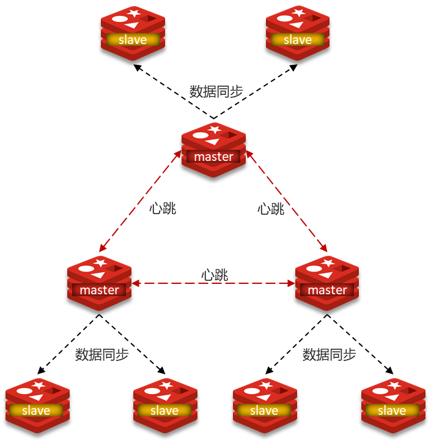
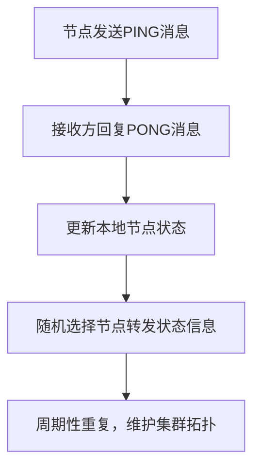

# 3. 分片集群

***

# Java面试八股文：Redis分片集群深度解析 &#x20;

***

## 1. 概述与定义 &#x20;



**Redis分片集群（Redis Cluster）** 是Redis的分布式解决方案，通过**数据分片**和**节点间协作**实现高可用、横向扩展和自动管理。其核心是将数据分散到多个节点，每个节点负责一部分数据，同时通过**Gossip协议**实现节点间通信和故障转移。 &#x20;

**关键术语**： &#x20;

- **哈希槽（Hash Slot）**：将数据分散到16384个槽位，每个键通过CRC16算法计算归属槽位。 &#x20;
- **分片（Sharding）**：数据按哈希槽分布到不同节点。 &#x20;
- **Gossip协议**：节点间通过心跳消息交换状态信息，维护集群拓扑。 &#x20;

***

## 2. 原理剖析 &#x20;

### 2.1 分片机制 &#x20;

#### 2.1.1 哈希槽分配 &#x20;

- **总槽位**：16384个槽位（0-16383）。 &#x20;
- **键到槽位映射**： &#x20;
  ```text 
  slot = CRC16(key) % 16384  
  ```

- **槽位分配示例**： &#x20;
  ```text 
  // 假设集群有3个主节点  
  Node A: slots 0-5460  
  Node B: slots 5461-10922  
  Node C: slots 10923-16383  
  ```


#### 2.1.2 数据迁移 &#x20;

- **手动迁移**：通过`CLUSTER ADDSLOTS`命令分配槽位。 &#x20;
- **自动迁移**：扩容时，集群自动平衡槽位分布。 &#x20;

***

### 2.2 Gossip协议 &#x20;

**作用**：节点间交换状态信息，维护集群一致性。 &#x20;

#### 2.2.1 消息类型 &#x20;

| **消息类型**​ | **作用**​        |
| --------- | -------------- |
| \`MEET\`  | 节点初次加入集群时交换信息。 |
| \`PONG\`  | 响应心跳请求，包含节点状态。 |
| \`FAIL\`  | 标记节点为失败状态。     |

#### 2.2.2 协议流程图（Mermaid语法） &#x20;




***

### 2.3 节点角色 &#x20;

| **角色**​     | **说明**​            | **特点**​           |
| ----------- | ------------------ | ----------------- |
| **Master**​ | 负责存储数据，处理写请求。      | 每个槽位由一个Master负责。  |
| **Slave**​  | 复制Master数据，提供读写分离。 | 可配置多个Slave。       |
| **配置节点**​   | 存储集群配置信息（槽位分配）。    | 所有Master节点都是配置节点。 |

***

### 2.4 故障转移 &#x20;

1. **检测故障**： &#x20;
   - 节点无响应超过`cluster-node-timeout`（默认15秒）。 &#x20;
2. **选举领航节点**： &#x20;
   - 其他Master节点投票选出一个节点负责故障转移。 &#x20;
3. **选择新Master**： &#x20;
   - 从故障Master的Slave中选择一个晋升为Master。 &#x20;

***

## 3. 应用目标 &#x20;

- **横向扩展**：通过增加节点提升存储容量和吞吐量。 &#x20;
- **高可用性**：自动故障转移，避免单点故障。 &#x20;
- **数据分片**：解决单节点内存瓶颈，支持海量数据。 &#x20;

***

## 4. 主要特点 &#x20;

| **特性**​   | **说明**​               | **优势**​ |
| --------- | --------------------- | ------- |
| **去中心化**​ | 节点间平等通信，无单点故障。        | 高可靠性    |
| **自动平衡**​ | 扩容时自动迁移槽位，无需人工干预。     | 简化运维    |
| **多主架构**​ | 每个Master独立处理请求，无写锁竞争。 | 高并发写入性能 |

***

## 5. 主要内容及其组成部分 &#x20;

### 5.1 集群启动与配置 &#x20;

#### 5.1.1 启动命令示例 &#x20;

```bash 
# 启动6379节点，集群模式  
redis-server --port 6379 --cluster-enabled yes --cluster-config-file nodes-6379.conf  

# 使用redis-cli创建集群（假设3主3从）  
redis-cli --cluster create \  
  127.0.0.1:6379 127.0.0.1:6380 127.0.0.1:6381 \  
  127.0.0.1:6382 127.0.0.1:6383 127.0.0.1:6384 \  
  --cluster-replicas 1  
```


#### 5.1.2 关键配置参数 &#x20;

| **参数**​                           | **说明**​          |
| --------------------------------- | ---------------- |
| \`cluster-enabled yes\`           | 启用集群模式。          |
| \`cluster-node-timeout\`          | 节点故障判定时间（默认15秒）。 |
| \`cluster-require-full-coverage\` | 否则集群降级为只读。       |

***

### 5.2 数据操作限制 &#x20;

#### 5.2.1 跨槽位命令 &#x20;

- **禁止操作**：如`MGET`跨槽位键，会导致错误： &#x20;
  ```text 
  (error) CROSSSLOT Keys in request don't hash to the same slot  
  ```

- **解决方案**： &#x20;
  - 使用`Redis Cluster`支持的原子命令（如`EVAL`脚本）。 &#x20;
  - 将关联数据存储在相同槽位（如通过`HASH`结构）。 &#x20;

#### 5.2.2 集群模式下的事务 &#x20;

- **限制**：事务（`MULTI/EXEC`）只能操作单个槽位的数据。 &#x20;

***

### 5.3 客户端集成 &#x20;

#### 5.3.1 Java客户端示例（Lettuce） &#x20;

```java 
// 配置集群节点  
ClusterClientOptions options = ClusterClientOptions.builder()  
    .discoveryRefreshInterval(Duration.ofSeconds(10))  
    .build();  

// 连接集群  
RedisClusterClient client = RedisClusterClient.create(  
    ClientResources.create(),  
    Arrays.asList("redis://127.0.0.1:6379", "redis://127.0.0.1:6380")  
);  
client.setOptions(options);  

// 执行命令  
StatefulRedisClusterConnection<String, String> connection = client.connect();  
connection.sync().set("key", "value");  
```


***

### 5.4 槽位与数据迁移 &#x20;

#### 5.4.1 手动迁移槽位 &#x20;

```bash 
# 将槽位0-5460迁移到节点192.168.1.100:6379  
redis-cli --cluster addslots 6379 0-5460  

# 将槽位分配同步到其他节点  
redis-cli --cluster reshard nodes.conf  
```


#### 5.4.2 自动迁移流程 &#x20;

1. **扩容新节点**：添加空节点到集群。 &#x20;
2. **迁移槽位**：集群自动将槽位从高负载节点迁移到新节点。 &#x20;

***

## 6. 应用与拓展 &#x20;

### 6.1 分片策略优化 &#x20;

#### 6.1.1 哈希槽冲突问题 &#x20;

- **场景**：键分布不均导致部分节点负载过高。 &#x20;
- **解决方案**： &#x20;
  - 使用`CRC16(key)`或`MOD`分片。 &#x20;
  - 对关联数据使用`Hash Tag`（`{}`包裹键前缀）： &#x20;
    ```text 
    SET {user:1001}:name "Alice" // 同一槽位  
    ```


***

### 6.2 与哨兵模式的对比 &#x20;

| **特性**​     | **分片集群**​     | **哨兵模式**​    |
| ----------- | ------------- | ------------ |
| **分片支持**​   | 内置分片机制，支持数据分散 | 依赖主从复制，无分片能力 |
| **自动故障转移**​ | 支持，基于Gossip协议 | 支持，依赖哨兵节点    |
| **复杂度**​    | 高（需管理槽位和节点）   | 中（依赖主从复制）    |

***

### 6.3 性能调优 &#x20;

| **优化点**​    | **建议**​                                     |
| ----------- | ------------------------------------------- |
| **网络延迟**​   | 部署节点在同一局域网，减少跨机房通信。                         |
| **槽位分配**​   | 扩容时使用\`redis-cli --cluster rebalance\`自动平衡。 |
| **客户端连接池**​ | 配置足够大的连接池，避免频繁创建连接。                         |

***

## 7. 面试问答（模拟回答） &#x20;

### Q1：Redis分片集群如何实现数据分片？ &#x20;

**回答**： &#x20;

Redis分片集群通过**哈希槽（16384个槽位）** 实现数据分片：

1. **键到槽位映射**：使用`CRC16(key) % 16384`计算槽位。 &#x20;
2. **槽位分配**：每个槽位由一个Master节点负责，数据存储在对应节点。 &#x20;
3. **自动平衡**：扩容时集群自动迁移槽位，确保负载均衡。 &#x20;

**示例**： &#x20;

```text 
// 计算键"key"的槽位  
slot = CRC16("key") % 16384  
```


***

### Q2：Gossip协议在集群中的作用是什么？ &#x20;

**回答**： &#x20;

Gossip协议是节点间通信的核心，主要作用包括： &#x20;

1. **状态同步**：节点通过`PING/PONG`交换状态信息。 &#x20;
2. **故障检测**：若节点长时间无响应，标记为失败。 &#x20;
3. **集群拓扑维护**：动态更新节点列表和槽位分配。 &#x20;

**流程图**： &#x20;


***

### Q3：分片集群如何处理跨槽位操作？ &#x20;

**回答**： &#x20;

跨槽位操作（如`MGET`不同槽位的键）会被Redis集群拒绝，报错`CROSSSLOT`。 &#x20;

**解决方案**： &#x20;

1. **使用Hash Tag**：将关联键存储在相同槽位。 &#x20;
2. **使用Lua脚本**：通过`EVAL`命令实现原子操作。 &#x20;
3. **避免跨槽位查询**：设计数据模型时确保业务逻辑在单槽位内完成。 &#x20;

***

### Q4：如何配置Redis分片集群？ &#x20;

**回答**： &#x20;

**步骤**： &#x20;

1. **启动多个节点**：配置集群模式（`cluster-enabled yes`）。 &#x20;
2. **创建集群**： &#x20;
   ```text 
   redis-cli --cluster create <节点列表> --cluster-replicas 1  
   ```

3. **分配槽位**：使用`redis-cli --cluster reshard`迁移槽位。 &#x20;
4. **客户端集成**：使用支持分片的客户端（如Lettuce）。 &#x20;

***

### Q5：分片集群与哨兵模式的区别？ &#x20;

**回答**： &#x20;

| **对比项**​  | **分片集群**​           | **哨兵模式**​      |
| --------- | ------------------- | -------------- |
| **分片能力**​ | 内置分片，支持数据分散         | 依赖主从复制，无分片能力   |
| **节点角色**​ | Master/Slave + 配置节点 | 主节点/从节点 + 哨兵节点 |
| **故障转移**​ | 基于Gossip协议自动完成      | 哨兵节点触发故障转移     |
| **适用场景**​ | 大规模分布式场景            | 主从架构的高可用性      |

***

## 总结 &#x20;

Redis分片集群是面试中分布式系统的高频考点，需深入理解哈希槽机制、Gossip协议、数据迁移策略及客户端集成。结合扩容、故障转移案例，能够全面展示对分布式缓存架构的理解！ 🌐⚡
