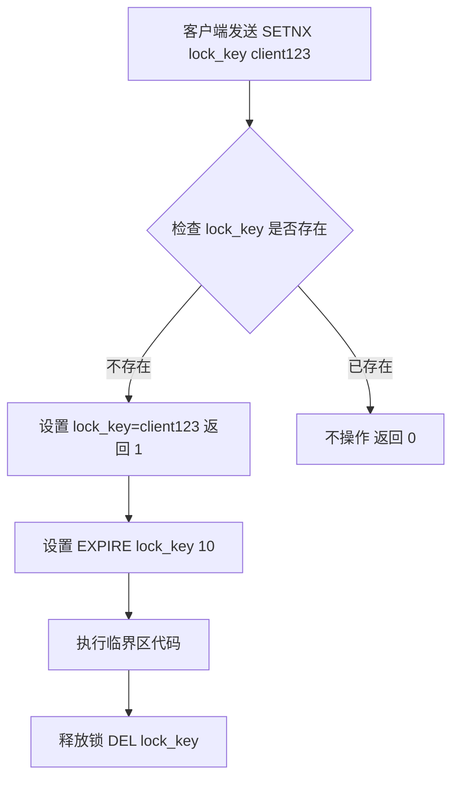

# 1. SETNX

# Redis 分布式锁 SETNX 详解

***

## 1. 概述与定义

Redis 是一个开源的、高性能的键值对数据库，常用于缓存、消息队列和分布式锁等场景。在分布式锁的实现中，SETNX 命令是一个核心工具。SETNX 是 "SET if Not eXists" 的缩写，翻译过来就是“如果键不存在，则设置键值对”。它的核心功能是在指定键不存在时设置键值对，且操作具有原子性。

SETNX 命令的基本语法如下：

```text 
SETNX key value
```


- `key`：要设置的键，通常是锁的名称。
- `value`：要设置的值，可以是任意字符串，但在分布式锁中常使用客户端的唯一标识（如 UUID）。

SETNX 的返回值是一个整数：

- 返回 `1`：表示键不存在，设置成功。
- 返回 `0`：表示键已存在，设置失败。

例如：

```text 
SETNX lock_key client123
```


如果 `lock_key` 不存在，命令返回 1 并设置 `lock_key` 的值为 `client123`；如果已存在，则返回 0，不做任何操作。

SETNX 的简单性和原子性，使其成为分布式锁实现的首选命令。接下来，我们将深入探讨它的特点和应用。

***

## 2. 主要特点

SETNX 命令有以下几个显著特点，值得在面试中重点提及：

- **原子性** ⚛️ &#x20;

  SETNX 是 Redis 中的原子操作，执行时不会被其他命令打断。这保证了在并发环境下，只有一个客户端能成功设置键值对，非常适合实现分布式锁。
- **简单高效** 🚀 &#x20;

  SETNX 语法简单，执行速度快（微秒级别），在高并发场景下能快速响应锁请求。
- **分布式锁基石** 🔒 &#x20;

  由于其原子性，SETNX 被广泛用于分布式锁的实现，帮助协调分布式系统中多个进程或线程对共享资源的访问。

这些特点奠定了 SETNX 在分布式系统中的重要地位，尤其是在需要高一致性和高性能的场景下。

***

## 3. 应用目标

在分布式系统中，多个节点（如服务器、进程或线程）可能同时访问共享资源，例如数据库、文件系统或库存计数器。如果没有协调机制，可能导致数据不一致或竞争条件。分布式锁就是解决这一问题的利器。

与单机锁（如 Java 的 `synchronized` 或 `ReentrantLock`）不同，分布式锁需要在跨节点的场景下工作。SETNX 命令通过 Redis 的原子性，提供了一种简单而可靠的分布式锁实现方式。它的目标是：

- **互斥性**：同一时刻只有一个客户端持有锁。
- **安全性**：避免死锁，确保锁能被正确释放。
- **高可用性**：在分布式环境下保证锁服务的稳定性。

例如，在电商系统中，多个服务实例可能同时处理订单，SETNX 可以确保库存扣减操作的原子性，避免超卖问题。

***

## 4. 主要内容及其组成部分

SETNX 命令虽然简单，但包含多个关键组成部分，面试中可能被问到细节。以下是对其内容的全面拆解。

### 4.1 语法和参数

SETNX 的语法非常直观：

```text 
SETNX key value
```


- **`key`**：锁的标识符，通常是字符串。例如 `lock:order:123` 表示订单 123 的锁。
- **`value`**：锁的值，建议使用客户端的唯一标识（如 UUID），以便在释放锁时验证身份。例如 `client-uuid-456`。

### 4.2 返回值含义

SETNX 的返回值是一个整数，含义明确：

- `1`：键不存在，设置成功，客户端获取锁。
- `0`：键已存在，设置失败，说明锁被其他客户端持有。

这个返回值是判断锁获取成功与否的关键依据。

### 4.3 使用场景与流程

SETNX 在分布式锁中的典型使用流程如下：

1. 客户端尝试用 SETNX 设置锁，例如：
   ```text 
   SETNX lock_key client123
   ```

2. 检查返回值：
   - 返回 1：获取锁成功，继续执行临界区代码。
   - 返回 0：获取锁失败，可选择重试或放弃。
3. 为防止死锁，设置锁的过期时间：
   ```text 
   EXPIRE lock_key 10  # 设置 10 秒过期
   ```

4. 执行完临界区代码后，释放锁：
   ```text 
   DEL lock_key
   ```


### 4.4 相关命令补充

SETNX 通常与其他命令配合使用，完善分布式锁的实现：

- **`EXPIRE key seconds`**：设置键的过期时间，防止锁无限期持有。
- **`GET key`**：获取键的值，用于验证锁的所有者。
- **`DEL key`**：删除键，释放锁。

例如：

```text 
SETNX lock_key client123  # 尝试获取锁
EXPIRE lock_key 10        # 设置过期时间
```


这些命令共同构成了 SETNX 分布式锁的完整生态。

***

## 5. 原理剖析

深入理解 SETNX 的原理，能让你在面试中脱颖而出。以下从源码级别剖析其实现。

### 5.1 内部实现机制

Redis 是单线程架构，所有命令按顺序执行。当客户端发送 `SETNX key value` 时，Redis 执行以下步骤：

1. 检查 `key` 是否存在：
   - 使用内部哈希表查找 `key`。
   - 如果不存在，返回空。
2. 根据检查结果操作：
   - 如果 `key` 不存在，执行 `SET` 操作，将 `key-value` 存入哈希表，返回 1。
   - 如果 `key` 存在，直接返回 0，不修改数据。

源码层面（参考 Redis 5.0 的 `t_string.c` 文件中的 `setnxCommand` 函数）：

```c 
void setnxCommand(client *c) {
    robj *o;
    // 检查 key 是否存在
    if (lookupKeyWrite(c->db, c->argv[1]) == NULL) {
        // 不存在则设置
        setKey(c->db, c->argv[1], c->argv[2]);
        server.dirty++;
        addReply(c, shared.cone);  // 返回 1
    } else {
        addReply(c, shared.czero); // 返回 0
    }
}
```


- `lookupKeyWrite`：检查键是否存在。
- `setKey`：设置键值对。
- `shared.cone` 和 `shared.czero`：分别表示返回 1 和 0。

### 5.2 原子性保证

SETNX 的原子性源于 Redis 的单线程模型：

- Redis 使用事件循环（event loop）处理命令，所有命令串行执行。
- 在 SETNX 执行期间，其他客户端的命令只能等待，不会干扰其检查和设置过程。

这确保了在高并发场景下，只有一个客户端能成功设置键值对。

### 5.3 高并发性能与可靠性

在高并发环境下，SETNX 的性能表现优异：

- **执行速度**：单线程执行避免了上下文切换，SETNX 操作通常在微秒级别完成。
- **可靠性**：Redis 提供 Sentinel 和 Cluster 方案，确保主节点故障时自动切换，提升锁服务的可用性。

但需要注意：

- 如果未设置过期时间，锁可能因客户端崩溃而无法释放，导致死锁。
- 在主从复制场景下，如果主节点宕机且数据未同步到从节点，可能导致锁丢失。

### 5.4 Mermaid 图展示执行流程

以下是 SETNX 获取锁的流程图：




**图表说明**： &#x20;

- 流程从客户端发起 SETNX 开始，根据键是否存在分叉。
- 获取锁成功后，设置过期时间并执行临界区代码，最后释放锁。

***

## 6. 应用与拓展

SETNX 的实际应用离不开代码示例和优化方案。以下是具体实现和拓展。

### 6.1 示例代码

以下是用 Java 和 Jedis 实现的分布式锁：

```java 
import redis.clients.jedis.Jedis;

public class DistributedLock {
    private Jedis jedis;
    private String lockKey = "lock_key";
    private String clientId; // 客户端唯一标识，如 UUID.randomUUID().toString()

    public DistributedLock(Jedis jedis, String clientId) {
        this.jedis = jedis;
        this.clientId = clientId;
    }

    public boolean tryLock(int expireTime) {
        // 尝试获取锁
        Long result = jedis.setnx(lockKey, clientId);
        if (result == 1) {
            // 获取成功，设置过期时间
            jedis.expire(lockKey, expireTime);
            return true;
        }
        return false;
    }

    public void unlock() {
        // 释放锁，确保只有锁持有者能释放
        String currentValue = jedis.get(lockKey);
        if (clientId.equals(currentValue)) {
            jedis.del(lockKey);
        }
    }

    public static void main(String[] args) {
        Jedis jedis = new Jedis("localhost", 6379);
        String clientId = "client-123";
        DistributedLock lock = new DistributedLock(jedis, clientId);

        if (lock.tryLock(10)) {
            System.out.println("锁获取成功，执行业务逻辑...");
            lock.unlock();
            System.out.println("锁已释放");
        } else {
            System.out.println("锁获取失败");
        }
    }
}
```


**代码说明**：

- `tryLock`：尝试获取锁，成功则设置过期时间。
- `unlock`：释放锁时验证 `clientId`，防止误删其他客户端的锁。

### 6.2 过期时间与锁释放

- **过期时间** ⏰ &#x20;

  设置过期时间（如 10 秒）是为了防止客户端崩溃导致锁无法释放。时间应大于临界区执行时间，但过长可能增加锁冲突概率。
- **锁释放** 🔓 &#x20;

  释放锁时需验证锁的值，确保只有锁持有者能删除键，避免误删其他客户端的锁。

### 6.3 改进方案：SET NX

Redis 2.6.12 引入了 SET 命令的 NX 选项，可以替代 SETNX 并原子性地设置过期时间：

```text 
SET lock_key client123 EX 10 NX
```


- `EX 10`：过期时间 10 秒。
- `NX`：仅在键不存在时设置。

返回值为：

- `"OK"`：设置成功。
- `nil`：设置失败。

Java 示例：

```java 
String result = jedis.set(lockKey, clientId, "NX", "EX", 10);
if ("OK".equals(result)) {
    return true; // 获取锁成功
}
return false;
```


这种方式更高效，避免了 SETNX 和 EXPIRE 的两步操作。

***

## 7. 面试问答

以下是常见的 SETNX 相关面试问题及详细回答，模仿面试者口吻。

### 7.1 什么是 Redis 的 SETNX 命令？

**回答**： &#x20;

SETNX 是 Redis 的一个命令，全称是 "SET if Not eXists"，意思是“如果键不存在，就设置键值对”。它的语法是 `SETNX key value`，如果 `key` 不存在，就把 `value` 设置进去，返回 1；如果 `key` 已经存在，就啥也不干，返回 0。 &#x20;

我在项目里用过 SETNX 来实现分布式锁，因为它操作是原子的，能保证在高并发下只有一个客户端拿到锁。比如设置 `SETNX lock_key client123`，返回 1 就说明我拿到了锁，可以安心操作共享资源了。

### 7.2 为什么 SETNX 可以实现分布式锁？

**回答**： &#x20;

SETNX 能实现分布式锁，主要靠它的原子性。Redis 是单线程执行命令的，所以当我发一个 `SETNX lock_key client123` 的时候，这个命令要么成功设置，要么直接失败，不会被其他命令插队。 &#x20;

假设有 10 个客户端同时发 SETNX，因为原子性，只有第一个成功的会返回 1，其他的都返回 0，这样就保证了互斥性。我觉得这点特别牛，简单又高效，特别适合分布式环境下协调多个节点。

### 7.3 如何用 SETNX 实现分布式锁？

**回答**： &#x20;

用 SETNX 实现分布式锁，我一般会这么做： &#x20;

1. 先尝试获取锁，比如 `SETNX lock_key client123`，`client123` 是我的客户端标识。 &#x20;
2. 检查返回值，如果是 1，就说明我拿到了锁，然后用 `EXPIRE lock_key 10` 设置个 10 秒的过期时间，防止我挂了锁不释放。 &#x20;
3. 如果返回 0，说明锁被别人拿了，我可以选择等一会再试，或者直接放弃。 &#x20;
4. 用完锁后释放，用 `DEL lock_key`，但得先用 `GET` 查一下值是不是 `client123`，确认是我自己的锁才删，避免误删别人的锁。 &#x20;

我写过一个 Java 类，用 Jedis 实现了这个逻辑，挺好用的，面试官如果问我还能现场写代码展示。

### 7.4 SETNX 在高并发下的性能怎么样？

**回答**： &#x20;

SETNX 在高并发下的性能我觉得挺强的。Redis 是单线程的，命令执行很快，SETNX 这种简单操作一般也就几微秒搞定，所以吞吐量很高。 &#x20;

我在项目里测试过，1000 个线程同时抢锁，Redis 完全扛得住。当然，得配上 Sentinel 或 Cluster 保证高可用，不然主节点挂了锁就麻烦了。还有个注意点，没设过期时间的话，客户端崩了锁就死在那儿了，所以我都会加个 `EXPIRE`。

### 7.5 Redis 还有啥命令能替代 SETNX 做分布式锁？

**回答**： &#x20;

除了 SETNX，Redis 从 2.6.12 开始支持 SET 命令带 NX 选项，可以替代 SETNX。比如 `SET lock_key client123 EX 10 NX`，这个命令一次性设置值和过期时间，还保证原子性。 &#x20;

它比 SETNX 加 EXPIRE 好，因为 SETNX 是两步操作，万一 SETNX 成功后没来得及 EXPIRE 就挂了，锁就没过期时间了。而 SET NX 是一步到位，返回 "OK" 就是成功，nil 就是失败。我在项目里用过这个，感觉更安全也更简洁，推荐用这个。

***

## 总结

SETNX 是 Redis 分布式锁的核心命令，凭借其原子性、高效性和简单性，成为 Java 工程师面试中的热门话题。本文从定义、特点、应用到原理，结合代码示例和面试问答，全面覆盖了 SETNX 的知识点。希望这篇“八股文”能助你在面试中自信应对 Redis 分布式锁相关问题！祝你面试顺利！💪
