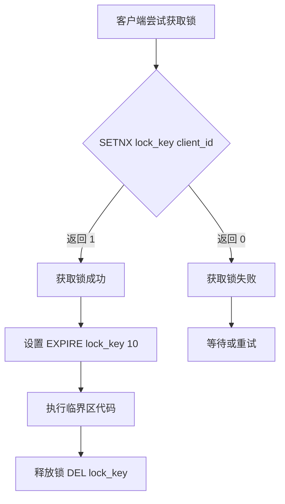

# 2. Redisson

# Redisson 详解

***

## 1. 概述与定义

Redisson 是一个基于 Redis 的 Java 驻留内存数据网格（In-Memory Data Grid），它利用 Redis 的高性能特性，提供了一系列分布式对象和服务，特别在分布式锁方面表现出色。Redisson 的设计目标是简化 Redis 的使用，让开发者能够专注于业务逻辑，而无需直接操作复杂的 Redis 命令。

- **核心功能**：Redisson 提供了分布式锁、分布式集合（如 Set、List）、分布式映射（如 Map）以及分布式服务（如远程服务、执行器服务）。
- **与 Redis 的关系**：Redisson 是 Redis 的 Java 客户端之一，但它不仅仅是简单封装 Redis 命令，而是提供了更高层次的抽象，比如分布式锁的自动续期机制和 RedLock 算法。
- **开源性质**：Redisson 是一个开源项目，托管在 GitHub 上，社区活跃，文档完善。

在分布式系统中，Redisson 被广泛用于需要高一致性、高并发的数据操作场景，例如微服务架构中的资源同步、缓存管理和任务调度等。

***

## 2. 主要特点

Redisson 的特点是面试中常被问到的“亮点”，以下是其核心特性，值得重点记忆：

- **分布式对象和服务** 🌐 &#x20;

  Redisson 提供了多种分布式对象（如锁、集合、映射）和服务（如远程调用），这些对象和服务可以在多个 Redis 节点间共享，适合分布式环境下的数据操作。
- **高性能** 🚀 &#x20;

  基于 Redis 的内存存储特性，Redisson 提供微秒级别的响应时间，非常适合高并发场景，如秒杀系统或实时数据处理。
- **易用性** 🛠️ &#x20;

  Redisson 的 API 设计直观，开发者可以像操作本地 Java 对象一样使用分布式对象。例如，获取锁只需一行代码 `lock.lock()`，无需手动实现 Redis 的 SETNX 逻辑。
- **可靠性** 🔒 &#x20;

  Redisson 支持 Redis 的多种部署模式，包括单节点、主从复制、哨兵模式和集群模式，确保了高可用性和容错能力。
- **自动续期机制** ⏳ &#x20;

  Redisson 的分布式锁内置 Watchdog 机制，能自动延长锁的过期时间，防止因客户端崩溃导致锁无法释放。

这些特点使 Redisson 成为 Java 开发者在分布式系统中的得力助手，尤其是在需要并发控制的场景下。

***

## 3. 应用目标

在分布式系统中，多个服务实例可能同时访问共享资源（如数据库、缓存或文件系统），如果缺乏协调机制，会导致数据不一致或竞争条件。Redisson 的主要目标是通过分布式锁和其他同步原语，解决这些问题，确保操作的原子性和一致性。

与传统的单机锁（如 Java 的 `synchronized` 或 `ReentrantLock`）相比，Redisson 的分布式锁能在跨节点的环境中工作，适用于以下场景：

- **微服务架构**：在多个服务实例间协调对共享资源的访问，例如防止重复提交订单。
- **高并发系统**：如电商秒杀、库存扣减，确保操作的线程安全性。
- **任务调度**：在分布式任务调度中，确保任务只被一个实例执行，避免重复处理。
- **缓存管理**：结合 Redis 的缓存功能，实现高效的数据访问和一致性控制。

简单来说，Redisson 旨在为开发者提供一种简单、高效、可靠的分布式同步工具，解决分布式系统中的并发难题。

***

## 4. 主要内容及其组成部分

Redisson 提供了丰富的功能模块，以下是对其主要组成部分的详尽解释，每个部分都包含具体用途和使用场景。

### 4.1 分布式锁

分布式锁是 Redisson 的核心功能，提供了多种锁类型，满足不同需求：

- **可重入锁（Reentrant Lock）** &#x20;

  允许同一线程多次获取同一把锁，类似于 Java 的 `ReentrantLock`，适用于需要嵌套锁的场景。
- **公平锁（Fair Lock）** &#x20;

  按照线程请求锁的顺序分配锁，避免线程饥饿，适合对公平性要求高的场景。
- **读写锁（ReadWrite Lock）** &#x20;

  支持读锁和写锁，允许多个读操作并发执行，但写操作互斥，适用于读多写少的场景。
- **红锁（RedLock）** &#x20;

  在 Redis 集群中实现更可靠的分布式锁，通过在多个节点上获取锁，增强容错能力。

### 4.2 分布式集合

Redisson 的分布式集合可以在多个节点间共享数据，提供了类似 Java 集合的操作接口：

- **RSet** &#x20;

  分布式 Set，支持添加、删除、查找等操作，适用于去重需求的场景，如用户 ID 集合。
- **RList** &#x20;

  分布式 List，支持按索引访问和队列操作，适用于有序数据存储，如日志列表。
- **RQueue** &#x20;

  分布式 Queue，遵循 FIFO（先进先出）原则，适用于任务队列或消息队列。
- **RDeque** &#x20;

  双端队列，支持从两端操作，适用于需要灵活插入和删除的场景。

### 4.3 分布式映射

Redisson 的分布式映射用于存储键值对，提供了高效的分布式数据存储：

- **RMap** &#x20;

  分布式 Map，支持 put、get、remove 等操作，适用于键值对存储，如用户会话数据。
- **RMultimap** &#x20;

  一个键对应多个值，类似于多值映射，适用于一对多的关系存储。
- **RMapCache** &#x20;

  带过期时间的 Map，适合缓存场景，如临时存储验证码。

### 4.4 分布式服务

Redisson 还提供了一些高级服务，增强了分布式系统的功能：

- **远程服务（Remote Service）** &#x20;

  支持 Java 的远程方法调用（RMI），可以在分布式环境中调用远程方法。
- **执行器服务（Executor Service）** &#x20;

  类似于 Java 的 ExecutorService，支持在分布式环境中提交和执行任务。
- **定时任务服务（Scheduled Executor Service）** &#x20;

  支持定时任务调度，适用于需要延迟或周期性执行的任务。

### 4.5 其他组件

- **RBloomFilter** &#x20;

  布隆过滤器，用于快速判断元素是否存在，适用于大数据去重场景。
- **RTopic** &#x20;

  发布/订阅消息系统，支持分布式消息通信。
- **RAtomicLong/RAtomicDouble** &#x20;

  分布式原子计数器，用于需要全局递增或递减的场景，如分布式 ID 生成。

这些组件覆盖了分布式系统中常见的操作需求，开发者可以根据具体场景选择合适的工具。

***

## 5. 原理剖析

深入理解 Redisson 的实现原理，能让你在面试中展现技术深度。以下从源码级别剖析其核心机制。

### 5.1 分布式锁的实现

Redisson 的分布式锁基于 Redis 的 SETNX 命令，确保互斥性。SETNX（SET if Not eXists）只有在键不存在时才设置值，成功返回 1，失败返回 0。

#### 5.1.1 基本锁获取流程

1. 客户端尝试获取锁：
   ```text 
   SETNX lock_key client_id
   ```

   - `lock_key`：锁的键名。
   - `client_id`：客户端的唯一标识，避免误释放其他客户端的锁。
2. 如果返回 1，获取锁成功；返回 0，说明锁被其他客户端持有。
3. 设置锁的过期时间，防止死锁：
   ```text 
   EXPIRE lock_key 10
   ```

4. 执行临界区代码后释放锁：
   ```text 
   DEL lock_key
   ```


#### 5.1.2 改进：原子性操作

早期 Redis 需要单独执行 SETNX 和 EXPIRE，可能因客户端崩溃导致锁无过期时间。Redisson 使用 Lua 脚本将两者合并为原子操作：

```lua 
if redis.call('setnx', KEYS[1], ARGV[1]) == 1 then
    redis.call('expire', KEYS[1], ARGV[2])
    return 1
else
    return 0
end
```


- **KEYS\[1]**：锁的键名。
- **ARGV\[1]**：客户端 ID。
- **ARGV\[2]**：过期时间（秒）。

#### 5.1.3 自动续期机制（Watchdog）

Redisson 的可重入锁（RLock）内置 Watchdog 机制，防止锁因业务执行时间过长而过期。Watchdog 是一个后台线程，定期检查锁状态并续期。

- **默认超时**：30 秒。
- **续期频率**：每 10 秒（超时时间的三分之一）。

源码片段（RedissonLock.java）：

```java 
private void scheduleExpirationRenewal(long threadId) {
    ExpirationEntry entry = new ExpirationEntry();
    if (EXPIRATION_RENEWAL_MAP.putIfAbsent(getEntryName(), entry) == null) {
        entry.addThreadId(threadId);
        renewExpiration();
    }
}

private void renewExpiration() {
    // 定时任务延长锁的过期时间
    timeout.schedule(() -> {
        renewExpirationAsync();
    }, internalLockLeaseTime / 3, TimeUnit.MILLISECONDS);
}
```


#### 5.1.4 RedLock 算法

在 Redis 集群中，单个节点故障可能导致锁失效。RedLock 算法通过在多个独立 Redis 节点上获取锁提高可靠性：

- **实现步骤**：
  1. 在 N 个 Redis 节点上尝试获取锁。
  2. 如果在多数节点（N/2 + 1）上成功获取锁，且总耗时小于锁的过期时间，则认为锁获取成功。
  3. 如果失败，释放所有已获取的锁。
- **源码片段**（RedissonRedLock.java）：

```java 
public void lock() {
    while (true) {
        long ttl = tryAcquire();
        if (ttl < 0) {
            return; // 成功获取锁
        }
        Thread.sleep(ttl); // 等待后重试
    }
}
```


### 5.2 Mermaid 图展示锁获取流程

以下是 Redisson 分布式锁的获取流程图：




**图表说明**： &#x20;

- 客户端通过 SETNX 判断锁是否可用。
- 成功后设置过期时间，执行业务逻辑，最后释放锁。
- 失败则进入等待或重试逻辑。

***

## 6. 应用与拓展

Redisson 在实际开发中非常灵活，以下是具体应用示例和优化方案。

### 6.1 示例代码：分布式锁

以下是使用 Redisson 实现分布式锁的代码：

```java 
import org.redisson.Redisson;
import org.redisson.api.RLock;
import org.redisson.api.RedissonClient;
import org.redisson.config.Config;

public class DistributedLockExample {
    public static void main(String[] args) throws InterruptedException {
        // 配置 Redisson 客户端
        Config config = new Config();
        config.useSingleServer().setAddress("redis://127.0.0.1:6379");
        RedissonClient redisson = Redisson.create(config);

        // 获取锁
        RLock lock = redisson.getLock("myLock");
        try {
            lock.lock(); // 阻塞式获取锁
            System.out.println("锁获取成功，执行业务逻辑...");
            Thread.sleep(1000); // 模拟业务操作
        } finally {
            lock.unlock(); // 释放锁
            System.out.println("锁已释放");
            redisson.shutdown(); // 关闭客户端
        }
    }
}
```


**代码说明**： &#x20;

- `getLock`：获取指定名称的锁对象。
- `lock`：阻塞式获取锁，若锁被占用则等待。
- `unlock`：释放锁，必须在 finally 中调用，避免异常导致锁未释放。

### 6.2 配置 Watchdog 超时

Watchdog 默认超时为 30 秒，可根据业务需求调整：

```java 
Config config = new Config();
config.useSingleServer().setAddress("redis://127.0.0.1:6379");
config.setLockWatchdogTimeout(60000); // 设置 60 秒超时
RedissonClient redisson = Redisson.create(config);
```


### 6.3 RedLock 使用示例

在高可靠性场景下，使用 RedLock：

```java 
RedissonClient client1 = Redisson.create(config1);
RedissonClient client2 = Redisson.create(config2);
RedissonClient client3 = Redisson.create(config3);

RLock lock1 = client1.getLock("lock1");
RLock lock2 = client2.getLock("lock2");
RLock lock3 = client3.getLock("lock3");

RedissonRedLock redLock = new RedissonRedLock(lock1, lock2, lock3);
redLock.lock();
try {
    System.out.println("RedLock 获取成功");
} finally {
    redLock.unlock();
}
```


**说明**：RedLock 在多个 Redis 实例上获取锁，确保即使部分实例故障，锁仍有效。

### 6.4 分布式集合示例

使用 RSet 存储用户 ID：

```java 
RSet<String> set = redisson.getSet("userIds");
set.add("user1");
set.add("user2");
System.out.println("Set size: " + set.size()); // 输出 2
```


***

## 7. 面试问答

以下是常见的 Redisson 面试问题及详细回答，模仿面试者口吻。

### 7.1 Redisson 是什么？它与 Redis 的关系是什么？

**回答**： &#x20;

Redisson 是一个基于 Redis 的 Java 库，提供了分布式锁、集合、映射等功能。它利用 Redis 的高性能和分布式特性，让开发者能更方便地在 Java 中实现分布式系统的同步和数据共享。 &#x20;

Redisson 和 Redis 的关系是客户端与服务端的关系。Redis 是一个内存数据库，提供了底层的键值存储能力，而 Redisson 是它的 Java 客户端之一。不过 Redisson 不只是简单封装 Redis 命令，它还提供了更高层次的功能，比如分布式锁的自动续期和 RedLock 算法，这些是原生 Redis 客户端做不到的。

### 7.2 Redisson 的分布式锁是如何实现的？

**回答**： &#x20;

Redisson 的分布式锁主要基于 Redis 的 SETNX 命令实现。SETNX 是“SET if Not eXists”的缩写，只有在键不存在时才会设置值，确保锁的互斥性。 &#x20;

具体流程是这样的：客户端尝试用 SETNX 设置一个锁的键，值是客户端的唯一标识。如果返回 1，说明锁获取成功，然后通过 EXPIRE 设置过期时间，避免死锁。如果返回 0，说明锁被其他客户端持有，就需要等待或重试。 &#x20;

为了保证 SETNX 和 EXPIRE 的原子性，Redisson 使用 Lua 脚本把这两步合并执行。释放锁时，会检查键的值是否匹配当前客户端的 ID，避免误删其他客户端的锁。

### 7.3 Redisson 的 Watchdog 机制是什么？它解决了什么问题？

**回答**： &#x20;

Watchdog 是 Redisson 分布式锁中的一个自动续期机制。它的作用是防止锁因业务执行时间过长而过期，同时也能在客户端崩溃后自动释放锁。 &#x20;

具体来说，当你用 RLock 的 lock 方法获取锁时，Redisson 会默认给锁设置 30 秒的过期时间，同时启动一个 Watchdog 线程。这个线程每隔 10 秒检查一次，如果发现锁还在使用，就自动延长过期时间。 &#x20;

它解决的问题是：如果不续期，锁可能在业务还没执行完时就过期，导致其他客户端提前获取锁，破坏互斥性；而如果客户端崩溃，锁会因过期时间自动释放，避免死锁。

### 7.4 RedLock 算法是什么？在什么场景下使用？

**回答**： &#x20;

RedLock 是 Redis 官方推荐的一种分布式锁算法，主要用于 Redis 集群环境。它的核心思想是，在多个独立的 Redis 节点上获取锁，只有当客户端在多数节点（N/2 + 1）上成功获取锁，且总耗时小于锁的过期时间，才认为锁获取成功。 &#x20;

Redisson 提供了 RedLock 的实现，比如 RedissonRedLock 类。它的优势是即使部分 Redis 节点故障，锁仍然可靠。使用场景一般是对锁的可靠性要求特别高的系统，比如金融交易场景，单点故障可能会导致严重后果。

### 7.5 如何在 Spring Boot 中集成 Redisson？

**回答**： &#x20;

在 Spring Boot 中集成 Redisson 很简单。第一步，在 pom.xml 里加依赖：

```xml 
<dependency>
    <groupId>org.redisson</groupId>
    <artifactId>redisson-spring-boot-starter</artifactId>
    <version>3.17.6</version>
</dependency>
```


第二步，在 application.properties 里配置 Redis 连接：

```.properties 
spring.redis.host=localhost
spring.redis.port=6379
```


第三步，在代码里通过 `@Autowired` 注入 RedissonClient：

```java 
@Autowired
private RedissonClient redissonClient;

public void testLock() {
    RLock lock = redissonClient.getLock("myLock");
    lock.lock();
    try {
        System.out.println("执行业务逻辑");
    } finally {
        lock.unlock();
    }
}
```


这样就完成了集成，可以直接使用 Redisson 的功能了。如果需要自定义配置，比如调整 Watchdog 超时，可以手动创建 RedissonClient Bean。

***

## 总结

Redisson 是一个功能强大且易用的 Java 分布式工具，尤其在分布式锁方面表现突出。通过本文的详细讲解，你应该对 Redisson 的定义、特点、应用场景、实现原理和使用方法有了全面的掌握。无论是面试还是实际开发，这些知识都能让你游刃有余。希望这篇“八股文”能助你在面试中脱颖而出！祝你面试顺利！💪
