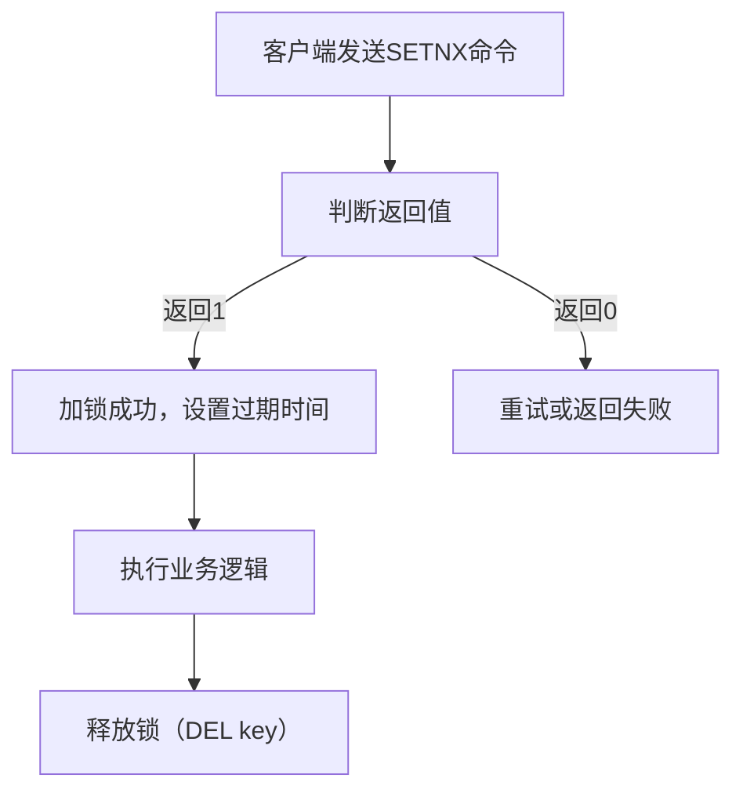

# 二. 分布式锁

***

# Java面试八股文：Redis分布式锁深度解析（SETNX与Redisson） &#x20;

***

## 1. 概述与定义 &#x20;

**Redis分布式锁**是基于Redis实现的分布式系统互斥访问机制，用于在分布式环境中控制对共享资源的访问，避免并发竞争导致的数据不一致或重复操作。核心目标是**保证同一时间只有一个客户端持有锁**。 &#x20;

**关键术语**： &#x20;

- **SETNX**：Redis原子命令，`SET if Not eXists`，用于加锁。 &#x20;
- **Redisson**：Redis的Java客户端，提供分布式锁封装。 &#x20;

***

## 2. 原理剖析 &#x20;

### 2.1 SETNX命令实现分布式锁 &#x20;

**原理**： &#x20;

- **加锁流程**： &#x20;
  1. 客户端使用`SETNX key value`尝试设置键值对。 &#x20;
  2. 若返回`1`，表示加锁成功；若返回`0`，表示锁已被占用。 &#x20;
- **过期时间处理**： &#x20;
  - 使用`EXPIRE`命令设置键的过期时间，避免死锁。 &#x20;
  - **问题**：`SETNX`与`EXPIRE`非原子操作，可能因网络中断导致锁未设置过期时间。 &#x20;

**流程图（Mermaid语法）**： &#x20;




***

### 2.2 原子性优化：Lua脚本 &#x20;

**问题**：`SETNX`与`EXPIRE`分开执行可能导致锁未设置过期时间。 &#x20;

**解决方案**：使用Lua脚本原子操作： &#x20;

```lua 
-- Lua脚本示例  
if redis.call("SETNX", KEYS[1], ARGV[1]) == 1 then  
    redis.call("EXPIRE", KEYS[1], ARGV[2])  
    return 1  
else  
    return 0  
end  
```


**优点**： &#x20;

- **原子性**：确保加锁与设置过期时间同时完成。 &#x20;
- **唯一性**：通过`ARGV[1]`传递唯一标识（如UUID）。 &#x20;

***

### 2.3 Redisson实现机制 &#x20;

**Redisson分布式锁**： &#x20;

- **核心接口**：`RLock`，继承自`java.util.concurrent.locks.Lock`。 &#x20;
- **实现特点**： &#x20;
  - **自动续期（自动续约）**：通过后台线程自动延长锁的过期时间。 &#x20;
  - **可重入锁**：支持同一个线程多次加锁。 &#x20;
  - **异步非阻塞**：基于Netty实现高性能通信。 &#x20;

**代码示例（Java）**： &#x20;

```java 
RLock lock = redissonClient.getLock("lockKey");  
try {  
    lock.lock(); // 阻塞式加锁  
    // 业务逻辑  
} finally {  
    lock.unlock(); // 释放锁  
}  
```


***

## 3. 应用目标 &#x20;

- **解决资源竞争**：如电商秒杀、库存扣减等场景。 &#x20;
- **避免死锁**：通过过期时间或唯一标识防止锁永久占用。 &#x20;
- **兼容性**：支持Java、Python等多语言环境（依赖Redis客户端）。 &#x20;

***

## 4. 主要特点对比（表格） &#x20;

| **实现方式**​           | **原子性**​ | **防死锁**​ | **性能**​  | **适用场景**​     |
| ------------------- | -------- | -------- | -------- | ------------- |
| **SETNX + EXPIRE**​ | 低（需Lua）  | 需手动处理    | 高（简单高效）  | 简单场景，需自行封装逻辑  |
| **Lua脚本**​          | 高        | 是        | 中（需解析脚本） | 中等复杂度场景       |
| **Redisson**​       | 高        | 自动处理     | 高（封装完善）  | 复杂场景（如可重入、异步） |

***

## 5. 主要内容及其组成部分 &#x20;

### 5.1 基于SETNX的分布式锁 &#x20;

#### 5.1.1 加锁与解锁流程 &#x20;

1. **加锁**： &#x20;
   ```text 
   SET lock_key my_random_value NX EX 10  
   ```

   - `NX`：仅当键不存在时设置。 &#x20;
   - `EX 10`：设置过期时间为10秒。 &#x20;
2. **解锁**： &#x20;
   ```java 
   if (GET lock_key == my_random_value) {  
       DEL lock_key  
   }  
   ```

   **关键点**：通过`my_random_value`验证锁归属。 &#x20;

#### 5.1.2 防止误删锁 &#x20;

- **Lua脚本实现**： &#x20;
  ```lua 
  if redis.call("GET", KEYS[1]) == ARGV[1] then  
      return redis.call("DEL", KEYS[1])  
  else  
      return 0  
  end  
  ```

- **作用**：确保仅持有锁的客户端能删除锁。 &#x20;

***

### 5.2 Redisson的高级特性 &#x20;

#### 5.2.1 可重入锁 &#x20;

- **实现原理**： &#x20;
  - 通过在锁值中记录持有线程ID和计数器，允许同一线程多次加锁。 &#x20;
- **示例代码**： &#x20;
  ```java 
  RLock lock = redissonClient.getLock("lock");  
  lock.lock(); // 第一次加锁  
  lock.lock(); // 第二次加锁（可重入）  
  lock.unlock(); // 需释放两次  
  ```


#### 5.2.2 自动续期 &#x20;

- **机制**： &#x20;
  - 客户端通过后台线程定期执行`WATCH`+`RENEW`操作，延长锁的过期时间。 &#x20;
- **代码片段**： &#x20;
  ```java 
  lock.lock(10, TimeUnit.SECONDS); // 设置锁有效期10秒  
  // 自动续约机制自动延长  
  ```


***

### 5.3 Redlock算法（多Redis节点） &#x20;

- **场景**：单Redis节点故障导致锁失效。 &#x20;
- **原理**： &#x20;
  1. 在N个独立Redis节点尝试加锁。 &#x20;
  2. 成功获取至少`(N/2)+1`个节点的锁，且总耗时小于超时时间。 &#x20;
  3. 锁有效期为`min(超时时间, 实际获取时间)`。 &#x20;
- **示例配置**： &#x20;
  ```java 
  // 需5个节点中获取3个锁  
  Redlock redlock = new Redlock(  
      Arrays.asList(  
          new RedissonClient("redis://host1"),  
          new RedissonClient("redis://host2"),  
          new RedissonClient("redis://host3"),  
          new RedissonClient("redis://host4"),  
          new RedissonClient("redis://host5")  
      )  
  );  
  ```


***

## 6. 应用与拓展 &#x20;

### 6.1 电商秒杀场景 &#x20;

- **问题**：高并发下库存扣减重复。 &#x20;
- **方案**： &#x20;
  ```java 
  // 使用Redisson实现  
  RLock stockLock = redisson.getLock("stock_lock");  
  try {  
      stockLock.lock(1000); // 最大持有时间1秒  
      int stock = redis.get("stock");  
      if (stock > 0) {  
          redis.decr("stock"); // 扣减库存  
      }  
  } finally {  
      stockLock.unlock();  
  }  
  ```


***

### 6.2 与数据库锁的对比 &#x20;

| **特性**​   | **Redis分布式锁**​ | **数据库锁**​    |
| --------- | -------------- | ------------ |
| **性能**​   | 高（内存操作）        | 低（磁盘IO）      |
| **适用场景**​ | 分布式系统          | 单机或简单集群      |
| **复杂度**​  | 中（需处理过期、误删）    | 低（直接使用数据库特性） |

***

### 6.3 常见问题与解决方案 &#x20;

| **问题**​    | **解决方案**​                         |
| ---------- | --------------------------------- |
| 锁未设置过期时间   | 使用\`SET key value NX PX ttl\`原子设置 |
| 多线程竞争导致误删锁 | 通过Lua脚本或Redisson封装保证原子性           |
| 单点故障导致锁失效  | 使用Redlock算法（多节点）                  |

***

## 7. 面试问答（模拟回答） &#x20;

### Q1：如何用Redis实现分布式锁？ &#x20;

**回答**： &#x20;

基于Redis的分布式锁可通过以下步骤实现： &#x20;

1. **加锁**：使用`SET key value NX PX ttl`命令原子设置键值和过期时间。 &#x20;
2. **解锁**：通过Lua脚本验证值是否一致后删除键： &#x20;
   ```lua 
   if redis.call("GET", KEYS[1]) == ARGV[1] then  
       return redis.call("DEL", KEYS[1])  
   else  
       return 0  
   end  
   ```

3. **防死锁**：过期时间确保即使客户端崩溃，锁最终会被自动释放。 &#x20;

**示例代码（Java）**： &#x20;

```java 
String value = UUID.randomUUID().toString();  
String script = "if redis.call('GET', KEYS[1]) == ARGV[1] then return redis.call('DEL', KEYS[1]) else return 0 end";  
Jedis jedis = new Jedis("localhost");  
if (jedis.set("lock", value, SET_IF_NOT_EXIST, SET_WITH_EXPIRE_TIME, 10) != null) {  
    try {  
        // 业务逻辑  
    } finally {  
        jedis.eval(script, Collections.singletonList("lock"), Collections.singletonList(value));  
    }  
}  
```


***

### Q2：Redis分布式锁为什么需要过期时间？ &#x20;

**回答**： &#x20;

过期时间的作用是**防止死锁**： &#x20;

- 若客户端在加锁后崩溃或网络中断，未手动释放锁，会导致其他客户端永远无法获取锁。 &#x20;
- 通过设置过期时间，即使锁未被手动删除，也会在时间到达后自动释放。 &#x20;

**示例**： &#x20;

```text 
SET lock_key my_value NX PX 1000 // 设置1秒后过期  
```


***

### Q3：Redisson的RLock与JDK的ReentrantLock有何区别？ &#x20;

**回答**： &#x20;

| **特性**​    | **RLock**​ | **ReentrantLock**​ |
| ---------- | ---------- | ------------------ |
| **分布式支持**​ | 是（依赖Redis） | 否（单JVM内）           |
| **可重入性**​  | 支持         | 支持                 |
| **自动释放**​  | 支持（过期时间）   | 需手动释放              |
| **性能**​    | 网络开销较高     | 本地调用高效             |

***

### Q4：Redis分布式锁的常见问题有哪些？如何解决？ &#x20;

**回答**： &#x20;

1. **问题1：锁未设置过期时间** &#x20;
   - **解决方案**：使用`SET key value NX PX ttl`原子设置，或Lua脚本。 &#x20;
2. **问题2：多客户端同时竞争导致误删锁** &#x20;
   - **解决方案**：通过唯一值（如UUID）和Lua脚本验证锁归属。 &#x20;
3. **问题3：单点故障导致锁失效** &#x20;
   - **解决方案**：使用Redlock算法在多个Redis节点实现。 &#x20;

***

### Q5：Redisson的RedLock如何保证可靠性？ &#x20;

**回答**： &#x20;

RedLock通过以下机制保证可靠性： &#x20;

1. **多节点投票**：需在超过半数的Redis节点成功获取锁。 &#x20;
2. **时间窗口约束**：总获取时间必须小于锁的过期时间。 &#x20;
3. **自动释放**：若某节点故障，其他节点仍能保证锁的有效性。 &#x20;

**示例配置**： &#x20;

```java 
RedLock redLock = new RedLock(  
    Arrays.asList(  
        redisson1.getLock("lock"),  
        redisson2.getLock("lock"),  
        redisson3.getLock("lock")  
    )  
);  
boolean isLocked = redLock.tryLock(10, 1, TimeUnit.SECONDS);  
```


***

## 总结 &#x20;

Redis分布式锁是面试高频考点，需深入理解`SETNX`、Lua脚本、Redisson封装及RedLock算法。结合电商秒杀、库存扣减等场景，能够清晰展示技术深度与工程实践能力！ 🔒🚀

[1. SETNX](<1. SETNX/1. SETNX.md> "1. SETNX")

[2. Redisson](<2. Redisson/2. Redisson.md> "2. Redisson")
