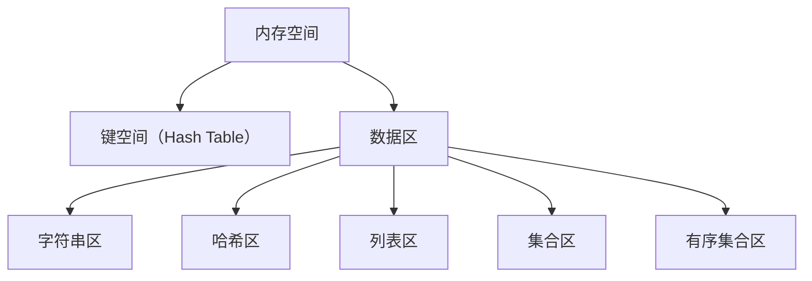

# 1. 内存设计

# Java面试八股文：Redis内存设计详解

***

## 1. 概述与定义

**Redis内存设计**是Redis作为内存数据库的核心能力，其设计目标是**高效利用内存**、**减少内存碎片**、**支持高并发读写**。由于Redis的所有数据均存储在内存中，内存管理直接影响性能、扩展性和可靠性。例如，一个电商系统使用Redis缓存商品信息时，若内存设计不合理，可能导致内存溢出或频繁GC，从而影响系统稳定性。

***

## 2. 原理剖析

### 2.1 内存分配策略

Redis通过**jemalloc内存分配器**优化内存管理，其核心原理如下：

- **内存池机制**：将内存划分为不同大小的块，减少内存碎片。
- **对象共享**：对小整数、空字符串等常量进行共享，减少重复存储。
- **内存复用**：通过**写时复制（Copy-on-Write）** 在修改数据时避免频繁分配内存。

#### 示例：字符串的存储方式

```java 
// 存储字符串时，Redis会根据数据类型选择编码方式
// 整数使用整数编码（int）
SET key 100

// 字符串使用embstr编码（字符串+SDS结构）
SET key "Hello"
```


### 2.2 数据结构优化

Redis的**数据结构设计**直接影响内存效率：

- **字符串（String）**：使用简单动态字符串（SDS）实现，支持高效追加和截取。
- **哈希（Hash）**：小数据量时使用**ziplist**（紧凑列表），大数据量时切换为**hashtable**（哈希表），减少内存开销。
- **列表（List）**：默认使用**linked list**，支持O(1)插入/删除；当元素过多时可能切换为**ziplist**。

#### 示例：Hash的存储方式切换

```java 
// 小数据量时使用ziplist（节省空间）
HSET user:1 name "Alice" age 30

// 数据量增大后自动切换为hashtable
HSET user:1 address "123 Main St" phone "555-1234"
```


### 2.3 内存回收与淘汰

- **惰性回收**：在访问键时检查是否过期，若过期则回收。
- **定期回收**：每秒扫描过期键（随机抽样20个），删除过期数据。
- **内存淘汰策略**：当内存达到`maxmemory`时，根据策略删除数据（如LRU、LFU等）。

***

## 3. 应用目标

Redis内存设计的核心目标包括：

- **高效利用内存**：通过数据结构优化和内存分配策略减少浪费。
- **低延迟与高吞吐**：确保单线程模型下快速响应请求。
- **可扩展性**：支持集群模式下的内存均衡分配。
- **容错性**：通过持久化（RDB/AOF）和主从复制防止数据丢失。

***

## 4. 主要特点

| 特性           | 描述                             |
| ------------ | ------------------------------ |
| **内存分配优化**​  | 使用jemalloc减少碎片，支持大对象和小对象的高效管理。 |
| **数据结构多样化**​ | 提供字符串、哈希、列表等结构，适应不同业务场景。       |
| **淘汰策略灵活**​  | 支持LRU、LFU、随机淘汰等策略，可根据业务需求选择。   |
| **过期键管理**​   | 惰性删除+定期删除结合，平衡性能与内存占用。         |
| **内存统计监控**​  | 通过\`INFO memory\`命令实时查看内存使用情况。 |

***

## 5. 主要内容及其组成部分

### 5.1 内存分区（Memory Partitioning）

Redis将内存划分为不同区域，按数据类型存储：




### 5.2 内存优化技巧

#### 5.2.1 数据结构选择

- **使用Hash代替多个String**：例如，存储用户信息时用Hash而非多个键：
  ```java 
  // 低效方式（多个键）
  SET user:1:name "Alice"
  SET user:1:age 30

  // 高效方式（一个Hash）
  HSET user:1 name "Alice" age 30
  ```


#### 5.2.2 整数编码优化

- 当值为整数时，直接存储为`long`类型，减少内存占用：
  ```java 
  // 存储为整数（占用更少内存）
  SET score 95
  ```


#### 5.2.3 压缩列表（ziplist）

- 对小型数据结构（如Hash、List）使用ziplist压缩存储：
  ```java 
  // 小型Hash自动使用ziplist
  HSET user:1 name "Alice" age 30
  ```


### 5.3 内存淘汰策略（Eviction Policies）

Redis支持6种淘汰策略（通过`maxmemory-policy`配置）：

| 策略名称                 | 适用场景                                 |
| -------------------- | ------------------------------------ |
| **noeviction**​      | 达到内存上限后，所有写操作报错。适用于对数据完整性要求高的场景。     |
| **allkeys-lru**​     | 删除最近最少使用的键，全局扫描所有键。适用于通用缓存场景。        |
| **volatile-lru**​    | 仅删除设置了过期时间的键中最近最少使用的。适用于有明确过期时间的场景。  |
| **allkeys-random**​  | 随机删除键，简单高效。适用于对数据新鲜度要求不高的场景。         |
| **volatile-random**​ | 仅删除设置了过期时间的键中的随机键。                   |
| **volatile-ttl**​    | 优先删除剩余存活时间（TTL）最短的键。适用于希望保留长存活数据的场景。 |

### 5.4 内存回收机制

- **写时复制（Copy-on-Write）**：在fork子进程（如RDB持久化）时，父进程共享内存，子进程写入时才复制。
- **内存碎片整理**：通过`MEMORY RECLAIM`命令主动整理碎片。

***

## 6. 应用与拓展

### 6.1 内存优化案例

假设电商系统需要缓存商品库存：

```java 
// 低效方式：每个商品用一个String存储
SET product:1001:stock 100
SET product:1002:stock 200

// 优化方式：使用Hash合并
HSET products stock:1001 100 stock:1002 200
```


### 6.2 集群部署中的内存管理

在Redis Cluster中：

- **数据分片**：通过哈希槽（Hash Slot）将数据分散到多个节点。
- **节点内存监控**：通过`CLUSTER NODES`命令查看各节点内存使用情况，动态调整分片策略。

***

## 7. 面试问答

### 7.1 为什么Redis单线程模型仍能高性能？

> **面试官视角**：Redis是单线程的，为什么还能处理高并发？
>
> **回答**：
> Redis的高性能得益于以下设计：
> 1\. **单线程避免了线程切换和锁竞争**：所有操作在单线程中顺序执行，无上下文切换开销。
> 2\. **高效的内存数据结构**：如SDS、ziplist等，确保操作时间复杂度低（如O(1)的Hash增删）。
> 3\. **非阻塞I/O与事件驱动**：通过`epoll`/`kqueue`快速处理网络事件，避免阻塞。
> 4\. **命令原子性**：所有操作在内存中完成，无需磁盘IO。
>
> **示例**：`INCR`命令可在内存中直接操作整数，无需锁，实现原子自增。

### 7.2 如何解决Redis内存不足？

> **面试官视角**：当Redis内存不足时，你会如何处理？
>
> **回答**：
> 可采取以下步骤：
> 1\. **检查内存使用**：执行`INFO memory`查看`used_memory`和`maxmemory`。
> 2\. **优化数据结构**：如将多个String合并为Hash，或使用整数编码。
> 3\. **调整淘汰策略**：设置`maxmemory-policy`为`allkeys-lru`，优先淘汰冷数据。
> 4\. **设置过期时间**：对缓存数据设置合理的TTL，如`EXPIRE key 3600`。
> 5\. **扩容集群**：通过添加节点分担内存压力。
> 6\. **清理无效数据**：使用`SCAN`命令遍历并删除无用键。

### 7.3 什么是LRU和LFU淘汰策略？如何选择？

> **面试官视角**：解释LRU和LFU的区别及适用场景。
>
> **回答**：
> \- **LRU（最近最少使用）**：删除最近一段时间内未被访问的键。适合访问模式不固定、需保留活跃数据的场景。
> \- **LFU（最近最不常使用）**：根据键的访问频率，删除被访问次数最少的键。适合高频访问的热点数据（如商品详情缓存）。
>
> **示例**：
> java
> \# 配置LFU策略
> config set maxmemory-policy allkeys-lfu

### 7.4 如何优化Hash的内存占用？

> **面试官视角**：如何让Hash的存储更高效？
>
> **回答**：
> 1\. **选择ziplist编码**：当字段和值较小时，Redis自动使用ziplist（如字段数<512，总大小<64KB）。
> 2\. **合并小对象**：将多个小型Hash合并为一个，减少键数量。
> 3\. **避免混合数据类型**：ziplist要求所有字段和值为简单类型（如字符串、整数）。

### 7.5 内存碎片率过高如何处理？

> **面试官视角**：Redis内存碎片率过高时，如何解决？
>
> **回答**：
> 1\. **检查碎片率**：通过`MEMORY STATS`命令查看`fragmentation_ratio`。
> 2\. **重启Redis**：释放内存并重新分配，消除碎片。
> 3\. **使用**\*\*`MEMORY RECLAIM`\*\*：主动触发内存碎片整理（Redis 6.0+支持）。
> 4\. **调整jemalloc参数**：如设置`--malloc-split-factor`优化内存分配策略。

***

## 总结

Redis的内存设计是其高性能的核心，通过**数据结构优化**、**内存分配策略**和**淘汰机制**，实现了高效存储与快速访问。面试中需重点理解其原理、应用场景及调优方法，结合实例说明设计思想，方能全面展现技术深度。
