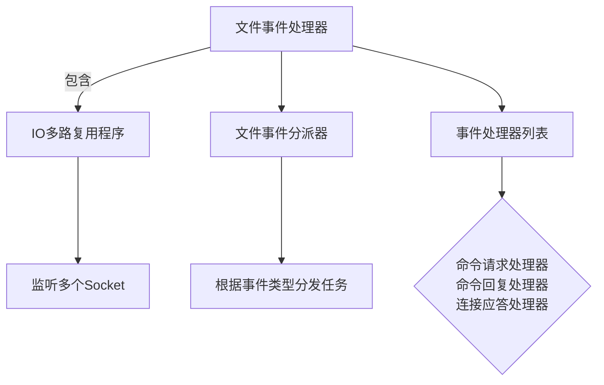
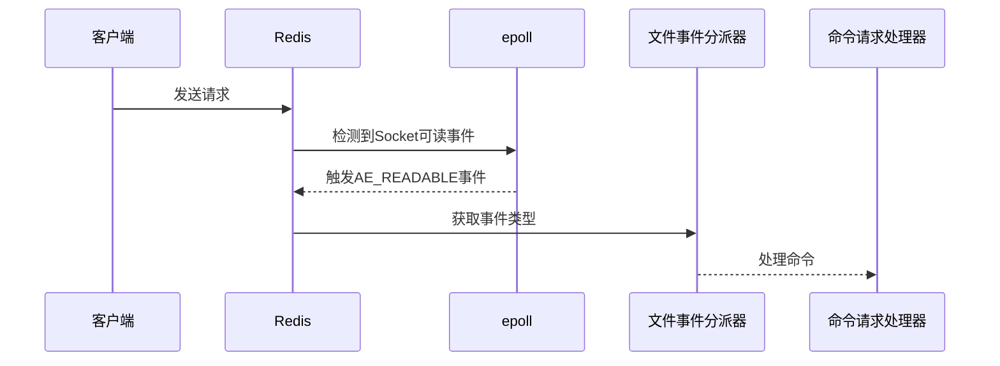
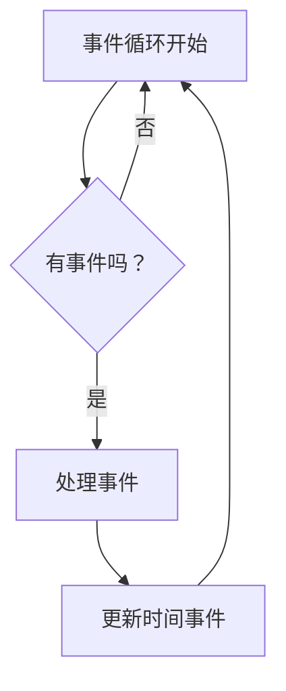

# 2. 单线程模型

***

# **Java面试八股文：Redis单线程模型详解**

***

## **1. 概述与定义**

**Redis单线程模型**是指Redis在处理客户端请求时，所有命令的解析、执行和响应均在一个主线程中顺序完成。其核心设计思想是**通过高效的事件驱动和非阻塞IO**，在单线程中实现高并发和低延迟。尽管单线程处理命令，但Redis通过以下机制实现高性能：

- **事件驱动模型**：通过监听和响应事件（如客户端请求、定时任务）实现异步处理。
- **非阻塞IO**：避免阻塞主线程，快速响应多个客户端请求。
- **内存操作**：所有数据操作在内存中完成，无需磁盘IO。

**示例**： &#x20;

```java 
// 客户端发送命令到Redis
redis-cli SET key "value"  // 该命令由主线程解析并执行
```


***

## **2. 原理剖析**

### **2.1 事件驱动模型**

Redis基于**Reactor模式**实现事件驱动，核心组件包括：

- **文件事件处理器**：处理客户端网络通信（如读写请求）。
- **时间事件处理器**：处理定时任务（如键过期、持久化）。

#### **文件事件处理器结构**：




#### **流程说明**：

1. **IO多路复用**：通过`epoll`（Linux）或`kqueue`（MacOS）监听所有Socket，检测可读/可写事件。
2. **事件分派**：将事件分发给对应的处理器（如`AE_READABLE`事件触发命令请求处理器）。
3. **命令执行**：主线程顺序执行命令，无需线程切换开销。

### **2.2 非阻塞IO与多路复用**

- **IO多路复用技术**： &#x20;

  Redis通过`epoll`实现高效监听：
  ```mermaid 
  sequenceDiagram
    客户端->>Redis: 发起连接请求
    Redis->>epoll: 注册Socket到epoll
    epoll-->>Redis: 返回可读事件
    Redis->>命令处理器: 处理请求
  ```

- **非阻塞模式**： &#x20;

  Redis将Socket设置为非阻塞，避免在读写时阻塞主线程：
  ```c 
  // 设置Socket为非阻塞（伪代码）
  int flags = fcntl(fd, F_GETFL, 0);
  fcntl(fd, F_SETFL, flags | O_NONBLOCK);
  ```


### **2.3 命令执行流程**

1. **接收请求**：通过`epoll`监听到Socket可读事件。
2. **解析命令**：将二进制请求解析为Redis命令（如`SET`、`GET`）。
3. **执行命令**：在主线程中直接操作内存数据结构（如哈希表、列表）。
4. **响应客户端**：将结果编码为二进制返回。

**示例**： &#x20;

```java 
// 执行命令流程（伪代码）
void processCommand() {
    readRequestFromClient(); // 非阻塞读取
    cmd = parseCommand();    // 解析命令
    result = execute(cmd);   // 执行命令
    sendReply(client, result); // 非阻塞写回
}
```


***

## **3. 应用目标**

Redis单线程模型的核心目标包括：

- **避免线程竞争**：无需锁机制，简化代码复杂度。
- **最大化内存吞吐**：内存操作无需等待，充分利用CPU缓存。
- **高并发支持**：通过事件循环处理数千连接，QPS可达10万+。
- **低延迟保证**：命令执行无上下文切换开销。

***

## **4. 主要特点**

| **特性**​     | **描述**​                       |
| ----------- | ----------------------------- |
| **事件驱动**​   | 通过事件循环监听和响应请求，无需多线程。          |
| **非阻塞IO**​  | 避免阻塞主线程，快速切换任务。               |
| **高吞吐低延迟**​ | 内存操作+单线程避免锁竞争，适合读多写少场景。       |
| **简单易维护**​  | 单线程设计减少并发问题，代码可读性高。           |
| **支持多路复用**​ | 通过\`epoll\`高效管理成千上万的Socket连接。 |

***

## **5. 主要内容及其组成部分**

### **5.1 文件事件处理器**

#### **核心组件**：

1. **IO多路复用程序**（如`epoll`）： &#x20;

   监听所有Socket的可读/可写事件。
2. **事件分派器**： &#x20;

   根据事件类型（`AE_READABLE`、`AE_WRITABLE`）分发到对应的处理器。
3. **事件处理器**： &#x20;
   - **连接应答处理器**：处理新连接的TCP握手。
   - **命令请求处理器**：解析客户端命令。
   - **命令回复处理器**：将结果写回客户端。

#### **工作流程图**：




### **5.2 时间事件处理器**

- **作用**：执行定时任务（如键过期、AOF/RDB持久化）。
- **实现**：基于`struct timeval`定时器，通过`eventloop`轮询触发。

**示例**： &#x20;

```c 
// 设置时间事件（伪代码）
aeCreateTimeEvent(loop, 300, freeMemoryIfNeeded, NULL, NULL);
```


### **5.3 事件循环（Event Loop）**

Redis的主线程通过无限循环处理事件：




#### **循环步骤**：

1. **监听事件**：通过`epoll_wait`等待事件。
2. **处理文件事件**：解析命令并执行。
3. **处理时间事件**：执行到期的定时任务（如清理过期键）。

***

## **6. 应用与拓展**

### **6.1 高并发场景优化**

- **使用Pipeline**：批量发送命令减少网络延迟：
  ```java 
  // Redis客户端使用Pipeline
  Jedis jedis = new Jedis("localhost");
  Pipeline pipeline = jedis.pipelined();
  pipeline.set("key1", "value1");
  pipeline.set("key2", "value2");
  pipeline.sync();
  ```

- **集群部署**：通过`Redis Cluster`分片处理请求，横向扩展吞吐量。

### **6.2 主从复制中的单线程应用**

- **数据同步**：从节点通过单线程拉取主节点的RDB文件和命令，避免多线程冲突。
- **性能优势**：单线程复制确保数据顺序一致，无需复杂协调。

***

## **7. 面试问答**

### **7.1 为什么Redis单线程模型能处理高并发？**

> **面试官视角**：Redis是单线程的，为什么还能处理高并发？
>
> **回答**：
> Redis的高性能源于以下设计：
> 1\. **非阻塞IO**：通过`epoll`快速切换任务，避免阻塞主线程。
> 2\. **事件驱动**：将网络IO和命令处理解耦，主线程专注于快速响应。
> 3\. **内存操作**：所有命令在内存中完成，无需磁盘IO。
> 4\. **高吞吐数据结构**：如`SDS`、`ziplist`保证O(1)/O(N)复杂度。
> **示例**：`GET key`命令仅需内存寻址，耗时<1ms。

***

### **7.2 Redis如何避免单线程成为瓶颈？**

> **面试官视角**：单线程如何保证性能？
>
> **回答**：
> 通过以下方式避免瓶颈：
> 1\. **减少命令执行时间**：所有命令设计为O(1)或O(N)（如哈希表查询）。
> 2\. **异步操作**：持久化（AOF/RDB）通过子进程或后台线程完成。
> 3\. **多路复用**：`epoll`同时管理成千上万的连接。
> 4\. **集群扩展**：通过分片将负载分散到多个节点。

***

### **7.3 单线程如何处理多个客户端请求？**

> \>Redis: 发送请求
> ClientB->>Redis: 发送请求
> Redis->>epoll: 注册SocketA和SocketB
> epoll-->>Redis: 返回SocketA可读事件
> Redis->>处理A的命令: 解析并执行
> Redis->>epoll: 继续监听

***

### **7.4 Redis的单线程与多线程对比优势？**

> **面试官视角**：为什么不采用多线程？
>
> **回答**：
> 单线程相比多线程有以下优势：
> 1\. **避免锁竞争**：无需同步机制，简化代码。
> 2\. **减少上下文切换**：单线程CPU利用率更高。
> 3\. **内存一致性**：命令执行顺序严格，避免并发数据不一致。
> **缺点**：
> CPU密集型操作（如复杂脚本）可能阻塞其他请求，需通过`Lua`脚本优化。

***

### **7.5 如何解决单线程的性能瓶颈？**

> **面试官视角**：如果单线程成为瓶颈，如何优化？
>
> **回答**：
> 1\. **优化命令复杂度**：避免O(N^2)操作（如`SORT`大列表）。
> 2\. **集群分片**：通过`Redis Cluster`分担流量。
> 3\. **读写分离**：主从复制减轻主节点压力。
> 4\. **异步任务**：如批量操作通过`Lua`脚本合并。
> 5\. **硬件升级**：更高性能的CPU或网络设备。

***

## **总结**

Redis的单线程模型通过**事件驱动+非阻塞IO**，在高并发场景下实现了高效处理。面试中需重点理解其**事件循环机制**、**多路复用原理**，并结合实际案例（如Pipeline、集群部署）说明设计思想。掌握这些知识点，能全面应对面试中关于Redis性能和架构的深度问题。
