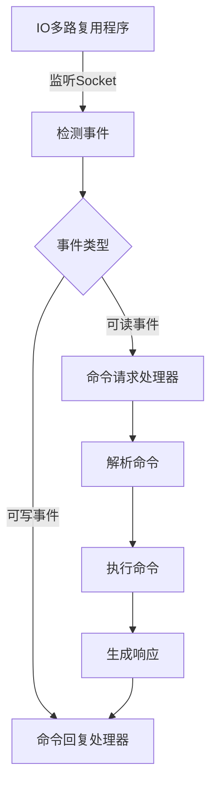
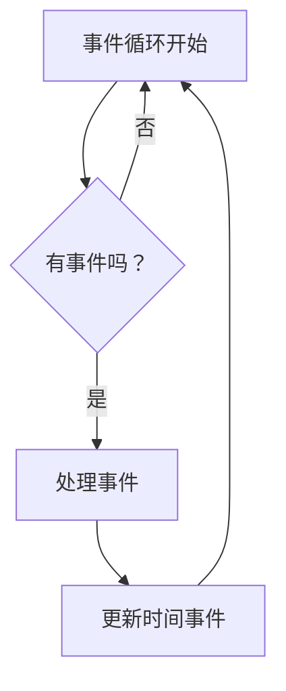
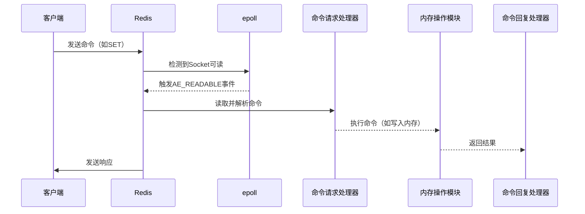
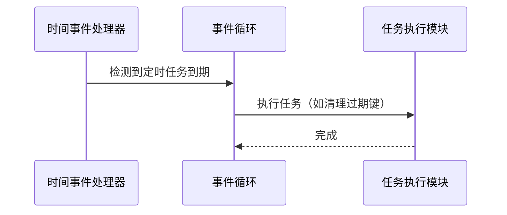

# 3. IO多路复用架构

***

# **Java面试八股文：Redis IO多路复用架构详解**

***

## **1. 概述与定义**

**Redis的IO多路复用架构**是其高性能网络通信的核心，通过**单线程+非阻塞IO**，实现同时监听和处理成千上万的客户端连接。其核心机制是**I/O多路复用程序**（如`epoll`），允许一个线程高效管理多个Socket，避免因阻塞或频繁轮询浪费资源。

**作用**： &#x20;

- **高并发处理**：支持每秒十万级请求。 &#x20;
- **低延迟**：快速响应客户端请求，无线程切换开销。 &#x20;
- **资源高效利用**：避免无效等待，最大化CPU与网络带宽利用率。

**示例**： &#x20;

```java 
// 客户端通过多个连接同时请求Redis
redis-cli -p 6379 SET key1 "value1"  // 连接1
redis-cli -p 6379 GET key2           // 连接2
```


***

## **2. 原理剖析**

### **2.1 文件事件处理器（File Event Handler）**

#### **核心组件**：

1. **I/O多路复用程序**： &#x20;
   - **Linux**：`epoll`（高可扩展性，支持百万级连接）。 &#x20;
   - **MacOS**：`kqueue`。 &#x20;
   - **Windows**：`IOCP`（在Redis中通过`win32`适配）。 &#x20;
2. **事件分派器**：根据事件类型（如`AE_READABLE`、`AE_WRITABLE`）分发到对应的处理器。 &#x20;
3. **事件处理器**： &#x20;
   - **连接应答处理器**：处理新连接的TCP握手。 &#x20;
   - **命令请求处理器**：解析客户端发送的命令。 &#x20;
   - **命令回复处理器**：将结果写回客户端。

#### **工作流程**：




#### **流程说明**： &#x20;

1. **监听Socket**：`epoll`注册所有需要监听的Socket。 &#x20;
2. **事件触发**：当Socket可读或可写时，`epoll`通知主线程。 &#x20;
3. **分派与处理**：根据事件类型调用对应的处理器，例如： &#x20;
   - **可读事件**：读取客户端发送的命令（如`SET`）。 &#x20;
   - **可写事件**：将命令执行结果写回客户端。

***

### **2.2 时间事件处理器（Time Event Handler）**

- **作用**：执行定时任务（如键过期、持久化）。 &#x20;
- **实现**：通过`struct timeval`定时器，由事件循环轮询触发。 &#x20;
- **示例**： &#x20;
  ```c 
  // 设置定时任务（伪代码）
  aeCreateTimeEvent(loop, 300, freeMemoryIfNeeded, NULL, NULL);
  ```


***

### **2.3 事件循环（Event Loop）**

Redis的主线程通过无限循环处理事件： &#x20;




#### **循环步骤**： &#x20;

1. **监听事件**：通过`epoll_wait`等待事件。 &#x20;
2. **处理文件事件**：解析命令并执行。 &#x20;
3. **处理时间事件**：执行到期的定时任务（如清理过期键）。 &#x20;
4. **重复循环**：持续监听和响应事件。

***

## **3. 应用目标**

Redis的IO多路复用架构旨在： &#x20;

- **最大化并发连接数**：支持成千上万的客户端同时连接。 &#x20;
- **低延迟通信**：避免阻塞，确保快速响应。 &#x20;
- **简化线程管理**：单线程避免锁竞争和上下文切换开销。 &#x20;
- **与单线程模型无缝集成**：命令执行、持久化等模块均基于单线程设计。

***

## **4. 主要特点**

| **特性**​      | **描述**​                                      |
| ------------ | -------------------------------------------- |
| **非阻塞IO**​   | 避免阻塞主线程，通过\`epoll\`快速切换任务。                   |
| **高并发支持**​   | 单线程处理数千连接，QPS可达10万+。                         |
| **事件驱动**​    | 通过事件循环响应请求，无需轮询。                             |
| **资源高效**​    | 减少无效等待，充分利用CPU与网络带宽。                         |
| **兼容多操作系统**​ | 适配\`epoll\`、\`kqueue\`、\`IOCP\`等不同平台的多路复用技术。 |

***

## **5. 主要内容及其组成部分**

### **5.1 文件事件处理器核心组件**

#### **5.1.1 I/O多路复用程序（以epoll为例）**

- **注册Socket**： &#x20;
  ```c 
  // 注册一个Socket到epoll
  epoll_ctl(epollfd, EPOLL_CTL_ADD, sock, &event);
  ```

- **监听事件**： &#x20;
  ```c 
  // 等待事件发生
  epoll_wait(epollfd, events, maxevents, -1);
  ```


#### **5.1.2 事件分派器**

- **事件类型**： &#x20;
  - `AE_READABLE`：Socket可读，触发命令请求处理器。 &#x20;
  - `AE_WRITABLE`：Socket可写，触发命令回复处理器。 &#x20;
- **分派逻辑**： &#x20;
  ```c 
  // 根据事件类型分发（伪代码）
  if (event == AE_READABLE) {
      processCommand(client);
  } else if (event == AE_WRITABLE) {
      sendReply(client);
  }
  ```


### **5.2 事件循环流程**

#### **5.2.1 命令处理流程**




#### **5.2.2 定时任务处理**




***

## **6. 应用与拓展**

### **6.1 高并发场景优化**

- **Pipeline批量操作**： &#x20;
  ```java 
  // 使用Pipeline减少网络延迟
  Jedis jedis = new Jedis("localhost");
  Pipeline pipeline = jedis.pipelined();
  pipeline.set("key1", "value1");
  pipeline.set("key2", "value2");
  pipeline.sync();
  ```

- **集群部署**：通过`Redis Cluster`分片处理请求，横向扩展吞吐量。

### **6.2 Redis 6.0的多线程改进**

- **多线程IO处理**： &#x20;
  - **读取请求**：通过多线程解析客户端命令，提升吞吐。 &#x20;
  - **写回响应**：多线程处理回复事件，避免主线程阻塞。 &#x20;
- **注意**：命令执行仍为单线程，保证原子性。

***

## **7. 面试问答**

### **7.1 为什么Redis能用单线程处理高并发？**

> **面试官视角**：单线程如何应对高并发？
>
> **回答**：
> 通过**IO多路复用+事件驱动**实现：
> 1\. **非阻塞IO**：通过`epoll`监听Socket，无需轮询。
> 2\. **快速事件切换**：主线程逐个处理事件（如读取A客户端命令、写回B客户端结果）。
> 3\. **命令高效执行**：所有命令设计为O(1)/O(N)，避免阻塞。
> **示例**：`GET key`仅需内存寻址，耗时<1ms。

***

### **7.2 Redis的IO多路复用与传统多线程模型有何不同？**

> **面试官视角**：Redis如何避免多线程的缺点？
>
> **回答**：
> **传统多线程**：
> \- 每个连接占用独立线程，线程切换和锁竞争开销大。
> **Redis模型**：
> \- **单线程+多路复用**：
> \- 避免线程竞争，无需锁机制。
> \- `epoll`高效监听数千Socket，无需创建/销毁线程。
> **优势**：CPU利用率更高，延迟更低。

***

### **7.3 Redis如何实现高并发下的低延迟？**

> **面试官视角**：Redis的网络模型如何保障响应速度？
>
> **回答**：
> 1\. **非阻塞IO**：读写操作快速返回，避免阻塞主线程。
> 2\. **事件循环**：按顺序处理事件，无上下文切换开销。
> 3\. **批量操作优化**：如Pipeline合并多个命令减少RTT（往返时间）。
> 4\. **多路复用**：`epoll`同时管理成千上万的连接。

***

### **7.4 Redis与Memcached的IO模型有何区别？**

> **面试官视角**：Redis与Memcached在IO处理上的差异？
>
> **回答**：

| 特性        | Redis（6.0前）     | Memcached   |
| --------- | --------------- | ----------- |
| **线程模型**​ | 单线程+多路复用（epoll） | 多线程+非阻塞IO   |
| **扩展性**​  | 通过集群分片扩展        | 客户端分片，扩展性受限 |
| **吞吐量**​  | 更高（单线程无切换开销）    | 受线程数量限制     |

***

### **7.5 如何优化Redis的网络性能？**

> **面试官视角**：Redis的性能瓶颈如何解决？
>
> **回答**：
> 1\. **启用Pipeline**：批量发送命令减少网络延迟。
> 2\. **使用Redis 6.0多线程IO**：提升命令解析和回复速度。
> 3\. **避免大Key操作**：减少内存分配/释放的开销。
> 4\. **集群分片**：通过`Redis Cluster`横向扩展。
> 5\. **优化持久化配置**：AOF使用`everysec`而非`always`，减少写盘延迟。

***

## **总结**

Redis的IO多路复用架构通过**非阻塞IO+事件驱动**，在单线程下实现了高并发和低延迟。面试中需重点理解其**事件循环机制**、**多路复用原理**，并结合实际案例（如Pipeline、集群部署）说明设计思想。掌握这些知识点，能全面应对面试中关于Redis性能和架构的深度问题。
