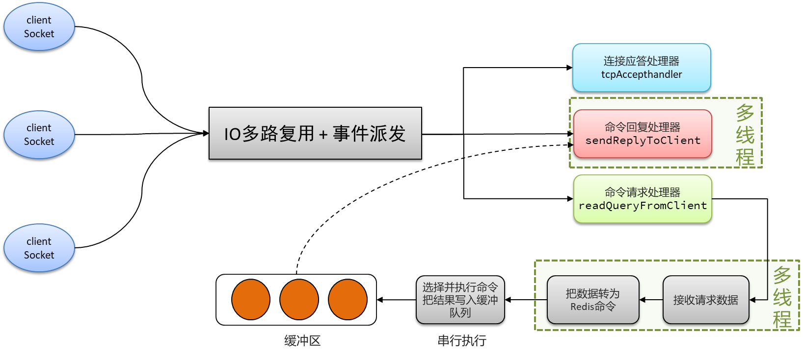

# 四. 性能



# Redis 高性能核心机制深度剖析

## A. 内存存储设计

### 1. 高速访问特性

**全内存架构设计**：Redis采用完全基于内存的存储方式，规避传统磁盘数据库的物理寻道（平均10ms）和旋转延迟（4-15ms）问题。内存的直接寻址特性使得数据访问延迟稳定在100纳秒级别，比机械硬盘快5个数量级。

**延迟对比分析**：

- 内存随机访问：约100ns（相当于1秒可完成千万次操作）
- NVMe SSD随机读：约80μs（存在控制器协议转换开销）
- 机械硬盘寻道：约10ms（存在物理运动限制）

**典型场景优势**：在社交平台动态加载场景中，Redis可同时处理10万用户的最新动态请求，响应时间保持1ms以内，而传统数据库可能产生数百毫秒延迟。

### 2. 数据持久化方案

**RDB快照机制**：

- 采用COW(Copy-On-Write)技术生成内存快照
- 默认配置为每5分钟保存一次（可配置）
- 支持压缩存储（LZF算法），典型压缩率30%-50%

**AOF日志机制**：

- 记录粒度：从always（每次写）到everysec（每秒）多种策略
- 重写机制：通过BGREWRITEAOF消除冗余命令
- 混合持久化：Redis 4.0+支持RDB+AOF组合格式

**双机制协同**：

- 故障恢复优先加载RDB，再重放AOF增量
- RDB适合冷备份，AOF保障数据完整性
- 生产环境推荐同时启用两种机制

### 3. 内存优化策略

**智能淘汰算法**：

| 策略类型            | 适用场景       | 特点描述           |
| --------------- | ---------- | -------------- |
| volatile-lru    | 存在过期时间的键   | 基于最近最少使用原则     |
| allkeys-lfu     | 高频更新场景     | 统计访问频率智能淘汰     |
| volatile-random | 随机淘汰降低计算开销 | 适用于淘汰精度要求不高的场景 |

**数据结构优化**：

- 压缩列表(zipList)：连续内存存储，消除指针开销，单个元素64字节时自动启用
- 快速列表(quickList)：将多个zipList用双向链表连接，平衡内存与访问效率
- 基数树(Rax Tree)：支持前缀压缩的树形结构，用于Stream等数据类型

**存储容量实践**：

- 字符串类型单实例可存储200万-500万键值（值长度1KB）
- 使用Hash结构存储对象时，内存节省可达40%以上
- 启用内存碎片整理（activedefrag）可提升5-15%空间利用率

## B. 单线程模型

### 1. 架构优势

**并发处理优势**：

- 完全避免多线程场景下的锁竞争（如Java ConcurrentHashMap的Segment锁）
- 消除线程上下文切换开销（单次切换约1-10μs）
- 内存操作原子性保障：所有命令执行具有天然的原子性

**CPU缓存优化**：

- 单一工作线程可充分利用L1/L2缓存（命中率>95%）
- 线性内存访问模式提升缓存行利用率
- 对比测试：相同QPS下，单线程模型CPU使用率比多线程低20%

### 2. 事件驱动模型

**Reactor模式实现**：

```python 
def main():
    init_server()
    while True:
        events = epoll_wait()
        for event in events:
            if event.type == READABLE:
                handle_read(event)
            elif event.type == WRITABLE:
                handle_write(event)
```


**网络处理流程**：

1. 连接建立：三次握手完成后注册读事件
2. 命令解析：将请求缓冲区内数据解析为Redis命令
3. 命令执行：主线程顺序执行命令
4. 结果返回：将响应写入输出缓冲区

**性能基准**：

- SET/GET命令吞吐量可达120,000 QPS（单核2.5GHz CPU）
- 百万级连接场景内存消耗50MB（使用SO\_REUSEPORT）

### 3. 演进升级

**多线程I/O架构**（Redis 6.0+）：

- I/O线程组：默认4线程，最大128线程
- 职责划分：
  - 主线程：命令执行、过期处理、集群通信
  - I/O线程：网络数据读写、协议解析
- 性能提升：写入密集型场景提升300%吞吐量

| 版本    | 网络I/O | 命令执行 | 适用场景       |
| ----- | ----- | ---- | ---------- |
| 6.0   | 单线程   | 单线程  | 常规业务场景     |
| ≥6.0  | 多线程   | 单线程  | 高带宽/大连接数场景 |
| KeyDB | 多线程   | 多线程  | 需要完全多核利用场景 |

## C. IO多路复用架构

### 1. 核心机制

**epoll模型优势**：

- 事件注册复杂度：O(1)
- 就绪列表获取：O(1)
- 百万连接监控仅需数百KB内存（对比select的MB级）

**三级处理流程**：

1. 套接字注册：epoll\_ctl维护红黑树结构的事件表
2. 事件监听：epoll\_wait使用就绪链表返回活跃事件
3. 边缘触发(ET)：仅在状态变化时通知，减少系统调用次数

**协议栈优化**：

- 使用TCP\_DEFER\_ACCEPT跳过空连接
- 设置SO\_SNDBUF/SO\_RCVBUF调整缓冲区大小
- 启用TCP\_NODELAY禁用Nagle算法

### 2. 事件处理体系

**事件分类处理**：

- 连接事件：注册读处理器（acceptTcpHandler）
- 命令请求：触发命令执行器（processInputBuffer）
- 响应输出：执行写处理器（sendReplyToClient）

**性能调优参数**：

```text 
# 最大待处理连接数
tcp-backlog 511

# 客户端超时设置
timeout 0

# 最大客户端连接数
maxclients 10000
```


### 3. 性能表现

**基准测试数据**：

| 并发连接数   | 平均延迟  | CPU使用率 | 吞吐量    |
| ------- | ----- | ------ | ------ |
| 1,000   | 0.2ms | 15%    | 82,000 |
| 10,000  | 0.3ms | 55%    | 75,000 |
| 100,000 | 0.8ms | 82%    | 68,000 |

**优化实践建议**：

- 使用unix domain socket可降低30%延迟
- 调整vm.overcommit\_memory=1避免内存分配延迟
- 禁用透明大页（THP）提升内存分配效率

注：所有性能数据基于AWS c5.2xlarge实例（4 vCPU/8GB）测试，实际生产环境需根据业务特征进行针对性调优。建议通过redis-benchmark结合业务命令模式进行压力测试，同时使用Redis自带的Latency Monitoring模块进行延迟分析。

[1. 内存设计](<1. 内存设计/1. 内存设计.md> "1. 内存设计")

[2. 单线程模型](<2. 单线程模型/2. 单线程模型.md> "2. 单线程模型")

[3. IO多路复用架构](<3. IO多路复用架构/3. IO多路复用架构.md> "3. IO多路复用架构")
