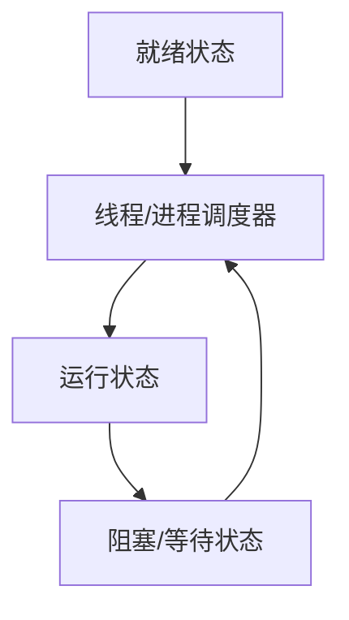

# 1. 线程进程

## 1. 概述与定义

在操作系统中，**进程**和**线程**是两个基本的执行单元，是实现并发和多任务的基础。进程代表程序的一个运行实例，每个进程拥有独立的地址空间和系统资源；而线程则是进程内的一个执行流，同一进程中的多个线程共享进程资源，但每个线程有自己的执行栈和程序计数器。

- **进程**：是系统进行资源分配和调度的基本单位，每个进程相对独立，彼此之间通过进程间通信（IPC）进行数据交换。进程之间隔离性强，安全性好，但创建和切换开销较大。 &#x20;
- **线程**：是程序执行的最小单位，线程是轻量级的进程，同一进程的线程共享内存、文件句柄等资源，切换开销小，适合需要高并发和高效响应的场景。

在 Java 并发领域，我们经常讨论线程的创建、管理、调度以及与进程之间的区别与联系。线程的高效管理和合理调度对于构建高性能、多任务并发系统至关重要。😊

## 2. 主要特点

线程与进程在设计理念和实现机制上有明显区别，其主要特点如下：

1. **内存隔离与共享** &#x20;
   - 进程拥有独立的内存空间，相互之间数据隔离，避免了数据污染和安全隐患。 &#x20;
   - 线程共享所在进程的内存资源，便于数据共享和通信，但需要额外同步机制保证数据一致性。 &#x20;
2. **创建和切换开销** &#x20;
   - 进程创建与切换开销较大，因为涉及独立地址空间的初始化和上下文切换。 &#x20;
   - 线程创建和切换开销较小，能更高效地利用系统资源。 &#x20;
3. **调度与并发性** &#x20;
   - 操作系统调度进程时，需要考虑进程间的资源隔离和优先级，通常采用抢占式调度。 &#x20;
   - 线程调度在同一进程内进行，线程切换速度快，能够实现高并发处理。 &#x20;
4. **稳定性与安全性** &#x20;
   - 进程之间由于内存隔离，崩溃时不会相互影响。 &#x20;
   - 同一进程内线程共享资源，一个线程异常可能影响整个进程，需要使用同步机制防止竞态条件。 &#x20;
5. **通信方式** &#x20;
   - 进程间通信（IPC）方式较多，如管道、共享内存、消息队列等，但实现较复杂。 &#x20;
   - 线程之间通信简单，直接通过共享内存和全局变量实现，但容易出现数据竞争。 &#x20;

下表对线程与进程的主要特点做一简要对比：

| 特点      | 进程                     | 线程                 |
| ------- | ---------------------- | ------------------ |
| 内存空间    | 独立，彼此隔离                | 共享同一进程内的内存         |
| 创建/切换开销 | 较大                     | 较小                 |
| 调度机制    | 操作系统级别抢占式调度            | 轻量级调度，线程切换快        |
| 资源占用    | 拥有独立资源，资源占用较多          | 共享资源，内存利用率高        |
| 通信方式    | 进程间通信复杂（管道、消息队列、共享内存等） | 直接共享变量，通信简单，但需同步保护 |

## 3. 应用目标

理解线程与进程的基本知识和区别，主要目的是为了在实际项目中合理选择并发模型，提高系统性能和响应速度。具体应用目标包括：

1. **提升系统并发处理能力** &#x20;

   通过多线程并发运行，提高 CPU 多核利用率，实现任务并行处理，从而缩短响应时间。🚀
2. **资源隔离与安全性管理** &#x20;

   对于需要高度隔离和安全性的任务，采用多进程方案可以降低相互影响的风险；而对轻量级任务，多线程方案则更高效。 &#x20;
3. **高效通信与数据共享** &#x20;

   同一进程内线程共享内存，便于数据交互；而进程间通信虽然复杂，但在分布式系统中可以实现跨进程数据传输。 &#x20;
4. **系统稳定性保障** &#x20;

   通过进程隔离，将关键任务与非关键任务分离，即使某个进程崩溃也不会影响整体系统稳定性。 &#x20;
5. **优化性能与扩展性** &#x20;

   合理使用线程和进程模型，可以在保障安全性的同时，进一步优化系统性能，并根据业务需求实现动态扩展。 &#x20;

总体来说，理解线程与进程有助于我们在系统设计中根据业务特点和性能要求做出最佳选择，为系统的高并发、高可用提供理论支持。🎯

## 4. 主要内容及其组成部分

本文将详细讲解线程与进程的核心属性及其组成部分，主要包括以下几个方面：

### 4.1 线程与进程的基本概念

- **进程** &#x20;

  是程序的一个运行实例，拥有独立的内存空间、系统资源和执行环境。进程之间相互独立，通过操作系统进行调度。 &#x20;
- **线程** &#x20;

  是进程中的一个执行单元，多个线程共享进程的资源，但有各自独立的执行栈和程序计数器。线程之间通过共享内存进行数据交互。

### 4.2 线程的生命周期

线程在运行过程中经历不同状态，通常包括以下几个阶段：

- **新建（New）**：线程对象创建后，但尚未调用 start() 方法。 &#x20;
- **就绪（Runnable）**：调用 start() 方法后，线程进入就绪状态，等待 CPU 分配时间片。 &#x20;
- **运行（Running）**：线程获得 CPU 资源后进入运行状态，开始执行任务。 &#x20;
- **阻塞/等待（Blocked/Waiting）**：由于同步、IO 或其他原因，线程暂时停止运行，等待某个条件满足。 &#x20;
- **终止（Terminated）**：线程执行完毕或被中断后退出。

通过代码示例，我们可以模拟线程生命周期的简单示例：

```java 
public class ThreadLifecycleDemo extends Thread {
    @Override
    public void run() {
        System.out.println(Thread.currentThread().getName() + " is running.");
        try {
            Thread.sleep(1000); // 模拟阻塞状态
        } catch (InterruptedException e) {
            e.printStackTrace();
        }
        System.out.println(Thread.currentThread().getName() + " is terminated.");
    }

    public static void main(String[] args) {
        ThreadLifecycleDemo t1 = new ThreadLifecycleDemo();
        t1.start();
    }
}
```


### 4.3 进程的属性

进程拥有以下核心属性：

- **独立的地址空间** &#x20;

  每个进程拥有自己的虚拟内存，进程间数据隔离。 &#x20;
- **系统资源** &#x20;

  每个进程拥有独立的系统资源，如文件句柄、环境变量等。 &#x20;
- **调度单元** &#x20;

  进程是操作系统调度的基本单位，具有独立的执行上下文。

### 4.4 线程与进程的调度机制

- **调度算法** &#x20;

  操作系统通常采用抢占式调度算法对进程和线程进行分配。 &#x20;
- **时间片轮转** &#x20;

  每个线程获得一定时间片，执行完毕后切换到下一个线程。 &#x20;
- **优先级调度** &#x20;

  系统可能根据线程优先级决定调度顺序，优先级高的线程更容易获得 CPU 时间。

### 4.5 线程上下文切换

线程上下文切换是指操作系统在不同线程之间切换时保存和恢复执行状态的过程。上下文切换会带来一定开销，频繁切换可能导致性能下降，因此需要合理规划线程数量与任务粒度。

### 4.6 进程与线程间的通信

- **进程间通信（IPC）** &#x20;

  包括管道、共享内存、消息队列等方式，通信开销较大，但保证数据隔离性。 &#x20;
- **线程间通信** &#x20;

  由于线程共享同一进程内存，通信相对简单，但需要同步机制防止数据竞争，如 synchronized、Lock、volatile 等。

下表总结了线程与进程在通信和切换方面的区别：

| 项目      | 进程通信               | 线程通信            |
| ------- | ------------------ | --------------- |
| 通信方式    | 管道、共享内存、消息队列等，开销较大 | 共享内存，通信简单但需同步保护 |
| 上下文切换开销 | 较高                 | 较低              |
| 数据隔离    | 独立内存，安全性高          | 共享内存，容易出现数据竞争   |

## 5. 原理剖析

深入理解线程与进程的原理有助于我们更好地应用于实际项目。下面详细解析关键原理：

### 5.1 进程创建与切换原理

- **进程创建** &#x20;

  当操作系统创建一个新进程时，会为其分配独立的地址空间、资源和上下文信息。进程创建通常比线程创建开销大。 &#x20;
- **进程切换** &#x20;

  进程切换涉及保存当前进程状态、加载新进程状态以及切换内存映射，切换过程需要进行大量数据拷贝和状态维护，因此时间开销较高。

### 5.2 线程创建与调度原理

- **线程创建** &#x20;

  在 Java 中，通过 Thread 类或 Runnable 接口创建线程，底层依赖操作系统提供的线程支持（如 POSIX 线程或 Windows 线程）。线程创建速度较快，因为线程共享进程资源。 &#x20;
- **线程调度** &#x20;

  线程调度由操作系统决定，通常采用时间片轮转和优先级调度。操作系统维护线程的状态信息，通过调度算法分配 CPU 时间片给各线程。 &#x20;
- **上下文切换** &#x20;

  线程上下文切换需要保存当前线程的程序计数器、寄存器、堆栈信息，并加载新线程的状态，这个过程在单个进程内进行，相对于进程切换开销较低，但仍需尽量减少切换频率以提高性能。

### 5.3 同步与互斥机制

由于线程共享同一进程内存，容易发生数据竞争，常用的同步机制有：

- **synchronized 关键字** &#x20;

  保证同一时刻只有一个线程执行同步代码块或方法。 &#x20;
- **Lock 接口** &#x20;

  提供比 synchronized 更灵活的加锁和解锁操作。 &#x20;
- **volatile 关键字** &#x20;

  保证变量在多线程之间的可见性，防止指令重排导致数据不一致。

### 5.4 系统调度策略

操作系统在调度进程与线程时，考虑的主要因素包括：

- **时间片分配** &#x20;

  为每个线程分配一定时间片，时间片用完后切换线程，保证所有线程都有机会执行。 &#x20;
- **优先级** &#x20;

  根据线程的优先级决定调度顺序，高优先级线程通常更容易获得 CPU 时间。 &#x20;
- **抢占式调度** &#x20;

  操作系统会抢占低优先级线程的 CPU 时间，分配给高优先级线程，确保响应性。

下面使用 Mermaid 图表展示线程和进程调度的整体流程：




图中展示了线程或进程在就绪、运行与阻塞状态之间的转换过程，由调度器（Scheduler）控制切换。

## 6. 应用与拓展

理解线程与进程的原理后，在实际开发中可将其应用于以下场景，并通过扩展实现高效并发：

### 6.1 高并发服务器

在 Web 服务器、游戏服务器等高并发系统中，多线程模型能充分利用多核 CPU 提高响应速度。通过合理的线程池管理和任务调度，可以避免频繁创建销毁线程带来的开销。

### 6.2 任务调度与异步处理

使用多线程实现异步任务处理和定时任务调度，如订单超时处理、日志记录、数据分析等，既保证响应速度，又能解耦业务逻辑。

### 6.3 多进程隔离

在安全要求高或任务独立性强的场景中，可以采用多进程设计，各进程之间采用进程间通信（IPC）进行数据交换。这样即使某个进程崩溃，也不会影响整个系统的运行。

### 6.4 并发优化工具

- **线程池**：通过 Executors 工厂方法构建线程池，避免频繁创建销毁线程。 &#x20;
- **并发集合**：使用 ConcurrentHashMap、CopyOnWriteArrayList 等线程安全集合。 &#x20;
- **同步工具**：利用 CountDownLatch、Semaphore、CyclicBarrier 等工具，实现线程间协调。

### 6.5 框架与中间件支持

现代 Java 框架（如 Spring Boot、Netty）均高度封装了线程管理和调度机制。通过理解线程和进程的基本原理，可以更好地使用这些框架，实现高效并发和高可用系统。

下表展示了线程与进程在不同应用场景下的选型依据：

| 应用场景      | 选型建议                         | 备注                                    |
| --------- | ---------------------------- | ------------------------------------- |
| 高并发服务器    | 多线程，使用线程池和 ConcurrentHashMap | 优先利用多核 CPU，减少线程创建开销                   |
| 定时任务与异步处理 | 多线程 + 线程池                    | 使用 ScheduledThreadPoolExecutor 实现定时任务 |
| 高安全隔离     | 多进程                          | 进程间相互独立，适合高安全要求场景                     |
| 并发数据共享    | 并发集合（ConcurrentHashMap 等）    | 保证数据一致性与线程安全                          |

## 7. 面试问答

下面从面试者角度出发，整理了五个常见的面试问题及详细回答，帮助你在面试中从容回答关于线程和进程基础及其调度、同步的相关问题。

### 问题1：请解释进程与线程的基本区别及各自的优缺点？

答： &#x20;
进程是系统进行资源分配和调度的基本单位，拥有独立的地址空间和资源，安全性高但创建和切换开销大；线程是进程内的一个执行单元，线程间共享内存，创建和切换开销小，适合高并发，但同步控制复杂，容易出现竞态条件。面试中我会强调应用场景，例如高并发处理适合多线程，而对安全隔离要求高的任务适合使用多进程。

### 问题2：请描述线程的生命周期及各状态之间的转换？

答： &#x20;
线程的生命周期通常包括新建、就绪、运行、阻塞/等待和终止五个状态。新建状态表示线程对象创建但未启动；就绪状态表示线程已启动，等待 CPU 调度；运行状态表示线程获得 CPU 时间片在执行任务；阻塞/等待状态表示线程因同步或 IO 操作暂停；终止状态表示线程任务执行完毕或被中断退出。面试中我会结合代码示例说明如何观察线程状态的变化。

### 问题3：线程上下文切换的原理及其性能影响是什么？

答： &#x20;
线程上下文切换是操作系统在不同线程间切换时保存和恢复线程状态（如寄存器、程序计数器、栈信息）的过程。虽然线程切换比进程切换开销小，但频繁切换仍会带来 CPU 缓存失效、系统调用开销等性能损耗。面试时，我会说明如何通过合理规划线程数量、减少不必要的同步和阻塞，降低上下文切换开销。

### 问题4：操作系统如何调度线程？请谈谈时间片轮转与优先级调度的实现原理。

答： &#x20;
操作系统采用抢占式调度算法来分配 CPU 给各线程，常用策略包括时间片轮转和优先级调度。时间片轮转为每个线程分配固定时间片，时间片用完后进行切换，保证所有线程都有机会运行；优先级调度根据线程优先级决定调度顺序，优先级高的线程更容易获得 CPU 时间。面试中我会讨论这两种调度策略的优缺点及其对系统响应时间和吞吐量的影响。

### 问题5：在多线程开发中，你如何处理线程间共享数据的同步问题？请举例说明使用 synchronized 与 Lock 的区别。

答： &#x20;
在多线程开发中，为防止数据竞争，必须对共享数据进行同步控制。synchronized 关键字通过监视器锁实现方法或代码块的互斥，使用简单但灵活性较低；而 Lock 接口（如 ReentrantLock）提供更细粒度的锁控制、可中断锁等待、定时锁等待等功能，灵活性更高但使用复杂。面试时我会结合具体代码示例说明两者的用法及各自适用场景，例如当需要公平锁和可中断锁时更倾向于使用 Lock。

## 总结

本文从概述与定义、主要特点、应用目标、主要内容及其组成部分、原理剖析、应用与拓展以及面试问答七个部分，全面解析了线程与进程的基础知识，重点讨论了线程进程的概念、生命周期、调度、同步与通信机制。通过详细的代码示例、表格归纳和 Mermaid 图表展示，我们不仅了解了线程与进程在内存隔离、资源共享、上下文切换、调度策略等方面的基本原理，还掌握了如何在实际项目中根据业务需求合理选择并发模型。希望这篇文章能为各位 Java 工程师在面试复习和项目开发中提供充分支持，帮助你构建高效、稳定、并发友好的系统。加油！🚀
