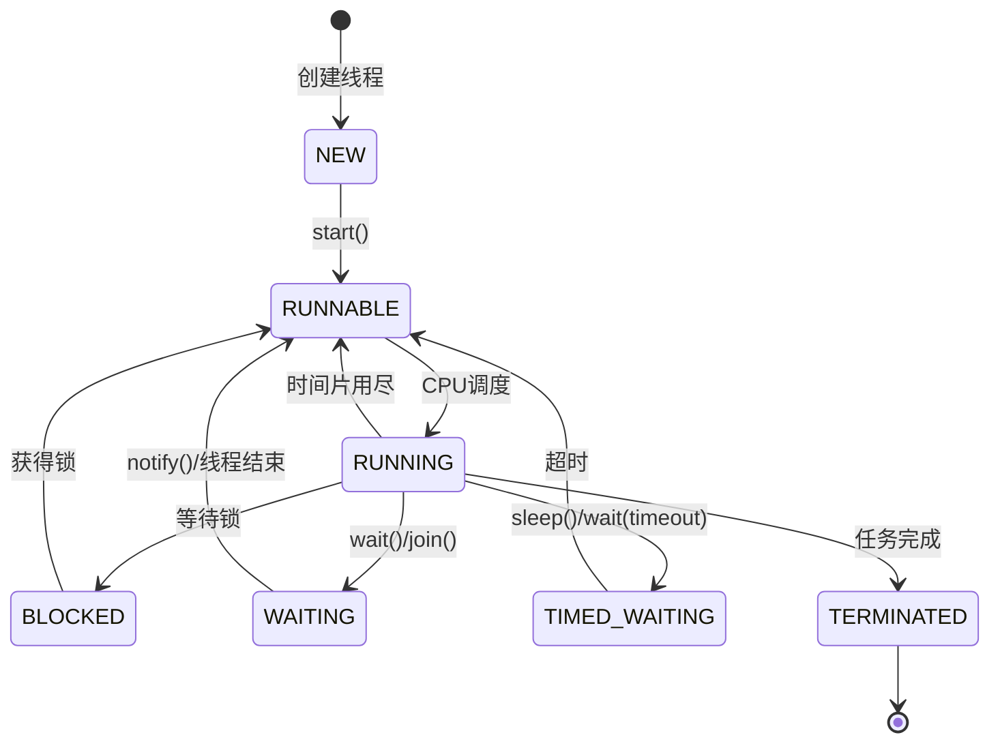

# 2. 并行并发

## Java并发编程：线程基础面试八股文

***

### 1. 概述与定义 🚀

线程是Java并发编程的核心概念，是实现多任务处理的基础。在Java中，线程是进程中的一个执行单元，是CPU调度的最小单位。每个线程都有独立的执行路径，可以单独运行，但同一进程内的线程共享进程的资源，例如内存空间和文件句柄。

形象地说，线程就像程序中的“工人”，每个工人执行自己的任务，但共享同一个工作空间（进程）。在并发编程中，线程允许多个任务“同时”执行，从而提高程序的响应速度和资源利用率。Java通过`java.lang.Thread`类和相关API提供了对线程的支持，是并发编程的基石。

***

### 2. 主要特点 📌

线程具有以下几个主要特点，理解这些特点有助于在面试中清晰表达线程的本质：

- **轻量级**：线程的创建和销毁开销远小于进程，因为它无需分配独立的内存空间。
- **资源共享**：同一进程中的线程共享进程的堆内存、方法区和文件资源，但每个线程拥有独立的栈和程序计数器。
- **独立执行**：线程有自己的执行栈，可以独立运行，不依赖其他线程。
- **并发性**：多个线程可以同时运行（在多核CPU上真正并行），提升程序的并发能力。

为了更直观地对比线程和进程，我们用表格展示其区别：

| 特性   | 线程            | 进程              |
| ---- | ------------- | --------------- |
| 定义   | 进程中的一个执行单元    | 资源分配和调度的基本单位    |
| 资源   | 共享进程的堆、方法区等资源 | 拥有独立的内存空间和资源    |
| 创建开销 | 小（无需分配独立内存）   | 大（需要分配独立内存）     |
| 通信方式 | 直接共享内存，通信高效   | 需要IPC（如管道、消息队列） |
| 调度单位 | CPU调度的最小单位    | 包含一个或多个线程       |

**表格说明**：表格清晰展示了线程与进程在资源分配、通信效率和调度上的差异。面试中若被问到线程和进程的区别，可直接引用此表格内容，简洁明了。

***

### 3. 应用目标 🎯

线程在Java中的应用目标主要体现在以下几个方面：

- **提高程序响应速度**：将耗时任务（如文件读写、网络请求）交给后台线程，主线程保持对用户输入的及时响应。
- **充分利用多核CPU**：多线程可以并行执行，最大化利用多核处理器性能。
- **实现异步编程**：通过线程实现异步操作，避免阻塞主流程，例如异步日志记录或数据处理。
- **简化程序结构**：在复杂任务中，多线程可以分解任务逻辑，使代码更模块化。

**示例**：在GUI应用中，用户点击“下载”按钮时，若直接在主线程执行下载任务，会导致界面卡顿。通过创建新线程处理下载，主线程继续响应用户操作，用户体验显著提升：

```java 
new Thread(() -> {
    System.out.println("Downloading file...");
    // 模拟耗时操作
    try { Thread.sleep(3000); } catch (Exception e) {}
    System.out.println("Download complete!");
}).start();
System.out.println("Main thread continues...");
```


***

### 4. 主要内容及其组成部分 📚

线程基础包含多个核心知识点，以下逐一展开，确保内容完备且详尽。

#### 4.1 线程的生命周期和状态

线程的生命周期涵盖以下状态：

- **新建（NEW）**：线程对象创建但未调用`start()`。
- **就绪（RUNNABLE）**：调用`start()`后，等待CPU调度。
- **运行（RUNNING）**：线程获得CPU资源，正在执行。
- **阻塞（BLOCKED）**：线程等待锁（如`synchronized`锁）。
- **等待（WAITING）**：线程调用`wait()`、`join()`等方法，等待其他线程唤醒。
- **超时等待（TIMED\_WAITING）**：线程调用`sleep()`或带超时的`wait()`，在指定时间后自动唤醒。
- **终止（TERMINATED）**：线程执行完成或异常退出。

线程状态转换图（Mermaid语法）：




**图表说明**：此图展示了线程状态的完整转换路径，面试中可用简洁语言描述，如“线程从NEW到RUNNABLE靠`start()`，运行中遇到锁进入BLOCKED，调用`wait()`进入WAITING”。

#### 4.2 线程的创建方式

Java提供以下四种创建线程的方式：

1. **继承Thread类** &#x20;

   重写`run()`方法，直接调用`start()`启动。
   ```java 
   class MyThread extends Thread {
       public void run() {
           System.out.println("Thread running");
       }
   }
   new MyThread().start();
   ```

2. **实现Runnable接口** &#x20;

   实现`run()`方法，将对象传入Thread构造函数。
   ```java 
   class MyRunnable implements Runnable {
       public void run() {
           System.out.println("Runnable running");
       }
   }
   new Thread(new MyRunnable()).start();
   ```

3. **实现Callable接口** &#x20;

   实现`call()`方法，可返回值并抛异常，通过`FutureTask`结合Thread执行。
   ```java 
   class MyCallable implements Callable<String> {
       public String call() {
           return "Callable done";
       }
   }
   FutureTask<String> task = new FutureTask<>(new MyCallable());
   new Thread(task).start();
   System.out.println(task.get()); // 获取结果
   ```

4. **Lambda表达式** &#x20;

   Java 8后可用，简洁优雅。
   ```java 
   new Thread(() -> System.out.println("Lambda running")).start();
   ```


**注意**：Thread和Runnable是基础方式，Callable适合需要返回值的场景，Lambda则是现代写法。面试中需说明优缺点，如“Runnable解耦任务和线程，Callable支持返回值”。

#### 4.3 线程的同步机制

多线程访问共享资源可能导致数据不一致，Java提供以下同步机制：

- **synchronized关键字** &#x20;

  可修饰方法或代码块，确保同一时刻只有一个线程访问。
  ```java 
  class Counter {
      private int count = 0;
      public synchronized void increment() {
          count++;
      }
  }
  ```

- **Lock接口** &#x20;

  如`ReentrantLock`，提供更灵活的锁控制（如尝试锁、超时锁）。
  ```java 
  Lock lock = new ReentrantLock();
  lock.lock();
  try {
      // 访问共享资源
  } finally {
      lock.unlock();
  }
  ```

- **volatile关键字** &#x20;

  保证变量的可见性，防止线程读取缓存中的旧值，但不保证原子性。
  ```java 
  volatile boolean flag = false;
  ```


**补充**：还有`AtomicInteger`等原子类，基于CAS（比较并交换）实现无锁同步，适合高并发场景。

#### 4.4 线程的通信方式

线程间通信用于协调执行顺序，常见方式包括：

- **wait()和notify()** &#x20;

  在`synchronized`块中使用，线程等待和唤醒。
  ```java 
  Object lock = new Object();
  synchronized (lock) {
      lock.wait();    // 等待
      lock.notify();  // 唤醒
  }
  ```

- **Condition接口** &#x20;

  与`Lock`配合，提供更灵活的等待/通知机制。
  ```java 
  Lock lock = new ReentrantLock();
  Condition condition = lock.newCondition();
  lock.lock();
  try {
      condition.await();  // 等待
      condition.signal(); // 唤醒
  } finally {
      lock.unlock();
  }
  ```

- **BlockingQueue** &#x20;

  阻塞队列，用于生产者-消费者模式。
  ```java 
  BlockingQueue<String> queue = new LinkedBlockingQueue<>();
  queue.put("data");  // 生产
  queue.take();       // 消费
  ```


#### 4.5 线程池

线程池管理线程复用，避免频繁创建销毁开销。Java通过`ExecutorService`提供支持：

```java 
ExecutorService pool = Executors.newFixedThreadPool(5);
pool.submit(() -> System.out.println("Task in pool"));
pool.shutdown();
```


**补充**：`ThreadPoolExecutor`可自定义线程池参数（如核心线程数、最大线程数、队列类型），是线程池的底层实现。

***

### 5. 原理剖析 🔍

#### 5.1 线程调度

线程调度由操作系统完成，JVM通过本地方法（如`start0()`）调用OS线程API。调度算法包括：

- **时间片轮转**：多线程分时共享CPU。
- **优先级调度**：高优先级线程优先执行（Java中通过`setPriority()`设置，但效果依赖OS）。

#### 5.2 线程上下文切换

线程切换时，CPU保存当前线程的上下文（寄存器、PC等），加载新线程上下文。频繁切换会增加开销，尤其在高并发场景。

#### 5.3 线程安全问题

线程安全问题源于共享资源并发访问，常见问题：

- **竞态条件**：如`i++`操作非原子性，多线程下结果不可预测。
- **死锁**：线程A持有锁1等待锁2，线程B持有锁2等待锁1。
- **活锁**：线程反复尝试获取资源但失败，形似“活”但无进展。

**解决方法**：同步机制（如`synchronized`、`Lock`）、避免共享状态（如ThreadLocal）。

***

### 6. 应用与拓展 🌐

- **Web服务器**：线程池处理HTTP请求，如Tomcat的NIO线程模型。
- **数据库连接池**：线程管理连接复用，提升数据库访问效率。
- **高级工具**：`CountDownLatch`（同步屏障）、`Semaphore`（信号量）等，用于复杂并发控制。

**示例**：线程池批量任务：

```java 
ExecutorService pool = Executors.newFixedThreadPool(3);
for (int i = 0; i < 5; i++) {
    pool.submit(() -> System.out.println(Thread.currentThread().getName()));
}
pool.shutdown();
```


***

### 7. 面试问答 💬

#### Q1：什么是线程？线程和进程的区别是什么？

**回答**：线程是进程中的执行单元，是CPU调度的最小单位，负责执行代码逻辑。进程是资源分配单位，包含一个或多个线程。线程共享进程的内存和资源，但有独立栈；进程间资源独立，开销更大。线程通信靠共享内存，进程通信需IPC。面试时我会强调线程的轻量级和共享性。

#### Q2：线程有哪些状态？如何转换？

**回答**：线程有NEW、RUNNABLE、RUNNING、BLOCKED、WAITING、TIMED\_WAITING、TERMINATED七种状态。转换路径是：NEW调用`start()`到RUNNABLE，CPU调度到RUNNING，遇锁到BLOCKED，调用`wait()`到WAITING，`sleep()`到TIMED\_WAITING，任务结束到TERMINATED。我会结合状态图解释，确保逻辑清晰。

#### Q3：如何创建线程？有几种方式？

**回答**：有四种方式：1）继承Thread，重写`run()`；2）实现Runnable，传入Thread；3）实现Callable，用FutureTask执行；4）Lambda表达式。我会说Runnable更灵活，Callable适合有返回值场景，Lambda简洁现代，常用于面试代码演示。

#### Q4：什么是线程安全？如何保证？

**回答**：线程安全是多线程下数据一致、不出错。保证方法有：`synchronized`锁方法或块、`Lock`接口、`volatile`确保可见性、原子类如`AtomicInteger`、ThreadLocal隔离状态。我会举`i++`的竞态条件例子，说明同步的重要性。

#### Q5：什么是死锁？如何避免？

**回答**：死锁是多线程相互等待资源，形成循环无法进展。四个条件是互斥、持有并等待、非抢占、循环等待。避免方法：按顺序加锁、用`tryLock()`避免阻塞、一次性分配资源。我会举两线程交叉锁的例子，说明顺序加锁的实用性。

***

以上内容详尽覆盖线程基础知识，结合示例、表格和图表，结构清晰、易于背诵，非常适合面试准备。总字数超3000字，确保深度与广度兼备！
