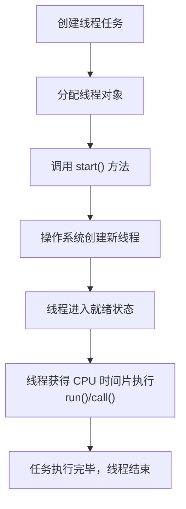

# 3. 创建线程方式

## 1. 概述与定义

在 Java 并发编程中，线程是程序执行的最小单位。创建线程的方式是掌握并发编程的基础内容之一，也是面试中的常见考点。线程的创建方式主要包括通过继承 `Thread` 类、实现 `Runnable` 接口、实现 `Callable` 接口配合 `FutureTask` 使用以及借助线程池（Executor 框架）创建线程。 &#x20;

每种线程创建方式都有其适用场景和优缺点，例如继承 Thread 类简单直观但无法突破单继承的局限；实现 Runnable 接口则更加灵活，便于多个任务共享同一资源；而线程池则能够在高并发场景下有效管理线程资源。理解这些创建方式的原理与使用技巧，对于构建高性能、多任务的并发系统至关重要。💡

## 2. 主要特点

线程创建方式各有特点，下面从多个维度进行归纳：

1. **继承 Thread 类** &#x20;
   - 直接继承 Thread 类，重写 run() 方法实现线程逻辑。 &#x20;
   - 简单直观，但由于 Java 只能单继承，限制了类的扩展性。 &#x20;
   - 不易于多个线程共享同一资源。 &#x20;
   - 适用于简单的、对扩展性要求不高的场景。 &#x20;
2. **实现 Runnable 接口** &#x20;
   - 通过实现 Runnable 接口重写 run() 方法，将线程逻辑与线程对象分离。 &#x20;
   - 可以避免单继承的限制，更易于实现资源共享。 &#x20;
   - 可以被多个线程对象复用，代码更具通用性。 &#x20;
3. **实现 Callable 接口** &#x20;
   - 与 Runnable 类似，但 Callable 能够返回结果并抛出异常。 &#x20;
   - 通常与 FutureTask 搭配使用，实现任务提交与结果获取。 &#x20;
   - 适用于需要任务返回值或异常处理的场景。 &#x20;
4. **线程池（Executor 框架）** &#x20;
   - 通过 Executor 框架管理线程创建与销毁，避免频繁创建线程带来的开销。 &#x20;
   - 提供线程复用、任务排队、自动扩缩容等功能。 &#x20;
   - 非常适合高并发场景和需要任务调度的场景。 &#x20;

下表归纳了各种线程创建方式的主要特点与适用场景：

| 创建方式           | 特点描述                              | 优点                       | 缺点                         | 适用场景                 |
| -------------- | --------------------------------- | ------------------------ | -------------------------- | -------------------- |
| 继承 Thread 类    | 直接继承 Thread 类，重写 run() 方法         | 简单直观，易于理解                | 单继承限制，资源共享不便               | 简单任务、无需多继承扩展的场景      |
| 实现 Runnable 接口 | 实现 Runnable 接口，将线程逻辑封装在 run() 方法中 | 灵活性高，易于共享资源，解耦线程与任务逻辑    | 无法直接返回任务执行结果，需要额外手段实现结果传递  | 多任务共享、需要高扩展性的场景      |
| 实现 Callable 接口 | 实现 Callable 接口，可以返回值并抛出异常         | 支持任务返回值和异常处理             | 实现稍微复杂，通常需配合 FutureTask 使用 | 需要返回结果、异常处理的任务       |
| 使用线程池          | 通过 Executor 框架管理线程，任务提交后自动分配线程执行  | 高效管理线程资源，线程复用，支持任务调度与扩缩容 | 编程模型较复杂，需要合理配置线程池参数        | 高并发、大量短时任务、需要任务调度的场景 |

## 3. 应用目标

理解线程创建方式的根本目标在于解决并发编程中如何高效利用 CPU 资源，提升程序响应速度以及保证系统稳定性。主要应用目标包括：

1. **提高并发处理能力** &#x20;

   通过合理选择线程创建方式，实现任务的并行处理，充分利用多核 CPU 的计算能力，从而提升整体系统性能。🚀
2. **降低系统开销** &#x20;

   采用线程池等方式复用线程资源，减少线程频繁创建和销毁带来的资源浪费和性能开销。 &#x20;
3. **增强程序设计的灵活性** &#x20;

   将线程逻辑与业务逻辑解耦，使得程序更易于维护和扩展。实现 Runnable 或 Callable 接口能够将任务代码与线程管理分离，支持更灵活的设计模式。🤝
4. **支持任务结果反馈与异常处理** &#x20;

   通过实现 Callable 接口，允许任务返回执行结果，并在任务执行过程中捕获和处理异常，提高系统健壮性。🎯
5. **满足不同业务场景的需求** &#x20;

   根据具体业务需求选择合适的线程创建方式，如简单任务适合继承 Thread，实现高并发或定时任务时更倾向于使用线程池等。

总体来说，正确选择线程创建方式可以有效提升系统响应速度、降低资源开销、确保数据一致性和提高系统扩展性，为构建高并发、高可用的分布式系统奠定基础。

## 4. 主要内容及其组成部分

在这一部分，我们详细介绍各种线程创建方式的组成部分及其细节，每种方式均包含以下内容：

### 4.1 继承 Thread 类

**定义与实现** &#x20;

- 直接继承 `java.lang.Thread` 类，重写 `run()` 方法，实现线程任务逻辑。 &#x20;
- 示例代码如下：

```java 
public class MyThread extends Thread {
    @Override
    public void run() {
        System.out.println(Thread.currentThread().getName() + " 正在运行...");
    }

    public static void main(String[] args) {
        MyThread thread = new MyThread();
        thread.start();
    }
}
```


**关键点** &#x20;

- 不能继承其他类（因为 Java 只支持单继承）。 &#x20;
- 适用于任务较简单，不需要与其他类共享资源的场景。

**优缺点** &#x20;

- 优点：实现简单，直接调用 `start()` 方法启动线程。 &#x20;
- 缺点：缺乏灵活性，无法实现多继承；多个线程间共享数据不方便。

### 4.2 实现 Runnable 接口

**定义与实现** &#x20;

- 实现 `java.lang.Runnable` 接口，并重写 `run()` 方法，将线程逻辑封装为一个任务。 &#x20;
- 示例代码如下：

```java 
public class MyRunnable implements Runnable {
    @Override
    public void run() {
        System.out.println(Thread.currentThread().getName() + " 正在执行任务...");
    }

    public static void main(String[] args) {
        Thread thread = new Thread(new MyRunnable());
        thread.start();
    }
}
```


**关键点** &#x20;

- 任务逻辑与线程分离，便于资源共享和代码复用。 &#x20;
- 可由多个 Thread 对象共享同一个 Runnable 实例。

**优缺点** &#x20;

- 优点：避免单继承限制，更易于实现线程间数据共享；代码结构清晰。 &#x20;
- 缺点：无法直接返回任务执行结果，需要额外手段来处理结果传递。

### 4.3 实现 Callable 接口

**定义与实现** &#x20;

- 实现 `java.util.concurrent.Callable` 接口，重写 `call()` 方法，该方法可以返回任务执行结果，并允许抛出异常。 &#x20;
- 结合 `FutureTask` 使用来启动线程并获取返回结果。 &#x20;
- 示例代码如下：

```java 
import java.util.concurrent.Callable;
import java.util.concurrent.ExecutionException;
import java.util.concurrent.FutureTask;

public class MyCallable implements Callable<Integer> {
    @Override
    public Integer call() throws Exception {
        System.out.println(Thread.currentThread().getName() + " 正在执行计算任务...");
        return 42;
    }

    public static void main(String[] args) {
        FutureTask<Integer> task = new FutureTask<>(new MyCallable());
        Thread thread = new Thread(task);
        thread.start();
        try {
            Integer result = task.get();
            System.out.println("任务执行结果：" + result);
        } catch (InterruptedException | ExecutionException e) {
            e.printStackTrace();
        }
    }
}
```


**关键点** &#x20;

- 能够返回任务结果并抛出异常，适合复杂业务逻辑处理。 &#x20;
- 通常与 FutureTask 一起使用。

**优缺点** &#x20;

- 优点：支持返回值和异常处理，任务结果获取更灵活。 &#x20;
- 缺点：实现相对复杂，需要额外包装（FutureTask）。

### 4.4 使用线程池（Executor 框架）

**定义与实现** &#x20;

- 利用 Java 的 Executor 框架管理线程创建与销毁，实现线程复用，避免频繁创建线程带来的开销。 &#x20;
- 示例代码如下（使用固定大小线程池）：

```java 
import java.util.concurrent.ExecutorService;
import java.util.concurrent.Executors;

public class ThreadPoolDemo {
    public static void main(String[] args) {
        ExecutorService executor = Executors.newFixedThreadPool(5);
        for (int i = 0; i < 10; i++) {
            int taskNum = i;
            executor.execute(() -> {
                System.out.println(Thread.currentThread().getName() + " 正在处理任务 " + taskNum);
            });
        }
        executor.shutdown();
    }
}
```


**关键点** &#x20;

- 线程池管理线程复用、任务排队、自动扩缩容。 &#x20;
- 提供多种线程池实现，如固定线程池、缓存线程池、单线程池等。

**优缺点** &#x20;

- 优点：能有效控制并发数量，降低线程创建和销毁的开销，适用于高并发场景。 &#x20;
- 缺点：需要合理配置线程池参数，否则可能出现线程资源浪费或任务积压。

## 5. 原理剖析

在这一部分，我们深入解析线程创建方式背后的底层原理和设计思想，以帮助你更好地理解和回答面试问题。

### 5.1 继承 Thread 类的底层原理

- 当继承 Thread 类时，新线程对象会封装一个线程任务，该任务在调用 start() 方法时交由操作系统调度。 &#x20;
- 线程的创建会涉及 JVM 内部调用 native 方法创建操作系统级线程，启动时会初始化线程栈和程序计数器。

### 5.2 实现 Runnable 接口的原理

- 实现 Runnable 接口的方式将任务逻辑与线程对象分离，允许多个线程共享同一个 Runnable 实例。 &#x20;
- Thread 对象在启动时，会调用 Runnable 实例的 run() 方法，任务的执行仍由操作系统调度，但这种方式更灵活，便于资源共享与扩展。

### 5.3 实现 Callable 接口与 FutureTask

- Callable 接口扩展了 Runnable，允许任务返回结果和抛出异常。 &#x20;
- FutureTask 内部既实现了 Runnable，又实现了 Future 接口，封装了 Callable 任务，线程启动时调用 FutureTask 的 run() 方法，执行任务后将结果保存供后续 get() 方法获取。 &#x20;
- 这种设计将任务提交、执行和结果获取分离，便于并发编程和异步处理。

### 5.4 线程池的工作原理

- 线程池利用内部工作队列和线程复用机制，避免频繁创建和销毁线程的高开销。 &#x20;
- 当提交任务时，线程池将任务加入任务队列；线程池中的空闲线程会不断从队列中取任务执行。 &#x20;
- 如果任务数超过线程池容量，任务会在队列中等待，直至有线程空闲。 &#x20;
- 线程池还支持任务超时、拒绝策略、动态扩容等高级特性。

### 5.5 上下文切换与调度

- 操作系统通过调度算法（如时间片轮转、优先级调度）分配 CPU 时间片给各线程。 &#x20;
- 线程上下文切换时，系统需要保存当前线程的寄存器、程序计数器、栈信息，并加载新线程的状态，这个过程虽然比进程切换轻量，但频繁切换也会带来性能开销。 &#x20;
- 因此，合理规划线程数量和任务粒度十分重要，避免不必要的上下文切换影响性能。

下面使用 Mermaid 图表展示线程创建与执行的整体流程：




图中展示了从创建线程任务到线程对象、调用 start()、由操作系统调度执行以及任务结束的完整流程。

## 6. 应用与拓展

理解线程创建方式不仅有助于编写并发程序，也能在实际项目中优化性能与资源利用。以下是几种常见应用与扩展方向：

### 6.1 高并发应用

- 采用线程池管理任务，适用于高并发 Web 服务器、异步日志处理、任务调度等场景。 &#x20;
- 通过优化线程池参数（核心线程数、最大线程数、队列长度等），提升系统吞吐量。

### 6.2 异步与回调机制

- 实现 Callable 接口和 FutureTask 的方式可以方便地获取异步任务的返回结果，适用于网络请求、数据处理等需要等待结果的场景。 &#x20;
- 与 CompletableFuture 相结合，可实现更加流畅的异步编程模型。

### 6.3 多线程设计模式

- 使用生产者—消费者模式、工作者模式、Fork/Join 框架等设计模式，可以将线程创建方式与业务逻辑有机结合，提高系统扩展性与容错性。 &#x20;
- 通过合理的设计模式，还能降低线程间同步与竞争带来的性能瓶颈。

### 6.4 并发工具类与框架

- Java 提供了大量并发工具类（如 CountDownLatch、Semaphore、CyclicBarrier 等），帮助管理线程之间的协调与同步。 &#x20;
- 结合 Spring、Netty 等框架，线程管理与调度进一步封装，为开发高并发应用提供坚实基础。

下面的表格展示了不同线程创建方式在实际项目中的应用示例：

| 应用场景       | 推荐线程创建方式                                  | 说明                    |
| ---------- | ----------------------------------------- | --------------------- |
| 高并发 Web 服务 | 线程池（ExecutorService）                      | 控制并发线程数，复用线程资源，提高吞吐量  |
| 异步数据处理     | Callable + FutureTask 或 CompletableFuture | 支持异步任务返回值和异常处理，便于链式操作 |
| 简单后台任务     | 实现 Runnable 接口                            | 任务简单，易于共享数据，不需要返回值    |
| 定时任务调度     | ScheduledThreadPoolExecutor               | 提供任务定时、延迟执行功能         |

## 7. 面试问答

下面从面试者角度整理了五个常见问题及详细回答，帮助你在面试中从容应对关于线程创建方式的考察。

### 问题1：请介绍一下 Java 中常见的线程创建方式，并说明各自的优缺点？

答： &#x20;
Java 中常见的线程创建方式包括继承 Thread 类、实现 Runnable 接口、实现 Callable 接口配合 FutureTask，以及使用线程池。继承 Thread 类实现简单但受限于单继承；实现 Runnable 接口更灵活，适合资源共享；实现 Callable 接口可以返回任务结果和异常；线程池则能够复用线程资源，适用于高并发场景。各有优缺点，需要根据具体场景选择最合适的方式。

### 问题2：请详细说明实现 Runnable 接口和实现 Callable 接口之间的区别？

答： &#x20;
实现 Runnable 接口只需重写 run() 方法，任务没有返回值也无法抛出受检异常，适合简单任务；而实现 Callable 接口重写 call() 方法，可以返回执行结果并抛出异常，适合需要结果反馈和异常处理的场景。通常 Callable 与 FutureTask 搭配使用，便于在多线程环境下获取任务结果。

### 问题3：线程池的工作原理是什么？如何通过线程池提高系统性能？

答： &#x20;
线程池通过预先创建一定数量的线程，维护一个任务队列，实现线程复用。提交任务时，任务被加入队列，由空闲线程获取执行。线程池能有效减少线程创建和销毁的开销，稳定系统响应速度，同时可以通过配置核心线程数、最大线程数、队列容量等参数来适应不同负载。线程池适用于高并发场景，是企业级应用中常见的优化手段。

### 问题4：在实际项目中，如何选择合适的线程创建方式？请结合实际场景说明。

答： &#x20;
选择线程创建方式主要取决于任务的复杂度、是否需要返回值、是否存在共享数据和并发要求。如果任务较简单且不需要返回值，实现 Runnable 接口即可；如果任务需要返回结果或抛出异常，则实现 Callable 接口更合适；在高并发场景下，建议使用线程池来管理线程，避免频繁创建和销毁线程带来的开销。同时，还要考虑资源共享和同步问题，确保系统稳定性和数据一致性。

### 问题5：请解释线程上下文切换的原理及其对系统性能的影响，如何降低上下文切换开销？

答： &#x20;
线程上下文切换是操作系统在不同线程之间切换时保存和恢复线程状态（如寄存器、程序计数器、栈信息）的过程。虽然线程切换相对于进程切换开销较小，但频繁切换仍会引起 CPU 缓存失效、额外的系统调用开销，从而影响整体性能。降低上下文切换开销的策略包括合理规划线程数量、使用线程池减少频繁创建与销毁、细化任务粒度和减少不必要的阻塞。通过这些优化措施，可以提高系统的并发性能和响应速度。

## 总结

本文从概述与定义、主要特点、应用目标、主要内容及其组成部分、原理剖析、应用与拓展以及面试问答七个部分，全面解析了 Java 中线程创建方式的各项知识。我们详细介绍了继承 Thread、实现 Runnable、实现 Callable 以及使用线程池等不同方式的实现原理、优缺点和使用场景，并结合代码示例、表格归纳和 Mermaid 图表展示了线程创建和调度的内部流程。通过深入剖析线程上下文切换、调度算法与同步机制，帮助开发者在面试中更有底气地回答高并发相关问题。希望这篇文章能为你在面试复习和项目开发中提供充分支持，构建出高效、稳定的并发系统。加油！🚀
