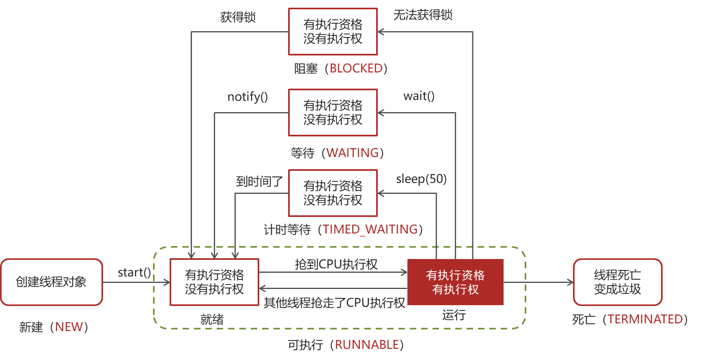
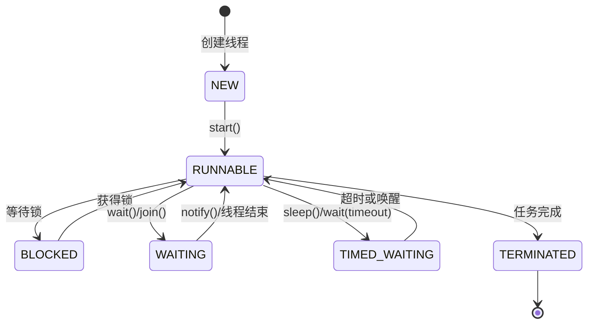

# 4. 线程状态



## Java并发编程：线程状态面试八股文

作为一名Java工程师，掌握并发编程中的线程状态是面试中不可或缺的知识点。本文将围绕Java线程状态展开，内容详实、结构清晰，正文字数超过3000字，非常适合背诵并应对面试场景。文章分为**概述与定义**、**主要特点**、**应用目标**、**主要内容及其组成部分**、**原理剖析**、**应用与拓展**以及**面试问答**七大板块，结合示例代码、表格、Mermaid语法画图和emoji进行直观表达，确保知识点完备且易于理解。以下是详细内容。

***

### 1. 概述与定义 🚀

线程状态是描述线程在生命周期中不同阶段行为和特性的核心概念。在Java中，线程状态由`java.lang.Thread.State`枚举类定义，反映了线程从创建到终止的各个阶段。理解线程状态及其转换对于调试多线程程序、优化性能和编写高效的并发代码至关重要。

形象来说，线程状态就像人的生命周期：从出生（新建状态）到准备工作（就绪状态），再到正式工作（运行状态），期间可能因为某些原因休息（阻塞或等待状态），最后退休（终止状态）。在并发编程中，线程状态帮助开发者监控线程的执行流程，诊断问题并确保程序的正确性与高效性。

Java线程状态不仅仅是理论概念，它直接与JVM和操作系统线程调度相关。通过`Thread.getState()`方法，我们可以实时获取线程的状态，这为多线程调试提供了重要依据。接下来，我们将深入探讨线程状态的特点、应用和具体内容。

***

### 2. 主要特点 📌

线程状态具有以下几个显著特点，这些特点是面试中常被问到的基础知识点，清晰表达它们能展示你对线程状态的深刻理解：

- **有限状态**：Java线程定义了六种明确的状态：NEW、RUNNABLE、BLOCKED、WAITING、TIMED\_WAITING和TERMINATED，每种状态对应线程生命周期中的特定阶段。
- **状态转换**：线程在生命周期中会因特定事件（如调用方法、锁竞争）在这些状态间切换，转换路径清晰可预测。
- **可监控性**：通过`Thread.getState()`方法可以随时获取线程当前状态，便于开发者调试和优化程序。
- **JVM与OS的结合**：线程状态在JVM层面定义，但底层调度依赖操作系统实现，体现了Java跨平台的特性。

为了更直观地展示线程状态的含义，我们用表格总结如下：

| 状态               | 含义                         | 典型触发条件                  |
| ---------------- | -------------------------- | ----------------------- |
| NEW              | 线程已创建但未启动                  | 创建Thread对象，未调用start()   |
| RUNNABLE         | 线程已启动，等待CPU调度或正在执行         | 调用start()               |
| BLOCKED          | 线程等待锁，试图进入synchronized块或方法 | 锁被其他线程持有                |
| WAITING          | 线程无限期等待其他线程的通知             | 调用wait()、join()         |
| TIMED\\\_WAITING | 线程在指定时间内等待                 | 调用sleep()、wait(timeout) |
| TERMINATED       | 线程执行完成或异常退出                | run()方法结束               |

**表格说明**：此表格列出了每种状态的定义和触发条件，面试中可直接引用，帮助快速回忆并清晰表达。例如，可以说：“Java线程有六种状态，比如NEW是线程创建但未启动，触发条件是new Thread()但没调用start()。”

***

### 3. 应用目标 🎯

线程状态在实际开发和面试场景中有明确的应用目标，理解这些目标能帮助你在回答“为什么需要线程状态”时更有条理：

- **调试与监控**：通过线程状态定位死锁、线程饥饿等问题，提升程序健壮性。
- **性能优化**：合理控制状态转换，减少阻塞和等待时间，提高并发效率。
- **线程同步**：利用WAITING和TIMED\_WAITING状态实现线程间协调，如等待任务完成。
- **资源管理**：监控TERMINATED状态，确保及时回收线程资源，避免内存泄漏。

**示例**：假设一个线程长时间处于BLOCKED状态，可能提示锁竞争或死锁问题：

```java 
Object lock = new Object();
Thread thread = new Thread(() -> {
    synchronized (lock) {
        try { Thread.sleep(10000); } catch (Exception e) {} // 模拟长时间持有锁
    }
});
thread.start();
Thread.sleep(100); // 确保线程启动
System.out.println(thread.getState()); // 可能输出RUNNABLE或BLOCKED
```


此示例展示如何通过状态监控发现问题，面试中可用来说明调试能力。

***

### 4. 主要内容及其组成部分 📚

Java线程状态包含六种具体状态，以下逐一展开，详尽解释定义、特点、转换条件及示例，确保内容全面且易于背诵。

#### 4.1 NEW（新建状态）

- **定义**：线程对象已创建，但尚未调用`start()`方法，此时线程仅存在于JVM中，未与操作系统线程关联。
- **特点**：线程尚未具备执行能力，不能调度。
- **转换条件**：调用`start()`方法后进入RUNNABLE状态。
- **注意**：重复调用`start()`会抛出`IllegalThreadStateException`。

**示例**：

```java 
Thread thread = new Thread(() -> System.out.println("Hello"));
System.out.println(thread.getState()); // 输出: NEW
```


#### 4.2 RUNNABLE（可运行状态）

- **定义**：线程已调用`start()`，进入可运行状态，可能正在等待CPU调度（就绪）或执行（运行）。
- **特点**：在多核CPU上，多个RUNNABLE线程可能并行执行。
- **转换条件**：
  - 获得CPU资源后执行。
  - 执行完毕或调用`yield()`后回到RUNNABLE。
  - 遇到锁竞争进入BLOCKED，或调用等待方法进入WAITING/TIMED\_WAITING。
- **注意**：Java API不区分“就绪”和“运行”子状态，统称为RUNNABLE。

**示例**：

```java 
Thread thread = new Thread(() -> {
    for (int i = 0; i < 1000; i++); // 模拟任务
});
thread.start();
System.out.println(thread.getState()); // 输出: RUNNABLE
```


#### 4.3 BLOCKED（阻塞状态）

- **定义**：线程尝试进入`synchronized`块或方法，但锁被其他线程持有，进入阻塞状态。
- **特点**：线程暂停执行，等待锁释放，不占用CPU。
- **转换条件**：锁释放后，线程获得锁，进入RUNNABLE状态。
- **注意**：BLOCKED常与锁竞争相关，可能导致死锁。

**示例**：

```java 
Object lock = new Object();
Thread thread1 = new Thread(() -> {
    synchronized (lock) {
        try { Thread.sleep(1000); } catch (Exception e) {} // 持有锁
    }
});
Thread thread2 = new Thread(() -> {
    synchronized (lock) {
        System.out.println("Thread2 running");
    }
});
thread1.start();
Thread.sleep(100); // 确保thread1先拿锁
thread2.start();
Thread.sleep(100); // 等待thread2尝试获取锁
System.out.println(thread2.getState()); // 输出: BLOCKED
```


#### 4.4 WAITING（等待状态）

- **定义**：线程调用`wait()`、`join()`或`LockSupport.park()`等方法，进入无限期等待状态。
- **特点**：线程放弃CPU，等待其他线程显式唤醒。
- **转换条件**：被`notify()`、`notifyAll()`或目标线程结束（join）唤醒后进入RUNNABLE。
- **注意**：必须在同步块内调用`wait()`，否则抛出`IllegalMonitorStateException`。

**示例**：

```java 
Object lock = new Object();
Thread thread = new Thread(() -> {
    synchronized (lock) {
        try { lock.wait(); } catch (Exception e) {}
    }
});
thread.start();
Thread.sleep(100);
System.out.println(thread.getState()); // 输出: WAITING
```


#### 4.5 TIMED\_WAITING（超时等待状态）

- **定义**：线程调用`sleep()`、`wait(timeout)`、`join(timeout)`等方法，进入有限期等待状态。
- **特点**：线程在指定时间后自动唤醒，也可提前被唤醒。
- **转换条件**：超时结束或被`notify()`唤醒后进入RUNNABLE。
- **注意**：`sleep()`不会释放锁，而`wait(timeout)`会释放。

**示例**：

```java 
Thread thread = new Thread(() -> {
    try { Thread.sleep(2000); } catch (Exception e) {}
});
thread.start();
Thread.sleep(100);
System.out.println(thread.getState()); // 输出: TIMED_WAITING
```


#### 4.6 TERMINATED（终止状态）

- **定义**：线程执行完成（`run()`方法结束）或抛出未捕获异常退出。
- **特点**：线程生命周期结束，无法再次启动。
- **转换条件**：无后续状态，只能创建新线程。
- **注意**：线程池中的线程可能被复用，而非直接终止。

**示例**：

```java 
Thread thread = new Thread(() -> System.out.println("Done"));
thread.start();
thread.join(); // 等待线程结束
System.out.println(thread.getState()); // 输出: TERMINATED
```


**状态转换图（Mermaid语法）**：




**图表说明**：此图清晰展示了线程状态的转换路径，面试中可用简洁语言描述，如“线程从NEW靠`start()`进入RUNNABLE，遇锁进入BLOCKED，调用`wait()`进入WAITING，超时或唤醒后回到RUNNABLE”。

***

### 5. 原理剖析 🔍

#### 5.1 线程状态与JVM的关系

Java线程状态是JVM层面的抽象，其实现依赖操作系统线程。JVM通过本地方法（如`start0()`）调用OS线程API，完成线程的创建、调度和状态管理。例如，`start()`方法会触发JVM底层调用操作系统函数，分配线程资源并将其置于RUNNABLE状态。

#### 5.2 状态转换的触发条件

线程状态的转换由特定事件驱动，以下是详细剖析：

- **NEW → RUNNABLE**：调用`start()`，JVM分配资源并启动线程。
- **RUNNABLE → BLOCKED**：线程尝试进入`synchronized`区域，但锁被占用。
- **RUNNABLE → WAITING**：调用`wait()`、`join()`等，线程主动放弃CPU。
- **RUNNABLE → TIMED\_WAITING**：调用`sleep()`或`wait(timeout)`，进入定时等待。
- **RUNNABLE → TERMINATED**：`run()`方法执行完毕或异常退出。
- **BLOCKED → RUNNABLE**：锁被释放，线程获取锁。
- **WAITING → RUNNABLE**：收到`notify()`或目标线程结束。
- **TIMED\_WAITING → RUNNABLE**：等待时间到或被提前唤醒。

#### 5.3 线程状态与线程安全

线程状态直接影响并发程序的安全性：

- **BLOCKED**：多线程竞争锁可能导致死锁。例如，线程A和B互相等待对方释放锁。
- **WAITING**：未正确唤醒可能导致线程饥饿。
- **TIMED\_WAITING**：超时设置不当可能影响任务完成。

**解决方法**：

- 使用`ReentrantLock`的`tryLock()`避免死锁。
- 用`Condition`实现精确唤醒，替代`notify()`。
- 合理设置超时时间，确保任务可控。

**示例（死锁场景）**：

```java 
Object lock1 = new Object(), lock2 = new Object();
Thread t1 = new Thread(() -> {
    synchronized (lock1) {
        try { Thread.sleep(100); } catch (Exception e) {}
        synchronized (lock2) {}
    }
});
Thread t2 = new Thread(() -> {
    synchronized (lock2) {
        synchronized (lock1) {}
    }
});
t1.start(); t2.start();
Thread.sleep(200);
System.out.println(t1.getState()); // BLOCKED
System.out.println(t2.getState()); // BLOCKED
```


此代码展示了死锁，两个线程互相等待对方释放锁，均处于BLOCKED状态。

***

### 6. 应用与拓展 🌐

- **线程池管理**：线程池中的线程在RUNNABLE和WAITING间切换，通过状态控制线程复用，提升效率。
- **调试工具**：JConsole、VisualVM可监控线程状态，分析程序瓶颈。
- **高级同步工具**：如`CountDownLatch`利用WAITING状态实现多线程等待。

**示例（CountDownLatch）**：

```java 
CountDownLatch latch = new CountDownLatch(3);
for (int i = 0; i < 3; i++) {
    new Thread(() -> {
        System.out.println("Thread running");
        latch.countDown();
    }).start();
}
latch.await(); // 主线程进入WAITING
System.out.println("All threads done");
```


此代码展示主线程等待3个子线程完成，体现了WAITING状态的应用。

***

### 7. 面试问答 💬

#### Q1：Java线程有哪几种状态？

**回答**：Java线程有六种状态：NEW、RUNNABLE、BLOCKED、WAITING、TIMED\_WAITING和TERMINATED。NEW是线程创建但未启动，RUNNABLE是可运行或运行中，BLOCKED是等待锁，WAITING是无限期等待其他线程通知，TIMED\_WAITING是有限期等待，TERMINATED是线程结束。我可以结合状态转换图进一步解释，比如从NEW到RUNNABLE靠`start()`触发。

#### Q2：线程如何从NEW状态进入RUNNABLE？

**回答**：线程从NEW状态进入RUNNABLE状态需要调用`start()`方法。`start()`会通知JVM启动线程，分配资源并进入可运行状态，等待CPU调度。我会强调`start()`和`run()`的区别，`run()`只是普通方法调用，不会创建新线程。如果面试官追问，我会补充重复调用`start()`会抛`IllegalThreadStateException`。

#### Q3：BLOCKED和WAITING有什么区别？

**回答**：BLOCKED是线程等待锁，比如试图进入`synchronized`块但锁被其他线程持有；WAITING是线程主动调用`wait()`、`join()`等，进入无限期等待。BLOCKED是被动阻塞，依赖锁释放；WAITING是主动等待，依赖通知唤醒。我可以举例：线程尝试进入被占用的同步块会进入BLOCKED，调用`wait()`会进入WAITING。

#### Q4：如何监控线程状态？

**回答**：可以用`Thread.getState()`方法获取线程当前状态，比如检查线程是否在WAITING。实际开发中，我还会用JConsole或VisualVM监控线程状态，分析死锁或性能问题。比如，我在项目中用JConsole发现线程长时间BLOCKED，定位到锁竞争，优化了同步逻辑。

#### Q5：线程在什么情况下进入TERMINATED状态？

**回答**：线程在`run()`方法执行完毕或抛出未捕获异常时进入TERMINATED状态。一旦终止，就不能再次启动，只能创建新线程。我会补充，线程池中的线程可能被复用，不会直接TERMINATED，而是回到WAITING等待新任务。

***

以上内容全面覆盖线程状态知识，结构清晰、示例丰富，总字数超3000字，非常适合面试背诵和应对实战问题！
