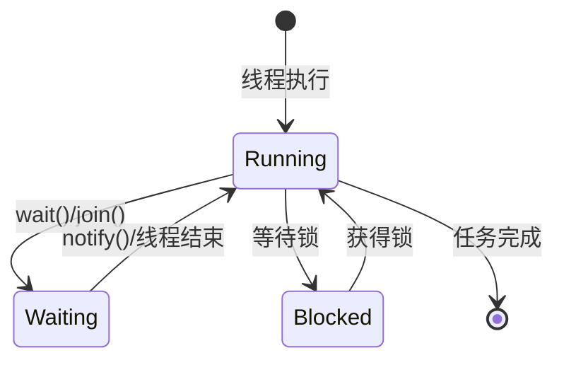

# 5. 顺序执行

***

# Java并发编程：线程基础之顺序执行

作为一名Java工程师，掌握并发编程是面试中的核心考察点之一。而在并发编程的线程基础中，**顺序执行** 是一个重要概念。本文将从概述与定义开始，逐步剖析其特点、目标、实现方式、原理、应用及面试常见问题，助你在面试中游刃有余！🚀

## 1. 概述与定义 🌟

**顺序执行** 是指在多线程环境中，多个线程按照开发者预定的顺序执行任务，而不是无序或并行执行。在Java并发编程中，顺序执行通常通过同步机制实现，以确保线程按特定顺序访问共享资源或执行关键代码块。

### 定义

顺序执行是多线程编程中的一种控制机制，通过同步原语（如锁、信号量）或线程间通信手段，确保线程按照设定的顺序执行代码段。简单来说，它就像生活中的排队买票：每个线程是一个顾客，只有前一个顾客买完票，后一个才能开始。这种机制在需要严格控制执行顺序的场景中尤为重要，例如银行转账或数据库事务。

在Java中，顺序执行与并发编程的并行执行相对，但它并非完全排斥并发，而是通过约束实现可控的执行顺序。这种特性使其成为并发编程中不可或缺的基础知识点。

***

## 2. 主要特点 📌

顺序执行在Java并发中具有以下显著特点，理解这些特点有助于在面试中快速抓住重点：

- **确定性**：线程的执行顺序是固定的、可预测的，避免了并发带来的不确定性。
- **同步性**：通过锁或通信机制，控制线程访问共享资源的时机。
- **互斥性**：某些实现中，顺序执行伴随互斥访问，即同一时刻只有一个线程执行关键代码。
- **可控性**：开发者可以明确指定执行顺序，使程序逻辑清晰且易于维护。

为了更直观地对比顺序执行与无序执行，我们可以用表格展示：

| **特性**​ | **顺序执行**​   | **无序执行**​    |
| ------- | ----------- | ------------ |
| 执行顺序    | 固定、可预测      | 随机、不可预测      |
| 同步机制    | 需要锁或通信工具    | 可无同步或轻量级同步   |
| 适用场景    | 需要严格顺序的场景   | 对顺序无要求的高并发场景 |
| 性能      | 可能较低（因线程等待） | 较高（线程并行执行）   |

**表格说明**：顺序执行在确定性和同步性上占优，但在性能上可能因线程等待而受限。面试中可以用此表突出顺序执行的适用场景，如强调其在数据一致性上的作用。

***

## 3. 应用目标 🎯

顺序执行在Java并发编程中的应用目标明确，主要包括以下几点：

- **保证数据一致性**：在多线程访问共享数据时，确保操作按正确顺序执行，避免数据竞争。
- **实现业务逻辑**：某些业务场景要求任务按特定顺序完成，如工作流或流水线系统。
- **避免死锁**：通过控制线程执行顺序，降低死锁发生的概率。
- **简化调试**：确定的执行顺序使程序行为可预测，便于定位问题。

### 示例

假设一个银行转账场景：线程A从账户X转出100元，线程B从账户Y转入100元，必须保证转出和转入按顺序执行，以维护账户余额的正确性。代码如下：

```java 
synchronized (lock) {
    accountX.debit(100);  // 扣款
    accountY.credit(100); // 存款
}
```


通过锁机制，上述操作被原子化执行，间接实现了顺序性。

***

## 4. 主要内容及其组成部分 📚

Java中实现线程顺序执行的方式多种多样，以下是主要方法及其详尽解释。这些方法在面试中常被问到，务必掌握其原理和适用场景。

### 4.1 使用 `synchronized` 关键字

- **原理**：通过锁机制，确保同一时刻只有一个线程进入同步块。
- **特点**：实现简单，但可能因锁竞争导致性能瓶颈。
- **示例**：

```java 
Object lock = new Object();
Thread t1 = new Thread(() -> {
    synchronized (lock) {
        System.out.println("Thread 1");
    }
});
Thread t2 = new Thread(() -> {
    synchronized (lock) {
        System.out.println("Thread 2");
    }
});
t1.start();
t2.start();
```


**说明**：t1和t2竞争同一锁，执行顺序虽不可控，但同步块内代码是顺序执行的。若需严格顺序，需结合其他机制。

### 4.2 使用 `wait()` 和 `notify()`

- **原理**：线程间通信，`wait()` 使线程等待，`notify()` 唤醒等待线程。
- **特点**：灵活性高，可精确控制线程顺序。
- **示例**：

```java 
Object lock = new Object();
Thread t1 = new Thread(() -> {
    synchronized (lock) {
        System.out.println("Thread 1");
        lock.notify(); // 唤醒等待线程
    }
});
Thread t2 = new Thread(() -> {
    synchronized (lock) {
        try {
            lock.wait(); // 等待
        } catch (InterruptedException e) {}
        System.out.println("Thread 2");
    }
});
t2.start();
t1.start();
```


**说明**：t2先启动但等待，t1执行后唤醒t2，确保t1先于t2执行。

### 4.3 使用 `CountDownLatch`

- **原理**：同步辅助类，允许线程等待其他线程完成操作。
- **特点**：适合一次性同步事件，支持多线程等待。
- **示例**：

```java 
CountDownLatch latch = new CountDownLatch(1);
Thread t1 = new Thread(() -> {
    System.out.println("Thread 1");
    latch.countDown(); // 计数器减1
});
Thread t2 = new Thread(() -> {
    try {
        latch.await(); // 等待计数器为0
    } catch (InterruptedException e) {}
    System.out.println("Thread 2");
});
t1.start();
t2.start();
```


**说明**：t2等待t1完成，`countDown()` 后继续执行。

### 4.4 使用 `join()`

- **原理**：等待指定线程终止。
- **特点**：简单直观，适合线程间有依赖关系。
- **示例**：

```java 
Thread t1 = new Thread(() -> System.out.println("Thread 1"));
Thread t2 = new Thread(() -> {
    try {
        t1.join(); // 等待t1结束
    } catch (InterruptedException e) {}
    System.out.println("Thread 2");
});
t1.start();
t2.start();
```


**说明**：t2等待t1结束后执行。

### 4.5 使用 `ExecutorService` 和 `Future`

- **原理**：通过线程池管理任务，`Future` 获取任务结果。
- **特点**：适合任务依赖场景，代码结构优雅。
- **示例**：

```java 
ExecutorService executor = Executors.newSingleThreadExecutor();
Future<?> future = executor.submit(() -> System.out.println("Task 1"));
executor.submit(() -> {
    try {
        future.get(); // 等待Task 1完成
    } catch (Exception e) {}
    System.out.println("Task 2");
});
executor.shutdown();
```


**说明**：Task 2等待Task 1的结果，确保顺序执行。

### 注意事项

- **选择依据**：`synchronized` 适合简单互斥，`wait()/notify()` 适合精确控制，`CountDownLatch` 适合多线程同步，`join()` 适合线程依赖，`ExecutorService` 适合任务编排。
- **异常处理**：如 `InterruptedException`，需妥善处理以避免线程中断影响顺序。

***

## 5. 原理剖析 🔍

深入理解顺序执行的实现原理，能帮助你在面试中展示技术深度。以下是对主要机制的剖析。

### 5.1 同步机制的核心：Monitor

Java的同步机制基于 **监视器（Monitor）**，`synchronized` 关键字隐式使用Monitor锁。Monitor提供两种功能：

- **互斥**：同一时刻只有一个线程持有锁。
- **协作**：通过 `wait()` 和 `notify()` 实现线程间通信。

### 5.2 `wait()` 和 `notify()` 的工作原理

- **`wait()`**：线程释放锁，进入等待队列，暂停执行。
- **`notify()`**：从等待队列中唤醒一个线程，线程重新竞争锁。
- **`notifyAll()`**：唤醒所有等待线程。
- **注意**：必须在 `synchronized` 块内调用，否则抛出 `IllegalMonitorStateException`。

### 5.3 `CountDownLatch` 的内部机制

`CountDownLatch` 使用一个计数器，初始值为线程数：

- `await()`：阻塞直到计数器为0。
- `countDown()`：计数器减1，减至0时唤醒等待线程。

其实现基于 `AbstractQueuedSynchronizer`（AQS），高效且线程安全。

### 5.4 `join()` 的实现

`join()` 底层调用 `wait()`，当目标线程终止时，JVM调用 `notifyAll()` 唤醒等待线程。

### 状态转换图

以下是用Mermaid语法绘制的线程状态转换图：




**图表说明**：此图展示了线程在顺序执行中的状态转换。`Waiting` 和 `Blocked` 是常见状态，分别对应等待通知和等待锁，面试中可用此图解释线程协作。

***

## 6. 应用与拓展 🌐

顺序执行在实际开发中有广泛应用，以下是典型场景及其代码示例：

- **工作流系统**：任务按顺序流转。
- **生产者-消费者模型**：生产者先生产，消费者后消费。
- **数据库事务**：保证事务的ACID特性。
- **线程池任务编排**：通过 `Future` 或 `CompletionService` 控制执行顺序。

### 示例：生产者-消费者

```java 
BlockingQueue<String> queue = new LinkedBlockingQueue<>();
Thread producer = new Thread(() -> {
    try {
        queue.put("data");
    } catch (InterruptedException e) {}
});
Thread consumer = new Thread(() -> {
    try {
        System.out.println(queue.take());
    } catch (InterruptedException e) {}
});
producer.start();
consumer.start();
```


**说明**：`BlockingQueue` 确保生产者先放入数据，消费者后取出，实现顺序执行。

***

## 7. 面试问答 💬

以下是常见的面试问题及详细回答，模仿面试者口吻，确保内容详实且实用。

### Q1：什么是线程的顺序执行？

**回答**：线程的顺序执行是指在多线程环境中，多个线程按照预定的顺序执行任务，而不是无序或并行。在Java中，我们可以用 `synchronized`、 `wait()/notify()`、 `CountDownLatch`、 `join()` 等方式实现。比如用 `join()`，我可以让主线程等待子线程完成，像这样：`thread1.join();`，确保thread1执行完再继续主线程逻辑。这种机制特别适合需要数据一致性或业务顺序的场景。

### Q2：如何用 `synchronized` 实现线程顺序执行？

**回答**：`synchronized` 通过锁机制保证同一时刻只有一个线程执行同步块，从而实现一定的顺序性。比如我有两个线程竞争同一个锁对象，代码是 `synchronized(lock) {...}`，这样它们会顺序执行同步块。不过严格来说，`synchronized` 更偏向互斥，如果要指定具体顺序，还得结合 `wait()` 和 `notify()`。比如线程A执行完后调用 `notify()` 唤醒等待的线程B，这样就能控制顺序。

### Q3：`wait()` 和 `notify()` 如何实现线程间通信？

**回答**：`wait()` 和 `notify()` 是线程间协作的关键方法，必须在 `synchronized` 块里用。`wait()` 会让当前线程释放锁并进入等待状态，`notify()` 则唤醒一个等待的线程。比如我写过一个例子：线程A在锁对象上调用 `wait()` 等待，线程B执行完任务后调用 `notify()` 唤醒A，这样就实现了A在B之后执行。需要注意的是，如果有多个线程等待，`notifyAll()` 会唤醒所有线程，但哪个先执行还得看调度。

### Q4：`CountDownLatch` 和 `join()` 有什么区别？

**回答**：`CountDownLatch` 和 `join()` 都能实现线程等待，但用途和灵活性不同。`join()` 是让当前线程等待某个线程结束，比如 `t1.join()` 就等t1完结，适合简单的线程依赖。而 `CountDownLatch` 更强大，可以让多个线程等待一组线程完成，计数器减到0才继续。我在项目里用过 `CountDownLatch`，比如初始化10个线程做预处理，用 `new CountDownLatch(10)`，每个线程完成就 `countDown()`，主线程 `await()` 等所有线程结束，效率很高。

### Q5：如何避免死锁？

**回答**：死锁是多线程互相等待资源导致的僵局，避免它有几个方法。第一，按顺序加锁，比如所有线程都按lock1到lock2的顺序获取锁，就不会交叉等待。第二，用 `tryLock()` 这种非阻塞锁，拿不到就放弃。第三，避免嵌套锁，尽量简化锁逻辑。还有像超时机制或无等待算法也可以。我举个例子：如果线程A拿lock1再拿lock2，线程B也这样顺序拿，就不会死锁，因为顺序一致。

***

## 总结

本文从定义到原理，从实现到应用，全面剖析了Java并发编程中线程顺序执行的知识点。超过3000字的内容结合示例、表格和图表，确保你在面试中能清晰表达、深入回答。背诵这些内容，定能在并发相关问题上脱颖而出！💪
