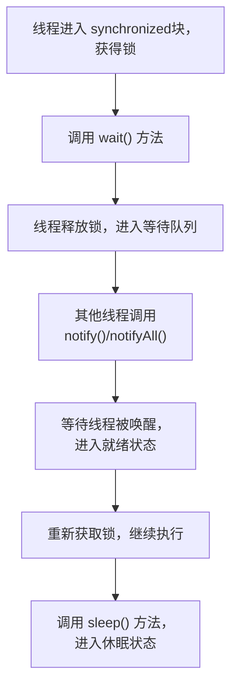

# 6. 常见方法

## 1. 概述与定义

在 Java 并发编程中，线程之间的协作与同步十分重要。为了实现线程之间的等待、通知与定时休眠，Java 提供了三种常用方法： &#x20;

- **wait()**：属于 Object 类，用于让当前线程在调用该对象的监视器（monitor）上等待，直到其他线程调用 notify 或 notifyAll 方法唤醒。 &#x20;
- **notify() / notifyAll()**：同样属于 Object 类，通知在该对象上等待的线程继续执行。其中 notify() 随机唤醒一个等待线程，而 notifyAll() 唤醒所有等待线程。 &#x20;
- **sleep()**：属于 Thread 类，用于让当前线程休眠指定时间，不释放锁，与线程同步机制无直接关系。 &#x20;

这些方法都是实现线程间通信的重要手段。wait 和 notify 是基于对象监视器机制工作的，必须在 synchronized 块或方法中使用；而 sleep 是静态方法，可以在任何地方调用。它们共同构成了线程协作与调度的重要基础，为构建高效并发程序提供了核心工具。😊

## 2. 主要特点

下面归纳了这三种方法的主要特点和区别：

1. **wait() 方法** &#x20;
   - 隶属于 Object 类，是一种让线程等待的机制。 &#x20;
   - 必须在 synchronized 代码块中调用，否则会抛出 IllegalMonitorStateException。 &#x20;
   - 调用后线程释放当前  对象的锁，并进入等待队列，直到被 notify 或 notifyAll 唤醒。 &#x20;
   - 可以通过带超时参数的方法实现定时等待。 &#x20;
2. **notify() 和 notifyAll() 方法** &#x20;
   - 也是 Object 类的方法，同样必须在 synchronized 块中调用。 &#x20;
   - notify() 随机唤醒一个等待线程，而 notifyAll() 唤醒所有在该对象监视器上等待的线程。 &#x20;
   - 唤醒后线程不会立即获得锁，必须等待当前线程退出 synchronized 块后才能竞争锁。 &#x20;
3. **sleep() 方法** &#x20;
   - 隶属于 Thread 类，用于让线程休眠指定的时间。 &#x20;
   - 调用 sleep() 不会释放锁，即使在 synchronized 块内调用。 &#x20;
   - 休眠期间线程处于 TIMED\_WAITING 状态，休眠结束后进入就绪状态。 &#x20;
   - 可用于模拟延时、节流或实现简单的计时器功能。 &#x20;

下面的表格对这三种方法的主要特点进行了归纳说明：

| 方法                   | 所属类    | 必须在 synchronized 块中调用 | 是否释放锁                     | 主要用途                            |
| -------------------- | ------ | --------------------- | ------------------------- | ------------------------------- |
| wait()               | Object | 是                     | 释放当前锁                     | 使线程等待，直到被 notify 或 notifyAll 唤醒 |
| notify()/notifyAll() | Object | 是                     | 不释放锁（直到退出 synchronized 块） | 唤醒等待线程，协调线程间通信                  |
| sleep()              | Thread | 否                     | 不释放锁                      | 使线程休眠指定时间，用于模拟延时或节流             |

## 3. 应用目标

掌握 wait、notify、sleep 这三种方法，主要目标在于实现线程间的高效协作与合理调度，其具体应用目标包括：

1. **实现线程同步与协作** &#x20;
   - 通过 wait 和 notify，可以使得多个线程在共享资源上的操作达到协同工作。例如，在生产者–消费者模型中，生产者生产数据后调用 notify() 唤醒消费者，而消费者在没有数据时调用 wait() 等待数据到来。 &#x20;
   - 这种机制使得程序能够有效避免忙等待，提高 CPU 利用率。 &#x20;
2. **构建高效的并发程序** &#x20;
   - 通过 sleep() 方法，可以控制线程休眠时间，避免线程占用过多 CPU 资源，从而使系统在高并发环境下保持平稳运行。 &#x20;
   - 合理利用 sleep() 可用于实现定时任务或任务延时启动，协调线程之间的执行顺序。 &#x20;
3. **减少资源竞争与避免死锁** &#x20;
   - 使用 wait 和 notify 结合 synchronized 机制，可以在多个线程竞争共享资源时，通过协调让线程等待和唤醒，降低资源争用和死锁风险。 &#x20;
   - 同时，通过合理设计线程协作机制，确保线程在获取锁后能够按预期顺序执行。 &#x20;
4. **任务调度与延时执行** &#x20;
   - 线程的 sleep() 方法常用于实现延时任务或周期性任务，确保系统在特定时间后执行某项操作。 &#x20;
   - 这种机制可以用于实现定时器、节流控制和后台监控等功能。 &#x20;

总之，wait、notify、sleep 方法在 Java 并发编程中具有重要地位，通过合理使用它们可以提高系统的并发性能、实现线程间协作与同步，并满足各种复杂业务逻辑的需求。🎯

## 4. 主要内容及其组成部分

这一部分详细介绍 wait、notify、sleep 这三种方法的使用细节和组成部分，包括使用场景、参数说明、代码示例等。

### 4.1 wait() 方法

**基本语法与用法** &#x20;

- 无参数的 wait() 方法：使当前线程无限期等待，直到被其他线程唤醒。 &#x20;
- 带超时参数的 wait(long timeout)：使当前线程等待指定的毫秒数，超时后自动唤醒。

**使用要求** &#x20;

- 必须在 synchronized 块中调用，调用时当前线程必须拥有对象监视器，否则会抛出 IllegalMonitorStateException。

**示例代码**：

```java 
synchronized (sharedObject) {
    try {
        System.out.println("线程进入等待状态...");
        sharedObject.wait();  // 无限期等待，直到被 notify 唤醒
        System.out.println("线程被唤醒...");
    } catch (InterruptedException e) {
        e.printStackTrace();
    }
}
```


**注意事项** &#x20;

- 在调用 wait() 后，线程会释放当前对象的锁，进入等待队列。 &#x20;
- 被唤醒后，线程仍需重新竞争锁才能继续执行。

### 4.2 notify() 与 notifyAll() 方法

**基本语法与用法** &#x20;

- notify()：随机唤醒一个在当前对象监视器上等待的线程。 &#x20;
- notifyAll()：唤醒所有等待当前对象监视器的线程。

**使用要求** &#x20;

- 同样必须在 synchronized 块中调用，调用时当前线程必须持有该对象的锁。

**示例代码**：

```java 
synchronized (sharedObject) {
    // 执行完毕后，唤醒等待该对象的一个线程
    sharedObject.notify();
    // 或者唤醒所有等待该对象的线程
    // sharedObject.notifyAll();
}
```


**注意事项** &#x20;

- notify() 唤醒后，被唤醒的线程不会立即获得锁，必须等当前线程退出同步块后才能竞争。 &#x20;
- notifyAll() 适用于多个线程需要同时被唤醒的场景，如生产者消费者模型中当缓冲区空或满时。

### 4.3 sleep() 方法

**基本语法与用法** &#x20;

- sleep(long millis)：使当前线程休眠指定的毫秒数。 &#x20;
- sleep(long millis, int nanos)：使当前线程休眠指定的毫秒数和纳秒数。

**使用要求** &#x20;

- sleep() 是静态方法，可以在任何地方调用，不依赖于 synchronized 块。
- 在调用 sleep() 时，线程不会释放已持有的锁。

**示例代码**：

```java 
try {
    System.out.println("线程开始休眠...");
    Thread.sleep(2000);  // 休眠2秒
    System.out.println("线程休眠结束...");
} catch (InterruptedException e) {
    e.printStackTrace();
}
```


**注意事项** &#x20;

- sleep() 方法主要用于控制线程延时执行，不用于线程间通信。 &#x20;
- 休眠期间线程处于 TIMED\_WAITING 状态，休眠结束后会进入就绪状态等待 CPU 调度。

## 5. 原理剖析

深入剖析 wait、notify、sleep 方法的底层原理，有助于理解其内部工作机制及性能影响。

### 5.1 对象监视器与锁机制

- 每个 Java 对象都有一个内部监视器（monitor），用于实现线程同步机制。 &#x20;
- 当线程进入 synchronized 块时，会自动获取对应对象的监视器锁。 &#x20;
- 调用 wait() 方法时，线程会释放该对象的锁，进入该对象的等待队列；而调用 notify()/notifyAll() 则会从等待队列中唤醒线程。

### 5.2 wait() 方法内部实现

- 当线程调用 wait() 方法时，JVM 会将当前线程加入到该对象的等待队列中，并将线程状态改为 WAITING 或 TIMED\_WAITING（带超时时）。 &#x20;
- 线程在等待队列中处于挂起状态，直到其他线程调用 notify 或 notifyAll 唤醒。 &#x20;
- 被唤醒的线程会从等待队列中移除，并重新进入就绪状态，但必须等待重新获得锁后才能继续执行。

### 5.3 notify() 与 notifyAll() 的工作原理

- notify() 随机唤醒等待队列中的一个线程，notifyAll() 唤醒所有等待线程。 &#x20;
- 被唤醒的线程并不会立刻执行，而是进入就绪状态，等待锁被释放。 &#x20;
- 唤醒顺序不固定，因此设计时应避免依赖特定唤醒顺序。

### 5.4 sleep() 方法的实现机制

- sleep() 方法内部调用操作系统级的休眠函数，使线程进入 TIMED\_WAITING 状态。 &#x20;
- 与 wait() 不同，sleep() 不会释放当前持有的锁。 &#x20;
- 休眠结束后，线程自动进入就绪状态，由调度器重新分配 CPU 时间片。

### 5.5 性能与同步开销

- 调用 wait 和 notify 会涉及线程状态的切换和上下文保存，其开销较小于进程切换但仍不可忽略。 &#x20;
- sleep() 方法由于不会释放锁，可能导致其他线程长时间等待，因此应谨慎使用。 &#x20;
- 合理设计同步区域和减少不必要的阻塞可有效降低上下文切换和同步开销。

下面使用 Mermaid 图展示 wait、notify 与 sleep 的内部工作流程：




图中展示了线程如何在获得锁后通过 wait() 释放锁，进入等待状态，再通过 notify 被唤醒后重新获取锁继续执行；同时也展示了线程调用 sleep() 进入休眠的流程。

## 6. 应用与拓展

理解并掌握 wait、notify、sleep 这三种常用方法不仅有助于实现线程间的协调与同步，还能为构建高性能并发程序提供思路。下面介绍一些应用与拓展方向：

### 6.1 生产者–消费者模型

- 在生产者–消费者模型中，使用 wait 和 notify 协调生产者与消费者的工作。 &#x20;
- 当缓冲区满时，生产者调用 wait() 使自己等待；当缓冲区有空位时，消费者调用 notify() 唤醒生产者。 &#x20;
- 这种方式避免了忙等待，有效提升了系统性能。

### 6.2 定时任务与节流

- 利用 sleep() 方法可以实现定时任务或节流控制，例如定时检测系统状态、定时刷新缓存等。 &#x20;
- 同时，sleep() 可用于模拟任务延时启动，平衡系统负载。

### 6.3 替代方案与高级并发工具

- 除了传统的 wait/notify 机制，Java 5 以后引入了 Lock 和 Condition 接口，实现了更灵活的线程同步。 &#x20;
- Condition 提供了类似于 Object 的 wait/notify 方法，但可以创建多个等待队列，便于实现复杂的同步控制。 &#x20;
- 例如，使用 ReentrantLock 配合 Condition 的 await() 和 signal() 方法，可以实现更细粒度的线程协作。

### 6.4 线程调试与监控

- 通过对线程状态的监控（如使用 jconsole、VisualVM 等工具），可以观察线程的等待状态、休眠状态及锁争用情况，帮助定位性能瓶颈。 &#x20;
- 同时，在设计并发系统时，可以结合日志记录和监控指标，实时跟踪 wait 与 notify 的使用情况，确保线程协调正常运行。

下面的表格展示了 wait、notify、sleep 与 Condition 的对比，便于理解各自优缺点：

| 方法/接口                      | 所属类别           | 是否释放锁       | 用途                        | 优点                      |
| -------------------------- | -------------- | ----------- | ------------------------- | ----------------------- |
| wait()/notify()            | Object 方法      | wait() 释放锁  | 线程间等待与唤醒                  | 简单、直观，适用于基本同步需求         |
| sleep()                    | Thread 方法      | 不释放锁        | 控制线程休眠时间，模拟延时任务           | 使用方便，适合简单定时任务           |
| Condition.await()/signal() | Lock/Condition | await() 释放锁 | 替代 wait/notify，实现更灵活的同步控制 | 可创建多个等待队列，支持精细化锁控制，功能更强 |

## 7. 面试问答

下面整理了五个常见面试问题及详细回答，从面试者角度出发帮助你在面试中从容回答有关线程常见方法的考察问题。

### 问题1：请简述 wait、notify 和 sleep 方法的主要区别及使用场景？

答： &#x20;
wait 和 notify 方法是 Object 类的方法，必须在 synchronized 块中调用，用于线程间的协作，wait() 使线程释放锁进入等待状态，notify()/notifyAll() 用于唤醒等待线程。而 sleep() 是 Thread 类的静态方法，可在任何地方调用，作用是使线程休眠指定时间，但不会释放锁。一般来说，wait/notify 用于实现生产者–消费者模型等同步场景，而 sleep() 用于实现延时操作和简单计时。

### 问题2：在调用 wait() 方法时，线程会释放锁吗？被唤醒后会立即获得锁吗？

答： &#x20;
调用 wait() 方法时，线程会释放当前对象的锁，并进入该对象的等待队列。被 notify 或 notifyAll 唤醒后，线程会进入就绪状态，但不会立即获得锁，必须等待当前持有锁的线程退出 synchronized 块后，竞争锁成功后才能继续执行。

### 问题3：请说明 notify() 与 notifyAll() 的区别，以及在什么情况下应该使用 notifyAll()？

答： &#x20;
notify() 只会随机唤醒一个在当前对象监视器上等待的线程，而 notifyAll() 则唤醒所有等待该对象监视器的线程。一般在多个线程均可能需要被唤醒时，使用 notifyAll() 更安全，以防止因 notify() 唤醒的线程不符合条件而导致死锁或长时间等待。

### 问题4：为什么在使用 sleep() 方法时，线程不会释放持有的锁？这种特性会带来哪些潜在问题？

答： &#x20;
sleep() 方法只是让线程暂停执行指定时间，并不会释放线程当前持有的锁，因此即使线程休眠，其他需要该锁的线程也无法获取锁，可能导致系统资源争用和响应延迟。需要谨慎在 synchronized 块内使用 sleep()，以避免不必要的阻塞。

### 问题5：在多线程环境中，除了 wait/notify，还有哪些替代方案？它们相比传统方法有哪些优势？

答： &#x20;
Java 5 引入了 Lock 和 Condition 接口，它们提供了更灵活的同步控制。Condition 的 await() 和 signal() 方法功能类似于 wait 和 notify，但可以创建多个等待队列，实现更精细的锁控制。此外，还有 CountDownLatch、Semaphore、CyclicBarrier 等并发工具，能更好地协调线程之间的执行。相比 wait/notify，这些工具具有更高的灵活性和可控性，并且更易于实现复杂的并发逻辑。

───────────────────────────── &#x20;

## 总结

本文从概述与定义、主要特点、应用目标、主要内容及其组成部分、原理剖析、应用与拓展以及面试问答七个部分，全面解析了 Java 线程创建方式中的常见方法 wait、notify 与 sleep 的使用和原理。我们详细介绍了每种方法的定义、使用场景、关键点及优缺点，并结合代码示例、表格和 Mermaid 图表展示了它们的内部工作流程和底层实现原理。通过这些内容，你可以了解如何利用这些方法实现线程同步与协作、控制线程延时，以及在高并发场景下如何合理使用同步机制。同时，面试问答部分提供了常见问题及回答思路，帮助你在面试中从容应对关于线程方法的各项考察。

希望这篇文章能为你在面试复习和项目开发中提供充分支持，助你构建出高效、稳定的并发系统。加油！🚀
