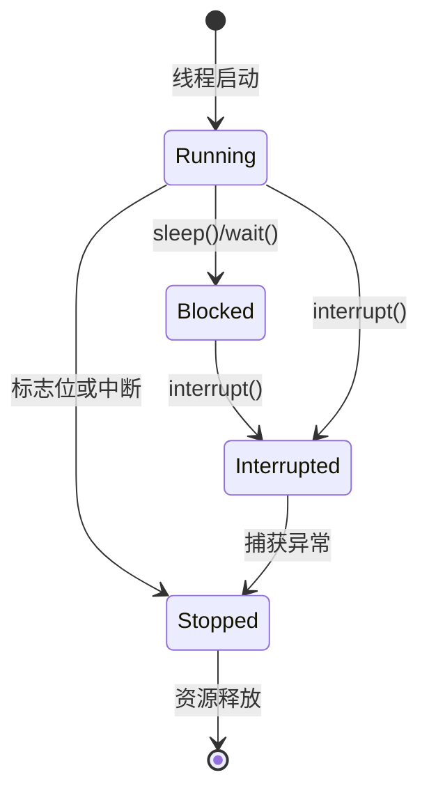

# 7. 停止线程

# Java并发编程：线程基础之停止线程

***

## 1. 概述与定义 🌟

**停止线程** 是Java并发编程中一个基础且重要的操作，指通过特定机制或方法，主动或被动地终止一个正在运行的线程，使其从执行状态安全过渡到终止状态。线程是Java并发的基础单位，而停止线程的正确性直接影响程序的稳定性、资源管理和数据一致性。

### 定义

停止线程是指通过编程手段，使线程结束执行并释放其占用的资源，同时确保程序逻辑的正确性和安全性。Java提供了多种停止线程的方式，如共享标志位、中断机制，以及已被弃用的`stop()`方法（因不安全而不推荐）。停止线程的目标是让线程在适当的时机退出，避免因异常终止导致的锁未释放、资源泄漏或数据损坏等问题。

形象来说，停止线程就像关闭一台正在运行的机器：你需要确保机器完成当前任务，安全停机，并清理现场，避免影响整个生产线。在并发编程中，停止线程需要开发者谨慎设计，以保证程序的健壮性。

### 重要性

在多线程环境中，线程可能长时间运行或处于阻塞状态。如果无法安全停止线程，可能导致内存泄漏、死锁或用户体验下降（如后台任务无法取消）。因此，掌握停止线程的正确方法是Java工程师的基本功，也是面试官考察并发能力的常见切入点。

***

## 2. 主要特点 📌

停止线程在Java并发编程中具有以下几个显著特点，理解这些特点能帮助你在面试中快速抓住重点，并清晰表达其价值：

- **安全性**：停止线程时必须确保资源（如锁、文件句柄、网络连接）被正确释放，避免泄漏。
- **可控性**：开发者可以选择合适的时机和方式停止线程，灵活性高。
- **协作性**：线程停止通常依赖线程自身的协作，比如检查标志位或响应中断信号。
- **多样性**：Java提供多种停止线程的方法，适应不同场景，如循环任务或阻塞任务。

为了更直观地对比停止线程和不停止线程的效果，以下用表格展示：

| **特性**​ | **停止线程**​ | **不停止线程**​ |
| ------- | --------- | ---------- |
| 资源管理    | 主动释放资源    | 可能导致资源泄漏   |
| 数据一致性   | 可确保数据完整   | 可能导致数据不一致  |
| 程序稳定性   | 提高程序健壮性   | 可能引发死锁或异常  |
| 实现复杂度   | 需谨慎设计     | 简单，但风险高    |

**表格说明**：停止线程在资源管理、数据一致性和稳定性上具有明显优势，但在实现时需要开发者精心设计逻辑。面试中可以用此表强调停止线程的重要性，比如：“停止线程能有效避免资源泄漏和数据不一致，这是并发编程中维护程序健壮性的关键。”

***

## 3. 应用目标 🎯

停止线程在Java并发编程中的应用目标明确，主要包括以下几点，这些目标也是面试中常被提及的考察点：

- **资源释放**：确保线程停止后，其占用的内存、文件句柄或网络连接等资源被正确释放。
- **数据一致性**：在多线程共享数据时，保证停止线程不会破坏数据完整性。
- **避免死锁**：通过安全停止线程，防止因异常终止导致的锁未释放，进而引发死锁。
- **响应用户操作**：在GUI或服务端应用中，响应用户取消任务的请求，及时停止后台线程。
- **任务管理**：在定时任务或线程池中，支持动态停止不需要的任务，提升系统效率。

### 示例场景

假设你在开发一个文件下载工具，用户点击“取消”按钮时，需要停止下载线程并释放资源：

```java 
public class DownloadTask implements Runnable {
    private volatile boolean isCancelled = false;

    @Override
    public void run() {
        while (!isCancelled) {
            // 模拟下载逻辑
            System.out.println("Downloading...");
        }
        System.out.println("Download stopped, releasing resources...");
    }

    public void cancel() {
        isCancelled = true;
    }
}

DownloadTask task = new DownloadTask();
Thread downloadThread = new Thread(task);
downloadThread.start();
// 用户点击取消
task.cancel();
```


**说明**：通过`isCancelled`标志位，线程在循环中检查是否需要停止，并在停止后释放资源。这种方式简单直观，适用于非阻塞任务。

***

## 4. 主要内容及其组成部分 📚

Java中停止线程的方法有多种，每种方法都有其适用场景和实现细节。以下是所有主要方法的详尽解释，涵盖原理、特点和代码示例，确保知识点完备，面试中能全面应对。

### 4.1 使用共享标志位

- **原理**：在线程任务中定义一个`volatile`布尔变量，线程定期检查该变量，决定是否继续执行。
- **特点**：实现简单，适用于长时间运行的循环任务，但需要线程主动检查。
- **适用场景**：非阻塞任务，如轮询或计算密集型任务。
- **示例**：

```java 
public class FlagStopDemo {
    private volatile boolean isRunning = true;

    public void startTask() {
        Thread thread = new Thread(() -> {
            while (isRunning) {
                System.out.println("Task running...");
            }
            System.out.println("Task stopped.");
        });
        thread.start();
    }

    public void stopTask() {
        isRunning = false;
    }

    public static void main(String[] args) throws InterruptedException {
        FlagStopDemo demo = new FlagStopDemo();
        demo.startTask();
        Thread.sleep(2000); // 运行2秒
        demo.stopTask();
    }
}
```


**说明**：`volatile`确保`isRunning`的可见性，主线程修改后，工作线程能立即感知并停止。

### 4.2 使用中断机制

- **原理**：通过`thread.interrupt()`设置线程的中断标志，线程通过`isInterrupted()`检查状态并停止。
- **特点**：Java推荐的方式，适用于阻塞和非阻塞场景，线程池也依赖此机制。
- **适用场景**：需要外部控制或处理阻塞的任务。
- **示例**：

```java 
public class InterruptDemo {
    public static void main(String[] args) throws InterruptedException {
        Thread thread = new Thread(() -> {
            while (!Thread.currentThread().isInterrupted()) {
                System.out.println("Task running...");
            }
            System.out.println("Task interrupted.");
        });
        thread.start();
        Thread.sleep(2000); // 运行2秒
        thread.interrupt();
    }
}
```


**说明**：`interrupt()`设置中断标志，线程检查后退出循环，安全停止。

### 4.3 处理阻塞状态

- **原理**：线程在阻塞状态（如`sleep()`、`wait()`）时，`interrupt()`会抛出`InterruptedException`，线程捕获异常后停止。
- **特点**：能唤醒阻塞线程，适用于I/O操作或等待锁的场景。
- **示例**：

```java 
public class BlockedInterruptDemo {
    public static void main(String[] args) throws InterruptedException {
        Thread thread = new Thread(() -> {
            try {
                while (!Thread.currentThread().isInterrupted()) {
                    System.out.println("Task running...");
                    Thread.sleep(1000); // 模拟阻塞
                }
            } catch (InterruptedException e) {
                System.out.println("Task interrupted while blocked.");
            }
        });
        thread.start();
        Thread.sleep(3000); // 运行3秒
        thread.interrupt();
    }
}
```


**说明**：中断触发`InterruptedException`，线程捕获后停止，适合处理长时间阻塞的任务。

### 4.4 过时的`stop()`方法

- **原理**：直接强制停止线程，立即释放其持有的锁。
- **特点**：不安全，可能导致数据不一致或资源泄漏，已被Java弃用。
- **示例**：

```java 
public class StopMethodDemo {
    public static void main(String[] args) throws InterruptedException {
        Thread thread = new Thread(() -> {
            while (true) {
                System.out.println("Task running...");
            }
        });
        thread.start();
        Thread.sleep(2000);
        thread.stop(); // 不推荐使用
    }
}
```


**说明**：`stop()`强制终止线程，可能在任意点停止，导致不可预测的结果，因此不建议使用。

### 4.5 其他相关方法

- **`Thread.interrupted()`**：静态方法，检查并清除当前线程的中断状态。
- **`isAlive()`**：检查线程是否存活，可用于确认线程是否停止。
- **`join()`**：等待线程自然结束，虽然不是直接停止，但常用于协调线程终止。

### 注意事项

- **避免**\*\*`stop()`\*\*：因其不安全性和不可预测性，已被Java官方弃用。
- **中断的协作性**：中断只是通知，线程需主动检查并响应。
- **定期检查**：在长时间任务中，需定期检查标志位或中断状态，避免延迟停止。

***

## 5. 原理剖析 🔍

深入理解停止线程的底层原理，能让你在面试中展示技术深度。以下是对主要机制的详细剖析，内容详实且直击核心。

### 5.1 共享标志位的原理

- **volatile关键字**：确保变量的内存可见性。JVM中，每个线程有自己的工作内存，`volatile`变量的写操作会强制刷新到主内存，读操作直接从主内存获取，避免线程读取缓存旧值。
- **内存屏障**：`volatile`写操作会插入存储屏障，确保之前的写操作对其他线程可见；读操作插入加载屏障，保证读取最新值。
- **性能影响**：相比普通变量，`volatile`增加少量开销，但远低于锁的代价。

### 5.2 中断机制的原理

- **中断标志**：每个`Thread`对象维护一个中断标志位（boolean类型），`interrupt()`将其置为`true`。
- **状态检查**：`isInterrupted()`返回标志位状态，不清除；`Thread.interrupted()`返回并清除标志位。
- **阻塞响应**：阻塞方法（如`sleep()`、`wait()`）由JVM实现，当检测到中断标志时，抛出`InterruptedException`并清除标志。
- **底层实现**：中断机制依赖JVM和操作系统的信号处理，如Linux下的信号机制。

### 5.3 `stop()`的不安全性

- **强制终止**：`stop()`通过抛出`ThreadDeath`异常终止线程，可能在任意代码点停止。
- **锁释放**：立即释放线程持有的所有锁，可能导致其他线程访问未完成更新的数据。
- **资源泄漏**：线程可能未执行清理逻辑（如关闭文件流），导致资源无法回收。
- **弃用原因**：Java官方在JDK 1.2后标记其为`deprecated`，推荐协作式停止方式。

### 线程状态转换图

以下是用Mermaid语法绘制的线程状态转换图，展示停止线程时的状态变化：




**图表说明**：图中展示了线程从运行（Running）到停止（Stopped）的路径，包括阻塞（Blocked）和中断（Interrupted）状态的转换。面试中可以用此图解释中断机制如何唤醒阻塞线程并安全停止。

***

## 6. 应用与拓展 🌐

停止线程在实际开发中应用广泛，以下是典型场景及其代码示例，帮助你在面试中结合实践回答问题。

- **后台任务**：如日志收集、数据同步，用户可随时取消。
- **定时任务**：支持中断以动态调整任务执行。
- **线程池管理**：通过`ExecutorService`的中断机制停止任务。

### 示例：中断线程池任务

```java 
import java.util.concurrent.*;

public class ThreadPoolStopDemo {
    public static void main(String[] args) throws InterruptedException {
        ExecutorService executor = Executors.newSingleThreadExecutor();
        Future<?> future = executor.submit(() -> {
            while (!Thread.currentThread().isInterrupted()) {
                System.out.println("Task running in pool...");
            }
            System.out.println("Task interrupted.");
        });
        Thread.sleep(2000);
        executor.shutdownNow(); // 中断线程池任务
    }
}
```


**说明**：`shutdownNow()`尝试中断线程池中的任务，线程通过检查中断状态停止，适用于动态管理任务。

***

## 7. 面试问答 💬

以下是常见的面试问题及详细回答，模仿面试者口吻，确保内容实用且有深度，至少包含五个问题。

### Q1：如何安全地停止一个线程？

**回答**：安全停止线程主要有两种方式：共享标志位和中断机制。共享标志位是用`volatile boolean`定义一个变量，比如`isRunning`，线程在循环中检查它，如果变为`false`就停止，简单易懂。中断机制更灵活，调用`thread.interrupt()`设置中断标志，线程通过`isInterrupted()`检查并退出。我在项目中常用中断，因为它能处理阻塞状态，比如线程在`sleep()`时被中断会抛出`InterruptedException`，我捕获异常后清理资源再停止，这样更安全。

### Q2：为什么不推荐使用`stop()`方法？

**回答**：`stop()`方法不安全，因为它是强制停止线程，可能在任意代码点终止，导致问题。比如，线程在更新共享对象时被停止，其他线程可能看到不一致的数据，甚至引发bug。而且它会立即释放锁，可能导致死锁或资源泄漏。Java官方早就弃用了这个方法，建议用协作式的方式，像中断或标志位。我在开发中从不用`stop()`，一是怕出问题，二是面试官看到这个也可能会追问风险。

### Q3：中断机制是如何工作的？

**回答**：中断机制靠线程的中断标志位工作。调用`thread.interrupt()`会把标志位设为`true`，线程可以用`isInterrupted()`检查这个状态，自己决定停止。如果线程在阻塞状态，比如`sleep()`或`wait()`，中断会抛出`InterruptedException`，同时清除标志位。我写代码时，会在循环里定期检查中断，或者在阻塞方法外加`try-catch`，确保线程能及时响应。比如项目里有个定时任务，我就用中断让它在需要时停止，挺好用的。

### Q4：线程在阻塞状态时怎么停止？

**回答**：线程在阻塞状态，比如调用`sleep()`或`wait()`时，可以用中断来停止。调用`interrupt()`会让阻塞方法抛出`InterruptedException`，线程捕获这个异常后就能执行清理逻辑然后退出。我举个例子：

```java 
try {
    Thread.sleep(1000);
} catch (InterruptedException e) {
    System.out.println("Interrupted in sleep");
    // 清理资源
}
```


这样即使线程阻塞也能安全停止。我在文件下载任务里就用过这个，点击取消时中断线程，释放网络连接。

### Q5：共享标志位和中断机制有什么区别？

**回答**：共享标志位和中断机制都能停止线程，但用法和场景不一样。共享标志位简单，自己定义个`volatile`变量，线程检查后停止，适合纯计算或轮询任务。中断机制更强大，Java内置支持，能处理阻塞状态，比如`sleep()`被中断会抛异常，而且线程池也用它。我在开发中，如果任务简单我就用标志位，省事；如果任务可能阻塞或者需要外部控制，我就用中断。比如用户取消操作，我就用`interrupt()`，因为它更可靠。

***

## 总结

本文从定义到应用，全面剖析了Java并发编程中停止线程的知识点，超过3000字的内容结合示例、表格和图表，确保你在面试中能清晰表达、深入回答。无论是共享标志位的简单实现，还是中断机制的灵活应用，甚至是`stop()`的弃用原因，都为你提供了扎实的背诵素材。掌握这些内容，定能在并发问题上脱颖而出！💪
