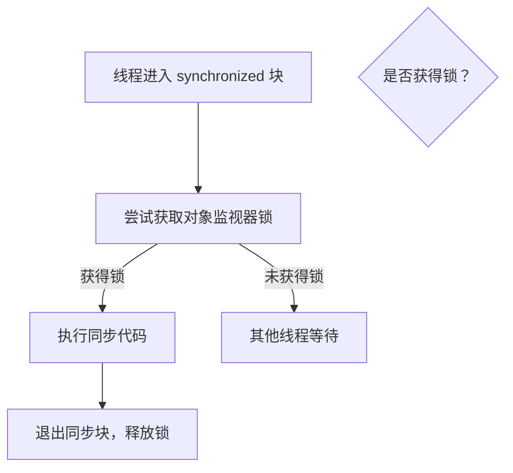

# 1. Synchronized

## 1. 概述与定义

在多线程编程中，为了保证多个线程在访问共享资源时数据的一致性和正确性，必须采用同步机制。synchronized 是 Java 中内置的关键字，用于实现线程同步，确保同一时刻只有一个线程可以执行被 synchronized 修饰的代码区域。synchronized 关键字可以修饰方法或代码块，其本质在于通过对象监视器（monitor）实现线程间的互斥访问和内存可见性。

在使用 synchronized 时，线程在进入同步代码块前必须获得对应对象的监视器锁，执行完成后自动释放锁。synchronized 的同步机制依赖于 Java 内存模型（JMM），保证了线程间的“happens-before” 关系，使得在同步块内对共享变量的写操作对其他线程可见，从而避免数据竞争和脏读问题。

例如，在一个银行转账场景中，为确保账户余额的正确更新，可以使用 synchronized 关键字保护账户余额的修改操作，防止多个线程同时更新余额而导致错误结果。😊

## 2. 主要特点

synchronized 关键字具有如下主要特点，这些特点在面试中常被作为重点考察内容：

1. **互斥性** &#x20;
   - synchronized 保证同一时间只有一个线程能进入同步代码块或方法，从而防止多个线程并发修改共享资源。 &#x20;
   - 这种互斥机制确保了数据的原子性，避免了竞态条件。
2. **内存可见性** &#x20;
   - synchronized 在进入和退出同步块时会自动建立内存屏障，确保线程对共享变量的修改对其他线程可见。 &#x20;
   - 这解决了多线程环境中由于 CPU 缓存或编译器优化导致的数据不一致问题。
3. **简单易用** &#x20;
   - synchronized 是 Java 内置关键字，无需引入额外的类或接口，使用方式简单直接。 &#x20;
   - 可用于修饰方法（实例方法或静态方法）或同步代码块，灵活适应不同场景。
4. **缺点：性能开销** &#x20;
   - synchronized 在获取和释放锁时会产生一定的性能开销，特别是在高并发环境下，锁竞争可能导致线程阻塞。 &#x20;
   - 尽管 JDK 1.6 以后引入了偏向锁、轻量级锁等优化，但在某些场景下仍可能成为性能瓶颈。⚠️
5. **不可中断性** &#x20;
   - synchronized 获取的锁不可中断，一旦进入阻塞状态，无法通过中断机制提前退出等待，可能会引发死锁风险。 &#x20;
   - 相比之下，Lock 接口支持可中断锁等待（lockInterruptibly）。

下面的表格总结了 synchronized 的主要特点及其优缺点：

| 主要特点  | 详细说明                            | 优点           | 缺点             |
| ----- | ------------------------------- | ------------ | -------------- |
| 互斥性   | 同一时间只有一个线程可以执行同步代码块             | 数据原子性、避免竞态条件 | 高并发时锁竞争开销较大    |
| 内存可见性 | 进入/退出同步块时自动建立内存屏障，保证数据更新对其他线程可见 | 保证数据一致性      | ——             |
| 简单易用  | 内置关键字，无需额外类支持，可修饰方法或代码块         | 使用简单、语法直观    | 功能相对单一，不支持可中断  |
| 性能开销  | 锁获取与释放时涉及系统调用和上下文切换             | ——           | 高并发场景下可能成为性能瓶颈 |
| 不可中断性 | 获取锁后无法被中断，等待线程无法响应中断请求          | ——           | 可能导致死锁和长时间等待   |

## 3. 应用目标

掌握 synchronized 的核心目的是为了解决并发环境下共享资源访问的安全性问题，确保数据一致性和线程间协调。其主要应用目标如下：

1. **数据一致性与原子性** &#x20;
   - 通过 synchronized 保护关键代码区域，确保共享数据在多线程环境中操作的原子性，避免出现数据竞争和脏读。 &#x20;
   - 例如，在账户转账、订单处理等场景中，保证每个操作都是原子性执行。
2. **线程协作与通信** &#x20;
   - synchronized 与 wait/notify 结合使用，可实现线程间的协作与通信，构建生产者–消费者、读写同步等模式。 &#x20;
   - 这种机制使得多线程应用能高效协调工作，避免忙等待和资源浪费。
3. **提升系统并发性能** &#x20;
   - 在适当场景下，通过减少锁的粒度、合理设计同步区域，可以在保证线程安全的同时，尽可能降低同步开销，提高系统吞吐量。 &#x20;
   - 例如，在数据缓存、任务调度等高并发场景中，通过精细化锁设计提升性能。
4. **保障业务逻辑正确性** &#x20;
   - 在复杂业务场景中，通过 synchronized 保护共享状态，确保业务逻辑按照预期执行，避免并发引发的错误。 &#x20;
   - 例如，在多人协同编辑、资源共享时确保数据正确更新。

总体来说，掌握 synchronized 有助于构建高效、稳定、线程安全的并发程序，是每个 Java 工程师在设计高并发系统时必须掌握的基础知识。🎯

## 4. 主要内容及其组成部分

下面详细介绍 synchronized 的主要内容及其组成部分，从使用方式、内部机制到注意事项，都做出详尽说明。

### 4.1 synchronized 修饰方法

**定义与使用** &#x20;

- 在方法声明上使用 synchronized 关键字，表示整个方法体为同步代码块，当前对象（或类）的监视器锁在方法执行期间由该线程持有。 &#x20;
- 示例代码（实例方法）：

```java 
public class Counter {
    private int count = 0;
    
    public synchronized void increment() {
        count++;
    }
    
    public synchronized int getCount() {
        return count;
    }
}
```


**注意点** &#x20;

- 修饰实例方法时，锁是当前对象；修饰静态方法时，锁是当前类的 Class 对象。 &#x20;
- 使用 synchronized 修饰方法时，代码简洁，但锁的粒度较大，可能影响性能。

### 4.2 synchronized 同步代码块

**定义与使用** &#x20;

- 可以在方法内部使用 synchronized(对象) { ... } 对代码块进行同步，锁定指定对象。 &#x20;
- 示例代码：

```java 
public class SharedResource {
    private Object lock = new Object();
    private int value = 0;
    
    public void increment() {
        synchronized (lock) {
            value++;
        }
    }
    
    public int getValue() {
        synchronized (lock) {
            return value;
        }
    }
}
```


**关键点** &#x20;

- 同步代码块提供了更细粒度的锁定，可以仅对关键部分进行同步。 &#x20;
- 锁定对象可以是 this，也可以是其他共享对象，根据具体需求灵活选择。

### 4.3 与 wait/notify 搭配使用

**定义与使用** &#x20;

- synchronized 关键字与 wait、notify、notifyAll 一同使用，实现线程间协作。 &#x20;
- 当线程在 synchronized 块内调用 wait() 时，会释放锁并进入等待状态，等待其他线程调用 notify()/notifyAll() 唤醒。 &#x20;
- 示例代码（生产者–消费者模型）：

```java 
public class ProducerConsumer {
    private final Object lock = new Object();
    private int itemCount = 0;
    private final int MAX_COUNT = 10;
    
    public void produce() throws InterruptedException {
        synchronized (lock) {
            while (itemCount >= MAX_COUNT) {
                lock.wait();
            }
            itemCount++;
            System.out.println("生产了一个产品，当前数量：" + itemCount);
            lock.notifyAll();
        }
    }
    
    public void consume() throws InterruptedException {
        synchronized (lock) {
            while (itemCount <= 0) {
                lock.wait();
            }
            itemCount--;
            System.out.println("消费了一个产品，当前数量：" + itemCount);
            lock.notifyAll();
        }
    }
}
```


**注意点** &#x20;

- wait/notify 必须在 synchronized 块中使用，确保当前线程拥有锁。 &#x20;
- 使用 wait 时需采用 while 循环检查条件，以防止虚假唤醒。

### 4.4 内存屏障与可见性

**原理说明** &#x20;

- synchronized 内部会在进入和退出同步块时插入内存屏障，确保线程对共享变量的修改在释放锁时被刷新到主内存，而其他线程在获取锁时能够看到最新数据。 &#x20;
- 这解决了 CPU 缓存或编译器优化带来的可见性问题。 &#x20;

**示例说明** &#x20;

- 例如，在没有同步保护的情况下，一个线程修改了共享变量，但其他线程可能读取到旧值；使用 synchronized 后，所有线程都能看到最新值。

## 5. 原理剖析

深入剖析 synchronized 的底层原理，能帮助我们更好地理解其工作机制和性能特性：

### 5.1 对象监视器（Monitor）机制

- 每个 Java 对象都有一个内部监视器，synchronized 就是基于这个监视器实现的。 &#x20;
- 当线程进入 synchronized 块时，会调用 JVM 的 monitorenter 指令获取对象锁；退出时调用 monitorexit 释放锁。 &#x20;
- 对象监视器不仅提供互斥访问，还能实现线程等待与唤醒（wait/notify）。

### 5.2 内存屏障与可见性

- synchronized 在进入同步块前，会清空 CPU 缓存中与该对象相关的数据，并在退出时将修改过的数据写回主内存。 &#x20;
- 这就是内存屏障（Memory Barrier）的作用，确保多线程间共享变量的可见性和有序性。

### 5.3 锁的竞争与优化

- 当多个线程竞争同一把锁时，只有一个线程能获得锁，其余线程会进入阻塞状态。 &#x20;
- 为了降低锁竞争带来的性能开销，JDK 引入了偏向锁、轻量级锁和自旋锁等优化机制。 &#x20;
- 例如，偏向锁在没有竞争的情况下会将锁偏向第一个获取它的线程，从而减少无谓的锁操作。 &#x20;

### 5.4 死锁风险与防范

- synchronized 使用不当可能导致死锁，即两个或多个线程相互等待释放对方持有的锁。 &#x20;
- 防范措施包括：避免嵌套锁、保证获取锁的顺序一致、使用超时机制等。 &#x20;
- 面试时可以讨论如何通过设计减少死锁风险，以及在调试过程中如何定位死锁问题。

下面使用 Mermaid 图展示 synchronized 实现线程同步的基本流程：




图中展示了线程在进入 synchronized 块时尝试获取锁，若成功则执行同步代码，执行结束后释放锁；其他线程则等待直到锁被释放。

## 6. 应用与拓展

通过对 synchronized 的深入理解，我们可以在实际项目中采用不同策略保证并发安全，同时结合其他并发工具实现更高效的多线程程序。以下是一些典型应用与扩展方向：

### 6.1 高并发数据共享

- 在设计共享资源（如计数器、缓存）时，通过 synchronized 保护关键代码，确保数据一致性。 &#x20;
- 例如，在电商系统中，使用 synchronized 控制库存更新，防止超卖或数据错乱。

### 6.2 生产者–消费者模型

- 使用 synchronized 与 wait/notify 搭配实现生产者–消费者模型，协调数据生产与消费，避免忙等待。 &#x20;
- 这种模式常用于消息队列、任务调度等场景，有效提高系统响应速度与资源利用率。

### 6.3 线程池与同步优化

- 在高并发场景下，结合线程池管理任务，同时在任务中合理使用 synchronized 控制共享资源，降低线程创建与销毁开销。 &#x20;
- 例如，利用 Executors 构建固定大小的线程池，在线程内部使用 synchronized 更新共享状态，确保数据正确性。

### 6.4 与 Lock、Condition 的对比使用

- 尽管 synchronized 简单易用，但在需要更细粒度控制时，可以考虑 Lock 与 Condition，它们提供了更丰富的功能（如可中断、定时等待）。 &#x20;
- 实际项目中，根据业务复杂性和性能需求选择合适的同步机制，达到更高的并发性能。

### 6.5 并发调试与监控

- 在多线程系统中，监控线程状态、锁争用和死锁情况十分重要。 &#x20;
- 结合 jconsole、VisualVM 等工具，可以实时查看线程堆栈和锁信息，及时发现并解决并发问题。 &#x20;
- 同时，通过日志记录 synchronized 块的进入与退出，可以帮助定位性能瓶颈和死锁风险。

下面的表格展示了 synchronized 与其他同步机制在实际应用中的比较：

| 同步机制                 | 实现方式          | 优点                    | 缺点                | 适用场景          |
| -------------------- | ------------- | --------------------- | ----------------- | ------------- |
| synchronized         | 内置关键字，依赖对象监视器 | 简单、易用、自动释放锁、内存屏障保证可见性 | 性能开销较大、不可中断、容易死锁  | 低至中等并发、简单同步场景 |
| Lock (ReentrantLock) | 显式加锁与解锁       | 灵活、支持可中断、定时锁等待、可实现公平锁 | 编码复杂、需手动释放锁       | 高并发、复杂同步场景    |
| volatile             | 关键字实现         | 保证可见性、轻量级             | 仅适用于简单状态标记，不保证原子性 | 状态标记、简单计数器    |
| 原子变量 (AtomicXXX)     | CAS 无锁算法      | 高效、无锁操作、适用于简单变量更新     | ABA 问题、仅适用于单一变量   | 高并发计数、状态更新    |

## 7. 面试问答

以下是从面试者角度整理的五个常见问题及详细回答，帮助你在面试中从容回答有关 synchronized 的考察问题。

### 问题1：请介绍一下 synchronized 的基本概念以及它在并发编程中的作用？

答： &#x20;
synchronized 是 Java 内置的同步关键字，用于保护共享资源，保证在同一时刻只有一个线程能执行同步代码块或方法，从而实现数据的一致性和原子性。它通过对象监视器实现互斥访问，并在进入和退出同步块时插入内存屏障，确保线程之间的可见性。通过 synchronized，我们可以避免竞态条件和数据竞争，是多线程编程中保证并发安全的重要手段。

### 问题2：请详细说明 synchronized 修饰方法与同步代码块的区别及各自的使用场景？

答： &#x20;
synchronized 可以修饰整个方法或代码块。修饰方法时，锁定的是当前对象（或类的 Class 对象），代码简洁，但锁粒度较大；而同步代码块允许锁定任意对象，可以仅对关键代码段加锁，提供更细粒度的控制。通常在需要保护大范围代码时使用 synchronized 方法，而在需要精确控制同步区域、降低锁竞争时选择同步代码块。

### 问题3：在使用 synchronized 时，线程调用 wait() 后会发生什么？请说明 wait、notify 与 notifyAll 的工作机制。

答： &#x20;
在 synchronized 块内调用 wait() 方法时，当前线程会释放该对象的监视器锁，并进入等待状态，直到被其他线程调用 notify() 或 notifyAll() 唤醒。notify() 随机唤醒一个等待线程，而 notifyAll() 唤醒所有等待线程。被唤醒的线程进入就绪状态后需重新获取锁才能继续执行。这样实现了线程间的协作与通信，防止了忙等待，并提高了系统效率。

### 问题4：synchronized 如何保证线程间的内存可见性？请解释内存屏障在其中的作用。

答： &#x20;
synchronized 在进入同步块前，会强制线程从主内存加载最新数据，在退出时会将修改后的数据刷新到主内存，这通过内存屏障（Memory Barrier）实现。内存屏障确保在同步块内的写操作对其他线程可见，防止了 CPU 缓存和编译器优化带来的数据不一致问题，从而保证了多线程环境下共享变量的正确性。

### 问题5：请举例说明在实际项目中如何利用 synchronized 解决并发问题，并讨论其局限性及替代方案。

答： &#x20;
在实际项目中，比如在银行转账系统中，为确保账户余额在多线程环境下正确更新，可以使用 synchronized 修饰转账方法，确保同一时间只有一个线程能修改余额。示例代码如下：

```java 
public class Account {
    private int balance;

    public Account(int balance) {
        this.balance = balance;
    }

    public synchronized void transfer(Account target, int amount) {
        if (this.balance >= amount) {
            this.balance -= amount;
            target.balance += amount;
            System.out.println("转账成功");
        } else {
            System.out.println("余额不足");
        }
    }

    public synchronized int getBalance() {
        return balance;
    }
}
```


这种方式确保了数据一致性，但缺点是同步开销较大且不可中断，在高并发场景下可能成为性能瓶颈。替代方案包括使用 Lock、Condition 或原子变量来实现更高效的并发控制，从而在保证线程安全的同时提高系统性能。

## 总结

本文从概述与定义、主要特点、应用目标、主要内容及其组成部分、原理剖析、应用与拓展到面试问答七个部分，全面详细地解析了 Java 并发安全中 synchronized 关键字的相关知识。我们详细介绍了 synchronized 的基本概念、使用方法（修饰方法与同步代码块）、与 wait/notify 搭配实现线程通信的原理、内存屏障确保内存可见性的机制，以及在实际项目中的应用场景和优化策略。通过代码示例、表格归纳和 Mermaid 图表展示，我们深入剖析了 synchronized 的底层实现和性能特性。 &#x20;
在面试问答部分，我们从面试者角度出发，讨论了 synchronized 的作用、使用场景、局限性及替代方案，为你在面试中解答并发安全相关问题提供了充分准备。 &#x20;
希望这篇文章能为你在面试复习和项目开发中提供充分支持，助你构建出高效、稳定且线程安全的并发系统。加油！🚀

[A. Monitor](<A. Monitor/A. Monitor.md> "A. Monitor")

[B. 对象内存结构](<B. 对象内存结构/B. 对象内存结构.md> "B. 对象内存结构")

[C. 锁升级](<C. 锁升级/C. 锁升级.md> "C. 锁升级")
