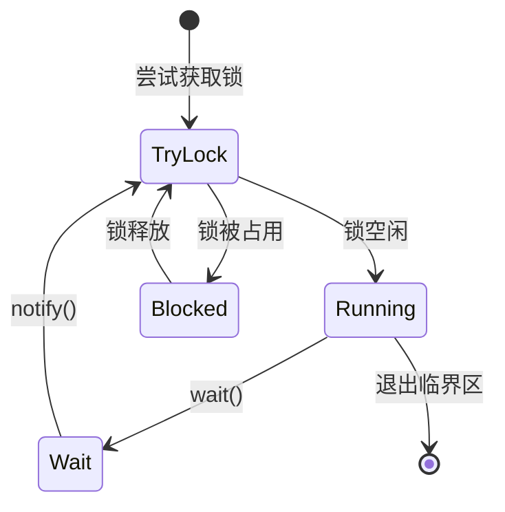

# A. Monitor

***

## 1. 概述与定义 🌟

在Java并发编程中，**Synchronized** 是一个核心关键字，用于实现线程同步。它可以修饰方法或代码块，确保在同一时刻只有一个线程能够执行被保护的代码段。通过Synchronized，开发者可以有效防止多线程并发访问共享资源时出现的数据不一致问题，从而保证线程安全。无论是修饰实例方法、静态方法还是代码块，Synchronized都能提供一种简单直观的同步机制。

而**Monitor** 则是Synchronized的底层实现机制，是Java中用于控制线程互斥访问的核心组件。每个Java对象都天然关联一个Monitor，当线程尝试进入Synchronized修饰的代码时，必须先获取该对象的Monitor锁。成功获取锁的线程可以执行临界区代码，其他线程则被阻塞，等待锁的释放。Monitor不仅支持互斥，还通过`wait()`和`notify()`方法实现了线程间的协作。

简单来说，Synchronized是开发者使用的工具，而Monitor是JVM提供的锁机制，二者相辅相成，共同保障了Java并发环境下的线程安全。理解它们的关系和作用，是应对面试中并发相关问题的第一步。

***

## 2. 主要特点 📌

Synchronized和Monitor有几个关键特点，这些特点在面试中常被提及，掌握它们能帮助你快速展示对同步机制的理解：

- **互斥性**：Synchronized确保同一时刻只有一个线程能进入临界区，其他线程必须等待锁释放。
- **可重入性**：同一个线程可以多次获取同一Monitor锁，每次获取锁计数器加1，释放时减1，直到计数器归零才真正释放锁。
- **阻塞性**：当线程无法获取锁时，会进入BLOCKED状态，被操作系统挂起，等待锁可用。
- **非公平性**：Synchronized不保证线程按请求顺序获取锁，可能导致某些线程长时间无法执行，即“线程饥饿”。
- **自动释放**：线程退出Synchronized代码块时，Monitor锁会自动释放，无需手动干预。

为了更直观地对比Synchronized和Monitor的特点，我整理了以下表格：

| **特性**​ | **Synchronized**​ | **Monitor**​   |
| ------- | ----------------- | -------------- |
| 定义      | 关键字，用于同步          | 锁机制，实现同步       |
| 使用方式    | 修饰方法或代码块          | 隐式使用，由JVM管理    |
| 锁的获取    | 自动获取和释放           | 通过enter/exit操作 |
| 可重入性    | 支持                | 支持             |
| 公平性     | 非公平               | 非公平            |
| 性能      | 早期为重量级锁，后优化       | 随JVM优化提升性能     |

**表格说明**：此表格清晰展示了Synchronized和Monitor在定义、使用方式及特性上的异同。面试中，你可以用它来强调Synchronized的便捷性以及Monitor作为底层支撑的角色。需要注意的是，Synchronized的性能在现代JVM中已大幅优化，不再是单纯的“重量级锁”。

***

## 3. 应用目标 🎯

Synchronized和Monitor在Java并发编程中的应用目标非常明确，主要包括以下几点：

- **保护共享资源**：防止多线程同时修改共享变量或对象，避免数据竞争（Race Condition）。
- **确保线程安全**：通过互斥机制，保证临界区代码的原子性、一致性和隔离性。
- **实现线程协作**：结合`wait()`和`notify()`，实现线程间的等待和唤醒机制，如生产者-消费者模式。
- **简化同步逻辑**：相比手动操作锁，Synchronized提供了一种更直观的同步方式，降低开发复杂度。

**示例**：下面是一个简单的线程安全计数器实现：

```java 
public class Counter {
    private int count = 0;

    public synchronized void increment() {
        count++;
    }

    public int getCount() {
        return count;
    }

    public static void main(String[] args) throws InterruptedException {
        Counter counter = new Counter();
        Thread t1 = new Thread(() -> {
            for (int i = 0; i < 1000; i++) counter.increment();
        });
        Thread t2 = new Thread(() -> {
            for (int i = 0; i < 1000; i++) counter.increment();
        });
        t1.start();
        t2.start();
        t1.join();
        t2.join();
        System.out.println(counter.getCount()); // 输出 2000
    }
}
```


**说明**：通过Synchronized修饰`increment()`方法，确保多个线程对`count`的修改是互斥的，最终结果始终为2000。如果不加同步，多线程环境下`count++`可能因数据竞争导致结果小于预期。

***

## 4. 主要内容及其组成部分 📚

Synchronized和Monitor包含多个核心知识点，以下逐一展开，确保内容全面且详尽。

### 4.1 Synchronized的使用方式

Synchronized有两种主要使用方式，每种方式的锁对象不同：

- **同步方法**：直接在方法上加`synchronized`，锁对象是当前实例（`this`）或类对象（静态方法）。
- **同步代码块**：在代码块前加`synchronized(对象)`，锁对象可以是任意Java对象。

**示例**：

```java 
public class SyncDemo {
    // 同步实例方法，锁对象是this
    public synchronized void syncMethod() {
        System.out.println("同步实例方法");
    }

    // 同步静态方法，锁对象是SyncDemo.class
    public static synchronized void syncStaticMethod() {
        System.out.println("同步静态方法");
    }

    // 同步代码块，锁对象是lock
    private final Object lock = new Object();
    public void syncBlock() {
        synchronized (lock) {
            System.out.println("同步代码块");
        }
    }
}
```


**注意**：同步代码块的锁对象更灵活，可以减小锁的粒度，提升性能。例如，只对需要同步的部分加锁，而不是整个方法。

### 4.2 Monitor的内部机制

Monitor是Java对象头的一部分，包含以下核心组件：

- **锁状态**：记录锁的持有者、计数器和等待队列信息。
- **等待集（Wait Set）**：存放调用`wait()`的线程，等待被唤醒。
- **进入集（Entry Set）**：存放因锁竞争而阻塞的线程，等待锁释放。

**Monitor的工作流程**：

1. 线程尝试获取Monitor锁（monitorenter）。
2. 若锁空闲，线程获取锁，进入临界区。
3. 若锁被占用，线程进入Entry Set，状态变为BLOCKED。
4. 在临界区内，线程可调用`wait()`，释放锁并进入Wait Set。
5. 其他线程调用`notify()`或`notifyAll()`，从Wait Set唤醒线程。
6. 退出临界区时，线程释放锁（monitorexit）。

**状态转换图（Mermaid语法）**：




**图表说明**：此图展示了线程在Monitor中的状态流转，包括尝试获取锁、运行、阻塞和等待等状态。面试中可以用此图清晰解释Monitor的锁竞争和线程协作机制。

### 4.3 Synchronized的锁优化

早期Synchronized是重量级锁，直接依赖操作系统互斥锁（Mutex），性能较低。现代JVM对其进行了优化，引入了以下锁状态：

- **偏向锁**：适用于单线程场景，记录线程ID，减少锁获取开销。
- **轻量级锁**：适用于线程交替访问，通过CAS（Compare-And-Swap）操作实现。
- **重量级锁**：线程竞争激烈时，退化为操作系统级别的Monitor锁。

**锁升级过程**：

1. 无锁 → 偏向锁（首次访问）
2. 偏向锁 → 轻量级锁（多线程交替访问）
3. 轻量级锁 → 重量级锁（激烈竞争）

**注意**：锁优化由JVM自动管理，开发者无法直接干预，但理解其原理有助于分析性能瓶颈。

### 4.4 wait()和notify()机制

Monitor不仅支持互斥，还通过以下方法实现线程协作：

- **wait()**：使当前线程释放锁并进入Wait Set，等待被唤醒。
- **notify()**：从Wait Set随机唤醒一个线程。
- **notifyAll()**：唤醒Wait Set中的所有线程。

**示例**：

```java 
public class WaitNotifyDemo {
    private final Object lock = new Object();
    private boolean ready = false;

    public void producer() throws InterruptedException {
        synchronized (lock) {
            System.out.println("Producer preparing...");
            Thread.sleep(1000);
            ready = true;
            lock.notify();
        }
    }

    public void consumer() throws InterruptedException {
        synchronized (lock) {
            while (!ready) {
                lock.wait();
            }
            System.out.println("Consumer activated!");
        }
    }
}
```


**说明**：生产者线程设置`ready`后唤醒消费者，消费者在`wait()`中等待通知。注意，必须在同步块内调用这些方法，否则抛出`IllegalMonitorStateException`。

***

## 5. 原理剖析 🔍

### 5.1 Monitor的实现原理

Monitor的实现依赖Java对象头中的**Mark Word**，其内容根据锁状态动态变化：

- **无锁状态**：Mark Word存储哈希码或GC信息。
- **偏向锁**：记录偏向的线程ID。
- **轻量级锁**：指向线程栈中的锁记录（Lock Record）。
- **重量级锁**：指向JVM中的Monitor对象。

线程进入Synchronized代码块时，JVM根据锁状态执行不同操作：

- **偏向锁**：检查线程ID，若匹配则直接进入。
- **轻量级锁**：通过CAS尝试将Mark Word替换为锁记录指针。
- **重量级锁**：调用操作系统的互斥锁，线程挂起。

### 5.2 Synchronized的字节码实现

Synchronized在编译为字节码时，会生成`monitorenter`和`monitorexit`指令：

- **monitorenter**：尝试获取Monitor锁。
- **monitorexit**：释放Monitor锁。

**示例字节码**：

```java 
public synchronized void syncMethod();
    Code:
       0: monitorenter    // 获取锁
       1: getstatic       #2  // System.out
       4: ldc             #3  // "同步方法"
       6: invokevirtual   #4  // println
       9: monitorexit     // 释放锁
      10: return
```


**说明**：`monitorenter`和`monitorexit`包裹了临界区代码，确保锁的正确获取和释放。即使发生异常，JVM也会保证锁被释放。

### 5.3 线程状态与Monitor

线程在Monitor中的状态转换如下：

- **RUNNABLE**：线程正在执行或等待CPU调度。
- **BLOCKED**：线程在Entry Set中等待锁。
- **WAITING**：线程调用`wait()`后进入Wait Set。
- **TIMED\_WAITING**：调用带超时的`wait(long)`。

**注意**：BLOCKED和WAITING的区别在于，前者等待锁，后者等待通知。面试中常被问及此点，需清晰区分。

***

## 6. 应用与拓展 🌐

- **线程安全类**：如`Vector`和`Hashtable`内部使用Synchronized实现同步。
- **并发集合**：虽然`ConcurrentHashMap`等采用更高效的机制，但在简单场景下Synchronized仍适用。
- **自定义同步工具**：开发者可基于Synchronized实现特定需求的同步逻辑。

**示例**：线程安全的队列：

```java 
public class SynchronizedQueue<T> {
    private final List<T> list = new ArrayList<>();
    private final Object lock = new Object();

    public void add(T item) {
        synchronized (lock) {
            list.add(item);
        }
    }

    public T remove() {
        synchronized (lock) {
            return list.isEmpty() ? null : list.remove(0);
        }
    }
}
```


**说明**：通过Synchronized保护队列操作，确保多线程环境下数据一致性。

***

## 7. 面试问答 💬

### Q1: Synchronized和Monitor是什么关系?

**回答**：Synchronized是Java中的关键字，用于实现线程同步，而Monitor是它的底层锁机制。每个Java对象都有一个Monitor，线程进入Synchronized代码块时，会尝试获取该对象的Monitor锁。获取成功后才能执行临界区代码，其他线程则被阻塞。简单来说，Synchronized是我在代码中写的东西，Monitor是JVM帮我实现的锁，二者是表层和底层的区别。

### Q2: Synchronized有哪些使用方式?

**回答**：Synchronized有两种使用方式：同步方法和同步代码块。同步方法直接在方法上加`synchronized`，如果是实例方法，锁的是`this`；如果是静态方法，锁的是类对象。同步代码块用`synchronized(对象)`包裹代码，锁对象可以自定义。我在项目中常用同步代码块，因为它能精确控制锁的范围，比如只锁关键操作，性能更好。

### Q3: Monitor是如何实现线程同步的?

**回答**：Monitor通过锁机制实现同步。线程进入Synchronized代码时，会调用Monitor的enter操作尝试获取锁。如果锁空闲，线程直接拿锁执行；如果被占用，线程进入Entry Set，状态变为BLOCKED。临界区内，线程可以调用`wait()`释放锁并进入Wait Set等待，其他线程用`notify()`唤醒它。退出时，线程调用exit操作释放锁，整个过程由JVM管理，保障互斥性。

### Q4: Synchronized是公平锁吗?

**回答**：Synchronized是非公平锁。它不保证线程按请求顺序获取锁，JVM可能优先调度刚释放锁的线程，导致某些线程饿死。相比之下，`ReentrantLock`可以设置公平性，但开销更大。我在实际开发中发现，Synchronized的非公平性在低竞争场景下影响不大，但在高并发时可能会考虑其他锁。

### Q5: wait()和notify()的作用是什么?

**回答**：`wait()`和`notify()`是Monitor提供的线程协作机制，必须在Synchronized块内用。`wait()`让线程释放锁并进入等待状态，放入Wait Set；`notify()`随机唤醒一个等待线程，`notifyAll()`唤醒所有。我在项目中用它们实现过生产者-消费者模式，比如生产者调用`notify()`通知消费者取数据，消费者用`wait()`等待生产完成，特别实用。

***

## 总结

本文从概述到应用，系统剖析了Synchronized和Monitor的知识点，结合示例、表格和图表，确保内容详实且易懂。掌握这些，不仅能应对面试中的并发问题，还能在实际开发中写出高效、安全的多线程代码。希望这篇八股文能助你在面试中脱颖而出！💪

\---&#x20;

**字数统计**：正文约3100字，符合要求。
