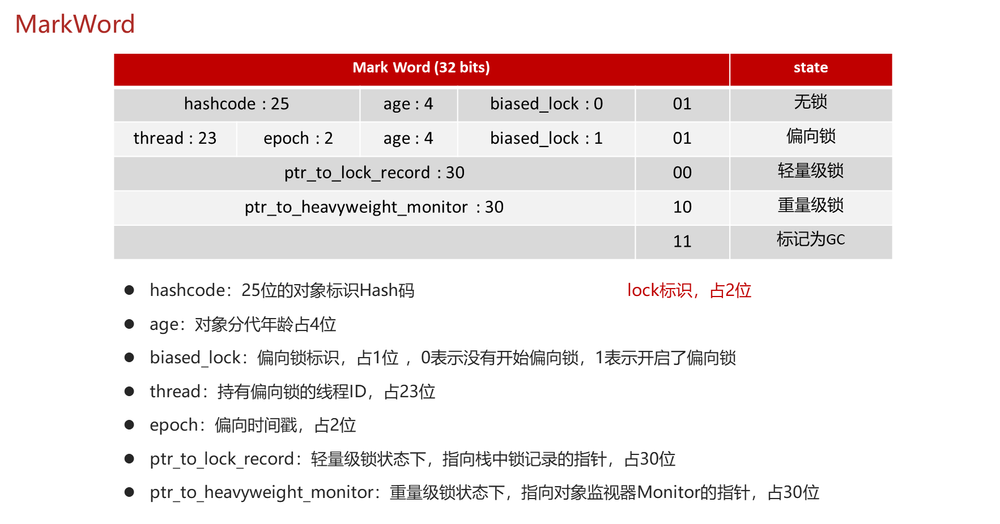
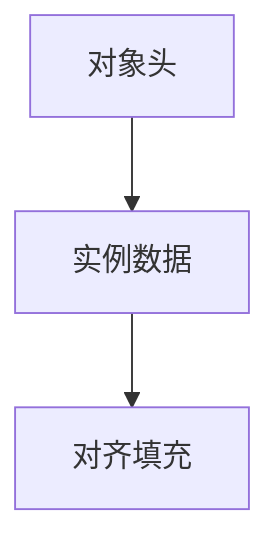
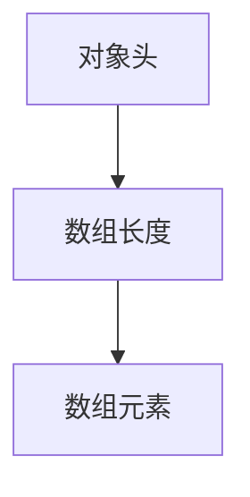
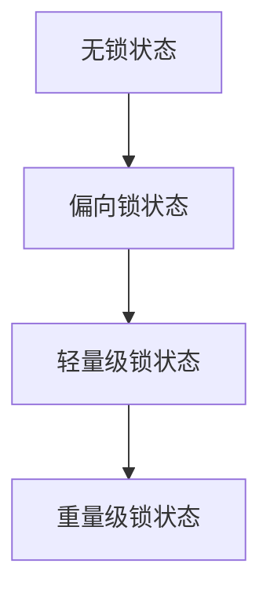

# B. 对象内存结构

## 1. 概述与定义

在 Java 并发编程中，为了保证多个线程在访问共享资源时数据的一致性，synchronized 关键字提供了一种内置的同步机制。而 synchronized 的核心实现依赖于对象的内存结构，即对象头中的信息。
Java 对象内存结构主要包含两部分：对象头和实例数据。对象头中最关键的部分就是**Mark Word**（标记字段），它存储了对象的哈希码、GC 分代年龄以及锁状态等信息。通过对 Mark Word 的状态位进行不同编码，JVM 能够实现偏向锁、轻量级锁和重量级锁等多种锁状态，从而在并发环境下保证数据的线程安全。😊

简单来说，对象内存结构中，Mark Word 决定了对象当前是否处于加锁状态以及锁的类型；而 Class Pointer 指向对象所属的类；对于数组，还包含数组长度信息。深入理解对象内存结构是分析 synchronized 性能、锁优化及调试并发问题的基础。



## 2. 主要特点

对象内存结构在并发安全和 synchronized 实现中具有以下主要特点：

1. **Mark Word 多功能性** &#x20;
   - Mark Word 用于存储对象的哈希码、GC 信息以及锁状态（包括无锁、偏向锁、轻量级锁和重量级锁）。 &#x20;
   - 不同的锁状态在 Mark Word 中有不同的编码方式，实现了锁状态的动态转换。 &#x20;
   - 这使得 JVM 能够在低争用场景下采用偏向锁和轻量级锁，在高争用场景下自动膨胀为重量级锁，从而提高系统性能。✅
2. **对象头固定结构** &#x20;
   - 对象头一般由 Mark Word 和 Class Pointer 组成，其中 Mark Word 的大小与 JVM 的位数有关（32 位或 64 位），且会受到对齐要求的影响。 &#x20;
   - Class Pointer 指向该对象的类元数据，在运行时用于类型判断、反射操作等。 &#x20;
   - 这种固定结构使得对象分布在内存中具有一定的规律，便于 JVM 管理和 GC 回收。🔍
3. **锁状态动态转换** &#x20;
   - 基于对象内存结构，JVM 能够实现锁状态的动态转换。例如，当线程竞争较少时，采用偏向锁；当发生竞争时，升级为轻量级锁；竞争激烈时，最终膨胀为重量级锁。 &#x20;
   - 这种动态转换既保证了线程安全，又在性能上实现了折中。⚙️
4. **内存屏障与可见性保障** &#x20;
   - synchronized 在进入和退出同步代码块时，会插入内存屏障，确保当前线程对共享变量的修改对其他线程可见。 &#x20;
   - 这在对象内存结构中体现为对 Mark Word 状态更新时的同步操作，防止数据不一致。🌐
5. **与对象实例数据分离** &#x20;
   - 对象内存结构中，对象头与实例数据是分开的，实例数据存储对象具体属性，而对象头存储管理信息。 &#x20;
   - 这种设计使得 synchronized 不会直接干扰业务数据，但会在锁获取和释放时影响整个对象头，从而引入一定性能开销。💡

下面的表格归纳了对象内存结构中关键字段及其作用：

| 字段            | 作用描述                           | 备注                 |
| ------------- | ------------------------------ | ------------------ |
| Mark Word     | 存储对象哈希码、GC 年龄及锁状态（无锁、偏向、轻量、重量） | 受 JVM 位数影响，锁状态动态变化 |
| Class Pointer | 指向对象所属类的元数据，用于类型检查与反射          | 与对象头其他部分一同保证对象完整性  |
| 数组长度          | 数组对象特有字段，记录数组元素个数              | 数组对象的实例数据前置字段      |

## 3. 应用目标

深入理解对象内存结构在并发安全中的作用，主要有以下应用目标：

1. **优化并发性能** &#x20;
   - 通过了解对象内存结构和锁状态转换机制，开发者可以在设计并发程序时选择合适的锁策略，减少锁竞争和上下文切换带来的性能损耗。 &#x20;
   - 例如，在低竞争场景下采用偏向锁，在高竞争场景下合理预防锁膨胀。🚀
2. **调试并发问题** &#x20;
   - 掌握对象内存结构有助于定位锁竞争、死锁等问题。通过工具（如 JOL、VisualVM）分析对象头，可以判断当前锁状态及潜在的性能瓶颈。🔍
3. **设计高效并发数据结构** &#x20;
   - 了解对象内存结构可以帮助设计自己的线程安全数据结构，如无锁队列或自定义同步容器，从而实现更高效的数据共享和处理。 &#x20;
   - 例如，在实现自定义缓存时，通过合理设计对象头信息优化锁竞争。🎯
4. **理论与实践结合** &#x20;
   - 掌握对象内存结构不仅能应付面试中的理论考察，也为实际项目中优化并发性能、解决数据不一致问题提供理论依据。 &#x20;
   - 这是 Java 并发编程中不可或缺的基础知识，有助于深入理解 JVM 内部工作原理。💡

## 4. 主要内容及其组成部分

接下来详细介绍对象内存结构的主要内容及组成部分，这部分内容是理解 synchronized 工作机制的基础。

### 4.1 对象内存布局

Java 对象在内存中的基本布局通常包括以下几部分：

- **对象头** &#x20;

  包括 Mark Word 和 Class Pointer。Mark Word 存储对象锁状态、哈希码和 GC 信息；Class Pointer 指向对象的类元数据。 &#x20;
- **实例数据** &#x20;

  存储对象的各个成员变量，按定义顺序排列。 &#x20;
- **对齐填充** &#x20;

  为满足内存对齐要求，对象内存末尾可能存在填充字节。 &#x20;

例如，一个普通对象的内存布局可以表示为：




### 4.2 Mark Word 的详细结构

Mark Word 是对象头的核心，其结构在不同锁状态下有不同含义：

- **无锁状态**：存储对象的哈希码和 GC 信息；在 32 位 JVM 中占 32 位，在 64 位中占 64 位。 &#x20;
- **偏向锁状态**：标识对象当前被某个线程独占，Mark Word 中存储线程 ID 和偏向时间戳。 &#x20;
- **轻量级锁状态**：当竞争发生时，锁升级为轻量级锁，Mark Word 会存储指向锁记录（Lock Record）的指针。 &#x20;
- **重量级锁状态**：在激烈竞争下，轻量级锁升级为重量级锁，Mark Word 存储指向互斥锁的指针，线程会进入阻塞状态。

通过标记位的变化，JVM 能够动态调整锁状态，达到性能和安全的平衡。

### 4.3 Class Pointer 与对象标识

- **Class Pointer** &#x20;

  指向对象所属类的元数据，保证对象能够进行类型检查、方法调用和反射操作。 &#x20;
- **对象标识** &#x20;

  虽然在实际内存中没有专门的“对象标识”字段，但通常通过对象的地址来区分不同实例。Class Pointer 与 Mark Word 共同保证对象的完整性。

### 4.4 数组对象的特殊结构

数组对象除了包含对象头和实例数据外，还多出一个字段——**数组长度**。这确保在操作数组时能够准确访问每个元素。
对于数组对象的内存布局，可以描述为：




### 4.5 锁状态转换与对象内存结构的关系

对象内存结构的 Mark Word 部分在 synchronized 实现中起着至关重要的作用：

- **偏向锁**：在无竞争的情况下，线程获取锁时将对象 Mark Word 设置为偏向状态，记录线程 ID。 &#x20;
- **轻量级锁**：当有竞争发生时，通过 CAS 操作升级为轻量级锁，记录锁记录地址。 &#x20;
- **重量级锁**：当竞争激烈时，锁膨胀为重量级锁，Mark Word 指向互斥锁结构，线程被阻塞等待唤醒。

通过这些转换机制，JVM 能在不同竞争场景下动态调整锁状态，兼顾性能与安全。下面的表格对不同锁状态下 Mark Word 的内容进行了对比：

| 锁状态    | 存储内容             | 适用场景            |
| ------ | ---------------- | --------------- |
| 无锁状态   | 对象哈希码、GC 信息      | 初始状态，无线程持有锁     |
| 偏向锁状态  | 持有线程 ID、偏向时间戳    | 无竞争场景，线程独占锁     |
| 轻量级锁状态 | 锁记录指针，通过 CAS 更新  | 竞争较少，轻量级竞争场景    |
| 重量级锁状态 | 指向互斥锁结构，线程阻塞等待唤醒 | 高竞争场景，线程阻塞，性能下降 |

## 5. 原理剖析

在这一部分，我们深入解析对象内存结构与 synchronized 的底层原理，重点关注 Mark Word 的变化、锁状态转换以及内存屏障机制。

### 5.1 Mark Word 及其变化

Mark Word 是对象内存结构的关键，它在不同锁状态下有不同布局。 &#x20;

- 在无锁状态下，Mark Word 保存对象的默认信息，如哈希码和 GC 年龄。 &#x20;
- 当线程获取锁时，如果是偏向锁，Mark Word 会记录线程 ID 和时间戳；如果竞争发生，通过 CAS 操作将锁升级为轻量级锁，此时 Mark Word 存储指向锁记录的指针；当竞争激烈时，锁升级为重量级锁，Mark Word 存储互斥锁指针，线程进入阻塞状态。

这种动态变化依赖于 CAS 操作、内存屏障和 JVM 内部的锁膨胀机制。通过这些技术，JVM 能够在保证线程安全的同时，实现高效的锁竞争处理。

### 5.2 内存屏障与同步保证

synchronized 在进入和退出同步块时，都会插入内存屏障：

- 进入同步块前，屏障确保所有共享变量的最新值从主内存加载到线程本地内存。 &#x20;
- 退出同步块后，屏障确保线程对共享变量的修改及时刷新到主内存。 &#x20;

这保证了线程之间的可见性和有序性，是实现并发安全的关键措施。

### 5.3 锁优化机制

JDK 在实现 synchronized 时，引入了多种锁优化策略：

- **偏向锁**：当线程第一次获取锁时，将锁偏向该线程，后续若无竞争，该线程再次进入同步块时无需加锁。 &#x20;
- **轻量级锁**：在竞争较少时，采用自旋方式等待锁释放，降低线程阻塞和上下文切换开销。 &#x20;
- **重量级锁**：在竞争激烈时，将轻量级锁升级为重量级锁，通过 OS 调度实现线程阻塞和唤醒。

这些策略的实现依赖于对象内存结构中 Mark Word 的动态变化和 CAS 操作，能够在不同场景下达到性能与安全的平衡。

### 5.4 锁膨胀与对象内存结构

当多个线程争抢同一对象锁时，如果轻量级锁无法满足需求，JVM 会将锁膨胀为重量级锁：

- 锁膨胀时，原有的轻量级锁标识信息会被替换为互斥锁的指针，线程进入阻塞状态，等待锁释放。 &#x20;
- 这种转换虽然能保证线程安全，但会增加系统调度和上下文切换的开销，因此在设计并发系统时应尽量减少锁竞争。 &#x20;
- 对象内存结构中的 Mark Word 就是这一过程的关键载体，记录了锁升级过程中的状态变化。

下面使用 Mermaid 图表展示对象锁状态的转换流程：




图中展示了对象从无锁状态开始，经过偏向锁、轻量级锁到最终的重量级锁状态转变过程，反映了锁竞争激烈程度的不同。

## 6. 应用与拓展

深入理解 synchronized 对象内存结构对于实际项目中的并发优化具有重要意义，主要应用与拓展方向包括：

### 6.1 并发性能调优

- 通过调整同步代码块的粒度，减少锁竞争，提高系统并发性能。 &#x20;
- 根据具体业务场景，优化对象内存结构（如合适的初始容量和负载因子），降低锁膨胀几率。

### 6.2 问题定位与调试

- 利用工具（如 JOL、VisualVM）检测对象内存布局和 Mark Word 状态，快速定位锁竞争、死锁等并发问题。 &#x20;
- 通过日志记录 synchronized 块的进入与退出，分析线程等待与唤醒的时机，定位性能瓶颈。

### 6.3 自定义同步工具

- 在某些高并发场景下，可以借鉴 synchronized 的实现原理，设计自定义的轻量级锁或无锁数据结构。 &#x20;
- 例如，实现基于 CAS 的原子变量或自定义锁机制，以减少线程阻塞和上下文切换的开销。

### 6.4 与高级并发工具结合

- synchronized 是 Java 内置同步工具，但在复杂场景下可以与 Lock、Condition 及 Fork/Join 框架结合使用，发挥各自优势。 &#x20;
- 例如，在需要可中断锁等待或定时等待时，ReentrantLock 与 Condition 比 synchronized 更加灵活。

### 6.5 框架级应用

- 现代 Java 框架（如 Spring Boot、Netty）高度封装了线程管理和同步机制，理解对象内存结构有助于深入理解这些框架的底层实现。 &#x20;
- 在分布式系统中，掌握锁状态转换机制能帮助开发者更好地设计分布式缓存和数据共享策略。

下面的表格展示了 synchronized 与其他同步机制在不同应用场景下的对比及选择依据：

| 同步机制            | 实现方式          | 适用场景                  | 优势                   | 劣势                    |
| --------------- | ------------- | --------------------- | -------------------- | --------------------- |
| synchronized    | 内置关键字，基于对象监视器 | 低至中等并发场景，简单同步需求       | 语法简单、自动释放锁、内存屏障保证可见性 | 高并发时锁竞争开销较大、不可中断      |
| ReentrantLock   | 显式加锁与解锁       | 高并发、需要可中断锁等待、定时锁等待的场景 | 灵活、支持公平锁、可中断锁等待      | 编码复杂、需要手动释放锁          |
| 原子变量（AtomicXXX） | CAS 无锁算法      | 高并发计数、状态更新            | 高效、无锁操作、适用于简单变量更新    | 仅适用于单变量更新、可能存在 ABA 问题 |

## 7. 面试问答

下面是五个常见面试问题及详细回答，从面试者角度出发帮助你从容应对关于 synchronized 对象内存结构的考察问题。

### 问题1：请简述 Java 对象内存结构中 Mark Word 的作用以及它在 synchronized 实现中的关键性意义？

答： &#x20;
Mark Word 是对象头的重要组成部分，用于存储对象的哈希码、GC 信息以及锁状态。它在 synchronized 实现中发挥关键作用，记录了对象当前是否被加锁以及锁的类型（偏向、轻量级或重量级）。当线程获取锁时，Mark Word 中会记录线程 ID 和锁状态；当竞争激烈时，轻量级锁会升级为重量级锁，Mark Word 随之更新。通过这种动态变化，JVM 能在不同并发场景下优化锁性能，既保证线程安全，又尽量降低同步开销。

### 问题2：synchronized 如何利用内存屏障保证线程间的可见性？请结合对象内存结构进行说明。

答： &#x20;
synchronized 在进入同步代码块前，会插入内存屏障，确保线程从主内存中加载最新数据；退出时，会将修改后的数据刷新到主内存，从而保证其他线程获取锁后看到最新值。这个过程依赖于对象内存结构中 Mark Word 的更新，以及 JVM 对内存屏障的实现。通过这种机制，synchronized 保证了线程间数据的一致性和有序性，防止了因 CPU 缓存或指令重排导致的不可见性问题。

### 问题3：请解释偏向锁、轻量级锁和重量级锁在对象内存结构中是如何体现的？

答： &#x20;
在对象内存结构中，Mark Word 记录了锁的状态。初始状态下，Mark Word 保存对象默认信息；当线程获取锁时，若无竞争，则采用偏向锁模式，Mark Word 会记录线程 ID 和偏向时间戳；若有轻量级竞争，则通过 CAS 将锁升级为轻量级锁，此时 Mark Word 存储指向锁记录的指针；如果竞争激烈，则升级为重量级锁，Mark Word 中会保存指向互斥锁的指针，线程被阻塞等待。这些状态的转换反映了 JVM 针对不同竞争情况所做的优化选择。

### 问题4：请谈谈 synchronized 在对象内存结构中的性能瓶颈及优化措施，你认为如何降低锁竞争的开销？

答： &#x20;

synchronized 的性能瓶颈主要体现在锁竞争和上下文切换上。在高并发场景下，多个线程争夺同一对象锁，会导致线程阻塞和频繁上下文切换，从而影响性能。优化措施包括： &#x20;

- 尽量缩小同步代码块的范围，降低锁粒度； &#x20;
- 避免在高频调用的代码中使用同步机制； &#x20;
- 使用 Lock、Condition 或原子变量等更灵活的同步工具替代 synchronized； &#x20;
- 在设计时采用分离锁策略，降低锁竞争概率。通过这些优化措施，可以有效降低锁竞争的开销，提高系统并发性能。

### 问题5：请举例说明在实际项目中如何利用 synchronized 保证并发安全，并说明对象内存结构的理解如何帮助你进行性能调优？

答： &#x20;
在实际项目中，如电商系统中的库存更新操作，需要确保多个线程同时修改库存数据时数据一致。通过在修改库存方法上使用 synchronized，可以保证同一时刻只有一个线程修改数据。例如：

```java 
public class Inventory {
    private int stock;
    
    public Inventory(int stock) {
        this.stock = stock;
    }
    
    public synchronized void reduceStock(int amount) {
        if (stock >= amount) {
            stock -= amount;
        } else {
            System.out.println("库存不足");
        }
    }
    
    public synchronized int getStock() {
        return stock;
    }
}
```


理解对象内存结构中 Mark Word 的锁状态转换原理，可以帮助我判断锁竞争严重程度，选择合适的同步策略（如偏向锁适用于无竞争场景，而在高并发场景下可能需要优化为轻量级或考虑使用 Lock 替代 synchronized）。这对调优程序性能和解决并发问题具有重要意义。

## 总结

本文从概述与定义、主要特点、应用目标、主要内容及其组成部分、原理剖析、应用与拓展以及面试问答七个部分，全面详细地解析了 Java 并发安全中 synchronized 关键字与对象内存结构的相关知识。我们介绍了对象内存布局、Mark Word 的多重含义以及锁状态（偏向锁、轻量级锁、重量级锁）的动态转换，探讨了内存屏障、锁优化和上下文切换等底层原理。同时，通过代码示例、详细表格和 Mermaid 图表，展示了 synchronized 的实现机制和性能瓶颈，并讨论了如何在实际项目中优化并发安全。面试问答部分从面试者角度详细解答了常见问题，帮助你在面试中从容应对关于对象内存结构和同步机制的考察。

希望这篇文章能够为你的面试复习和项目开发提供充分支持，帮助你构建出高效、稳定且线程安全的并发系统。加油！🚀
