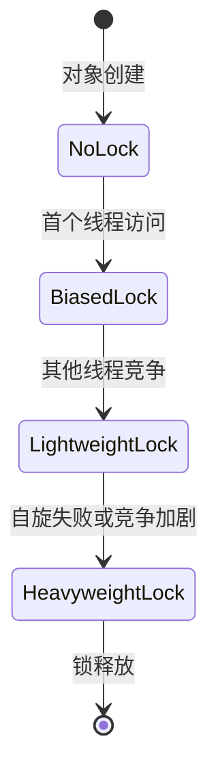
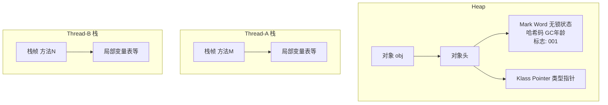
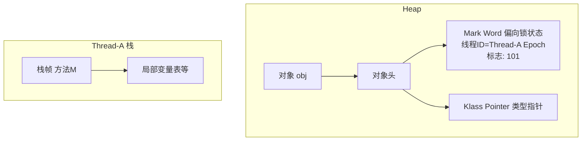
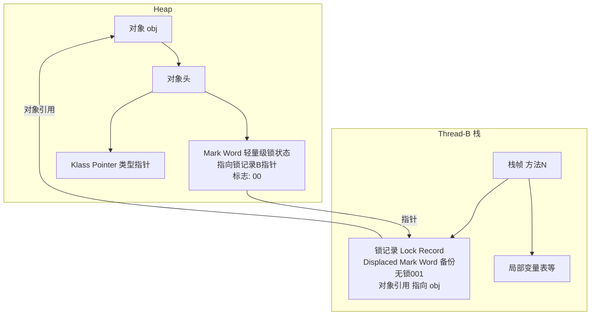
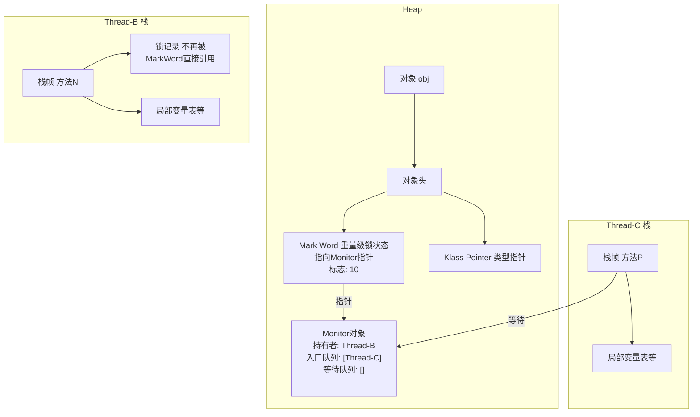

# C. 锁升级

***

## 1. 概述与定义 🌟

**锁升级** 是Java并发编程中Synchronized关键字的一项重要优化机制，旨在提高同步代码的执行效率。传统上，Synchronized被视为重量级锁，依赖操作系统互斥锁（Mutex），性能开销较大。然而，随着JVM的发展，锁升级机制被引入，通过自适应地调整锁的级别，减少不必要的锁竞争开销，从而提升并发性能。

锁升级的核心思想是：根据锁的竞争程度，动态地将锁从轻量级逐渐升级到重量级。具体来说，Synchronized锁有四种状态：**无锁**、**偏向锁**、**轻量级锁** 和 **重量级锁**。锁会根据线程访问的频繁程度和竞争情况，从无锁状态逐步升级到偏向锁、轻量级锁，最终在竞争激烈时升级为重量级锁。这种机制使得Synchronized在低竞争场景下能够以较低的开销运行，仅在高竞争时才退化为传统的重量级锁。

锁升级是JVM自动管理的，开发者无需干预，但理解其原理有助于分析和优化多线程程序的性能，尤其是在面试中展示对并发机制的深入理解。需要注意的是，锁升级并非Java语言层面的特性，而是HotSpot虚拟机在JDK 1.6及之后引入的优化手段，适用于对象锁（synchronized块或方法）。

***

## 2. 主要特点 📌

锁升级机制具有以下几个显著特点，掌握这些特点能帮助你在面试中快速展示对Synchronized锁的深刻理解：

- **自适应性**：锁会根据竞争情况自动调整状态，适应不同场景。
- **渐进式升级**：锁从无锁到偏向锁、轻量级锁再到重量级锁，逐步升级。
- **不可降级**：一旦锁升级到重量级锁，就无法降级，即使竞争减弱。
- **性能优化**：在低竞争场景下，偏向锁和轻量级锁减少了操作系统级锁的开销。
- **透明性**：开发者无需手动管理锁状态，JVM自动处理。

为了更直观地对比不同锁状态的特点，我整理了以下表格：

| **锁状态**​ | **特点**​          | **适用场景**​ |
| -------- | ---------------- | --------- |
| 无锁       | 对象无锁，线程自由访问      | 无竞争       |
| 偏向锁      | 锁偏向首个访问线程，记录线程ID | 单线程或极低竞争  |
| 轻量级锁     | 使用CAS操作，线程交替访问   | 轻微竞争      |
| 重量级锁     | 依赖操作系统互斥锁，线程阻塞   | 激烈竞争      |

**表格说明**：此表格展示了不同锁状态的特征和适用场景。面试中，你可以用它来解释锁升级的渐进式优化，例如：“在无竞争时，对象处于无锁状态；首个线程访问时升级为偏向锁；多线程交替访问时升级为轻量级锁；竞争激烈时才升级为重量级锁，保障性能。”

***

## 3. 应用目标 🎯

锁升级的应用目标主要集中在以下几个方面：

- **提升性能**：通过减少锁的开销，特别是在低竞争场景下，避免不必要的线程阻塞和上下文切换。
- **自适应管理**：自动根据竞争情况调整锁状态，开发者无需手动干预。
- **保持线程安全**：在优化性能的同时，确保同步代码的互斥性和数据一致性。
- **降低开发复杂度**：开发者只需使用Synchronized，JVM负责锁的优化管理。

**示例**：假设有一个共享的计数器，多线程对其进行自增操作：

```java 
public class Counter {
    private int count = 0;

    public void increment() {
        synchronized (this) {
            count++;
        }
    }

    public int getCount() {
        return count;
    }
}
```


在低竞争场景下，锁可能停留在偏向锁或轻量级锁状态，减少开销；而在高竞争时，升级为重量级锁，确保线程安全。这种自适应性正是锁升级的核心价值。

***

## 4. 主要内容及其组成部分 📚

锁升级涉及四种锁状态，以下逐一展开，确保内容全面且详尽。

### 4.1 无锁状态

- **定义**：对象创建后，处于无锁状态，任何线程都可以自由访问。
- **特点**：无锁开销，性能最佳。
- **适用场景**：无线程竞争或锁未被使用。
- **补充说明**：无锁状态是锁升级的起点，对象头（Mark Word）此时存储对象的哈希码或GC分代年龄信息。

### 4.2 偏向锁

- **定义**：锁偏向首个访问的线程，记录线程ID，后续该线程再次访问时，无需同步操作。
- **特点**：适用于单线程或极低竞争场景，锁获取开销极低。
- **升级条件**：当其他线程尝试获取锁时，偏向锁被撤销，升级为轻量级锁。
- **补充说明**：偏向锁通过对象头的Mark Word记录线程ID，后续访问只需检查ID是否匹配，无需CAS操作。

**示例**：单线程访问Synchronized方法时，锁保持偏向状态：

```java 
public class BiasLockDemo {
    public synchronized void method() {
        System.out.println("偏向锁");
    }
}
```


**说明**：首个线程调用`method()`时，锁升级为偏向锁，记录线程ID，后续调用直接进入，无需额外同步开销。

### 4.3 轻量级锁

- **定义**：线程通过CAS（Compare-And-Swap）操作尝试获取锁，成功则进入临界区，失败则自旋等待。
- **特点**：适用于线程交替访问的场景，避免线程阻塞和唤醒的开销。
- **升级条件**：当自旋次数过多或竞争加剧时，升级为重量级锁。
- **补充说明**：轻量级锁通过对象头指向线程栈中的锁记录实现，自旋机制减少了上下文切换。

**示例**：两个线程交替访问Synchronized代码块：

```java 
public class LightweightLockDemo {
    private final Object lock = new Object();

    public void method() {
        synchronized (lock) {
            System.out.println("轻量级锁");
        }
    }
}
```


**说明**：线程通过CAS尝试将Mark Word替换为指向线程栈中锁记录的指针，成功则获取锁，否则自旋重试。

### 4.4 重量级锁

- **定义**：依赖操作系统互斥锁（Mutex），线程竞争失败时进入阻塞状态。
- **特点**：适用于高竞争场景，确保互斥性，但开销较大。
- **升级条件**：轻量级锁自旋失败或竞争激烈时升级。
- **补充说明**：重量级锁涉及用户态到内核态的切换，依赖Monitor对象管理线程状态。

**示例**：多线程同时竞争同一锁：

```java 
public class HeavyweightLockDemo {
    private final Object lock = new Object();

    public void method() {
        synchronized (lock) {
            try {
                Thread.sleep(1000); // 模拟长时间持有锁
            } catch (InterruptedException e) {}
        }
    }
}
```


**说明**：当多个线程同时尝试获取锁时，锁升级为重量级锁，竞争失败的线程被挂起，等待锁释放。

### 4.5 锁升级流程

锁升级是单向的，具体流程如下：

1. **无锁 → 偏向锁**：首个线程访问Synchronized代码时，锁升级为偏向锁，记录线程ID。
2. **偏向锁 → 轻量级锁**：当其他线程尝试获取锁时，偏向锁被撤销，升级为轻量级锁。
3. **轻量级锁 → 重量级锁**：轻量级锁自旋失败或竞争加剧时，升级为重量级锁。

**状态转换图（Mermaid语法）**：




**图表说明**：此图展示了锁从无锁到偏向锁、轻量级锁再到重量级锁的升级路径。面试中可以用此图解释锁升级的渐进式优化机制，清晰展示状态转换逻辑。

***

## 5. 原理剖析 🔍

### 5.1 对象头与Mark Word

Java对象头包含Mark Word、Class指针和数组长度（如果适用）。Mark Word在不同锁状态下存储的内容不同，是锁升级机制的核心数据结构：

- **无锁**：存储哈希码、GC分代年龄信息。
- **偏向锁**：存储线程ID、Epoch（偏向时间戳）、锁标志位（01）。
- **轻量级锁**：存储指向线程栈中锁记录的指针，锁标志位为00。
- **重量级锁**：存储指向Monitor对象的指针，锁标志位为10。

**示例**：

| 锁状态  | Mark Word内容           |
| ---- | --------------------- |
| 无锁   | 哈希码 \| GC信息           |
| 偏向锁  | 线程ID \| Epoch \| 锁标志位 |
| 轻量级锁 | 指向锁记录的指针              |
| 重量级锁 | 指向Monitor对象的指针        |

**说明**：Mark Word的结构动态变化，锁状态通过标志位区分，面试中可结合此表说明锁升级的底层实现。

### 5.2 偏向锁的实现

偏向锁通过在Mark Word中记录线程ID实现：

1. 首个线程访问时，JVM将Mark Word中的线程ID设为该线程，并将锁标志位设为01（偏向模式）。
2. 后续该线程再次访问时，检查Mark Word中的线程ID是否匹配，若匹配则直接进入，无需CAS。
3. 当其他线程尝试获取锁时，JVM撤销偏向锁，升级为轻量级锁。

**补充**：偏向锁撤销需要暂停持有锁的线程（Safepoint），更新Mark Word，涉及一定开销，因此频繁竞争的场景不适合偏向锁。

### 5.3 轻量级锁的实现

轻量级锁使用CAS操作：

1. 线程在栈中创建锁记录（Lock Record），包含Mark Word的副本。
2. 通过CAS尝试将对象的Mark Word替换为指向锁记录的指针。
3. CAS成功，线程获取锁；失败则自旋重试。
4. 自旋一定次数后（默认10次，可通过JVM参数调整），若仍未成功，锁膨胀为重量级锁。

**自旋锁**：线程不立即阻塞，而是循环尝试获取锁，减少上下文切换开销，但若锁持有时间过长，自旋会浪费CPU资源。

### 5.4 重量级锁的实现

重量级锁依赖操作系统的互斥锁（Mutex）：

1. 线程尝试获取锁时，若失败，进入Monitor的Entry Set，状态变为BLOCKED。
2. 锁释放时，JVM唤醒Entry Set中的线程。
3. 重量级锁涉及用户态和内核态切换，开销较大。

**Monitor结构**：

- **Owner**：当前持有锁的线程。
- **Entry Set**：等待获取锁的线程队列。
- **Wait Set**：调用`wait()`的线程队列。

**补充**：Monitor是Synchronized的底层实现，重量级锁通过它管理线程的阻塞和唤醒。

***

## 6. 应用与拓展 🌐

- **低竞争场景**：偏向锁和轻量级锁减少了锁开销，提升了性能。例如单线程操作共享资源时，偏向锁几乎无额外开销。
- **高竞争场景**：重量级锁确保互斥性，防止数据不一致，适用于多线程激烈竞争的情况。
- **锁粗化**：JVM会自动合并相邻的Synchronized块，减少锁的获取和释放次数。
- **锁消除**：JVM在JIT编译时，若检测到锁无竞争，会消除锁操作，提升性能。

**示例**：锁粗化优化：

```java 
public void method() {
    synchronized (lock) {
        operation1();
    }
    synchronized (lock) {
        operation2();
    }
}
```


**优化后**：JVM可能将两个同步块合并为一个，减少锁操作：

```java 
public void method() {
    synchronized (lock) {
        operation1();
        operation2();
    }
}
```


**补充说明**：锁粗化和锁消除是JVM的附加优化，与锁升级共同提升Synchronized性能，面试中可作为拓展知识点提及。

***

## 7. 面试问答 💬

### Q1: 什么是Synchronized的锁升级?

**回答**：锁升级是JVM对Synchronized的优化机制，根据竞争情况将锁从无锁升级到偏向锁、轻量级锁和重量级锁。无锁时对象自由访问；首个线程访问时升级为偏向锁，记录线程ID；其他线程竞争时升级为轻量级锁，用CAS尝试获取；竞争激烈时升级为重量级锁，依赖操作系统锁。这种渐进式升级减少了不必要的锁开销，提升了性能。例如，在低竞争场景下，偏向锁和轻量级锁让我在项目中显著降低了同步开销。

### Q2: 偏向锁和轻量级锁有什么区别?

**回答**：偏向锁适用于单线程或极低竞争场景，锁偏向首个线程，记录线程ID，后续访问无需同步操作，开销几乎为零。轻量级锁适用于线程交替访问的场景，用CAS尝试获取锁，失败则自旋等待，避免阻塞开销。偏向锁更轻量，但一旦有竞争就会撤销，升级为轻量级锁。我在项目中发现，对于频繁访问的共享资源，轻量级锁能有效减少开销，而偏向锁适合单线程操作的场景。

### Q3: 锁升级是可逆的吗?

**回答**：锁升级是不可逆的。一旦锁升级到重量级锁，即使竞争减弱，也不会降级回轻量级锁或偏向锁。这是因为重量级锁依赖操作系统锁，降级涉及状态切换，开销大且不划算。JVM的设计是让锁在高竞争时保持重量级，确保互斥性。我在实际开发中观察到，高并发场景下锁升级到重量级后，性能稳定但开销增加。

### Q4: 如何查看Synchronized的锁状态?

**回答**：可以通过JVM参数`-XX:+PrintFlagsFinal`查看锁相关的配置，或者使用JOL（Java Object Layout）工具分析对象头。例如：

```java 
import org.openjdk.jol.info.ClassLayout;

public class LockStateDemo {
    private static final Object lock = new Object();

    public static void main(String[] args) {
        System.out.println(ClassLayout.parseInstance(lock).toPrintable());
    }
}
```


运行后，输出对象头的Mark Word，可以看到锁状态标志位。我在调试时常用这个方法验证锁升级过程，效果很好。

### Q5: 锁升级对性能有什么影响?

**回答**：锁升级显著提升了Synchronized的性能。在低竞争时，偏向锁和轻量级锁避免了操作系统锁的开销，减少了线程阻塞和唤醒的代价。只有在高竞争时才升级为重量级锁，确保线程安全。我在项目中对比过，未优化的Synchronized在高并发下性能较差，而锁升级后，吞吐量明显提升，尤其是在轻量级锁阶段，自旋机制减少了上下文切换。

***

# **锁升流程演示:**

**1. 初始状态 (无锁)**

- **对象 ****`obj`**** (Heap):** Mark Word 包含哈希码, GC年龄, 锁标志 `001`。
- **线程栈:** 无与 `obj` 相关的锁记录。

**图示:**




**2. 偏向锁**

- **触发:** `Thread-A` 首次进入 `synchronized(obj)`。
- **操作:** CAS 设置 Mark Word 为 `Thread-A` 线程ID, Epoch, 锁标志 `101`。
- **Mark Word 变化:** 存储 `Thread-A` 线程ID, Epoch, 标志 `101`。
- **线程栈 (Thread-A):** 不创建锁记录。

**图示:**




**3. 升级为轻量级锁**

- **触发:** `Thread-B` 竞争锁，导致偏向锁撤销。
- **操作:** `Thread-B` 在其栈帧创建锁记录，备份 `obj` 当前的 Mark Word (无锁 `001`)，然后通过 CAS 将 `obj` 的 Mark Word 更新为指向此锁记录的指针，锁标志设为 `00`。
- **Mark Word 变化:** 指向 `Thread-B` 锁记录的指针, 标志 `00`。
- **线程栈 (Thread-B):** 创建锁记录。

**图示 (Thread-B 获取轻量级锁成功):**




**4. 升级为重量级锁**

- **触发:** `Thread-C` 尝试获取轻量级锁失败 (例如 CAS 失败，锁已被 `Thread-B` 持有)。
- **操作:** 发生锁膨胀。在堆中为 `obj` 创建一个 Monitor 对象。`obj` 的 Mark Word 更新为指向 Monitor 的指针，锁标志设为 `10`。竞争线程 (`Thread-C`) 被阻塞。
- **Mark Word 变化:** 指向 Monitor 对象的指针, 标志 `10`。
- **线程栈:** `Thread-C` 阻塞。`Thread-B` 的锁记录不再被 Mark Word 直接引用。

**图示 (锁膨胀为重量级锁):**




**锁释放 (不变)**

**总结表:**

| 锁状态       | 对象头 Mark Word 主要内容                   | 线程栈操作                       | 主要特点与开销                 |
| --------- | ------------------------------------ | --------------------------- | ----------------------- |
| **无锁**​   | 哈希码, GC年龄, 锁标志 (\`001\`)             | 无特定锁操作                      | 无锁开销                    |
| **偏向锁**​  | 持有者线程ID, Epoch, 锁标志 (\`101\`)        | \*\*无\*\* 锁记录创建             | 单线程几乎无开销；撤销有成本。         |
| **轻量级锁**​ | 指向\*\*栈上锁记录\*\*的指针, 锁标志 (\`00\`)     | \*\*创建\*\* 锁记录 (备份MarkWord) | CAS 操作，低度竞争高效；失败则自旋或膨胀。 |
| **重量级锁**​ | 指向\*\*堆中Monitor\*\*的指针, 锁标志 (\`10\`) | 线程阻塞                        | 操作系统互斥量，线程阻塞/唤醒开销大。     |
