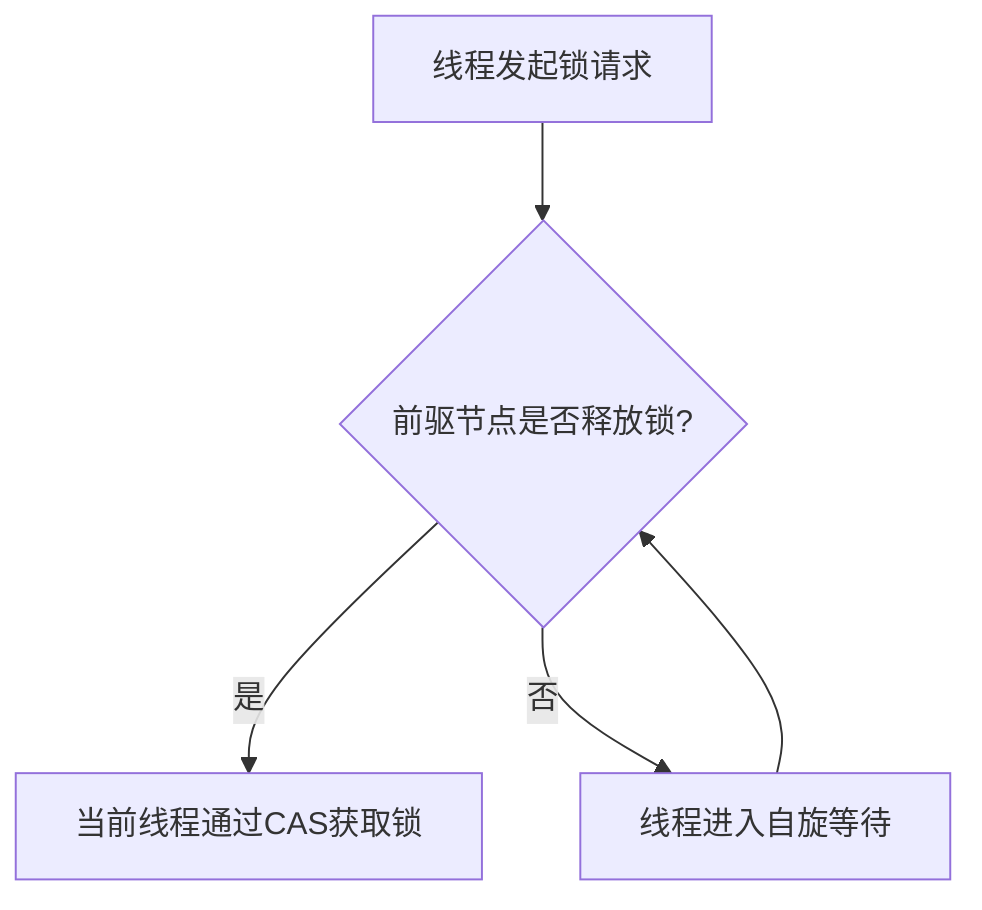
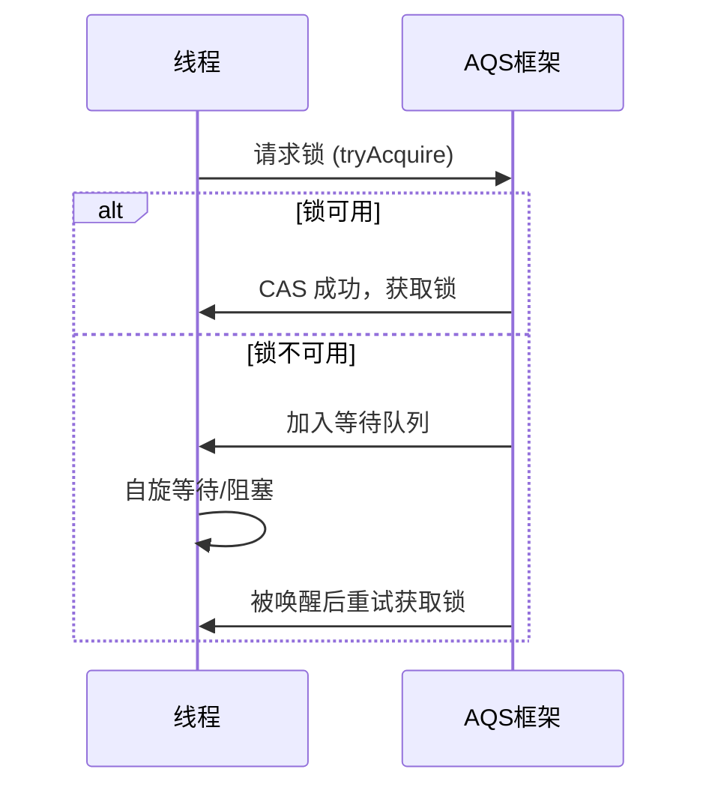

# CLK锁队列

# Java面试八股：并发中的AQS与CLK详解

## 一、概述与定义

Java 语言在并发编程方面提供了丰富的工具和抽象，尤其在 JDK1.5 之后，通过 java.util.concurrent 包大量同步器实现，使得多线程编程更加健壮和高效。其中，**AbstractQueuedSynchronizer（AQS）** 是一个用于构建锁和同步器的框架，其基本思想在于通过一个整数状态（state）以及一个 FIFO 等待队列来管理线程的获取与释放。AQS 采用了 CAS 操作来保证状态的原子更新，因而实现了线程安全的同步器。😊

在实际应用中，许多常见的同步器（如 ReentrantLock、Semaphore、CountDownLatch 等）均是基于 AQS 构建的。而本文重点介绍的叶子节点——**CLK**（可视作基于 CLH 锁设计思想的锁实现），则是 AQS 框架在并发控制中的一种具体应用。CLK 通过自旋、CAS 操作和等待队列等机制实现了高性能的锁竞争控制，是面试中常见的考点之一。

## 二、主要特点

AQS 与 CLK 作为并发控制的核心组件，其主要特点如下：

- **高效性** &#x20;

  利用 CAS 操作和自旋优化，能够在大多数情况下避免线程切换带来的性能损耗。💨
- **灵活性与可扩展性** &#x20;

  AQS 框架通过定义同步状态和 FIFO 队列，实现了多种不同类型的同步器。用户可以通过继承 AQS 来定制专门的同步器；而 CLK 则在此基础上，针对特定场景优化了锁竞争。🔧
- **公平性与非公平性支持** &#x20;

  AQS 支持公平（FIFO）和非公平策略的选择，帮助开发者根据实际需求权衡性能与线程调度的公平性。⚖️
- **简洁的内部结构** &#x20;

  内部主要由同步状态、等待队列、节点等组成，结构清晰，便于理解和调试。📊
- **易于调试与分析** &#x20;

  AQS 的设计便于定位线程竞争问题，而 CLK 作为一种高效锁实现，在性能调优时具有参考价值。🔍

下表总结了 AQS 与 CLK 的核心特点：

| 特点    | AQS                      | CLK（基于 CLH 锁）              |
| ----- | ------------------------ | -------------------------- |
| 设计思想  | 利用 state 和 FIFO 队列实现线程同步 | 采用自旋与等待队列相结合的自旋锁设计         |
| 更新方式  | 基于 CAS 操作，保证原子性          | 依赖 CAS 和 volatile 变量实现状态更新 |
| 公平性支持 | 支持公平与非公平两种调度策略           | 通常采用非公平方式，但可适当改进公平性        |
| 应用场景  | 构建各类同步器（锁、信号量、倒计时器等）     | 高性能场景下的锁竞争，降低线程上下文切换       |
| 扩展性   | 易于扩展，适应多种并发场景            | 可作为特定场景下的轻量级锁实现            |

## 三、应用目标

AQS 的设计目标在于提供一个通用的同步器构造器，使得开发者无需从零开始编写复杂的并发控制逻辑即可实现各种同步机制。具体来说，AQS 的应用目标包括：

1. **构建自定义锁** &#x20;

   通过继承 AQS，可以轻松实现如可重入锁、读写锁等复杂同步器。例如，ReentrantLock 就是基于 AQS 的非公平或公平版本实现的。
2. **实现信号量、倒计时器等同步器** &#x20;

   AQS 不仅限于锁的实现，其状态机制适用于多种同步场景，如 Semaphore（信号量）、CountDownLatch（倒计时器）等。
3. **高性能线程调度** &#x20;

   通过自旋和 CAS 操作减少线程切换，提升高并发场景下的性能。

而对于 CLK（基于 CLH 锁设计思想的锁），其目标则主要体现在：

- **降低线程阻塞开销** &#x20;

  采用自旋技术尽量避免线程阻塞和唤醒的上下文切换，适用于短时锁竞争场景。
- **实现轻量级高效同步** &#x20;

  在多核 CPU 环境下，通过优化自旋锁策略，实现较高的并发吞吐量和响应速度。
- **适应高频率锁竞争场景** &#x20;

  针对高并发系统中锁竞争频繁的情况，提供一种快速响应和释放的同步机制。

## 四、主要内容及其组成部分

本部分详细解析 AQS 与 CLK 的组成结构，并结合示例进行说明。

### 1. AQS 的核心组成部分

AQS 的内部主要包含以下几个部分：

- **同步状态（state）** &#x20;

  一个整型变量，用于记录同步状态。对于独占锁，state 通常表示锁是否被占用；对于共享锁，则表示可共享的许可数。 &#x20;

  例如： &#x20;
  ```java 
  private volatile int state;
  ```

- **FIFO 等待队列** &#x20;

  当线程无法获取锁时，会被封装为 Node 节点加入 FIFO 队列。队列中保存了线程等待的次序，确保了公平性或近似公平性。 &#x20;

  队列中常见字段包括 head（队列头节点）和 tail（队列尾节点）。
- **Node 节点结构** &#x20;

  每个等待线程都被封装为一个 Node 对象，记录线程状态、前驱和后继节点、等待状态等。 &#x20;

  节点状态常见取值： &#x20;
  - SIGNAL：表示当前节点的后继线程需要唤醒。 &#x20;
  - CANCELLED：表示节点已经取消等待。 &#x20;
  - CONDITION：用于条件队列中。 &#x20;

下表展示了 AQS 内部节点常见状态的说明：

| 状态 | 说明                        |
| -- | ------------------------- |
| 0  | 初始状态，表示未被占用               |
| 1  | 已被线程占用，等待队列中可能被标记为 SIGNAL |
| -1 | 表示取消等待或线程中断               |

此外，AQS 通过 CAS 操作更新 state，从而保证并发场景下的线程安全。

### 2. CLK 的组成及实现原理

CLK（在本篇中视作基于 CLH 锁设计的锁实现）是 AQS 框架下的一种具体实现，其主要思路在于利用 CLH 锁算法进行线程排队和自旋等待。其组成部分主要包括：

- **前驱节点与后继节点** &#x20;

  CLH 锁通过维护每个线程前驱节点的状态来决定当前线程是否可以获取锁。线程只需监控其前驱节点是否释放锁，从而避免全局轮询。
- **自旋等待机制** &#x20;

  当线程未获取锁时，会在短时间内自旋，检查前驱节点的状态变化。若前驱节点释放锁，则当前线程通过 CAS 操作获取锁。 &#x20;

  自旋过程减少了线程阻塞和唤醒带来的上下文切换开销。🔥
- **CAS 操作与 volatile 变量** &#x20;

  利用 CAS 保证状态的原子更新，并结合 volatile 关键字确保状态对各线程的可见性。

下图展示了基于 CLH 锁思想的线程获取锁过程的流程图（使用 Mermaid 绘制）：




*说明：图中流程表明线程在获取锁时，首先检测前驱节点状态，若已释放则尝试通过 CAS 获取锁，否则进入自旋状态，直至成功。*

### 3. 示例代码解析

以下示例展示了如何基于 AQS 实现一个简单的自定义同步器，并结合 CLK 思想实现一个轻量级锁：

```java 
import java.util.concurrent.locks.AbstractQueuedSynchronizer;

public class CLKLock {
    // 内部同步器类，继承 AQS
    private static class Sync extends AbstractQueuedSynchronizer {
        // 尝试获取锁：若 state 为 0 则使用 CAS 更新为 1
        @Override
        protected boolean tryAcquire(int acquires) {
            return compareAndSetState(0, 1);
        }

        // 尝试释放锁：直接将 state 置为 0
        @Override
        protected boolean tryRelease(int releases) {
            setState(0);
            return true;
        }
    }
    
    private final Sync sync = new Sync();
    
    public void lock() {
        // 采用自旋方式获取锁，模仿 CLH 自旋等待
        while (!sync.tryAcquire(1)) {
            // 自旋等待，同时可加入 Thread.onSpinWait() 优化
            Thread.yield();
        }
    }
    
    public void unlock() {
        sync.tryRelease(1);
    }
}
```


*解释：* &#x20;

- 通过继承 AbstractQueuedSynchronizer 实现同步器核心逻辑。 &#x20;
- tryAcquire 方法通过 CAS 尝试将 state 从 0 更新为 1，实现锁的获取； &#x20;
- 当获取失败时，线程进入自旋状态，模拟 CLH 锁中监控前驱节点的机制； &#x20;
- unlock 方法直接重置 state 为 0，从而释放锁。

此外，实际 CLH 锁的实现会涉及到节点的排队、前驱节点状态监控等更复杂的逻辑，上述代码为简化版示例，帮助理解 AQS 与自旋锁相结合的基本原理。

## 五、原理剖析

深入剖析 AQS 与 CLK 的实现原理，有助于理解它们在高并发场景下如何确保线程安全与高效调度。

### 1. AQS 的内部工作原理

AQS 内部采用**CAS（Compare And Swap）** 操作来保证对同步状态的原子更新。当线程请求锁时，会执行以下步骤：

1. **尝试获取锁** &#x20;

   调用 tryAcquire 方法，若当前 state 状态允许则通过 CAS 操作成功获得锁。 &#x20;

   关键点在于 CAS 操作利用硬件指令实现原子性，避免了锁竞争下的不一致性问题。🔒
2. **失败后的等待队列** &#x20;

   若获取锁失败，线程会被封装为 Node 节点加入 FIFO 等待队列中。队列中的节点通过前驱后继关系维持等待顺序。 &#x20;

   AQS 通过 volatile 和内存屏障保证各节点状态的可见性，防止线程出现饥饿现象。
3. **唤醒机制** &#x20;

   当持有锁的线程释放锁时，会唤醒等待队列中处于 SIGNAL 状态的后继线程，使其再次尝试获取锁。 &#x20;

   这种机制既保障了公平性（若使用公平策略）又提高了并发性能。

### 2. CLK 的原理解析

CLK（基于 CLH 锁思想的锁）的实现中，重点在于自旋等待与前驱节点状态检测，其原理可归纳为以下几点：

- **前驱依赖** &#x20;

  每个线程只需关心其前驱节点的状态变化，而无需扫描整个等待队列，从而降低了竞争范围。这种设计可以在一定程度上减少无谓的内存一致性开销。
- **自旋优化** &#x20;

  在短时间内自旋等待，避免线程切换带来的代价，适用于持锁时间较短的场景。 &#x20;

  此处可结合 Thread.onSpinWait() 方法，提示 JVM 优化自旋行为。😊
- **状态可见性** &#x20;

  利用 volatile 关键字保证前驱节点状态的可见性，当前驱释放锁时，当前线程能及时感知并尝试获取锁。 &#x20;

  CAS 操作在自旋中反复尝试更新 state，确保状态转换的正确性和原子性。
- **公平与非公平策略** &#x20;

  虽然大多数自旋锁实现采用非公平策略以降低延迟，但在高负载环境下，适当的公平性设计可以防止某些线程长时间饥饿。 &#x20;

  这一点在实际应用中需要根据具体场景进行取舍和优化。⚖️

下面用 Mermaid 图示描述 AQS 锁状态的转换流程：




*说明：* 该图描述了线程请求锁时的状态转换，从尝试获取锁、加入等待队列到最终通过唤醒机制重新获取锁的过程。

### 3. CAS 与 volatile 的关键作用

- **CAS（Compare And Swap）** &#x20;

  作为无锁编程的核心机制，CAS 保证在多个线程竞争时，只有一个线程能够成功修改 state，其余线程通过失败重试保证最终一致性。
- **volatile 关键字** &#x20;

  确保多个线程对 state 的访问具有可见性，防止 CPU 缓存导致的状态不一致问题。在自旋锁的设计中，volatile 保证了前驱节点状态的实时更新。

这些机制共同作用，确保了 AQS 与 CLK 在高并发环境下能够高效且正确地协调线程调度。

## 六、应用与拓展

在实际项目中，基于 AQS 的同步器和基于 CLH 锁思想的 CLK 有着广泛的应用和扩展空间。

### 1. 常见同步器的构建

利用 AQS 框架，可以构建出多种同步器，如下表所示：

| 同步器                    | 作用描述                | 应用场景              |
| ---------------------- | ------------------- | ----------------- |
| ReentrantLock          | 可重入互斥锁，支持公平和非公平策略   | 控制临界区访问，保护共享资源    |
| CountDownLatch         | 倒计时器，允许线程等待其他线程完成任务 | 多线程任务协调、等待多个子线程完成 |
| Semaphore              | 信号量，控制同时访问特定资源的线程数  | 限制资源访问数量，如数据库连接池  |
| ReentrantReadWriteLock | 读写锁，允许多线程并发读取但独占写入  | 缓存数据保护、文件读写控制     |

开发者可根据具体业务需求选择适合的同步器，同时也可以通过扩展 AQS 实现更复杂的同步策略。

### 2. 高性能并发场景的应用

在高并发环境下，线程竞争激烈，使用传统的阻塞锁可能导致线程上下文切换频繁。基于 AQS 与 CLK 的设计可以：

- **降低阻塞与唤醒开销** &#x20;

  自旋等待在短时竞争场景下显著提高性能，适用于轻量级锁需求。 &#x20;
- **实现细粒度锁控制** &#x20;

  通过定制同步状态与队列管理，实现更加灵活的锁策略，避免过度锁定导致性能瓶颈。 &#x20;
- **支持复杂同步模式** &#x20;

  如组合锁、分段锁等，满足大规模并发系统对吞吐量和响应时间的高要求。

### 3. 拓展：混合锁与锁优化

在实际应用中，往往需要结合自旋锁与阻塞锁的优点，设计出混合锁策略。例如，短时竞争时采用自旋等待，竞争激烈或持锁时间较长时采用阻塞机制。通过调节自旋次数和超时时间，可以平衡性能与公平性。

此外，还可结合 AQS 实现如下高级功能：

- **超时锁** &#x20;

  在获取锁时设定超时条件，防止长时间等待导致系统响应缓慢。
- **中断响应** &#x20;

  允许线程在等待锁时响应中断，增强系统鲁棒性。
- **条件变量支持** &#x20;

  结合 AQS 的条件队列，实现类似 Object.wait/notify 的等待唤醒机制，支持复杂的同步逻辑。

这些拓展使得 AQS 成为构建高性能并发框架的重要基础。

## 七、面试问答

下面从面试者角度出发，提供五个常见问题及详细回答，帮助求职者在面试中从容应对考官提问。

### 1. 什么是 AQS？它的设计初衷是什么？

AQS，即 AbstractQueuedSynchronizer，是 Java 提供的一个构建同步器的抽象类。它的设计初衷在于简化多线程同步控制的开发，通过维护一个整型的同步状态和一个 FIFO 等待队列，利用 CAS 保证线程安全，实现了诸如 ReentrantLock、Semaphore、CountDownLatch 等多种同步器。AQS 采用了灵活的设计模式，使得开发者只需关注如何定义同步状态的获取和释放逻辑，而不必操心底层线程调度细节。

### 2. 如何实现自定义的同步器？

在实现自定义同步器时，我们通常需要继承 AQS，并重写以下两个关键方法：

- **tryAcquire(int)**：尝试获取锁，根据具体业务逻辑通过 CAS 更新状态。 &#x20;
- **tryRelease(int)**：释放锁，同样需要更新状态。 &#x20;

此外，对于共享模式下，还需实现 tryAcquireShared 与 tryReleaseShared。 &#x20;

例如，实现一个简单的独占锁：

```java 
public class MyLock extends AbstractQueuedSynchronizer {
    @Override
    protected boolean tryAcquire(int acquires) {
        return compareAndSetState(0, 1);
    }
    
    @Override
    protected boolean tryRelease(int releases) {
        setState(0);
        return true;
    }
    
    public void lock() {
        acquire(1);
    }
    
    public void unlock() {
        release(1);
    }
}
```


这种设计极大简化了同步器的开发过程，同时充分利用了 AQS 内部的等待队列和唤醒机制。

### 3. 请解释 CLK（基于 CLH 锁思想）的基本原理和实现思路？

CLK 锁借鉴了 CLH 锁的设计思想，其核心在于让每个线程只关注自身前驱节点的状态。具体来说，当线程请求锁时，不必轮询整个队列，只需检测前驱节点是否释放锁。若前驱节点释放锁，则当前线程通过 CAS 操作获取锁；否则，线程在一定时间内自旋等待。这种机制减少了不必要的线程调度和上下文切换，从而在高并发场景下显著提升性能。简单示例代码如下：

```java 
public class CLKLock {
    private static class Sync extends AbstractQueuedSynchronizer {
        @Override
        protected boolean tryAcquire(int acquires) {
            return compareAndSetState(0, 1);
        }
        
        @Override
        protected boolean tryRelease(int releases) {
            setState(0);
            return true;
        }
    }
    
    private final Sync sync = new Sync();
    
    public void lock() {
        while (!sync.tryAcquire(1)) {
            Thread.yield();
        }
    }
    
    public void unlock() {
        sync.tryRelease(1);
    }
}
```


此代码虽为简化版，但展示了如何利用 AQS 与自旋等待实现轻量级锁。

### 4. AQS 中如何保证线程安全和公平性？

AQS 通过以下两方面保证线程安全与公平性：

- **线程安全性**： &#x20;

  采用 CAS 操作对同步状态进行原子更新，并结合 volatile 关键字确保内存可见性，从而防止多线程同时修改状态出现数据不一致的问题。
- **公平性**： &#x20;

  AQS 内部维护了 FIFO 等待队列。当采用公平策略时，每个线程必须按照入队顺序依次获取锁，确保先等待的线程优先获得资源；而非公平策略则允许线程在竞争中抢占锁，从而在某些场景下提升吞吐量。

这种设计既能满足高性能要求，又能在必要时提供公平调度保障。

### 5. 在实际项目中，如何选择使用 AQS 实现的不同同步器？

实际项目中，同步器的选择依赖于具体业务需求和并发场景：

- 若需要严格的互斥控制，则可选用基于 AQS 的 ReentrantLock；
- 对于需要多个线程等待某个条件的场景，CountDownLatch 或 CyclicBarrier 更为合适；
- 若场景中存在大量读操作和少量写操作，采用 ReentrantReadWriteLock 能够提高并发吞吐量；
- 而对于高频率锁竞争场景，基于 CLH 锁思想的 CLK 锁通过自旋等待和前驱节点检测可以显著降低上下文切换开销。 &#x20;

选择时需权衡公平性、响应时间和系统负载，必要时可通过自定义扩展 AQS 以满足特殊需求。

***

总结以上内容，从 AQS 的基本原理、核心组成部分到 CLK 锁的设计思想，再到各种同步器的应用与扩展，均展现了 Java 并发编程中深入且完备的知识体系。对于面试来说，熟悉这些内容不仅有助于回答理论问题，更能通过代码示例和原理剖析展现出对并发控制机制的深刻理解。希望这篇文章能帮助广大 Java 工程师在面试过程中获得更大信心与优势。
