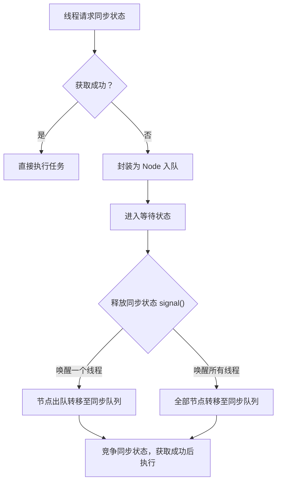

# 同步队列

# Java面试八股 —— 并发中的AQS同步队列详解

## 1. 概述与定义

在 Java 并发编程中，AbstractQueuedSynchronizer（简称 AQS）是构建各种同步器（如 ReentrantLock、Semaphore、CountDownLatch 等）的基础框架。AQS 的核心思想在于利用一个整型同步状态（state）和一个队列来管理线程的等待和唤醒，从而实现对共享资源的互斥或共享控制。

其中，**同步队列**是 AQS 内部最重要的组成部分之一。它主要用于存放那些未能成功获取同步状态的线程。每当线程尝试获取锁或其他同步资源失败时，就会被封装成一个 Node 对象加入到同步队列中，按照先进先出的顺序排队等待。待持有锁的线程释放资源后，通过唤醒队列中等待的线程，使其重新竞争获取锁资源。😊

同步队列不仅确保了线程等待顺序（FIFO）或者近似公平性，而且通过 CAS（Compare And Swap）操作和 volatile 关键字保证了多线程环境下操作的原子性与内存可见性。这种设计大大降低了忙等待和不必要的线程上下文切换，提升了系统的整体性能和响应速度。

## 2. 主要特点

AQS 同步队列具有以下几个主要特点：

- **FIFO 排队** &#x20;

  同步队列遵循先进先出（FIFO）的原则，线程按照请求顺序依次入队，从而保证公平性或近似公平性（在非公平策略下可能有一定偏差，但整体结构依然保证顺序）。
- **高效挂起与唤醒** &#x20;

  利用 LockSupport 等机制，线程在入队后被挂起，只有当持有资源的线程释放锁时，等待线程才会被唤醒继续竞争。这样避免了忙等待带来的 CPU 浪费。🔥
- **原子性操作** &#x20;

  同步队列的节点插入、删除均依赖 CAS 操作实现原子更新，确保多线程并发修改队列时数据的一致性和正确性。
- **内存可见性** &#x20;

  使用 volatile 关键字保证关键字段（如状态、节点指针）的内存可见性，使得一个线程对队列的修改能及时被其他线程感知。
- **分离等待与同步** &#x20;

  AQS 设计上将等待队列与条件等待队列区分开来，同步队列专注于管理线程竞争同步状态，而条件队列则用于实现更加复杂的条件等待机制，二者协同工作，实现灵活的线程调度。

下表对同步队列的主要特点进行了归纳：

| 特点      | 说明                                    | 备注             |
| ------- | ------------------------------------- | -------------- |
| FIFO 排队 | 线程按照进入队列的顺序等待唤醒                       | 保证基本的公平性       |
| 高效挂起唤醒  | 利用 LockSupport 挂起线程，唤醒时通过 signal 机制通知 | 降低 CPU 资源消耗    |
| 原子性操作   | 依赖 CAS 操作更新队列指针，确保并发安全                | 避免并发修改冲突       |
| 内存可见性   | volatile 确保关键状态字段对所有线程及时可见            | 防止内存缓存带来的状态不一致 |
| 分离设计    | 同步队列与条件队列分离，满足不同同步场景下的调度需求            | 提高系统扩展性与可维护性   |

## 3. 应用目标

同步队列在 AQS 框架中的应用目标主要有以下几点：

1. **实现线程的有序等待** &#x20;

   当多个线程同时竞争共享资源时，同步队列通过 FIFO 排队，使得线程按照一定顺序等待资源，从而避免了抢占带来的混乱，确保系统调度的合理性。
2. **提高系统性能** &#x20;

   通过挂起等待线程，避免了线程忙等待（busy waiting）占用 CPU 时间，同时在资源释放后仅唤醒必要的线程，降低上下文切换的开销，从而提高系统整体吞吐量和响应速度。
3. **构建多种同步器** &#x20;

   同步队列是构建各种同步器（例如独占锁和共享锁）的基础模块。开发者可以通过继承 AQS 并重写特定方法，利用同步队列机制快速构建出满足业务需求的自定义同步器。
4. **实现灵活的线程调度** &#x20;

   同步队列不仅用于线程等待，还支持中断、超时等高级功能，使得线程在等待过程中能够根据条件及时退出等待状态，避免因长时间等待引发的死锁或饥饿现象。😊
5. **简化并发编程复杂性** &#x20;

   将线程等待和唤醒逻辑封装在同步队列中，降低了开发者直接操作底层线程调度的复杂性，使得并发控制的实现更为简洁明了，同时有助于面试时展示对并发底层原理的深刻理解。

## 4. 主要内容及其组成部分

同步队列作为 AQS 框架的关键模块，其内部实现涉及多个组成部分，下面对每个部分进行详细解析。

### 4.1 节点（Node）结构

在同步队列中，每个等待线程都会被封装为一个 Node 对象。Node 结构主要包含以下几个属性：

- **线程引用（Thread thread）** &#x20;

  保存等待线程的引用，以便在需要唤醒时调用。
- **前驱节点和后继节点（Node prev, Node next）** &#x20;

  同步队列采用链表结构，利用前后指针将各个 Node 串联起来，形成 FIFO 队列。
- **等待状态（int waitStatus）** &#x20;

  用于表示当前节点的状态，常见状态包括：
  - 0：初始状态
  - SIGNAL（通常为 -1）：表示当前节点的后继需要被唤醒
  - CANCELLED（通常为 1）：表示该节点已因中断或超时而失效
- **模式标识** &#x20;

  部分同步器需要区分独占模式与共享模式，节点中会包含相应标识，决定唤醒时的不同处理逻辑。

下表展示了 Node 节点常用状态的说明：

| 状态        | 说明           | 数值 |
| --------- | ------------ | -- |
| 初始状态      | 节点刚入队时的默认状态  | 0  |
| SIGNAL    | 表示需要唤醒后继线程   | -1 |
| CANCELLED | 节点因中断或超时而被取消 | 1  |

### 4.2 队列头和尾指针

同步队列采用链表结构，通常通过两个指针管理队列：

- **head 指针** &#x20;

  指向队列的头部。头节点通常不存放有效线程数据，而是作为哨兵节点，帮助管理队列操作。
- **tail 指针** &#x20;

  指向队列的尾部，新入队的 Node 将被插入到该位置。tail 指针的更新通过 CAS 操作保证原子性，以应对多线程并发入队的场景。

### 4.3 入队与出队机制

**入队过程：** &#x20;

当线程获取同步状态失败时，会执行以下步骤入队：

1. 将当前线程封装为 Node 对象。
2. 利用 CAS 操作将 Node 插入到链表尾部，并更新 tail 指针。
3. 成功入队后，节点进入等待状态，等待后续被唤醒重新竞争。

**出队过程：** &#x20;

出队主要发生在持有资源的线程释放同步状态时：

1. 调用 signal 或 signalAll 方法，唤醒等待队列中的一个或多个节点。
2. 被唤醒的节点从同步队列中移除，并转移至 AQS 同步队列（或直接参与竞争）。
3. 出队过程中同样依赖于 CAS 操作保证更新的原子性。

下面是一段简化版代码，展示了节点入队的基本逻辑：

```java 
static final class Node {
    volatile int waitStatus;
    volatile Node prev;
    volatile Node next;
    volatile Thread thread;
    
    Node(Thread thread) {
        this.thread = thread;
    }
    
    Node(Thread thread, Node pred) {
        this.thread = thread;
        this.prev = pred;
    }
}

private Node enq(final Node node) {
    for (;;) {
        Node t = tail;
        if (t == null) { // 队列为空，初始化头节点
            if (compareAndSetHead(new Node(null))) {
                tail = head;
            }
        } else {
            node.prev = t;
            if (compareAndSetTail(t, node)) {
                t.next = node;
                return t;
            }
        }
    }
}
```


上述代码中，`enq` 方法通过无限循环与 CAS 操作确保 Node 能够正确地插入同步队列，同时保证在高并发下队列结构的一致性。😊

### 4.4 同步队列与条件队列的区别

在 AQS 中，同步队列与条件队列分别承担不同的职责：

- **同步队列**：用于管理因竞争同步状态而等待的线程，确保线程按照顺序进入竞争状态。
- **条件队列**：用于管理调用 await() 后因条件不满足而等待的线程，其与同步队列分离开来，便于实现更精细的等待通知机制。

这种设计使得 AQS 在实现锁、信号量等同步器时能够灵活调整线程等待与唤醒策略。

## 5. 原理剖析

深入理解同步队列的工作原理，对于面试和调优至关重要。下面从多个角度对同步队列进行详细解析。

### 5.1 入队操作的原理

当线程请求锁但未能成功时，其会被封装为 Node 对象并入队。入队过程依赖于 CAS 操作更新 tail 指针，确保每个节点都能原子性地插入队列。关键点如下：

- 线程首先检查队列是否为空，若为空则初始化头节点。
- 非空时，将当前 Node 的 prev 指针指向当前尾节点，然后使用 CAS 将 tail 更新为当前 Node。
- CAS 操作若失败，则说明有其他线程同时进行入队操作，当前线程会重新获取最新的 tail 继续尝试入队。

### 5.2 出队与唤醒机制

当持有锁的线程释放同步状态时，会执行唤醒操作：

1. 通过 signal 或 signalAll 方法，从同步队列中选择需要唤醒的 Node。
2. 将被唤醒的节点状态标记更新，并利用 LockSupport.unpark(thread) 唤醒对应线程。
3. 被唤醒的线程随后会进入重新竞争状态，直至成功获取同步状态。

这种机制避免了所有线程同时唤醒带来的激烈竞争，保证系统资源得到合理利用。

### 5.3 内存模型与原子性

同步队列中，CAS 操作和 volatile 关键字起到了决定性作用：

- **CAS 操作**：保证节点入队和出队过程中指针更新的原子性，避免因并发操作导致的队列混乱。
- **volatile 关键字**：确保 Node 对象中的状态字段（如 waitStatus）在多线程之间的及时可见性，避免由于 CPU 缓存带来的数据不一致问题。

### 5.4 状态转换流程图

下面使用 Mermaid 绘制流程图，描述线程从竞争同步状态、入队等待到被唤醒的状态转换过程：




图中展示了当线程竞争同步状态失败后，如何封装为 Node 进入同步队列等待，并在同步状态释放后通过唤醒机制进入重新竞争的完整流程。

## 6. 应用与拓展

同步队列作为 AQS 框架的核心机制，在实际开发中得到了广泛应用，并为构建多种同步器提供了基础支持。下面列举几个主要应用场景及拓展方向：

### 6.1 构建各类同步器

许多 Java 并发同步器的实现都依赖于同步队列机制，例如：

- **ReentrantLock**：在独占模式下，线程因竞争失败进入同步队列等待被唤醒，从而保证锁的互斥性。
- **Semaphore**：当可用许可不足时，线程进入同步队列等待许可释放。
- **CountDownLatch**：利用同步队列实现线程等待其他任务完成后统一释放等待。

通过继承 AQS 并重写相应方法，开发者可以快速构建自定义同步器，满足特殊业务需求。

### 6.2 自定义扩展

在实际项目中，有时需要对同步队列进行扩展或定制：

- **超时等待机制**：在同步队列中加入超时策略，确保线程在超时后自动退出等待状态，避免无限期挂起。
- **中断响应机制**：检测节点中的中断状态，使等待线程在必要时能及时退出队列，提高系统鲁棒性。
- **共享与独占模式混合**：根据业务需求调整队列中节点的唤醒策略，实现既支持共享又支持独占的复杂同步器。

### 6.3 与异步编程结合

在响应式或异步编程场景下，同步队列的思想也可被借鉴，用于调度任务和管理资源。将异步任务请求封装为队列节点，并结合回调机制，可以实现高效的任务调度系统。

下表总结了同步队列在不同同步器中的应用场景：

| 同步器                    | 应用场景               | 同步队列作用           |
| ---------------------- | ------------------ | ---------------- |
| ReentrantLock          | 临界区保护，保证线程互斥       | 线程竞争失败时入队等待唤醒    |
| Semaphore              | 控制并发访问共享资源，如数据库连接数 | 等待许可不足时入队等待      |
| CountDownLatch         | 多线程等待其他任务完成        | 等待倒计时结束后统一唤醒所有线程 |
| ReentrantReadWriteLock | 读写分离，提高并发访问性能      | 管理读写线程竞争，保证合理调度  |

## 7. 面试问答

下面从面试者角度出发，提供五个常见的面试问题及详细回答，帮助大家在面试中展示对 AQS 同步队列机制的深入理解。

### 7.1 问题一：什么是 AQS 同步队列？它在并发控制中起到什么作用？

回答： &#x20;

AQS 同步队列是 AQS 框架内部用于管理获取同步状态失败的线程的 FIFO 链表。线程在竞争锁或同步资源时，若无法立即获取，会被封装为 Node 对象加入同步队列，等待资源释放后通过唤醒机制重新竞争。这样既保证了线程等待的有序性，又避免了忙等待和频繁上下文切换，从而提高系统性能和响应速度。

### 7.2 问题二：请简述同步队列中 Node 的主要组成部分及其作用。

回答： &#x20;

在同步队列中，每个 Node 对象主要包含以下几个部分： &#x20;

- 线程引用（thread）：保存等待线程的引用，用于唤醒操作； &#x20;
- 前驱节点（prev）和后继节点（next）：通过双向链表链接，保证 FIFO 排队； &#x20;
- 等待状态（waitStatus）：记录节点状态（如初始状态、SIGNAL、CANCELLED），决定后续唤醒逻辑。 &#x20;

这些字段共同保证了节点能够在并发环境中正确入队、等待和被唤醒。

### 7.3 问题三：同步队列如何保证入队和出队操作的原子性？

回答： &#x20;

同步队列采用了 CAS 操作和 volatile 关键字来保证原子性和内存可见性。入队时，通过 CAS 更新 tail 指针，确保多个线程同时入队时队列结构不会混乱；出队或唤醒时，同样依赖 CAS 更新节点状态和链表指针，保证节点从队列中正确移除，从而确保同步队列在并发环境下始终保持一致性和正确性。🔥

### 7.4 问题四：请解释同步队列与条件队列的区别及各自的作用。

回答： &#x20;

同步队列和条件队列在 AQS 中分别承担不同职责： &#x20;

- 同步队列用于管理因竞争同步状态而等待的线程，确保线程按照 FIFO 顺序等待并在资源释放时被唤醒； &#x20;
- 条件队列则用于实现更细粒度的条件等待，比如线程因特定条件不满足而调用 await() 进入等待状态。 &#x20;

二者分离设计，使得 AQS 能够在实现锁和其他同步器时既满足竞争机制，又能实现灵活的条件控制。

### 7.5 问题五：请举例说明如何利用同步队列实现自定义同步器。

回答： &#x20;

在自定义同步器中，我们通常继承 AQS 并重写 tryAcquire 和 tryRelease 方法。当线程竞争失败时，AQS 会自动调用 enq 方法将当前线程封装为 Node 对象加入同步队列。下面是一段简单的独占锁示例代码：

```java 
import java.util.concurrent.locks.AbstractQueuedSynchronizer;

public class CustomLock {
    private final Sync sync = new Sync();
    
    private static class Sync extends AbstractQueuedSynchronizer {
        @Override
        protected boolean tryAcquire(int acquires) {
            return compareAndSetState(0, 1);
        }
        
        @Override
        protected boolean tryRelease(int releases) {
            setState(0);
            return true;
        }
    }
    
    public void lock() {
        if (!sync.tryAcquire(1)) {
            // 入队后等待直至获取锁
            sync.acquire(1);
        }
    }
    
    public void unlock() {
        sync.release(1);
    }
}
```
