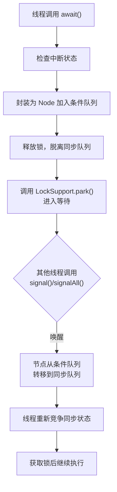

# 条件队列

## 1. 概述与定义

在 Java 并发编程中，AbstractQueuedSynchronizer（简称 AQS）提供了一种构建同步器的通用框架，它通过维护一个整型状态（state）和队列来管理线程竞争。AQS 中有两个核心队列： &#x20;

- **同步队列（Synchronization Queue）**：用于管理因竞争同步状态而等待的线程； &#x20;
- **条件队列（Condition Queue）**：用于管理因条件不满足而主动进入等待状态的线程，也称为条件等待队列。

**条件队列**是 AQS 内部通过内部类 ConditionObject 实现的，用于支持线程在持有锁的情况下进行条件等待。当线程调用 Condition 的 await() 方法时，会将自己从同步队列中“脱离”出来，放入条件队列中，等待特定条件满足后被 signal 或 signalAll 唤醒，再重新进入同步队列竞争锁资源。😊

条件队列的设计使得线程可以基于更加灵活的条件判断进行等待，不再像传统的 Object.wait/notify 那样简单粗暴。它的实现依赖于 AQS 的内在结构，通过节点（Node）链表来记录等待线程，从而实现精准的等待与唤醒机制。条件队列与同步队列虽然都是线程等待队列，但在作用、结构和使用方式上均有明显区别。

## 2. 主要特点

AQS 条件队列具有以下主要特点：

- **分离条件与同步** &#x20;

  条件队列将等待条件与锁的竞争分离开来。线程在调用 await() 后不再竞争同步状态，而是进入条件队列，只有在被 signal 或 signalAll 唤醒后，才会重新进入同步队列参与竞争。这样设计使得等待与唤醒逻辑更加明确，代码也更易于理解和维护。
- **支持多条件变量** &#x20;

  一个锁可以绑定多个 Condition 对象，每个 Condition 对象对应一个独立的条件队列。这样可以针对不同的业务逻辑建立多种等待机制，满足复杂并发场景下的需求。😊
- **精确唤醒机制** &#x20;

  条件队列通过 signal() 或 signalAll() 方法唤醒等待线程，避免了不必要的全部唤醒，有助于降低线程调度开销，提高系统响应效率。
- **响应中断与超时** &#x20;

  Condition 提供了 awaitUninterruptibly、awaitNanos 和 awaitUntil 等方法，允许线程在等待时能够响应中断或设置超时时间，提升了系统的健壮性。
- **内存可见性与原子性** &#x20;

  利用 volatile 关键字和 CAS 操作，条件队列中关键字段（如节点状态）的更新保证了线程间的及时可见性和操作的原子性，从而避免由于内存缓存导致的状态不一致问题。

下面的表格总结了条件队列的主要特点：

| 主要特点      | 详细说明                                   | 备注            |
| --------- | -------------------------------------- | ------------- |
| 分离条件与同步   | 将等待条件和锁的竞争分离，线程通过 await() 进入条件队列等待条件满足 | 提高代码的清晰性和可维护性 |
| 支持多条件变量   | 一个锁可以对应多个 Condition，每个 Condition 有独立队列 | 适用于复杂业务场景     |
| 精确唤醒机制    | 仅唤醒等待特定条件的线程，避免全部唤醒造成过度竞争              | 提高性能          |
| 响应中断与超时   | 支持中断和超时等待，防止线程长时间挂起                    | 提升系统健壮性       |
| 内存可见性与原子性 | 利用 volatile 和 CAS 保证状态更新的及时性与原子性       | 确保并发正确性       |

## 3. 应用目标

条件队列在 AQS 框架中主要用于实现条件等待机制，目标在于解决多线程并发条件控制问题。其具体应用目标包括：

1. **实现条件等待与精确唤醒** &#x20;

   条件队列允许线程在等待过程中根据业务条件主动挂起，只有当条件满足后才被唤醒重新竞争锁资源，从而避免线程不必要的等待和资源浪费。
2. **提升系统响应性** &#x20;

   支持中断与超时机制，使线程在等待过程中能够及时响应系统变化，防止因等待时间过长引起的死锁或饥饿问题，提高系统的鲁棒性和响应速度。
3. **构建复杂同步器** &#x20;

   通过条件队列可以构建出如生产者消费者、读写分离等多种同步模型，为各种业务场景提供灵活的并发解决方案。
4. **增强业务逻辑表达能力** &#x20;

   将条件判断与等待分离，使得代码逻辑更加清晰，开发者可以更直观地表达“等待条件”与“竞争锁”两种行为，降低并发编程的复杂度。😊
5. **降低线程上下文切换** &#x20;

   精确唤醒机制确保只有必要的线程被唤醒，减少无效竞争，从而降低线程上下文切换的开销，提升系统整体性能。

## 4. 主要内容及其组成部分

AQS 的条件队列主要由内部类 ConditionObject 实现，其核心组成部分包括：

### 4.1 ConditionObject 类

在 AQS 中，ConditionObject 实现了 java.util.concurrent.locks.Condition 接口，是条件队列的具体实现。它将线程从同步队列中移出，进入条件队列等待，然后在条件满足后再转回同步队列。

### 4.2 Node 节点

条件队列同样使用 Node 节点来记录等待线程的信息，每个 Node 至少包含以下字段：

- **thread**：当前等待线程的引用，用于后续唤醒；
- **nextWaiter**：指向队列中下一个节点，用于构成链表结构；
- **waitStatus**：节点状态，记录线程是否处于等待状态、是否已取消等待等。 &#x20;
  - 0 表示初始状态 &#x20;
  - CONDITION（特定值）表示处于条件队列中 &#x20;
  - CANCELLED 表示因中断或超时取消等待

下面的代码示例展示了 ConditionObject 内部 Node 的简化实现：

```java 
static final class Node {
    volatile Thread thread;
    // 指向条件队列中的下一个等待节点
    Node nextWaiter;
    // 节点状态：0 表示初始状态，特殊值表示等待条件状态
    int waitStatus;
    
    Node(Thread thread) {
        this.thread = thread;
    }
}
```


### 4.3 条件队列链表结构

ConditionObject 内部维护一个单向链表，记录所有调用 await() 的线程。该链表有一个头结点（firstWaiter）和尾节点（lastWaiter）。当线程调用 await() 后，会将自己包装成 Node 加入队列末尾；而当其他线程调用 signal() 或 signalAll() 时，会从队列头依次唤醒节点。 &#x20;

这种链表结构保证了等待顺序，并支持批量唤醒。

### 4.4 方法实现

ConditionObject 提供了多个方法来支持条件等待与唤醒，如：

- **await()** &#x20;

  线程调用 await() 后，先将自身加入条件队列，然后释放持有的锁，进入等待状态。唤醒后，线程将重新竞争同步状态。
- **awaitUninterruptibly()** &#x20;

  类似 await()，但在等待过程中不响应中断。
- **awaitNanos(long nanosTimeout)** 和 **awaitUntil(Date deadline)** &#x20;

  支持带超时的等待，当超时后线程自动退出等待队列。
- **signal()** &#x20;

  唤醒条件队列中的第一个线程，将其从条件队列转移到同步队列中，使其重新参与竞争。
- **signalAll()** &#x20;

  唤醒条件队列中的所有线程。

下面是 ConditionObject 部分方法的简化实现示例：

```java 
public final void await() throws InterruptedException {
    // 检查线程中断状态
    if (Thread.interrupted())
        throw new InterruptedException();
    // 将当前线程包装为 Node，加入条件队列
    Node node = addConditionWaiter();
    // 释放当前持有的锁，并保存状态
    int savedState = fullyRelease(node);
    // 进入等待循环，直到被 signal 唤醒后转入同步队列
    while (!isOnSyncQueue(node)) {
        LockSupport.park(this);
        if (Thread.interrupted())
            // 中断后取消等待并抛出异常
            cancelWait(node);
    }
    // 重新获取锁
    reacquire(savedState);
}
 
public final void signal() {
    if (!isHeldExclusively())
        throw new IllegalMonitorStateException();
    Node first = firstWaiter;
    if (first != null)
        doSignal(first);
}
```


*说明：* 该代码展示了线程调用 await() 时的基本流程——检查中断、加入条件队列、释放锁、挂起等待以及最终被唤醒后重新竞争同步状态。

## 5. 原理剖析

深入剖析 AQS 条件队列的原理，可以帮助理解线程如何在等待条件与竞争同步状态之间转换，其核心原理主要涉及以下几个方面：

### 5.1 线程进入条件队列

当线程调用 await() 时，流程大致如下：

1. 检查中断状态。如果线程已经中断，则直接抛出 InterruptedException。 &#x20;
2. 将线程包装成 Node 对象，并将其插入到 ConditionObject 的条件队列中（通过 addConditionWaiter() 方法）。 &#x20;
3. 调用 fullyRelease() 方法释放当前持有的锁，将线程从同步队列中移除。 &#x20;
4. 线程进入等待状态，调用 LockSupport.park() 使自身挂起，直到被其他线程通过 signal()/signalAll() 唤醒。😊

### 5.2 唤醒与转移过程

当其他线程调用 signal() 时，流程如下：

1. 首先检查调用线程是否持有锁，确保调用合法性。 &#x20;
2. 从条件队列头部取出一个等待的 Node，并调用 doSignal() 方法。 &#x20;
3. 在 doSignal() 方法中，将该 Node 从条件队列中移除，然后将其转移到同步队列中，使其重新参与同步状态的竞争。 &#x20;
4. 最终，被唤醒的线程通过 LockSupport.unpark(thread) 得到唤醒机会，并在竞争到同步状态后继续执行。

### 5.3 内存可见性与原子操作

在整个过程中，条件队列依赖 CAS 操作和 volatile 关键字：

- **CAS 操作**：用于在条件队列中原子性地更新队列指针，保证多个线程同时修改队列时不会出现数据竞争。 &#x20;
- **volatile 关键字**：确保 Node 节点中的状态和队列指针对所有线程都及时可见，避免因 CPU 缓存问题导致状态不一致。🔥

### 5.4 状态转换流程图

下面使用 Mermaid 绘制一幅流程图，描述线程从调用 await() 进入条件队列、被 signal 唤醒、再重新竞争同步状态的状态转换过程：




图中展示了线程进入条件队列后如何被唤醒并最终重新获得同步状态的完整过程。

## 6. 应用与拓展

AQS 条件队列在实际开发中有着广泛的应用和拓展方向，主要包括以下几个方面：

### 6.1 实现复杂的条件等待机制

在多线程协作场景中，经常需要根据不同条件控制线程等待。例如，在生产者消费者模型中，消费者线程在缓冲区为空时需要等待，而生产者线程在缓冲区满时也需等待。利用条件队列，可以为同一把锁绑定多个 Condition 对象（如 notEmpty 与 notFull），分别管理不同的等待条件，实现精确唤醒，避免不必要的线程竞争。

### 6.2 构建自定义同步器

开发者可以继承 AQS 并结合条件队列实现自定义同步器。比如，在设计一个既支持公平等待又能处理多种条件的锁时，通过重写 await()、signal() 方法，实现条件队列与同步队列之间的协调操作，为复杂业务场景提供可靠的并发控制。

### 6.3 中断与超时控制

条件队列支持线程中断和超时等待。在实际项目中，可以利用这些特性，防止线程长时间处于等待状态，从而提高系统健壮性。开发者可以根据业务需要设计出既响应中断又支持超时退出的同步机制。

### 6.4 与响应式编程结合

在现代高并发、响应式编程场景下，条件队列的思想也可以应用于异步任务调度中。将异步任务请求封装为等待队列中的节点，结合回调机制，可以实现高效的任务调度和资源管理，进一步提升系统吞吐量和响应速度。😊

下面的表格展示了条件队列在不同场景中的应用：

| 应用场景     | 主要用途                          | 条件队列作用              |
| -------- | ----------------------------- | ------------------- |
| 生产者消费者模型 | 分别等待缓冲区非空和非满条件，精确唤醒对应线程       | 为不同条件建立独立队列，减少误唤醒   |
| 自定义同步器   | 构建支持多种条件的锁和同步器                | 实现线程等待、超时、中断等高级控制   |
| 异步任务调度   | 将异步任务请求转化为等待队列中的节点，结合回调机制调度执行 | 管理任务排队与唤醒，降低上下文切换开销 |
| 多条件协作    | 多个线程根据不同业务条件协同工作              | 分离不同条件，支持精准通知与等待    |

## 7. 面试问答

下面提供五个常见的面试问题及详细回答，帮助面试者从容展示对 AQS 条件队列的深入理解：

### 7.1 问题一：什么是 AQS 条件队列？它与同步队列的区别是什么？

回答： &#x20;

AQS 条件队列是 AQS 内部通过 ConditionObject 实现的，用于管理调用 await() 进入等待状态的线程。这些线程不再竞争同步状态，而是等待特定条件满足后被唤醒，再转移到同步队列中重新竞争。与同步队列不同，同步队列用于管理因竞争同步状态失败而等待的线程，而条件队列专注于条件等待，两者各司其职，互不干扰。😊

### 7.2 问题二：请简述线程调用 await() 后在条件队列中的流程。

回答： &#x20;

当线程调用 await() 时，首先检查自身中断状态，若无中断，则将线程包装为 Node 对象加入条件队列。接着，线程释放持有的锁，进入挂起状态（通过 LockSupport.park()）。当其他线程调用 signal() 或 signalAll() 时，等待线程对应的 Node 会被移出条件队列，转移到同步队列中，线程随后重新竞争锁资源，最终获取锁后继续执行。🔥

### 7.3 问题三：条件队列如何支持中断和超时机制？

回答： &#x20;

AQS 的 ConditionObject 提供了 awaitUninterruptibly、awaitNanos 以及 awaitUntil 方法，使线程在等待过程中可以响应中断或者在指定时间后自动退出等待。通过这些方法，线程在调用 await() 时会不断检查中断标志或超时条件，确保在满足条件或超时后能够及时退出，避免无限挂起，提高系统健壮性。😊

### 7.4 问题四：signal() 与 signalAll() 在条件队列中的作用是什么？

回答： &#x20;

signal() 方法用于唤醒条件队列中等待的第一个线程，将其从条件队列移到同步队列中，使其重新参与锁竞争；而 signalAll() 则会唤醒条件队列中所有等待的线程。精确唤醒机制避免了不必要的全部唤醒，从而减少竞争和上下文切换，提高系统性能。🔥

### 7.5 问题五：请举例说明如何利用条件队列实现生产者消费者模型？

回答： &#x20;

在生产者消费者模型中，可以使用 ReentrantLock 创建两个 Condition 对象（例如 notFull 与 notEmpty）。当生产者发现缓冲区已满时，调用 notFull.await() 将自己加入条件队列等待；消费者在缓冲区为空时，调用 notEmpty.await() 进入等待状态。当生产者放入数据后，通过 notEmpty.signal() 唤醒消费者；反之，当消费者取走数据后，调用 notFull.signal() 唤醒生产者。下面的示例代码展示了这一过程：

```java 
import java.util.concurrent.locks.Condition;
import java.util.concurrent.locks.ReentrantLock;

public class ProducerConsumer {
    private final ReentrantLock lock = new ReentrantLock();
    // 定义两个条件变量：notFull 和 notEmpty
    private final Condition notFull = lock.newCondition();
    private final Condition notEmpty = lock.newCondition();
    private final Object[] buffer = new Object[10];
    private int count, putIndex, takeIndex;
    
    public void put(Object item) throws InterruptedException {
        lock.lock();
        try {
            while (count == buffer.length) {
                notFull.await();
            }
            buffer[putIndex] = item;
            if (++putIndex == buffer.length) {
                putIndex = 0;
            }
            count++;
            notEmpty.signal();
        } finally {
            lock.unlock();
        }
    }
    
    public Object take() throws InterruptedException {
        lock.lock();
        try {
            while (count == 0) {
                notEmpty.await();
            }
            Object item = buffer[takeIndex];
            buffer[takeIndex] = null;
            if (++takeIndex == buffer.length) {
                takeIndex = 0;
            }
            count--;
            notFull.signal();
            return item;
        } finally {
            lock.unlock();
        }
    }
}
```


在上述代码中，通过两个 Condition 分别控制缓冲区满和空的情况，利用条件队列实现了线程之间的精确协作。

## 总结

本文从概述与定义、主要特点、应用目标、主要内容及其组成部分、原理剖析、应用与拓展，再到面试问答，全面深入地解析了 Java 并发中 AQS 条件队列的实现机制。 &#x20;

- 在概述部分，我们介绍了条件队列在 AQS 框架中的定义及其与同步队列的区别； &#x20;
- 主要特点部分总结了条件队列分离条件与同步、支持多条件变量、精确唤醒、中断超时支持以及内存可见性等关键特性； &#x20;
- 应用目标部分阐明了条件队列如何帮助实现精准的线程等待、提升响应性、构建复杂同步器以及降低上下文切换； &#x20;
- 主要内容及其组成部分详细解析了 ConditionObject 类、节点结构、条件队列链表结构和相关方法的实现，并辅以代码示例； &#x20;
- 原理剖析部分通过对线程进入条件队列、唤醒与转移机制以及内存模型的解析，并结合 Mermaid 流程图，深入揭示了条件队列的工作原理； &#x20;
- 应用与拓展部分讨论了条件队列在生产者消费者、自定义同步器、异步任务调度等场景中的实际应用； &#x20;
- 最后，通过五个常见面试问答，帮助面试者从容展示对 AQS 条件队列机制的理解。

通过全面掌握 AQS 条件队列的原理与实现，开发者不仅能够编写出高性能、灵活的并发程序，还能在面试中自信地回答与条件等待机制相关的各种问题。希望这篇文章能成为广大 Java 工程师备战面试的重要参考资料，助力你在并发编程领域不断突破与进步！ 😊
