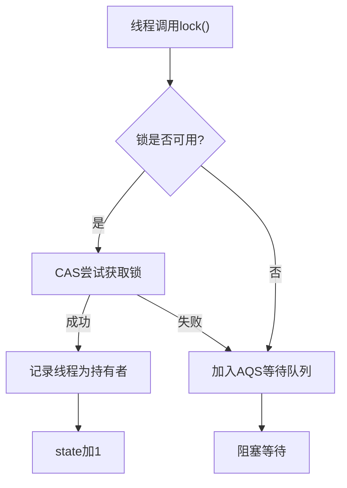

# 3. Lock

# Java并发编程中的Lock详解：面试八股文全攻略

***

## 1. 概述与定义

在Java并发编程中，`Lock`是`java.util.concurrent.locks`包下的一个接口，定义了锁的基本操作方法。它提供了一种比传统`synchronized`关键字更灵活、更强大的同步机制。`synchronized`是Java早期的内置同步工具，虽然简单易用，但存在一些局限性，例如无法中断等待锁的线程、无法实现非阻塞锁获取等。而`Lock`接口的出现，填补了这些空白，让开发者能够更精细地控制多线程环境下的资源访问。

`Lock`的主要实现类是`ReentrantLock`（可重入锁），它实现了`Lock`接口的所有方法，支持线程多次获取同一把锁，并提供了公平锁和非公平锁的选项。此外，`Lock`还支持条件变量（`Condition`），为线程间的协作提供了更强大的支持。简单来说，`Lock`是Java并发编程中的“升级版锁”，适用于需要更高灵活性和控制力的场景。

***

## 2. 主要特点

`Lock`相较于`synchronized`，拥有以下显著特点，值得在面试中重点记忆：

- **可重入性** 🔁 &#x20;

  一个线程可以多次获取同一把锁，每次获取时，锁的计数器加1；释放时，计数器减1，直到计数器为0，锁才真正被释放。这种特性避免了线程自己被自己阻塞的情况。
- **可中断性** ⏹️ &#x20;

  在等待锁时，线程可以被中断（通过`lockInterruptibly()`方法），抛出`InterruptedException`，从而避免死锁或无限等待。
- **超时机制** ⏳ &#x20;

  通过`tryLock(long time, TimeUnit unit)`方法，线程可以在指定时间内尝试获取锁，若超时未获取，则返回`false`，放弃等待。
- **公平性** ⚖️ &#x20;

  `Lock`支持公平锁（Fair Lock）和非公平锁（Non-Fair Lock）。公平锁按照线程请求锁的顺序分配，防止线程“饥饿”；非公平锁允许线程插队，可能提升吞吐量。
- **条件变量** 📡 &#x20;

  通过`newCondition()`方法，`Lock`可以创建多个`Condition`对象，用于线程间的精确协作，类似`Object`的`wait()`和`notify()`，但更灵活。

这些特点让`Lock`在复杂并发场景中游刃有余，面试时如果能结合具体场景阐述这些特点，会给面试官留下深刻印象！

***

## 3. 应用目标

`Lock`的主要目标是为多线程程序提供一种灵活、高效的同步机制，解决并发访问共享资源时可能出现的数据不一致问题。相比`synchronized`，`Lock`适用于以下场景：

- 需要更细粒度的锁控制，比如支持中断或超时。
- 需要实现公平锁，避免某些线程长时间无法获取资源。
- 需要多个条件变量来协调线程行为。
- 需要更高的性能和吞吐量（通过非公平锁）。

简而言之，`Lock`的目标是让开发者在面对复杂的并发需求时，能够“随心所欲”地设计同步策略，提升程序的性能和响应性。🎯

***

## 4. 主要内容及其组成部分

`Lock`作为一个接口，定义了一系列核心方法，每个方法都有其独特的作用。以下是`Lock`接口的全部方法及其详细解释：

### 4.1 `void lock()`

- **作用**: 获取锁。如果锁当前可用，线程立即获取；如果锁不可用，线程会被阻塞，直到锁被释放。
- **使用场景**: 需要确保线程安全时，强制获取锁。
- **示例**:

```java 
Lock lock = new ReentrantLock();
lock.lock(); // 获取锁
try {
    // 访问共享资源
    System.out.println(Thread.currentThread().getName() + " 获取了锁");
} finally {
    lock.unlock(); // 释放锁
}
```


- **注意**: 必须在`finally`块中释放锁，避免异常导致锁未释放。

### 4.2 `void lockInterruptibly()`

- **作用**: 获取锁，但允许线程在等待时被中断。如果被中断，会抛出`InterruptedException`。
- **使用场景**: 需要响应中断信号，避免线程长时间阻塞。
- **示例**:

```java 
Lock lock = new ReentrantLock();
try {
    lock.lockInterruptibly(); // 可中断地获取锁
    System.out.println("锁已获取");
} catch (InterruptedException e) {
    System.out.println("等待锁时被中断");
} finally {
    if (lock.isHeldByCurrentThread()) {
        lock.unlock();
    }
}
```


### 4.3 `boolean tryLock()`

- **作用**: 尝试非阻塞地获取锁。如果锁可用，返回`true`并获取锁；否则返回`false`，不阻塞线程。
- **使用场景**: 不希望线程等待锁时阻塞。
- **示例**:

```java 
Lock lock = new ReentrantLock();
if (lock.tryLock()) {
    try {
        System.out.println("成功获取锁");
    } finally {
        lock.unlock();
    }
} else {
    System.out.println("获取锁失败");
}
```


### 4.4 `boolean tryLock(long time, TimeUnit unit)`

- **作用**: 在指定时间内尝试获取锁。如果成功，返回`true`；超时未获取，返回`false`。
- **使用场景**: 需要设置等待时间，避免无限期阻塞。
- **示例**:

```java 
Lock lock = new ReentrantLock();
try {
    if (lock.tryLock(2, TimeUnit.SECONDS)) {
        try {
            System.out.println("2秒内获取到锁");
        } finally {
            lock.unlock();
        }
    } else {
        System.out.println("2秒超时，放弃获取锁");
    }
} catch (InterruptedException e) {
    System.out.println("等待时被中断");
}
```


### 4.5 `void unlock()`

- **作用**: 释放锁。如果锁计数器减为0，则锁被完全释放，其他线程可以获取。
- **使用场景**: 在获取锁后，必须手动释放。
- **注意**: 只能由持有锁的线程调用，否则抛出`IllegalMonitorStateException`。

### 4.6 `Condition newCondition()`

- **作用**: 创建一个与当前锁绑定的`Condition`对象，用于线程间的等待和唤醒。
- **使用场景**: 需要实现生产者-消费者模式等复杂协作。
- **示例**:

```java 
Lock lock = new ReentrantLock();
Condition condition = lock.newCondition();

lock.lock();
try {
    System.out.println("等待条件");
    condition.await(); // 线程等待
    System.out.println("被唤醒");
} catch (InterruptedException e) {
    e.printStackTrace();
} finally {
    lock.unlock();
}

// 另一个线程唤醒
lock.lock();
try {
    condition.signal(); // 唤醒等待的线程
} finally {
    lock.unlock();
}
```


### 4.7 ReentrantLock的具体实现

`ReentrantLock`是`Lock`接口的默认实现，支持所有上述方法，并通过构造函数参数`boolean fair`设置公平性：

- `ReentrantLock()`: 默认非公平锁。
- `ReentrantLock(true)`: 公平锁。

***

## 5. 原理剖析

`ReentrantLock`的底层实现依赖于`AbstractQueuedSynchronizer`（AQS），一个强大的同步框架。理解其原理对面试中的深入问题至关重要。

### 5.1 AQS的核心结构

AQS维护了以下关键组件：

- **状态变量** (`state`): 表示锁的状态。`ReentrantLock`中，`state=0`表示锁未被持有，`state>0`表示锁被持有，值代表重入次数。
- **FIFO队列**: 存储等待锁的线程，使用双向链表实现。
- **线程持有者**: 记录当前持有锁的线程。

### 5.2 获取锁的流程

当线程调用`lock()`时：

1. **检查锁状态**: 通过CAS（Compare-And-Swap）尝试将`state`从0改为1。
2. **成功获取**: 如果CAS成功，且当前无其他线程持有锁，则线程获取锁，记录当前线程为持有者。
3. **重入**: 如果当前线程已持有锁，`state`加1。
4. **失败阻塞**: 如果锁被其他线程持有，当前线程被加入AQS的等待队列，进入阻塞状态。

Mermaid流程图如下：




### 5.3 释放锁的流程

当线程调用`unlock()`时：

1. **减少计数器**: `state`减1。
2. **完全释放**: 如果`state`变为0，锁被释放，持有者清空。
3. **唤醒队列**: AQS唤醒等待队列中的下一个线程，尝试获取锁。

### 5.4 公平性实现

- **公平锁**: 检查队列中是否有等待线程，若有，则当前线程加入队列尾部。
- **非公平锁**: 直接尝试抢锁，可能插队成功。

### 5.5 Condition原理

`Condition`基于AQS的等待队列实现。`await()`将线程加入条件队列，`signal()`唤醒队列中的线程。

***

## 6. 应用与拓展

`Lock`的应用场景非常广泛，以下是几个典型案例：

### 6.1 读写锁：ReentrantReadWriteLock

- **特点**: 读锁允许多线程共享，写锁独占。
- **示例**:

```java 
ReentrantReadWriteLock rwLock = new ReentrantReadWriteLock();
Lock readLock = rwLock.readLock();
Lock writeLock = rwLock.writeLock();

// 读操作
readLock.lock();
try {
    System.out.println("读取数据");
} finally {
    readLock.unlock();
}

// 写操作
writeLock.lock();
try {
    System.out.println("写入数据");
} finally {
    writeLock.unlock();
}
```


### 6.2 条件变量协作

实现生产者-消费者：

```java 
Lock lock = new ReentrantLock();
Condition notFull = lock.newCondition();
Condition notEmpty = lock.newCondition();
Queue<Integer> queue = new LinkedList<>();
int capacity = 10;

public void produce(int value) {
    lock.lock();
    try {
        while (queue.size() == capacity) {
            notFull.await();
        }
        queue.add(value);
        notEmpty.signal();
    } catch (InterruptedException e) {
        e.printStackTrace();
    } finally {
        lock.unlock();
    }
}

public int consume() {
    lock.lock();
    try {
        while (queue.isEmpty()) {
            notEmpty.await();
        }
        int value = queue.poll();
        notFull.signal();
        return value;
    } catch (InterruptedException e) {
        Thread.currentThread().interrupt();
        return -1;
    } finally {
        lock.unlock();
    }
}
```


### 6.3 锁降级

先获取写锁，再获取读锁，最后释放写锁：

```java 
ReentrantReadWriteLock rwLock = new ReentrantReadWriteLock();
Lock readLock = rwLock.readLock();
Lock writeLock = rwLock.writeLock();

writeLock.lock();
try {
    // 修改数据
    readLock.lock(); // 获取读锁
} finally {
    writeLock.unlock(); // 释放写锁
}
// 此时仍持有读锁
try {
    // 读取数据
} finally {
    readLock.unlock();
}
```


***

## 7. 面试问答

以下是面试中常见的`Lock`相关问题及详细回答：

### 7.1 Q: Lock和synchronized有什么区别？

**A**: 你好，`Lock`和`synchronized`都是Java中用于同步的工具，但它们有几个关键区别。首先，`Lock`是显式锁，需要手动调用`lock()`和`unlock()`来获取和释放锁，而`synchronized`是隐式锁，由JVM自动管理，代码块执行完后自动释放。其次，`Lock`功能更丰富，比如支持可中断锁（`lockInterruptibly()`）、超时获取（`tryLock(long, TimeUnit)`）和非阻塞尝试（`tryLock()`），而`synchronized`不支持这些。另外，`Lock`可以设置公平锁或非公平锁，`synchronized`只能是非公平锁。最后，`Lock`支持条件变量`Condition`，可以实现更灵活的线程协作，而`synchronized`只能依赖`wait()`和`notify()`。简单来说，`Lock`更灵活但需要手动管理，适合复杂场景；`synchronized`更简单，适合简单同步需求。

### 7.2 Q: ReentrantLock是如何实现可重入性的？

**A**: 嗯，`ReentrantLock`实现可重入性主要靠AQS的`state`计数器和线程持有者记录。当线程第一次调用`lock()`时，通过CAS将`state`从0变为1，并记录当前线程为锁的持有者。如果同一个线程再次调用`lock()`，AQS会检查当前持有者是否是自己，如果是，就直接把`state`加1，表示重入次数增加。释放锁时，调用`unlock()`会将`state`减1，直到`state`变为0，锁才真正被释放，其他线程才能获取。这样，通过计数器和线程检查，`ReentrantLock`就实现了可重入性，避免了自己阻塞自己的问题。

### 7.3 Q: 什么是公平锁和非公平锁？

**A**: 好的，公平锁和非公平锁是`ReentrantLock`的两种模式。公平锁（Fair Lock）是指线程获取锁的顺序跟它们请求锁的顺序一致，也就是FIFO。比如，如果线程A先请求锁，线程B后请求，那么即使锁释放后B先醒来，A也会优先获取锁。而非公平锁（Non-Fair Lock）则允许线程“插队”，锁释放后，谁抢到就归谁，可能导致后请求的线程先拿到锁。`ReentrantLock`默认是非公平锁，因为非公平锁吞吐量更高，但可能导致线程“饥饿”；公平锁更公平，但性能稍低。可以通过构造函数`ReentrantLock(true)`设置为公平锁。

### 7.4 Q: Lock如何实现线程间的协作？

**A**: 这个简单，`Lock`通过`Condition`对象实现线程协作。调用`newCondition()`可以创建一个与锁绑定的条件变量，类似`synchronized`中的`wait()`和`notify()`。比如，线程A调用`condition.await()`会释放锁并等待，进入条件队列；线程B调用`condition.signal()`会唤醒等待的线程，线程A被唤醒后重新竞争锁，获取后继续执行。通过这种方式，可以实现生产者-消费者模式等复杂协作。`Condition`的优势是可以创建多个条件变量，比`synchronized`的单一`wait/notify`更灵活。

### 7.5 Q: 在使用Lock时，如何避免死锁？

**A**: 避免死锁是并发编程的关键，用`Lock`时有几个方法可以预防。首先，**固定锁的获取顺序**，比如总是先锁A再锁B，避免循环等待。其次，可以用`tryLock()`尝试获取锁，如果拿不到就放弃或重试，避免一直阻塞。另外，设置超时机制，比如`tryLock(1, TimeUnit.SECONDS)`，超时后放弃锁，防止无限等待。还有，手动释放锁要放在`finally`块中，确保异常不会导致锁未释放。最后，借助工具分析死锁，比如用JConsole监控线程状态。总之，合理设计锁的获取和释放逻辑是避免死锁的核心。

***

## 总结

通过这篇文章，我们系统梳理了`Lock`在Java并发编程中的方方面面，从定义到原理，从应用到面试应对，内容详实且结构清晰。无论是代码示例还是流程图，都旨在帮助你更直观地理解`Lock`的奥秘。希望你在面试中面对`Lock`相关问题时，能胸有成竹、侃侃而谈，拿下心仪的Offer！💪
