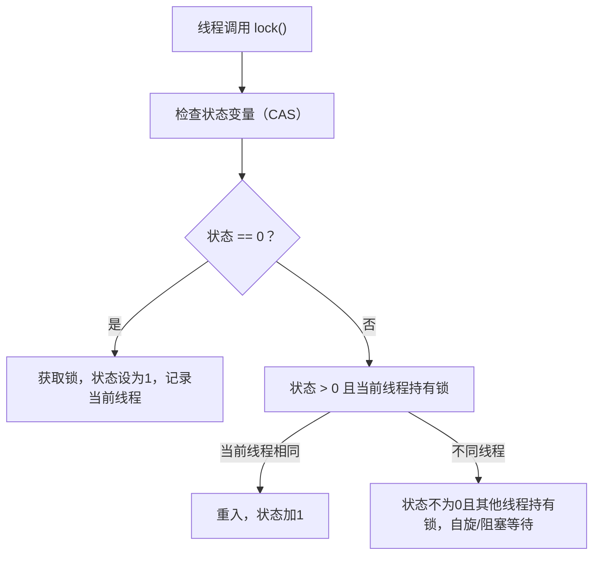

# 4. Synchronized VS Lock

## 1. 概述与定义

在多线程并发编程中，保证共享资源的一致性与线程安全是至关重要的。Java 提供了多种同步机制，其中最常用的两种是 Synchronized 关键字和 Lock 接口（如 ReentrantLock）。 &#x20;

**Synchronized** 是 Java 的内置同步机制，通过修饰方法或代码块来保证同一时刻只有一个线程能够执行同步代码区域，从而实现互斥访问。其底层依赖于对象的监视器（monitor），进入 synchronized 区块时，线程必须获得该对象的锁；退出时，锁自动释放。由于其内建且语法简单，synchronized 在使用上非常直观，但也存在不可中断、灵活性不足等问题。 &#x20;

**Lock** 接口则是 JDK 1.5 引入的一种显式锁机制，由于其提供了诸如可中断锁获取、定时锁获取以及公平锁选项等高级特性，能够满足更复杂的并发控制需求。其中，ReentrantLock 是 Lock 接口最常用的实现类，它支持可重入、可中断、定时等待等功能，使得线程同步更具灵活性。 &#x20;

简单来说，Synchronized 与 Lock 均用于实现线程同步，但两者在使用方式、功能扩展和性能调优方面存在明显差异。😊

## 2. 主要特点

### Synchronized 的特点

1. **内置关键字，易于使用** &#x20;
   - 直接通过 synchronized 修饰方法或代码块，无需额外类的支持。 &#x20;
   - 自动获取与释放对象锁，编码简单直观。 &#x20;
2. **隐式锁机制** &#x20;
   - 基于对象监视器实现，进入同步区域时自动获取锁，退出时自动释放。 &#x20;
   - 在进入/退出同步块时会自动插入内存屏障，保证内存可见性。 &#x20;
3. **不可中断与无定时等待** &#x20;
   - 获取锁过程中不可中断，无法指定等待超时，容易导致线程长时间阻塞。 &#x20;
4. **性能优化** &#x20;
   - JDK 1.6 以后，通过偏向锁、轻量级锁等优化技术，在无竞争时性能非常高。 &#x20;
   - 但在高竞争环境下可能出现较多阻塞和上下文切换开销。 &#x20;

### Lock 的特点

1. **显式加锁，灵活可控** &#x20;
   - Lock 接口需要手动调用 lock() 和 unlock() 方法，控制粒度更细。 &#x20;
   - 支持公平锁和非公平锁，可根据业务需求调整锁获取策略。 &#x20;
2. **支持可中断和定时锁获取** &#x20;
   - lockInterruptibly() 方法允许在等待锁时响应中断，tryLock(timeout) 支持定时等待，能有效避免死锁和长时间阻塞。 &#x20;
3. **Condition 条件变量** &#x20;
   - 与 Lock 结合使用，通过 newCondition() 方法创建多个条件等待队列，实现类似 wait/notifyAll 的功能，但更灵活。 &#x20;
4. **编程复杂度较高** &#x20;
   - 需要手动管理锁的获取与释放，容易出现忘记释放锁等问题，编码上比 synchronized 复杂。 &#x20;

下面的表格对 Synchronized 与 Lock 的主要特点进行了直观对比：

| 特性        | Synchronized                      | Lock（ReentrantLock）           |
| --------- | --------------------------------- | ----------------------------- |
| 使用方式      | 内置关键字修饰方法或代码块                     | 显式调用 lock() 和 unlock()        |
| 自动释放锁     | 是                                 | 否，需在 finally 块中手动释放           |
| 可中断性      | 不支持                               | 支持 lockInterruptibly()        |
| 定时锁获取     | 不支持                               | 支持 tryLock(timeout, TimeUnit) |
| 条件等待机制    | 使用 Object 的 wait/notify（只能一个条件队列） | 使用 Condition 可创建多个等待队列        |
| 代码复杂度     | 简单                                | 相对复杂，但更灵活                     |
| 性能（无竞争时）  | 优秀，JVM 优化良好                       | 相当，非公平锁时性能较好                  |
| 性能（竞争激烈时） | 可能因阻塞和上下文切换开销增加                   | 自旋和公平策略可改善竞争性能                |

## 3. 应用目标

深入理解并正确选择 Synchronized 和 Lock 的同步机制，主要目的是确保并发环境下共享数据的安全性和一致性，同时提高系统并发性能。具体应用目标包括：

1. **保证数据一致性与原子性** &#x20;
   - 通过同步控制，确保多个线程在修改共享资源时数据更新为原子操作，避免出现竞态条件。 &#x20;
   - 例如，银行转账、订单处理等关键业务场景中，必须保证数据更新的正确性。
2. **提高系统并发性能** &#x20;
   - 采用合适的同步工具，减少不必要的线程阻塞和上下文切换，提升系统吞吐量。 &#x20;
   - 在高并发场景下，Lock 的可中断和定时获取特性可以避免长时间等待。
3. **实现灵活的线程协作** &#x20;
   - 通过使用 Condition、wait/notify 等机制，实现生产者–消费者、任务协调等复杂线程通信。 &#x20;
   - 这种方式既能避免忙等待，又能提高 CPU 利用率。
4. **适应不同业务需求** &#x20;
   - 根据业务场景选择使用 Synchronized 还是 Lock：对于简单、低竞争场景可使用 Synchronized，而在需要更高响应性或复杂控制时选用 Lock。 &#x20;
   - 合理的选择和调优能够平衡性能与安全性。
5. **降低开发和维护难度** &#x20;
   - 通过掌握两种同步机制，能够在实际项目中灵活切换，减少同步错误和死锁风险，提升代码稳定性。 &#x20;

总体来说，掌握 Synchronized 与 Lock 的区别及其使用场景，有助于构建高效、稳定且线程安全的并发程序，是 Java 并发编程中不可或缺的基础知识。🎯

## 4. 主要内容及其组成部分

本部分详细介绍 Synchronized 与 Lock 的主要内容及其组成部分，包括各自的使用方法、关键 API、内部机制及注意事项，确保你对每个细节都有深入理解。

### 4.1 Synchronized 的使用方式

#### 4.1.1 修饰方法

- **说明**：直接在方法声明上添加 synchronized，整个方法体为同步代码块。 &#x20;
- **示例**：

```java 
public class Counter {
    private int count = 0;
    
    public synchronized void increment() {
        count++;
    }
    
    public synchronized int getCount() {
        return count;
    }
}
```


- **优点**：实现简单，语法直观。 &#x20;
- **缺点**：锁粒度较大，可能导致不必要的阻塞。

#### 4.1.2 同步代码块

- **说明**：在方法内部使用 synchronized(锁对象) { ... } 实现局部同步。 &#x20;
- **示例**：

```java 
public class SharedResource {
    private final Object lock = new Object();
    private int value = 0;
    
    public void increment() {
        synchronized (lock) {
            value++;
        }
    }
    
    public int getValue() {
        synchronized (lock) {
            return value;
        }
    }
}
```


- **优点**：可以精确控制同步范围，锁粒度更细。 &#x20;
- **缺点**：需要明确指定锁对象，编程稍复杂。

### 4.2 Lock 的使用方式

#### 4.2.1 基本使用

- **说明**：通过 ReentrantLock 类创建锁对象，调用 lock() 获取锁，调用 unlock() 释放锁。 &#x20;
- **示例**：

```java 
import java.util.concurrent.locks.ReentrantLock;

public class LockDemo {
    private final ReentrantLock lock = new ReentrantLock();
    private int count = 0;
    
    public void increment() {
        lock.lock();
        try {
            count++;
        } finally {
            lock.unlock();
        }
    }
    
    public int getCount() {
        return count;
    }
}
```


- **优点**：灵活，可指定公平性，支持可中断、定时等待。 &#x20;
- **缺点**：使用时必须确保在 finally 块中释放锁，否则可能引起死锁。

#### 4.2.2 可中断锁获取

- **说明**：使用 lockInterruptibly() 方法，允许线程在等待锁时响应中断。 &#x20;
- **示例**：

```java 
public void doTask() {
    try {
        lock.lockInterruptibly();
        try {
            // 执行任务
        } finally {
            lock.unlock();
        }
    } catch (InterruptedException e) {
        System.out.println("线程在等待锁期间被中断");
    }
}
```


- **优点**：提高响应性，防止线程长时间阻塞。 &#x20;
- **缺点**：使用较复杂，需要处理中断异常。

#### 4.2.3 定时锁获取

- **说明**：使用 tryLock(long timeout, TimeUnit unit) 方法，尝试在规定时间内获取锁。 &#x20;
- **示例**：

```java 
import java.util.concurrent.TimeUnit;

public void tryLockTask() {
    try {
        if (lock.tryLock(500, TimeUnit.MILLISECONDS)) {
            try {
                // 执行任务
            } finally {
                lock.unlock();
            }
        } else {
            System.out.println("在 500 毫秒内未能获取到锁");
        }
    } catch (InterruptedException e) {
        e.printStackTrace();
    }
}
```


- **优点**：避免长时间等待，提高系统健壮性。 &#x20;
- **缺点**：需要合理设置超时时间，防止频繁重试。

#### 4.2.4 与 Condition 的结合

- **说明**：使用 ReentrantLock 提供的 newCondition() 方法获取 Condition 对象，实现线程间等待与通知。 &#x20;
- **示例**：生产者–消费者模式（详见下文）。

```java 
import java.util.concurrent.locks.Condition;
import java.util.concurrent.locks.ReentrantLock;

public class ProducerConsumer {
    private final ReentrantLock lock = new ReentrantLock();
    private final Condition notEmpty = lock.newCondition();
    private final Condition notFull = lock.newCondition();
    private final int[] buffer = new int[10];
    private int count, putIndex, takeIndex;
    
    public void produce(int value) throws InterruptedException {
        lock.lock();
        try {
            while (count == buffer.length) {
                notFull.await();
            }
            buffer[putIndex] = value;
            putIndex = (putIndex + 1) % buffer.length;
            count++;
            notEmpty.signal();
        } finally {
            lock.unlock();
        }
    }
    
    public int consume() throws InterruptedException {
        lock.lock();
        try {
            while (count == 0) {
                notEmpty.await();
            }
            int value = buffer[takeIndex];
            takeIndex = (takeIndex + 1) % buffer.length;
            count--;
            notFull.signal();
            return value;
        } finally {
            lock.unlock();
        }
    }
}
```


- **优点**：Condition 提供多等待队列，比 wait/notify 更灵活；可以分别管理不同的等待条件。 &#x20;
- **缺点**：编程模型较为复杂，使用时需要注意 signal 的时机。

## 5. 原理剖析

深入了解 Synchronized 与 Lock 的底层实现原理，可以帮助我们更好地选择与优化并发安全策略。下面详细剖析 ReentrantLock 的内部原理及其与 Synchronized 的对比。

### 5.1 AbstractQueuedSynchronizer（AQS）

- ReentrantLock 的核心实现依赖于 AbstractQueuedSynchronizer（AQS），这是一个用于构建锁和同步器的框架。 &#x20;
- AQS 通过一个 volatile 状态变量表示锁的持有状态，并利用 CAS 操作实现原子更新。 &#x20;
- 当线程无法获取锁时，会被封装成 Node 加入等待队列，通过自旋和阻塞机制等待锁释放。 &#x20;
- AQS 支持独占模式和共享模式，ReentrantLock 属于独占锁。

### 5.2 锁状态管理与重入机制

- ReentrantLock 内部使用一个状态变量记录锁持有次数。 &#x20;
- 当状态为 0 时，线程通过 CAS 操作将状态设置为 1，并成为锁拥有者；如果同一线程再次调用 lock()，状态累加实现重入。 &#x20;
- 当线程调用 unlock() 时，状态减 1，直到状态归零时释放锁。 &#x20;
- 这种机制确保同一线程能多次进入同步区域，同时防止其他线程介入。

### 5.3 公平锁与非公平锁

- ReentrantLock 可通过构造函数指定公平模式。 &#x20;
- 公平锁在获取锁时会检查等待队列，确保线程按顺序获得锁，防止线程饥饿，但性能略低； &#x20;
- 非公平锁直接尝试 CAS 更新状态，不顾等待队列顺序，性能较高，但可能导致部分线程长时间等待。 &#x20;
- 具体实现上，AQS 根据公平策略调整入队和唤醒逻辑。

### 5.4 自旋等待与阻塞策略

- 在 CAS 操作失败时，线程可能会自旋等待锁释放，以减少阻塞上下文切换。 &#x20;
- 自旋等待适用于竞争不激烈的场景，但竞争激烈时可能导致 CPU 占用率上升。 &#x20;
- AQS 通过自旋和阻塞机制平衡性能：在短时间内自旋重试，若重试次数超过阈值，则将线程加入阻塞队列等待唤醒。

### 5.5 内存屏障与可见性保证

- synchronized 与 Lock 都会在获取和释放锁时插入内存屏障，确保对共享变量的修改对其他线程可见。 &#x20;
- 在 ReentrantLock 中，锁的获取和释放通过 AQS 内部的 CAS 和 volatile 机制实现，这同样保证了内存可见性和有序性。 &#x20;

下面使用 Mermaid 图表展示 ReentrantLock 的锁获取流程：




图中展示了线程在调用 lock() 时，首先检查状态变量，若为 0 则通过 CAS 获取锁；如果状态大于 0且当前线程已经持有锁，则进行重入；否则，线程进入自旋等待或阻塞状态，直到锁释放。

## 6. 应用与拓展

深入理解 ReentrantLock 的内部实现与锁机制有助于在实际项目中做出最佳的并发控制策略，以下是几种典型应用与扩展方向：

### 6.1 高并发数据共享

- 在设计共享缓存、计数器等数据结构时，使用 ReentrantLock 替代 synchronized 以获得更高的性能与灵活性。 &#x20;
- 根据业务需求选择公平或非公平模式，进一步优化锁竞争。

### 6.2 生产者–消费者模型

- 结合 ReentrantLock 与 Condition 实现线程间通信，构建高效的生产者–消费者模型。 &#x20;
- 多个 Condition 对象可以分别管理不同的等待条件，提高系统响应速度。

### 6.3 任务调度与异步处理

- 在线程池和异步任务调度中，利用 ReentrantLock 控制共享资源，确保任务之间数据一致。 &#x20;
- 定时任务、周期性任务均可通过定时锁获取等方法进行精细控制。

### 6.4 自定义并发数据结构

- 结合 CAS 与 ReentrantLock 的思想，可以设计无锁或低锁并发数据结构，如无锁队列、并发栈等。 &#x20;
- 这些数据结构能在高并发环境下提高吞吐量，适用于分布式缓存和消息系统。

### 6.5 与高级并发工具结合

- ReentrantLock 可与 Semaphore、CountDownLatch、CyclicBarrier 等并发工具结合，实现复杂的线程协调和任务调度。 &#x20;
- 例如，在分布式系统中，通过这些工具构建稳定的任务调度平台，确保各模块协同工作。

下面的表格展示了 ReentrantLock 在不同并发场景下的应用与优化建议：

| 应用场景      | 选型建议                              | 优化策略                   |
| --------- | --------------------------------- | ---------------------- |
| 高并发数据共享   | 使用非公平锁以提高吞吐量                      | 缩小同步代码块，减少锁持有时间        |
| 生产者–消费者模型 | 使用公平锁或 Condition 实现线程协调           | 根据缓冲区状态合理调整等待与唤醒策略     |
| 异步任务调度    | 结合线程池与 ReentrantLock 实现任务调度       | 合理设置任务粒度和线程池参数，避免长时间阻塞 |
| 自定义并发数据结构 | 借鉴 CAS 与 ReentrantLock 设计无锁结构     | 结合自旋锁与退避策略，平衡性能与资源利用   |
| 复杂任务协同    | 与 Semaphore、CyclicBarrier 等工具配合使用 | 分离任务逻辑，确保各模块同步执行，防止死锁  |

## 7. 面试问答

下面列举了五个常见面试问题及详细回答，帮助你在面试中从容回答有关 ReentrantLock 与并发安全实现的考察问题。

### 问题1：请介绍 ReentrantLock 的基本概念，并说明它与 synchronized 的主要区别？

答： &#x20;
ReentrantLock 是一种基于 Lock 接口的可重入锁，提供了比 synchronized 更灵活的锁控制功能。与 synchronized 相比，ReentrantLock 支持公平锁和非公平锁、可中断锁获取和定时锁获取，还可以通过 Condition 实现更精细的线程通信。synchronized 语法简单，自动加锁和释放，但在高并发场景下可能因不可中断性和锁竞争导致性能瓶颈。

### 问题2：请详细说明 ReentrantLock 内部是如何利用 AbstractQueuedSynchronizer（AQS）实现锁管理的？

答： &#x20;
ReentrantLock 的核心实现依赖于 AbstractQueuedSynchronizer（AQS）。AQS 通过一个 volatile 状态变量表示锁状态，并使用 CAS 操作尝试更新状态。当线程获取锁失败时，AQS 将线程封装成 Node 加入等待队列，并采用自旋或阻塞方式等待锁释放。AQS 支持锁重入，通过状态计数记录同一线程的锁持有次数，直到状态归零时释放锁。整个过程利用了 CAS、内存屏障和阻塞队列等机制，实现了高效锁管理。

### 问题3：ReentrantLock 如何实现公平锁和非公平锁？请说明两者的实现原理及优缺点？

答： &#x20;
在 ReentrantLock 中，通过构造函数可以指定公平锁或非公平锁。公平锁在获取锁时会检查等待队列，按照请求顺序分配锁，避免线程饥饿，但性能开销较大；非公平锁直接通过 CAS 操作获取锁，性能较高，但可能导致部分线程长时间等待。公平锁适用于对响应顺序要求较高的场景，而非公平锁更适合高并发场景追求吞吐量。

### 问题4：请解释 ReentrantLock 中 lockInterruptibly() 和 tryLock(timeout) 方法的作用及使用场景？

答： &#x20;
lockInterruptibly() 方法允许线程在等待锁的过程中响应中断，避免长时间阻塞，适用于需要及时响应中断的场景。tryLock(timeout, TimeUnit unit) 方法允许线程在规定时间内尝试获取锁，超时后返回 false，从而防止线程无限等待。两者均提供了比 synchronized 更灵活的锁获取方式，适合高并发和需要快速响应的业务需求。

### 问题5：请谈谈你在项目中如何使用 ReentrantLock 与 Condition 实现线程间通信，并如何优化锁的性能？

答： &#x20;
在项目中，我常使用 ReentrantLock 与 Condition 实现生产者–消费者模式。当共享缓冲区为空时，消费者调用 Condition.await() 进入等待状态；当生产者生产数据后，调用 Condition.signal() 或 signalAll() 唤醒等待线程。为了优化锁性能，我会尽量缩小同步代码块范围，减少锁持有时间；同时，根据业务情况选择公平或非公平锁；在竞争激烈时，适当调整自旋重试策略以减少上下文切换。合理配置这些参数能显著提高系统并发性能，并降低死锁和饥饿风险。

## 总结

本文从概述与定义、主要特点、应用目标、主要内容及其组成部分、原理剖析、应用与拓展以及面试问答七个部分，全面详细地解析了 Java 并发安全中 ReentrantLock 的使用与底层实现，重点讨论了 Synchronized 与 Lock 的对比、ReentrantLock 的可重入性、公平与非公平模式、可中断与定时锁获取、Condition 机制以及底层依赖的 AQS 框架。文章中通过大量代码示例、详细的表格归纳和 Mermaid 图表展示了 ReentrantLock 的内部结构和工作流程，同时讨论了如何在实际项目中优化并发性能、降低锁竞争风险。 &#x20;

面试问答部分从面试者角度出发，针对常见问题给出了详细回答，涵盖了 ReentrantLock 的基本概念、内部实现、优势与不足、以及在实际项目中的应用策略。希望这篇文章能够为你的面试复习和项目开发提供充分支持，助你构建出高效、稳定且线程安全的并发系统。加油！🚀
