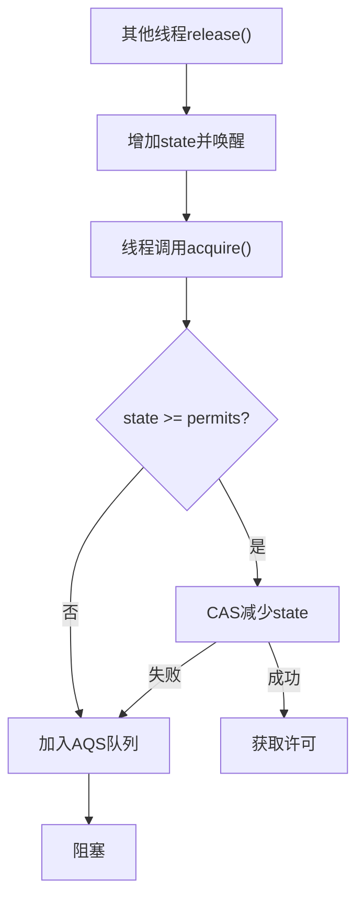

# 5. Semaphore

# Java并发编程中的Semaphore详解：面试八股文全攻略

***

## 1. 概述与定义

`Semaphore`是Java并发包中的一个同步工具类，位于`java.util.concurrent`包下，用于控制对共享资源的并发访问。它基于信号量机制，通过维护一组“许可”（permits）来限制同时访问资源的线程数量。线程在访问资源前必须调用`acquire()`方法获取许可，如果当前许可不足，线程会被阻塞；使用完毕后，通过`release()`方法释放许可，使其他等待线程有机会获取。

与传统的互斥锁（如`Lock`或`synchronized`）不同，`Semaphore`允许多个线程同时访问资源，前提是许可数量足够。这种特性使其非常适合需要限制并发访问数量的场景，例如数据库连接池、线程池或流量控制。形象地说，`Semaphore`就像一个停车场的管理员，控制着停车位（许可）的分配，确保资源不会被过度使用。🎟️

从定义上看，`Semaphore`的核心在于“计数”：许可数大于0时，线程可以获取并进入资源区；许可数为0时，新来的线程必须等待。这种机制让`Semaphore`在并发编程中具有独特的地位，既灵活又高效。

***

## 2. 主要特点

`Semaphore`具备以下几个关键特点，值得在面试中熟记并结合场景阐述：

- **许可计数机制** 📜 &#x20;

  `Semaphore`通过一个计数器管理许可数量。线程通过`acquire()`减少许可计数，通过`release()`增加计数。如果许可不足（计数小于0），线程会被阻塞。这种机制简单而强大。
- **支持多线程并发访问** 👥 &#x20;

  不同于互斥锁的“独占”特性，`Semaphore`允许多个线程同时持有许可并访问资源。例如，设置5个许可，就允许最多5个线程并发执行。
- **公平性可选** ⚖️ &#x20;

  `Semaphore`支持公平模式和非公平模式。公平模式下，线程按请求顺序获取许可；非公平模式下，线程可能插队，默认采用非公平模式以提升性能。
- **可中断性** ⏹️ &#x20;

  通过`acquireInterruptibly()`方法，线程在等待许可时可以被中断，避免无限阻塞或死锁风险。
- **批量操作** 📦 &#x20;

  `Semaphore`支持批量获取或释放许可，例如`acquire(int permits)`和`release(int permits)`，适用于需要一次性操作多个资源的场景。
- **非阻塞尝试** 🚦 &#x20;

  `tryAcquire()`方法允许线程尝试获取许可，若失败则立即返回，不会阻塞，适合需要快速响应的场景。

这些特点使得`Semaphore`在并发控制中非常灵活。面试时，若能结合实际案例（如限制数据库连接数）说明这些特点，会让回答更具说服力。

***

## 3. 应用目标

`Semaphore`的主要目标是**限制对共享资源的并发访问数量**，防止资源过载或耗尽，确保系统稳定性。它适用于以下场景：

- **限制并发线程数**：如控制同时访问数据库的线程数量，避免数据库压力过大。
- **资源池管理**：如线程池或连接池，通过许可控制可用资源数量。
- **流量控制**：在网络应用中，限制同时处理的请求数，防止服务器崩溃。
- **简易锁实现**：当许可数为1时，可退化为互斥锁（不过通常`Lock`更适合此场景）。

简而言之，`Semaphore`的目标是通过精确的许可管理，实现资源的合理分配和并发控制，是并发编程中的“限流神器”。🎯

***

## 4. 主要内容及其组成部分

`Semaphore`提供了丰富的API，涵盖创建、获取、释放和其他辅助功能。以下是对其所有方法的详尽解释：

### 4.1 构造函数

- **`Semaphore(int permits)`** &#x20;

  创建一个信号量，指定初始许可数，默认非公平模式。
- **`Semaphore(int permits, boolean fair)`** &#x20;

  创建信号量，指定许可数和是否为公平模式。

```java 
Semaphore semaphore = new Semaphore(3); // 3个许可，非公平
Semaphore fairSemaphore = new Semaphore(3, true); // 3个许可，公平
```


### 4.2 获取许可的方法

- **`void acquire()`** &#x20;

  获取一个许可，若无可用许可，线程阻塞。
- **`void acquire(int permits)`** &#x20;

  获取指定数量的许可，若不足则阻塞。
- **`void acquireInterruptibly()`** &#x20;

  可中断地获取一个许可，若被中断抛出`InterruptedException`。
- **`void acquireInterruptibly(int permits)`** &#x20;

  可中断地获取多个许可。
- **`boolean tryAcquire()`** &#x20;

  尝试获取一个许可，成功返回`true`，否则返回`false`，不阻塞。
- **`boolean tryAcquire(int permits)`** &#x20;

  尝试获取多个许可。
- **`boolean tryAcquire(long timeout, TimeUnit unit)`** &#x20;

  在指定时间内尝试获取一个许可，超时返回`false`。
- **`boolean tryAcquire(int permits, long timeout, TimeUnit unit)`** &#x20;

  在指定时间内尝试获取多个许可。

```java 
Semaphore semaphore = new Semaphore(2);
try {
    semaphore.acquire(); // 阻塞获取
    System.out.println("获取成功");
} catch (InterruptedException e) {
    e.printStackTrace();
}
```


### 4.3 释放许可的方法

- **`void release()`** &#x20;

  释放一个许可，增加计数器。
- **`void release(int permits)`** &#x20;

  释放指定数量的许可。

**注意**：释放许可无需持有许可，但逻辑上应确保获取和释放匹配，避免许可溢出或不足。

```java 
semaphore.release(); // 释放一个许可
```


### 4.4 其他辅助方法

- **`int availablePermits()`** &#x20;

  返回当前可用许可数。
- **`int drainPermits()`** &#x20;

  获取并清空所有可用许可，返回清空前的数量。
- **`boolean isFair()`** &#x20;

  判断是否为公平模式。
- **`boolean hasQueuedThreads()`** &#x20;

  检查是否有线程在等待许可。
- **`int getQueueLength()`** &#x20;

  返回等待许可的线程数（近似值）。
- **`Collection<Thread> getQueuedThreads()`** &#x20;

  返回等待队列中的线程集合（受限于实现）。

```java 
System.out.println("可用许可数: " + semaphore.availablePermits());
```


这些方法覆盖了`Semaphore`的所有功能，从创建到状态查询，面试中可能会被问到某个方法的具体用途，建议熟记。

***

## 5. 原理剖析

`Semaphore`的底层实现基于`AbstractQueuedSynchronizer`（AQS），一个强大的同步框架。深入理解其原理对回答面试中的“底层实现”问题至关重要。

### 5.1 AQS的核心作用

AQS通过一个`state`变量管理同步状态。在`Semaphore`中，`state`表示当前可用许可数：

- **获取许可**：调用`acquire()`时，尝试通过CAS（Compare-And-Swap）将`state`减去请求的许可数。若`state` >= 0，获取成功；否则，线程进入AQS的等待队列。
- **释放许可**：调用`release()`时，将`state`加上释放的许可数，并唤醒等待队列中的线程。

### 5.2 公平与非公平的实现

- **非公平模式**：线程直接尝试CAS减少`state`，若成功则获取许可，否则进入队列。这种方式性能更高，但可能导致线程“饥饿”。
- **公平模式**：线程先检查等待队列，若有线程排队，则加入队列尾部，避免插队，保证先来先得。

### 5.3 获取许可的详细流程

以下是`acquire()`的执行过程：

1. **检查许可**：读取`state`，判断是否足够。
2. **CAS尝试**：若足够，尝试原子减去许可数。
3. **成功**：若CAS成功且`state`仍>=0，线程获得许可。
4. **失败**：若CAS失败或`state`<0，线程被加入AQS队列并阻塞。
5. **唤醒**：其他线程释放许可后，AQS唤醒队列中的线程重试。

Mermaid流程图如下：




**说明**：此图展示了获取许可的逻辑循环，确保线程在许可不足时排队等待。

### 5.4 释放许可的流程

1. **增加state**：通过CAS将`state`加上释放的许可数。
2. **唤醒线程**：若队列中有等待线程，唤醒一个或多个（取决于释放数量）。

### 5.5 与其他工具的对比

- **与**\*\*`Lock`\*\*：`Lock`基于AQS实现互斥，`state`为0或1；`Semaphore`允许多个许可。
- **与**\*\*`CountDownLatch`\*\*：`Semaphore`许可可重复使用，`CountDownLatch`计数一次性递减至0。

***

## 6. 应用与拓展

`Semaphore`在实际开发中有广泛应用，以下是几个典型场景及代码示例：

### 6.1 限制并发线程数

限制同时访问资源的线程数为5：

```java 
Semaphore semaphore = new Semaphore(5);
for (int i = 0; i < 10; i++) {
    new Thread(() -> {
        try {
            semaphore.acquire();
            System.out.println(Thread.currentThread().getName() + " 开始执行");
            Thread.sleep(1000);
        } catch (InterruptedException e) {
            e.printStackTrace();
        } finally {
            semaphore.release();
            System.out.println(Thread.currentThread().getName() + " 结束执行");
        }
    }).start();
}
```


**输出分析**：最多5个线程同时执行，其他线程等待，体现限流效果。

### 6.2 资源池实现

模拟数据库连接池：

```java 
class ConnectionPool {
    private final Semaphore semaphore;
    private final List<String> connections;

    public ConnectionPool(int size) {
        semaphore = new Semaphore(size);
        connections = new ArrayList<>(size);
        for (int i = 0; i < size; i++) {
            connections.add("Connection-" + i);
        }
    }

    public String getConnection() throws InterruptedException {
        semaphore.acquire();
        return connections.remove(0);
    }

    public void releaseConnection(String conn) {
        connections.add(conn);
        semaphore.release();
    }
}
```


**说明**：`Semaphore`确保连接数不超过初始值，超出时阻塞。

### 6.3 流量控制

限制Web服务器的并发请求：

```java 
Semaphore semaphore = new Semaphore(10); // 最多10个请求
server.setHandler((req, resp) -> {
    try {
        semaphore.acquire();
        // 处理请求
        resp.write("Success");
    } finally {
        semaphore.release();
    }
});
```


***

## 7. 面试问答

以下是常见的`Semaphore`面试问题及详细回答：

### 7.1 Q: Semaphore是什么？有什么用途？

**A**: 你好，`Semaphore`是Java并发包中的一个工具，用于控制共享资源的并发访问。它通过维护一个许可计数器，限制同时访问资源的线程数。线程需要通过`acquire()`获取许可，完成后用`release()`释放。主要用途包括限制并发线程数、实现资源池和流量控制。比如，可以用它限制数据库连接数，防止资源耗尽。

### 7.2 Q: Semaphore的公平模式和非公平模式有何不同？

**A**: 嗯，公平模式和非公平模式的区别在于获取许可的顺序。公平模式下，线程按请求顺序排队，先来的先获取，类似于FIFO队列；非公平模式下，线程直接竞争，可能插队，默认是非公平的。非公平性能更好，因为减少了上下文切换，但可能导致某些线程等待时间长。公平模式更公平，但开销稍大。

### 7.3 Q: 如何用Semaphore实现互斥锁？

**A**: 可以的，把`Semaphore`的许可数设为1就行。线程在进入临界区前调用`acquire()`，出来时调用`release()`。因为只有一个许可，同一时间只有一个线程能执行。不过，实际中`Lock`更适合互斥场景，因为它支持可重入和条件变量，而`Semaphore`更擅长限流。

### 7.4 Q: Semaphore和CountDownLatch的区别是什么？

**A**: 好的，`Semaphore`和`CountDownLatch`都是并发工具，但目的不同。`Semaphore`控制并发访问数量，许可可以反复获取和释放，比如限制10个线程访问资源。`CountDownLatch`是等待一组操作完成，计数从N减到0后，所有等待线程继续，不能重用。简单说，`Semaphore`管流量，`CountDownLatch`管同步。

### 7.5 Q: 使用Semaphore时如何避免死锁？

**A**: 避免死锁得注意几点。第一，确保获取许可后在`finally`块释放，防止异常漏释放。第二，避免多个`Semaphore`嵌套，或保持固定获取顺序，防止循环等待。第三，可以用`tryAcquire()`尝试获取，失败就放弃，避免阻塞。最后，监控`getQueueLength()`，及时发现异常。总之，合理设计逻辑最关键。

***

## 总结

通过这篇文章，我们系统梳理了`Semaphore`的方方面面，从定义到原理，再到应用和面试应对，内容详实且直观。希望你能在面试中熟练运用这些知识，轻松拿下Offer！💪
