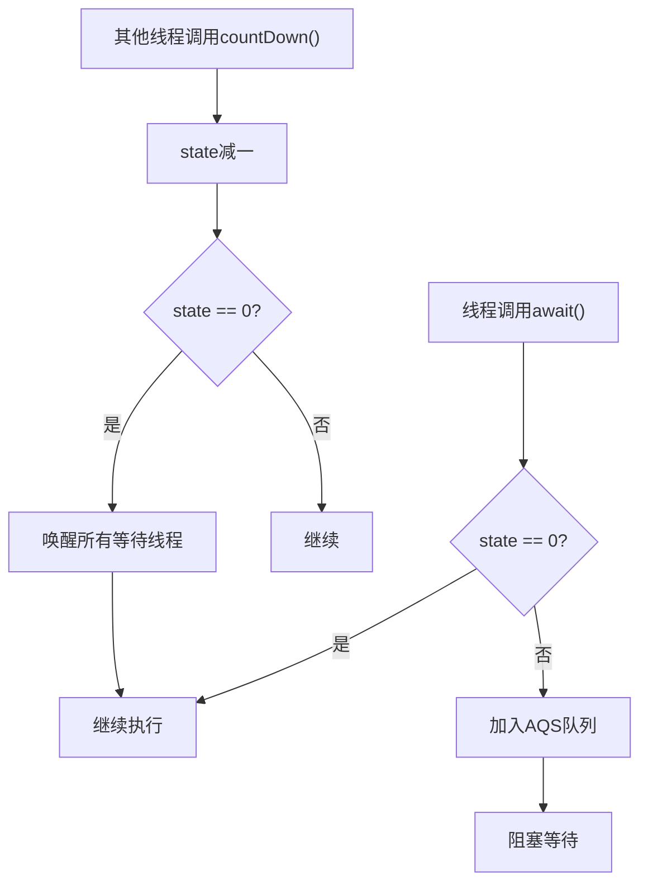

# 6. CountDownLatch

# Java并发编程中的CountDownLatch详解：面试八股文全攻略

***

## 1. 概述与定义

`CountDownLatch`是`java.util.concurrent`包中的一个同步工具类，用于协调多个线程之间的协作。它允许一个或多个线程等待其他线程完成一系列操作后再继续执行。`CountDownLatch`的核心机制是通过一个计数器来实现，计数器的初始值表示需要等待的事件数。每次一个事件完成，调用`countDown()`方法使计数器减一；等待的线程通过`await()`方法阻塞，直到计数器减为零，所有等待线程才会被唤醒。

与传统的互斥工具（如`Lock`或`synchronized`）不同，`CountDownLatch`更侧重于线程间的“同步”而非“互斥”。它的设计初衷是为了解决需要等待多个任务完成后才执行下一步的场景，例如并行计算、任务编排等。形象地比喻，`CountDownLatch`就像一个倒计时器，所有线程都在等待“倒计时归零”后才继续行动。⏳

在Java并发编程的知识体系中，`CountDownLatch`属于并发工具类的一员，与`Semaphore`、`CyclicBarrier`等工具共同构成了线程协作的基础。尽管它不是线程安全的基石（如`ReentrantLock`），但其简单高效的特性使其在特定场景下不可替代。理解其定义和定位，是掌握其用法和面试应对的第一步。

***

## 2. 主要特点

`CountDownLatch`具备以下几个关键特点，熟记这些特点并能在面试中结合场景阐述，会让你的回答更具深度：

- **一次性使用** 🔒 &#x20;

  `CountDownLatch`的计数器一旦减为零，就无法重置或重复使用。这与`CyclicBarrier`（支持重置）形成鲜明对比。如果你需要在面试中被问到替代方案，记得提到`CyclicBarrier`。
- **多线程等待** 👥 &#x20;

  允许多个线程同时调用`await()`等待计数器归零，适用于“一等”模式，即一个线程等待多个任务完成。这种特性在主线程等待子线程的场景中尤为常见。
- **可中断性** ⏹️ &#x20;

  `await()`方法支持线程中断，等待中的线程可以被其他线程通过`interrupt()`方法中断，抛出`InterruptedException`。这为异常处理提供了灵活性。
- **超时机制** ⏳ &#x20;

  通过`await(long timeout, TimeUnit unit)`方法，线程可以设置最长等待时间。如果超时前计数器未归零，线程会自动唤醒并继续执行，避免无限阻塞。
- **无锁竞争** 🚫 &#x20;

  `CountDownLatch`内部实现基于`AbstractQueuedSynchronizer`（AQS），不涉及传统的锁竞争，因此性能较高，适合高并发场景。

这些特点共同塑造了`CountDownLatch`的使用场景和局限性。在面试中，若能结合实际案例（如等待所有子任务完成）说明这些特点，会让你的回答更具说服力。例如，可以提到“一次性使用让我在任务编排中更倾向于用它，而超时机制则适合需要容错的场景”。

***

## 3. 应用目标

`CountDownLatch`的主要目标是**协调线程间的执行顺序**，确保某些线程在其他线程完成任务后才开始执行。它在并发编程中扮演着“等待-通知”的角色，具体应用目标包括：

- **等待多个任务完成**：例如，在并行计算中，主线程需要等待所有子线程计算完毕后再汇总结果。
- **任务编排**：在复杂的工作流中，确保前置任务（如数据加载）完成后才执行后续任务（如数据处理）。
- **模拟高并发**：在性能测试中，等待多个线程准备就绪后同时执行，模拟高并发请求。
- **线程池任务监控**：监控线程池中所有任务的完成情况，确保所有工作线程结束后执行清理操作。

简而言之，`CountDownLatch`通过简单的计数机制，实现线程间的同步协作，是并发编程中的“轻量级神器”。🎯 在面试中，如果你能结合具体业务场景（如“电商系统等待多个库存检查线程完成后扣减库存”）来阐述应用目标，会让考官眼前一亮。

***

## 4. 主要内容及其组成部分

`CountDownLatch`的API设计简洁高效，主要包括构造函数、等待方法、计数方法和查询方法。以下是对其所有组成部分的详尽解释：

### 4.1 构造函数

- **`CountDownLatch(int count)`** &#x20;

  创建一个`CountDownLatch`对象，指定初始计数器值`count`。这个值必须大于等于0，否则会抛出`IllegalArgumentException`。

```java 
CountDownLatch latch = new CountDownLatch(3); // 等待3个事件
```


**注意**：`count`表示需要等待的事件数，通常与任务数或线程数对应。初始化后，计数器值不可修改。

### 4.2 等待方法

- **`void await()`**\*\* throws InterruptedException\*\* &#x20;

  使当前线程阻塞，直到计数器减为零或线程被中断。如果计数器已经为零，方法立即返回。
- **`boolean await(long timeout, TimeUnit unit)`**\*\* throws InterruptedException\*\* &#x20;

  等待指定时间。如果在超时前计数器减为零，返回`true`；若超时仍未归零，返回`false`。`TimeUnit`支持纳秒到天的多种时间单位。

```java 
try {
    latch.await(); // 阻塞等待所有事件完成
    System.out.println("所有任务完成");
} catch (InterruptedException e) {
    System.out.println("等待被中断");
    Thread.currentThread().interrupt(); // 恢复中断状态
}
```


**使用场景**：`await()`适用于需要无限等待的场景，而带超时的`await`适合需要容错的系统，例如避免因子任务失败导致主线程永久阻塞。

### 4.3 计数方法

- **`void countDown()`** &#x20;

  将计数器减一。如果计数器减到零，会唤醒所有通过`await()`等待的线程。如果计数器已为零，继续调用此方法不会有任何效果。

```java 
latch.countDown(); // 事件完成，计数减一
```


**注意**：`countDown()`是线程安全的，多个线程可以并发调用，内部通过CAS（比较并交换）保证原子性。

### 4.4 查询方法

- **`long getCount()`** &#x20;

  返回当前计数器的值，用于调试或监控剩余事件数。此方法不阻塞，随时可调用。

```java 
System.out.println("剩余事件数: " + latch.getCount());
```


**完整性说明**：虽然`getCount()`不是核心功能，但在排查问题或日志记录时非常有用。例如，可以用它检查是否有任务未完成。

**API总结表格**：

| 方法名                               | 功能描述            | 抛出异常                         | 使用场景     |
| --------------------------------- | --------------- | ---------------------------- | -------- |
| \`CountDownLatch(int count)\`     | 初始化计数器          | \`IllegalArgumentException\` | 创建实例     |
| \`void await()\`                  | 阻塞等待计数器归零       | \`InterruptedException\`     | 主线程等待子任务 |
| \`boolean await(long, TimeUnit)\` | 限时等待计数器归零       | \`InterruptedException\`     | 带超时的任务等待 |
| \`void countDown()\`              | 计数器减一，归零时唤醒等待线程 | 无                            | 子任务完成通知  |
| \`long getCount()\`               | 获取当前计数器值        | 无                            | 调试或状态监控  |

**表格说明**：此表格列出了`CountDownLatch`的所有方法，清晰展示了功能、异常和场景，帮助你在面试中快速回忆API细节。

***

## 5. 原理剖析

`CountDownLatch`的底层实现依赖于`AbstractQueuedSynchronizer`（AQS），一个强大的同步框架。深入理解其原理，不仅能应对面试中的“底层实现”问题，还能提升你对并发工具的整体认知。

### 5.1 AQS的核心作用

AQS通过一个`state`变量管理同步状态。在`CountDownLatch`中，`state`表示剩余的事件数：

- **初始化**：通过构造函数设置`state = count`。
- **countDown()**：每次调用通过CAS操作将`state`减一。
- **await()**：检查`state`是否为0，若不为0则线程进入等待状态。

AQS内部维护了一个FIFO队列，用于存放阻塞的线程。`CountDownLatch`利用AQS的共享模式（Shared Mode），允许多个线程同时获取“锁”并继续执行。

### 5.2 等待和唤醒机制

- **await()的执行逻辑**： &#x20;

  调用`await()`时，线程会通过AQS的`acquireSharedInterruptibly(1)`方法检查`state`。若`state > 0`，线程被加入AQS的等待队列并阻塞；若`state = 0`，立即返回。
- **countDown()的执行逻辑**： &#x20;

  调用`countDown()`时，通过`releaseShared(1)`方法将`state`减一。当`state`减为0时，AQS会唤醒队列中的所有等待线程。

### 5.3 共享模式详解

与AQS的独占模式（如`ReentrantLock`）不同，`CountDownLatch`使用共享模式。当`state`归零时，所有等待线程都被唤醒，而不是逐个释放。这种设计确保了高并发场景下的一致性。

### 5.4 流程图展示

以下是用Mermaid语法绘制的`CountDownLatch`工作流程：




**图表说明**：此图展示了`await()`和`countDown()`的交互逻辑。`await()`线程在`state > 0`时阻塞，`countDown()`逐步减少`state`，直到归零时唤醒所有线程。

### 5.5 与其他工具的底层对比

- **与**\*\*`Lock`\*\*：`Lock`基于AQS独占模式，强调资源互斥；`CountDownLatch`基于共享模式，强调事件同步。
- **与**\*\*`CyclicBarrier`\*\*：`CyclicBarrier`也用AQS，但通过`parties`和`count`实现可重用，逻辑更复杂。

**完整性补充**：虽然`CountDownLatch`不直接涉及线程池或`ExecutorService`，但在面试中可能被问到与线程池的结合（如监控线程池任务）。其核心仍是AQS的共享模式，理解这一点即可应对扩展问题。

***

## 6. 应用与拓展

`CountDownLatch`在实际开发中应用广泛，以下是三个典型场景及详细代码示例：

### 6.1 等待多个任务完成

主线程等待3个子线程完成任务：

```java 
import java.util.concurrent.CountDownLatch;

public class MultipleTasksDemo {
    public static void main(String[] args) {
        CountDownLatch latch = new CountDownLatch(3);
        for (int i = 0; i < 3; i++) {
            new Thread(() -> {
                try {
                    System.out.println(Thread.currentThread().getName() + " 开始执行");
                    Thread.sleep(1000); // 模拟任务耗时
                    System.out.println(Thread.currentThread().getName() + " 执行完成");
                } catch (InterruptedException e) {
                    e.printStackTrace();
                } finally {
                    latch.countDown();
                }
            }, "线程-" + i).start();
        }
        try {
            latch.await();
            System.out.println("所有子线程执行完毕，主线程继续");
        } catch (InterruptedException e) {
            e.printStackTrace();
        }
    }
}
```


**输出分析**：主线程在所有子线程完成前阻塞，体现了`CountDownLatch`的同步能力。

### 6.2 模拟高并发

等待多个线程准备就绪后同时执行：

```java 
import java.util.concurrent.CountDownLatch;

public class HighConcurrencyDemo {
    public static void main(String[] args) throws InterruptedException {
        CountDownLatch startLatch = new CountDownLatch(1);
        CountDownLatch endLatch = new CountDownLatch(5);
        for (int i = 0; i < 5; i++) {
            new Thread(() -> {
                try {
                    System.out.println(Thread.currentThread().getName() + " 准备就绪");
                    startLatch.await(); // 等待开始信号
                    System.out.println(Thread.currentThread().getName() + " 开始执行");
                    Thread.sleep(1000);
                } catch (InterruptedException e) {
                    e.printStackTrace();
                } finally {
                    endLatch.countDown();
                }
            }, "线程-" + i).start();
        }
        Thread.sleep(1000); // 模拟准备时间
        System.out.println("发出开始信号");
        startLatch.countDown(); // 触发所有线程开始
        endLatch.await(); // 等待所有线程完成
        System.out.println("所有线程执行完毕");
    }
}
```


**说明**：`startLatch`控制线程同时开始，`endLatch`确保主线程等待所有线程完成。

### 6.3 任务编排

确保任务A和B完成后执行任务C：

```java 
import java.util.concurrent.CountDownLatch;

public class TaskOrchestrationDemo {
    public static void main(String[] args) throws InterruptedException {
        CountDownLatch latch = new CountDownLatch(2);
        new Thread(() -> {
            System.out.println("任务A开始");
            try {
                Thread.sleep(500);
            } catch (InterruptedException e) {
                e.printStackTrace();
            }
            System.out.println("任务A完成");
            latch.countDown();
        }).start();
        new Thread(() -> {
            System.out.println("任务B开始");
            try {
                Thread.sleep(800);
            } catch (InterruptedException e) {
                e.printStackTrace();
            }
            System.out.println("任务B完成");
            latch.countDown();
        }).start();
        latch.await();
        System.out.println("任务C开始执行");
    }
}
```


**拓展说明**：在实际项目中，可以结合线程池（如`ExecutorService`）优化上述代码，提高资源利用率。

***

## 7. 面试问答

以下是常见的`CountDownLatch`面试问题及详细回答，模拟面试者口吻：

### 7.1 Q: CountDownLatch是什么？有什么用途？

**A**: 你好，`CountDownLatch`是Java并发包里的一个同步工具类，用来协调多个线程的执行顺序。它通过一个计数器实现，一个或多个线程可以通过`await()`等待其他线程完成任务，每次任务完成调用`countDown()`减一，计数器归零时所有等待线程继续执行。我觉得它特别适合等待多个任务完成的场景，比如并行计算中主线程等子线程，或者任务编排时确保前置任务完成后执行后续步骤，还有模拟高并发测试也很常见。

### 7.2 Q: CountDownLatch和CyclicBarrier有什么区别？

**A**: 嗯，这俩都是线程同步工具，但用途和设计不一样。`CountDownLatch`是一次性的，计数器归零后就不能重用，适合一组线程等待另一组任务完成，比如主线程等子线程。`CyclicBarrier`可以重用，线程间相互等待，所有线程都到达屏障点后一起继续，适合需要多次同步的场景，比如多线程迭代计算。我觉得简单说，`CountDownLatch`是“等事件”，`CyclicBarrier`是“等线程”。

### 7.3 Q: CountDownLatch可以重用吗？如果不能，怎么实现可重用功能？

**A**: 不行，`CountDownLatch`是一次性的，计数器归零后就没法重置了，因为它的设计就是单次同步。如果需要可重用功能，我会用`CyclicBarrier`，它支持重置计数器，可以循环使用，非常适合需要反复等待的场景，比如多轮并发测试。实在要用`CountDownLatch`实现类似效果，就得每次都新建一个实例，但这样不如直接用`CyclicBarrier`方便。

### 7.4 Q: 在使用CountDownLatch时，如何处理线程中断？

**A**: 这个我有经验。`CountDownLatch`的`await()`方法是可中断的，如果线程在等待时被中断，会抛出`InterruptedException`。我通常会在`try-catch`里处理，比如记录日志或者取消任务。如果怕无限等待，还可以用`await(long timeout, TimeUnit unit)`设置超时，超时后返回`false`，这样可以避免线程一直卡住。处理中断时，我还会调用`Thread.currentThread().interrupt()`恢复中断状态，确保后续逻辑能感知到。

### 7.5 Q: CountDownLatch的底层实现是什么？

**A**: `CountDownLatch`底层基于AQS（AbstractQueuedSynchronizer）实现。AQS有个`state`变量，在这里表示剩余事件数。初始化时`state`设为`count`，`countDown()`通过CAS把`state`减一，`await()`检查`state`是不是0，不是就进AQS队列阻塞。`state`归零时，AQS用共享模式唤醒所有等待线程。这种实现不依赖锁，性能挺高的。我觉得理解AQS的共享模式是关键，跟独占模式比，它允许多线程同时通过。

***

## 总结

通过这篇文章，我们全面梳理了`CountDownLatch`的定义、特点、应用、原理和面试应对策略。无论是代码示例还是底层剖析，都力求详实清晰。希望你在面试中能熟练运用这些知识，轻松拿下Offer！💪
