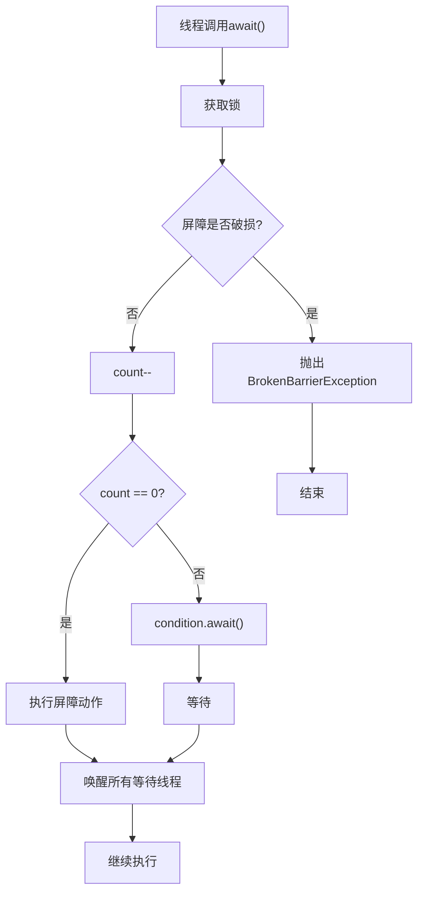

# 7. CyclicBarrier

# Java并发编程中的CyclicBarrier详解：面试八股文全攻略

***

## 1. 概述与定义

`CyclicBarrier`是`java.util.concurrent`包中的一个同步工具类，用于协调多个线程的执行进度。它允许一组线程在某个共同的屏障点（barrier point）上等待，直到所有线程都到达该点后，再继续执行。与`CountDownLatch`的一次性使用不同，`CyclicBarrier`支持重置和重复使用，这也是其“循环”（Cyclic）特性的体现。

`CyclicBarrier`的核心机制是通过一个计数器来实现，计数器的初始值表示需要等待的线程数。每个线程在到达屏障点时调用`await()`方法，使计数器减一，并进入等待状态。当计数器减为零时，所有等待的线程被唤醒，继续执行。此外，`CyclicBarrier`还支持在所有线程到达屏障后，执行一个可选的屏障动作（barrier action）。

在Java并发编程中，`CyclicBarrier`常用于需要分阶段执行的任务，例如并行计算、模拟多线程协同工作等场景。形象地比喻，`CyclicBarrier`就像一个集合点，所有参与的线程必须在集合点“打卡”后，才能集体进入下一阶段。🏁

***

## 2. 主要特点

`CyclicBarrier`具备以下几个关键特点，值得在面试中熟记并结合场景阐述：

- **可重用性** 🔄 &#x20;

  `CyclicBarrier`可以重复使用，适合需要多次同步的场景。每次屏障被“冲破”后，可以通过`reset()`方法重置计数器，重新开始新一轮的等待。
- **线程协作** 👥 &#x20;

  允许多个线程在某个共同点上等待，直到所有线程都到达后再一起继续执行。这种“全体等待”的机制非常适合需要协同工作的多线程任务。
- **可选的屏障动作** 🎬 &#x20;

  可以在所有线程到达屏障后，执行一个指定的`Runnable`任务。这个任务通常用于在阶段性完成时执行一些汇总或清理操作。
- **可中断性** ⏹️ &#x20;

  `await()`方法支持线程中断，等待中的线程可以被其他线程通过`interrupt()`方法中断，抛出`InterruptedException`。这为异常处理提供了灵活性。
- **超时机制** ⏳ &#x20;

  通过`await(long timeout, TimeUnit unit)`方法，线程可以设置最长等待时间。如果在超时前所有线程未到达屏障，线程会自动唤醒并抛出`TimeoutException`。
- **破损检测** 🛠️ &#x20;

  如果某个线程在等待过程中发生异常或中断，`CyclicBarrier`会进入“破损”状态，其他等待线程会抛出`BrokenBarrierException`。这有助于及时发现和处理异常情况。

这些特点共同塑造了`CyclicBarrier`的使用场景和优势。在面试中，若能结合实际案例（如多线程并行计算）说明这些特点，会让你的回答更具深度。例如，可以提到“可重用性让我在多轮迭代计算中更倾向于用`CyclicBarrier`，而屏障动作则适合在每轮结束后执行数据聚合”。

***

## 3. 应用目标

`CyclicBarrier`的主要目标是**协调多个线程的执行进度**，确保所有线程在某个阶段完成后才进入下一阶段。它在并发编程中扮演着“同步集合点”的角色，具体应用目标包括：

- **分阶段执行任务**：例如，在并行计算中，多个线程并行处理数据，完成后在屏障点同步，等待所有线程完成后再进行下一轮计算或结果汇总。
- **模拟多线程协同**：如模拟多个运动员同时起跑、多个任务同时开始执行等场景。
- **线程池任务编排**：在复杂的工作流中，确保一组任务完成后才执行后续任务。
- **测试并发代码**：在单元测试中，控制多个线程的执行顺序，验证并发逻辑的正确性。

简而言之，`CyclicBarrier`通过灵活的屏障机制，实现线程间的同步协作，是并发编程中的“团队协作神器”。🎯 在面试中，如果你能结合具体业务场景（如“游戏中多个玩家准备就绪后同时开始比赛”）来阐述应用目标，会让考官印象深刻。

***

## 4. 主要内容及其组成部分

`CyclicBarrier`的API设计简洁高效，主要包括构造函数、等待方法、重置方法和其他辅助方法。以下是对其所有组成部分的详尽解释：

### 4.1 构造函数

- **`CyclicBarrier(int parties)`** &#x20;

  创建一个`CyclicBarrier`对象，指定参与的线程数`parties`。当`parties`个线程都调用`await()`后，屏障被冲破。
- **`CyclicBarrier(int parties, Runnable barrierAction)`** &#x20;

  创建一个`CyclicBarrier`对象，指定参与线程数和屏障动作`barrierAction`。当屏障被冲破时，会在最后一个线程上执行该`Runnable`任务。

```java 
CyclicBarrier barrier = new CyclicBarrier(3); // 3个线程
CyclicBarrier barrierWithAction = new CyclicBarrier(3, () -> System.out.println("所有线程到达，执行屏障动作"));
```


**注意**：`parties`表示需要等待的线程数，必须大于0。屏障动作是可选的，通常用于执行汇总或清理操作。

### 4.2 等待方法

- **`int await()`**\*\* throws InterruptedException, BrokenBarrierException\*\* &#x20;

  使当前线程在屏障点等待，直到所有线程都到达屏障或线程被中断。返回线程到达的索引（从`parties-1`到0）。
- **`int await(long timeout, TimeUnit unit)`**\*\* throws InterruptedException, BrokenBarrierException, TimeoutException\*\* &#x20;

  带超时的等待。如果在指定时间内所有线程未到达屏障，抛出`TimeoutException`。

```java 
try {
    int index = barrier.await(); // 等待所有线程
    System.out.println("线程" + index + "继续执行");
} catch (InterruptedException | BrokenBarrierException e) {
    e.printStackTrace();
}
```


**使用场景**：`await()`适用于需要无限等待的场景，而带超时的`await`适合需要容错的系统，避免因某个线程故障导致其他线程永久阻塞。

### 4.3 重置方法

- **`void reset()`** &#x20;

  重置屏障，恢复到初始状态。如果有线程正在等待，会抛出`BrokenBarrierException`。

```java 
barrier.reset(); // 重置屏障
```


**注意**：重置操作会使正在等待的线程抛出异常，需谨慎使用。通常在新一轮任务开始前调用。

### 4.4 其他辅助方法

- **`int getParties()`** &#x20;

  返回参与屏障的线程数。
- **`int getNumberWaiting()`** &#x20;

  返回当前在屏障上等待的线程数。
- **`boolean isBroken()`** &#x20;

  检查屏障是否处于破损状态（即有线程中断或超时）。

```java 
System.out.println("参与线程数: " + barrier.getParties());
System.out.println("当前等待线程数: " + barrier.getNumberWaiting());
System.out.println("屏障是否破损: " + barrier.isBroken());
```


**完整性说明**：这些辅助方法在调试和监控中非常有用。例如，`getNumberWaiting()`可以帮助判断当前进度，`isBroken()`则用于检测异常情况。

**API总结表格**：

| 方法名                                      | 功能描述             | 抛出异常                                                                       | 使用场景      |
| ---------------------------------------- | ---------------- | -------------------------------------------------------------------------- | --------- |
| \`CyclicBarrier(int parties)\`           | 初始化屏障，指定参与线程数    | \`IllegalArgumentException\`                                               | 创建实例      |
| \`CyclicBarrier(int parties, Runnable)\` | 初始化屏障，指定线程数和屏障动作 | \`IllegalArgumentException\`                                               | 创建实例并设置动作 |
| \`int await()\`                          | 等待所有线程到达屏障       | \`InterruptedException\`, \`BrokenBarrierException\`                       | 线程同步等待    |
| \`int await(long, TimeUnit)\`            | 带超时的等待           | \`InterruptedException\`, \`BrokenBarrierException\`, \`TimeoutException\` | 带超时的线程等待  |
| \`void reset()\`                         | 重置屏障到初始状态        | 无                                                                          | 重新开始新一轮任务 |
| \`int getParties()\`                     | 获取参与线程数          | 无                                                                          | 查询屏障配置    |
| \`int getNumberWaiting()\`               | 获取当前等待线程数        | 无                                                                          | 监控等待进度    |
| \`boolean isBroken()\`                   | 检查屏障是否破损         | 无                                                                          | 检测异常状态    |

**表格说明**：此表格列出了`CyclicBarrier`的所有方法，清晰展示了功能、异常和场景，帮助你在面试中快速回忆API细节。

***

## 5. 原理剖析

`CyclicBarrier`的底层实现基于`ReentrantLock`和`Condition`，通过锁和条件变量实现线程的等待和唤醒。深入理解其原理，不仅能应对面试中的“底层实现”问题，还能提升你对并发工具的整体认知。

### 5.1 内部结构

`CyclicBarrier`内部维护以下关键组件：

- **parties**：参与线程数，初始化时设置，不可变。
- **count**：当前未到达屏障的线程数，初始为`parties`，每次`await()`减一。
- **lock**：`ReentrantLock`实例，用于保护共享状态。
- **condition**：`Condition`对象，用于线程等待和唤醒。
- **barrierCommand**：可选的屏障动作`Runnable`。

### 5.2 await()的执行逻辑

当线程调用`await()`时：

1. **获取锁**：线程通过`lock.lock()`获取锁，确保同步。
2. **检查屏障状态**：若屏障已破损，抛出`BrokenBarrierException`。
3. **减少计数**：`count--`。
4. **判断是否为最后一个线程**：
   - 若`count > 0`，线程通过`condition.await()`进入等待状态。
   - 若`count == 0`，执行屏障动作（如果有），然后通过`condition.signalAll()`唤醒所有等待线程。
5. **释放锁**：在`finally`块中释放锁。

### 5.3 重置机制

调用`reset()`时：

1. **获取锁**。
2. **重置count**：将`count`重置为`parties`。
3. **唤醒等待线程**：通过`condition.signalAll()`唤醒所有等待线程，使其抛出`BrokenBarrierException`。
4. **释放锁**。

### 5.4 流程图展示

以下是用Mermaid语法绘制的`CyclicBarrier`工作流程：




**图表说明**：此图展示了`await()`的执行路径。线程在屏障未破损时减少计数，若是最后一个线程，则执行动作并唤醒其他线程；否则，进入等待状态。

### 5.5 与CountDownLatch的底层对比

- **CountDownLatch**：基于AQS的共享模式，计数器一次性递减至0后唤醒所有线程。
- **CyclicBarrier**：基于`ReentrantLock`和`Condition`，支持重置和重复使用，更灵活但开销稍大。

**完整性补充**：虽然`CyclicBarrier`不直接使用AQS，但其实现原理与AQS的共享模式有异曲同工之妙。理解这一点有助于你在面试中进行类比和扩展。

***

## 6. 应用与拓展

`CyclicBarrier`在实际开发中应用广泛，以下是两个典型场景及详细代码示例：

### 6.1 并行计算

多个线程并行处理数据，完成后在屏障点同步，执行汇总：

```java 
import java.util.concurrent.CyclicBarrier;

public class ParallelComputationDemo {
    public static void main(String[] args) {
        int parties = 3;
        CyclicBarrier barrier = new CyclicBarrier(parties, () -> System.out.println("所有线程完成，汇总结果"));
        for (int i = 0; i < parties; i++) {
            new Thread(() -> {
                try {
                    System.out.println(Thread.currentThread().getName() + " 开始计算");
                    Thread.sleep(1000); // 模拟计算
                    System.out.println(Thread.currentThread().getName() + " 到达屏障");
                    barrier.await();
                    System.out.println(Thread.currentThread().getName() + " 继续执行");
                } catch (Exception e) {
                    e.printStackTrace();
                }
            }, "线程-" + i).start();
        }
    }
}
```


**输出分析**：所有线程在屏障点等待，待所有线程到达后，执行屏障动作并继续执行。

### 6.2 模拟多线程协同

模拟多个运动员同时起跑：

```java 
import java.util.concurrent.CyclicBarrier;

public class AthleteDemo {
    public static void main(String[] args) {
        int athletes = 5;
        CyclicBarrier barrier = new CyclicBarrier(athletes, () -> System.out.println("所有运动员准备就绪，比赛开始！"));
        for (int i = 0; i < athletes; i++) {
            new Thread(() -> {
                try {
                    System.out.println(Thread.currentThread().getName() + " 准备中");
                    Thread.sleep((int) (Math.random() * 1000));
                    System.out.println(Thread.currentThread().getName() + " 准备就绪");
                    barrier.await();
                    System.out.println(Thread.currentThread().getName() + " 起跑");
                } catch (Exception e) {
                    e.printStackTrace();
                }
            }, "运动员-" + i).start();
        }
    }
}
```


**说明**：所有运动员准备就绪后，同时起跑，体现了`CyclicBarrier`的同步能力。

**拓展说明**：在实际项目中，`CyclicBarrier`常与线程池结合使用，提高资源利用率。例如，可以使用`ExecutorService`管理线程，避免手动创建大量线程。

***

## 7. 面试问答

以下是常见的`CyclicBarrier`面试问题及详细回答，模拟面试者口吻：

### 7.1 Q: CyclicBarrier和CountDownLatch有什么区别？

**A**: 你好，`CyclicBarrier`和`CountDownLatch`都是线程同步工具，但用途和设计不同。`CyclicBarrier`适用于一组线程相互等待，直到所有线程都到达屏障点后再一起继续，而且可以重用，适合多轮同步。`CountDownLatch`是一次性的，用于等待一组任务完成，主线程等子线程那种场景。我觉得简单说，`CyclicBarrier`是“线程等线程”，`CountDownLatch`是“线程等事件”。

### 7.2 Q: CyclicBarrier如何实现线程的同步等待？

**A**: `CyclicBarrier`内部用`ReentrantLock`和`Condition`实现。每个线程调用`await()`时，先获取锁，然后减少计数器。如果计数器没到0，就通过`condition.await()`等待；如果是最后一个线程，就执行屏障动作并通过`condition.signalAll()`唤醒所有等待线程。整个过程线程安全，锁保证了同步。

### 7.3 Q: CyclicBarrier的屏障动作有什么作用？

**A**: 屏障动作是在所有线程都到达屏障后，由最后一个线程执行的`Runnable`任务。通常用来在阶段性完成时做一些汇总、清理或通知操作。比如，在并行计算中，可以在每轮计算后汇总结果，或者在模拟场景中，执行“比赛开始”的动作。挺实用的，能让同步点更有意义。

### 7.4 Q: 如何处理CyclicBarrier中的异常和中断？

**A**: 如果线程在等待时被中断或超时，`CyclicBarrier`会进入破损状态，其他等待线程会抛出`BrokenBarrierException`。我通常会在`await()`后检查异常，如果捕获到`BrokenBarrierException`，就处理异常逻辑，比如重试或取消任务。对于中断，我会恢复中断状态，确保后续逻辑能感知到。

### 7.5 Q: CyclicBarrier适用于哪些场景？

**A**: `CyclicBarrier`适合需要多线程协同、分阶段执行的场景。比如，并行计算中多轮迭代，每次迭代后同步；或者模拟多个人同时开始某项活动，像游戏里的玩家准备就绪后一起进入游戏。我觉得它在需要“全体就绪”再行动的场景特别好用。

***

## 总结

通过这篇文章，我们系统梳理了`CyclicBarrier`的定义、特点、应用、原理和面试应对策略。无论是代码示例还是底层剖析，都力求详实清晰。希望你在面试中能熟练运用这些知识，轻松拿下Offer！💪
