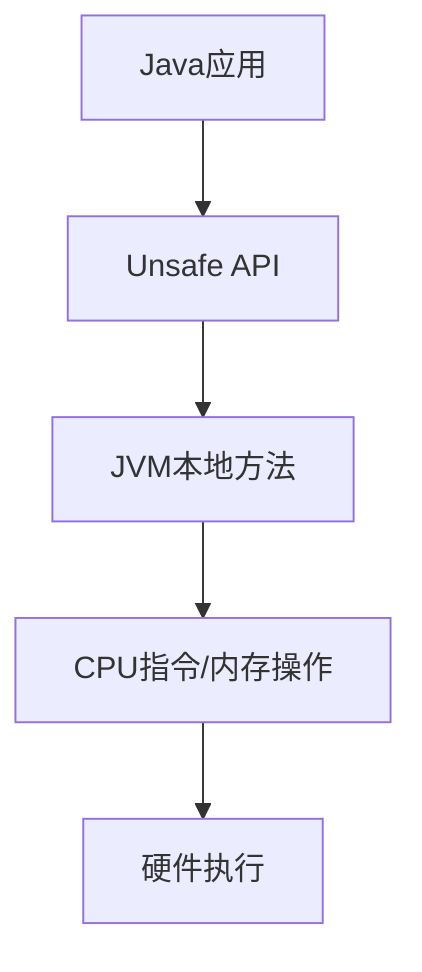
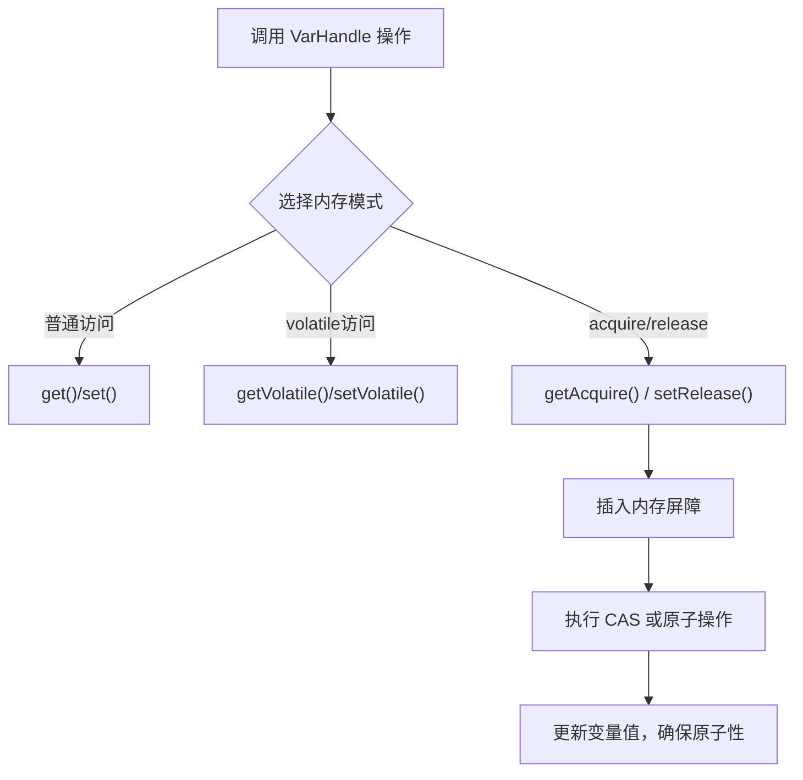

# 3. Unsafe

# Java并发编程中的Unsafe详解：面试八股文全攻略

***

## 1. 概述与定义

`Unsafe`是Java中位于`sun.misc`包下的一个特殊类，它提供了对Java虚拟机（JVM）底层操作的直接访问能力。它的名字“Unsafe”（非安全）揭示了其特性：它绕过了Java的类型安全和内存管理机制，允许开发者直接操作内存、线程和对象等底层资源。`Unsafe`类在Java标准库中并未公开文档化，属于非官方API，但它在JDK内部被广泛使用，尤其是在并发编程和性能优化领域。

具体来说，`Unsafe`提供了内存分配与释放、CAS（Compare-And-Swap）操作、线程调度、对象字段操作等功能。它是`java.util.concurrent`包中许多并发工具类（如`AtomicInteger`、`LockSupport`）的底层实现基础。通过`Unsafe`，开发者可以实现一些通常由JVM管理的操作，例如直接分配堆外内存、修改私有字段、实现高性能的无锁并发控制等。然而，由于其绕过了Java的安全机制，使用`Unsafe`需要格外小心，稍有不慎可能导致内存泄漏、数据竞争等问题。因此，在实际开发中，开发者很少直接使用它，但理解其原理和用途对于掌握Java并发编程的底层机制至关重要。

在面试场景中，考官可能会问：“什么是Unsafe类？它在Java中有哪些作用？”这时，你需要清晰地阐述其定义和功能，并强调其在并发编程中的重要性，同时点出它的风险性，以展现你的全面理解。

***

## 2. 主要特点

`Unsafe`类的强大之处在于其多方面的底层操作能力，以下是其主要特点，面试时可以结合场景进行背诵和扩展：

- **直接内存操作** 🧠 &#x20;

  `Unsafe`允许开发者像C/C++那样直接分配、释放和操作内存，提供了`allocateMemory`、`freeMemory`等方法。这种能力在高性能场景（如零拷贝）中非常有用，但需要手动管理内存，增加了出错风险。
- **CAS操作支持** 🔄 &#x20;

  提供了`compareAndSwapInt`、`compareAndSwapLong`等方法，支持无锁编程。CAS是许多并发数据结构（如`AtomicInteger`）的核心，依赖CPU原子指令实现高效并发控制。
- **线程调度** ⏳ &#x20;

  通过`park`和`unpark`方法实现线程的阻塞和唤醒，是`LockSupport`类的底层支持。这些方法在锁和同步工具的实现中起到关键作用。
- **对象和字段操作** 🔍 &#x20;

  `Unsafe`可以直接访问和修改对象的字段（包括私有字段），通过字段偏移量操作内存。这在序列化、反射等场景中非常实用。
- **类加载和定义** 📚 &#x20;

  提供了`defineClass`方法，支持动态定义类，常用于动态代理和字节码增强（如AOP框架）。
- **内存屏障** 🚧 &#x20;

  通过`loadFence`、`storeFence`等方法控制内存访问顺序，确保多线程环境下的可见性和有序性，类似于`volatile`的内存语义。

这些特点使`Unsafe`成为Java并发编程中的“幕后英雄”。在面试中，若能结合具体例子（如CAS在`AtomicInteger`中的应用）阐述，会让你的回答更具说服力。例如，可以说：“`Unsafe`的CAS操作是无锁编程的基础，比传统锁更高效，我在项目中见过它在高并发计数器中的应用。”

***

## 3. 应用目标

`Unsafe`的设计目标是为开发者提供低级别、直接的JVM操作能力，以支持高性能并发编程和系统级优化。具体应用目标包括：

- **实现高性能并发数据结构**：通过CAS操作支持无锁编程，如`AtomicInteger`、`AtomicReference`。
- **线程调度和同步**：利用`park`和`unpark`实现线程阻塞与唤醒，支持锁和条件变量。
- **直接内存管理**：在网络编程（如Netty的零拷贝）或缓存管理中，直接操作堆外内存以提升性能。
- **对象和字段直接访问**：在ORM框架或序列化库中，通过字段操作提高效率。
- **动态类加载**：支持动态代理、AOP等场景的类生成。

简而言之，`Unsafe`的目标是让开发者“逃逸”Java的安全限制，实现更底层的控制和优化。在面试中，可以强调其在高性能场景中的作用，同时提到替代方案（如`VarHandle`），展现知识的全面性。

***

## 4. 主要内容及其组成部分

`Unsafe`提供了丰富的API，涵盖多个方面，以下是其主要方法及其详尽解释，面试时需熟记这些功能及其使用场景。

### 4.1 获取Unsafe实例

`Unsafe`是单例类，但其构造函数是私有的，无法直接实例化。通常通过反射获取：

```java 
import sun.misc.Unsafe;
import java.lang.reflect.Field;

public class UnsafeUtil {
    public static Unsafe getUnsafe() {
        try {
            Field field = Unsafe.class.getDeclaredField("theUnsafe");
            field.setAccessible(true);
            return (Unsafe) field.get(null);
        } catch (Exception e) {
            throw new RuntimeException("Unable to get Unsafe instance", e);
        }
    }
}
```


**注意**：在JDK 9+中，`Unsafe`的使用受到模块化限制，可能抛出异常，建议了解`VarHandle`作为替代方案。

### 4.2 内存管理

`Unsafe`支持堆外内存操作，类似于C的`malloc`和`free`，主要方法包括：

- **`long allocateMemory(long bytes)`**：分配指定大小的内存，返回地址。
- **`void freeMemory(long address)`**：释放指定地址的内存。
- **`void putByte(long address, byte x)`**：在指定地址写入字节。
- **`byte getByte(long address)`**：从指定地址读取字节。
- 类似方法还有`putInt`、`getInt`、`putLong`、`getLong`等，支持多种数据类型。

**示例**：

```java 
Unsafe unsafe = UnsafeUtil.getUnsafe();
long address = unsafe.allocateMemory(8);
unsafe.putLong(address, 123456789L);
long value = unsafe.getLong(address);
System.out.println(value); // 输出 123456789
unsafe.freeMemory(address);
```


**场景**：实现自定义内存池或零拷贝传输。

### 4.3 CAS操作

CAS是`Unsafe`的核心功能，支持无锁并发，主要方法包括：

- **`boolean compareAndSwapInt(Object o, long offset, int expected, int x)`**：对int字段进行CAS。
- **`boolean compareAndSwapLong(Object o, long offset, long expected, long x)`**：对long字段进行CAS。
- **`boolean compareAndSwapObject(Object o, long offset, Object expected, Object x)`**：对对象引用进行CAS。

**示例**：实现无锁计数器：

```java 
public class AtomicCounter {
    private volatile int count = 0;
    private static final Unsafe unsafe = UnsafeUtil.getUnsafe();
    private static final long valueOffset;

    static {
        try {
            valueOffset = unsafe.objectFieldOffset(AtomicCounter.class.getDeclaredField("count"));
        } catch (Exception e) {
            throw new Error(e);
        }
    }

    public void increment() {
        while (true) {
            int current = count;
            if (unsafe.compareAndSwapInt(this, valueOffset, current, current + 1)) {
                break;
            }
        }
    }

    public int get() {
        return count;
    }
}
```


**说明**：类似于`AtomicInteger`，通过CAS实现线程安全的自增。

### 4.4 线程调度

支持线程阻塞与唤醒：

- **`void park(boolean isAbsolute, long time)`**：阻塞当前线程，`time`为0表示无限等待。
- **`void unpark(Thread thread)`**：唤醒指定线程。

**示例**：

```java 
Thread thread = new Thread(() -> {
    System.out.println("Thread is parking");
    unsafe.park(false, 0L);
    System.out.println("Thread is unparked");
});
thread.start();
Thread.sleep(1000);
unsafe.unpark(thread);
```


**场景**：实现自定义锁或同步工具。

### 4.5 对象和字段操作

支持直接访问对象字段：

- **`long objectFieldOffset(Field f)`**：获取字段偏移量。
- **`int getInt(Object o, long offset)`**：读取int值。
- **`void putInt(Object o, long offset, int x)`**：设置int值。
- 类似方法包括`getObject`、`putObject`等。

**示例**：

```java 
public class Person {
    private int age = 30;
}

Person p = new Person();
long ageOffset = unsafe.objectFieldOffset(Person.class.getDeclaredField("age"));
unsafe.putInt(p, ageOffset, 35);
System.out.println(unsafe.getInt(p, ageOffset)); // 输出 35
```


**场景**：绕过访问控制修改私有字段。

### 4.6 内存屏障

控制内存操作顺序：

- **`void loadFence()`**：加载屏障。
- **`void storeFence()`**：存储屏障。
- **`void fullFence()`**：完整屏障。

**场景**：实现volatile语义或自定义同步。

### 4.7 类加载和定义

- **`Class<?> defineClass(String name, byte[] b, int off, int len, ClassLoader loader, ProtectionDomain protectionDomain)`**：动态定义类。

**场景**：动态代理或字节码增强。

***

## 5. 原理剖析

`Unsafe`的实现依赖JVM的本地方法（native methods），通过C++代码与JVM内部交互。以下是核心功能的深入解析：

### 5.1 内存管理原理

`allocateMemory`和`freeMemory`操作堆外内存（Direct Memory），由JVM的内存分配器管理，不受GC控制。内存地址是本地指针，`put`和`get`方法直接读写该地址。这种方式减少了堆内分配的开销，但需要手动释放，否则会导致内存泄漏。

### 5.2 CAS操作原理

CAS依赖CPU的原子指令（如`cmpxchg`），通过`Unsafe`的本地方法调用实现。它比较内存值与期望值，若相等则更新为新值，整个过程是原子的。CAS的高效性在于避免锁竞争，但可能因ABA问题需要额外处理（如使用版本号）。

### 5.3 线程调度原理

`park`使线程进入等待状态，依赖JVM线程调度器和OS信号机制。`unpark`通过许可机制唤醒线程，支持先唤醒后等待的灵活性，与`Object.wait`相比更高效。

### 5.4 对象和字段操作原理

`Unsafe`利用JVM的对象内存布局（对象头+实例数据+填充），通过偏移量直接访问字段内存。这种操作绕过了Java的封装性，依赖JVM的具体实现。

### 5.5 内存屏障原理

内存屏障对应CPU的内存同步指令（如`mfence`），确保操作顺序。例如，`fullFence`保证之前的读写操作对其他线程可见。

**流程图**：




**说明**：此图展示了`Unsafe`调用从应用层到硬件层的路径，体现了其底层特性。

***

## 6. 应用与拓展

`Unsafe`在JDK和第三方库中有广泛应用：

### 6.1 并发工具类

- **`AtomicInteger`**：基于CAS实现原子操作。
- **`LockSupport`**：基于`park`和`unpark`。
- **`AQS`**：使用CAS管理同步状态。

### 6.2 高性能数据结构

- **Disruptor**：利用`Unsafe`操作内存。
- **Netty**：通过`Unsafe`实现零拷贝。

### 6.3 自定义内存管理

- **内存池**：减少GC开销。
- **序列化**：直接访问字段提高效率。

**示例**：无锁队列：

```java 
public class UnsafeQueue {
    private static final Unsafe unsafe = UnsafeUtil.getUnsafe();
    private static final long headOffset;
    private static final long tailOffset;

    static {
        try {
            headOffset = unsafe.objectFieldOffset(UnsafeQueue.class.getDeclaredField("head"));
            tailOffset = unsafe.objectFieldOffset(UnsafeQueue.class.getDeclaredField("tail"));
        } catch (Exception e) {
            throw new Error(e);
        }
    }

    private volatile Node head;
    private volatile Node tail;

    public UnsafeQueue() {
        head = tail = new Node(null);
    }

    public void offer(Object value) {
        Node newNode = new Node(value);
        while (true) {
            Node currentTail = tail;
            if (unsafe.compareAndSwapObject(this, tailOffset, currentTail, newNode)) {
                currentTail.next = newNode;
                break;
            }
        }
    }

    public Object poll() {
        while (true) {
            Node currentHead = head;
            if (currentHead.next == null) return null;
            if (unsafe.compareAndSwapObject(this, headOffset, currentHead, currentHead.next)) {
                return currentHead.next.value;
            }
        }
    }

    private static class Node {
        Object value;
        Node next;
        Node(Object value) { this.value = value; }
    }
}
```


***

## 7. 面试问答

### 7.1 Q: Unsafe类是什么？有什么作用？

**A**: 你好，`Unsafe`是`sun.misc`包下的一个类，提供对JVM底层的直接操作能力。它可以分配内存、执行CAS操作、调度线程、访问对象字段等。在Java中，它是并发工具类的基石，比如`AtomicInteger`用它实现无锁操作，`LockSupport`用它实现线程阻塞。它的作用是为高性能编程提供支持，但因为绕过了安全机制，使用时要小心内存泄漏等问题。

### 7.2 Q: Unsafe的CAS操作有什么优势？

**A**: `Unsafe`的CAS操作是无锁的，通过CPU原子指令实现，避免了锁的线程切换开销。在高并发场景下，比如计数器自增，CAS效率很高，尤其在竞争不激烈时。我觉得它特别适合读多写少的场景，比`synchronized`更轻量。

### 7.3 Q: Unsafe的park和unpark方法有什么作用？

**A**: `park`和`unpark`是线程调度的核心方法。`park`让当前线程阻塞，可以设置等待时间；`unpark`唤醒指定线程。它们是`LockSupport`的基础，比`wait`和`notify`更灵活，支持先唤醒后等待。我在项目中见过它们用于实现自定义锁。

### 7.4 Q: Unsafe在内存管理方面的应用？

**A**: `Unsafe`可以直接分配和释放堆外内存，比如`allocateMemory`和`freeMemory`。这在零拷贝场景下很有用，比如Netty用它减少数据复制开销。另外，它还能实现内存池，降低GC压力，提高性能。

### 7.5 Q: 使用Unsafe有哪些风险？

**A**: 使用`Unsafe`的风险主要有内存泄漏和数据竞争。因为它操作堆外内存，不受GC管理，如果忘记释放就会泄漏。另外，直接操作内存可能引发线程安全问题。而且它是内部API，未来版本可能不兼容，官方推荐用`VarHandle`替代。

***

# VarHandle

## 1. 概述与定义

在 Java 并发编程中，为了高效、安全地访问共享变量，JDK 曾长期依赖于 sun.misc.Unsafe 类和各种原子类（如 AtomicInteger 等）。但这些机制存在封装不完善、跨平台性较差、使用不够直观等问题。为了弥补这些不足，Java 9 引入了 **VarHandle**（变量句柄）机制，其主要定义在 `java.lang.invoke.VarHandle` 包中。 &#x20;

VarHandle 为开发者提供了一种类似于指针的低级别操作方式，用于读取和写入对象或数组中的变量，同时支持多种内存访问语义（例如普通访问、volatile 访问、acquire/release 访问等），可以实现原子操作和内存屏障。通过 VarHandle，开发者可以实现更加灵活、细粒度的并发控制，而不必依赖底层的 Unsafe 类。😊

VarHandle 的设计目标在于以一种类型安全、平台无关的方式替代 Unsafe 的部分功能，同时具备更丰富的操作方法，帮助开发者实现高性能并发编程。

## 2. 主要特点

VarHandle 机制具有以下几个显著特点：

- **类型安全与灵活性** &#x20;

  VarHandle 在创建时就绑定了变量的类型和访问位置，通过泛型和反射机制保证类型安全，使得操作不会出现隐式转换错误。
- **丰富的内存语义** &#x20;

  VarHandle 提供了多种内存访问模式，例如： &#x20;
  - 普通（plain）访问 &#x20;
  - 透明（opaque）访问 &#x20;
  - volatile 访问 &#x20;
  - acquire/release 访问 &#x20;
    每种模式对应不同的内存可见性和排序要求，满足不同并发场景下的需求。 &#x20;
- **原子操作支持** &#x20;

  除了基本的 get/set 操作外，VarHandle 还支持 compareAndSet、getAndSet、getAndAdd 等原子操作，这使得开发者可以方便地实现无锁数据结构和并发算法。🔥
- **跨平台一致性** &#x20;

  与 Unsafe 不同，VarHandle 的设计充分考虑了跨平台兼容性，在不同架构上均能提供一致的内存语义和性能表现。
- **简洁的 API 设计** &#x20;

  VarHandle 提供的 API 设计直观且统一，便于学习和使用，同时减少了直接使用 Unsafe 时容易出错的风险。

下面的表格总结了 VarHandle 的主要操作及其内存语义：

| 操作方法                          | 访问模式        | 说明                      |
| ----------------------------- | ----------- | ----------------------- |
| get(Object...)                | 普通访问        | 读取值，但无内存屏障，可能被重排序       |
| set(Object..., value)         | 普通写入        | 写入值，无额外内存屏障             |
| getVolatile(Object...)        | volatile 访问 | 保证读操作具有 volatile 内存语义   |
| setVolatile(Object..., value) | volatile 写入 | 保证写操作具有 volatile 内存语义   |
| getAcquire(Object...)         | acquire 访问  | 保证读操作具有 acquire 内存屏障    |
| setRelease(Object..., value)  | release 写入  | 保证写操作具有 release 内存屏障    |
| compareAndSet(...)            | 原子性操作       | 通过 CAS 实现无锁更新，支持原子比较与交换 |
| getAndAdd(...)                | 原子性加法操作     | 原子地增加变量，并返回旧值           |

## 3. 应用目标

VarHandle 的引入旨在为 Java 提供一种更为灵活和安全的低级变量操作机制，其主要应用目标包括：

1. **替代 Unsafe 部分功能** &#x20;

   VarHandle 提供了类似 Unsafe 的内存操作功能，但在类型安全和内存语义方面更为完善。开发者可以利用 VarHandle 实现高性能的原子操作，而不必直接依赖于 Unsafe。
2. **实现无锁数据结构** &#x20;

   利用 VarHandle 的原子操作（如 compareAndSet、getAndAdd），可以方便地构建无锁队列、无锁栈等数据结构，满足高并发环境下对性能和伸缩性的要求。😊
3. **优化内存访问与并发控制** &#x20;

   不同的内存访问模式使得开发者可以在不同场景下选择合适的内存屏障，从而降低不必要的内存同步开销，提升系统性能。
4. **提供丰富的内存模型支持** &#x20;

   VarHandle 为开发者提供了普通、volatile、acquire/release 等多种内存访问模式，使得在设计并发算法时能够精细控制内存可见性和操作顺序，保证并发正确性。
5. **增强反射与动态语言支持** &#x20;

   通过与 MethodHandles 结合，VarHandle 能够在运行时动态获取变量句柄，支持动态语言和高性能 JIT 编译优化，适应复杂的应用场景。

## 4. 主要内容及其组成部分

VarHandle 的主要内容和组成部分包括以下几个方面：

### 4.1 VarHandle 的获取

获取 VarHandle 的方式主要有两种： &#x20;

- **通过 MethodHandles.lookup()** &#x20;

  使用 MethodHandles.lookup() 方法结合反射获得 VarHandle，例如获取某个类中某个字段的句柄。 &#x20;
- **通过 VarHandle 直接创建** &#x20;

  Java 提供了一些内置方法简化 VarHandle 的获取过程，确保在类型安全的前提下动态访问变量。

示例代码如下：

```java 
import java.lang.invoke.MethodHandles;
import java.lang.invoke.VarHandle;

public class VarHandleExample {
    private int value;
    
    // 静态变量，用于存放 VarHandle
    private static final VarHandle VALUE_HANDLE;
    
    static {
        try {
            VALUE_HANDLE = MethodHandles.lookup().findVarHandle(VarHandleExample.class, "value", int.class);
        } catch (ReflectiveOperationException e) {
            throw new Error(e);
        }
    }
    
    public int getValue() {
        return (int) VALUE_HANDLE.get(this);
    }
    
    public void setValue(int newValue) {
        VALUE_HANDLE.set(this, newValue);
    }
    
    public boolean compareAndSetValue(int expected, int newValue) {
        return VALUE_HANDLE.compareAndSet(this, expected, newValue);
    }
}
```


*说明：* 该代码展示了如何通过 MethodHandles.lookup() 获取 VarHandle，然后利用其进行 get、set 和 CAS 操作。

### 4.2 内存访问语义

VarHandle 支持多种内存访问模式，对应不同的操作方法。例如： &#x20;

- **普通访问**：无额外内存屏障，适用于不需要严格同步的场景。 &#x20;
- **volatile 访问**：保证所有线程都能看到最新的值，适用于并发场景。 &#x20;
- **acquire/release 访问**：分别用于读操作和写操作时的内存屏障控制，能更精细地平衡性能与同步要求。

下面的表格再次列出了不同内存模式对应的方法：

| 内存模式        | 读方法           | 写方法           |
| ----------- | ------------- | ------------- |
| 普通访问        | get()         | set()         |
| volatile 访问 | getVolatile() | setVolatile() |
| acquire 访问  | getAcquire()  | —             |
| release 访问  | —             | setRelease()  |

### 4.3 原子操作

VarHandle 提供了多种原子操作方法，例如 compareAndSet、getAndSet、getAndAdd 等。这些方法利用底层硬件的原子指令，实现无锁更新。

示例说明：

```java 
public boolean updateValueAtomically(int expected, int newValue) {
    return VALUE_HANDLE.compareAndSet(this, expected, newValue);
}

public int getAndIncrement() {
    return (int) VALUE_HANDLE.getAndAdd(this, 1);
}
```


*说明：* 这段代码展示了如何利用 VarHandle 实现 CAS 操作和原子自增操作，确保在多线程环境下数据操作的原子性和一致性。🔥

### 4.4 VarHandle 与反射

VarHandle 与传统反射（Reflection）相比，具有更高的性能和更强的类型安全性。通过 VarHandle，开发者不仅可以动态访问对象属性，还能指定具体的内存访问模式，从而实现细粒度控制。

### 4.5 线程安全与内存模型

VarHandle 内部依赖底层硬件支持的原子指令和内存屏障，结合 Java 内存模型（JMM），确保了并发场景下的数据一致性。通过 volatile、acquire 和 release 等关键字和方法，VarHandle 能够在不牺牲性能的前提下实现线程间的正确同步。

## 5. 原理剖析

深入理解 VarHandle 的工作原理，对于掌握 Java 并发底层机制十分关键。下面从多个角度进行解析：

### 5.1 内存模型与屏障

VarHandle 操作涉及 Java 内存模型的核心概念——内存屏障。 &#x20;

- **Volatile 语义**：使用 getVolatile()/setVolatile() 方法能确保所有线程都能立即看到最新的值，等同于插入 full memory barrier。 &#x20;
- **Acquire/Release 语义**：getAcquire() 方法在读取前插入 acquire barrier，确保后续操作不会被重排序到读操作之前；setRelease() 则在写操作后插入 release barrier，确保写操作对后续操作可见。

这种内存屏障的控制使得 VarHandle 能够精细管理多线程访问顺序，提高并发正确性和性能。

### 5.2 原子性与 CAS 操作

VarHandle 的原子操作（如 compareAndSet）依赖于底层 CPU 的 CAS 指令，在更新共享变量时，先比较当前值是否与预期一致，再执行更新操作。 &#x20;

- 如果值匹配，则更新成功；否则返回失败。 &#x20;
- 这种机制避免了使用锁的开销，从而大幅提高了并发场景下的吞吐量。

### 5.3 与 Unsafe 的对比

VarHandle 的设计初衷之一就是替代 Unsafe 部分功能。与 Unsafe 相比，VarHandle 具备： &#x20;

- 更高的类型安全性 &#x20;
- 更丰富的内存访问模式 &#x20;
- 更标准化的 API 设计

VarHandle 内部可能依然调用类似 Unsafe 的底层方法，但对外提供了更安全、易用的接口。

### 5.4 状态转换与示意图

下面使用 Mermaid 绘制一幅图示，描述 VarHandle 在进行原子更新和内存屏障处理时的基本流程：




图中展示了 VarHandle 在不同内存模式下如何选择对应方法，并通过内存屏障和 CAS 操作实现原子更新。

## 6. 应用与拓展

VarHandle 的应用不仅限于基本的变量访问操作，其丰富的功能使得它在多个场景中具有重要意义：

### 6.1 构建无锁数据结构

利用 VarHandle 的原子操作，可以构建无锁队列、无锁栈等数据结构，这些数据结构在高并发场景下具有更高的吞吐量。例如，通过 getAndAdd() 实现计数器、通过 compareAndSet() 构造链表节点的插入与删除。

### 6.2 高性能并发工具

在需要低延迟和高性能的场景下（如金融交易、实时数据处理），VarHandle 提供的内存语义可以帮助开发者优化锁竞争，减少线程同步开销，提高整体系统性能。

### 6.3 替代传统原子类

传统的原子类（如 AtomicInteger）在功能上比较单一，而 VarHandle 提供了更灵活、可扩展的原子操作接口。开发者可以基于 VarHandle 实现自定义原子变量和并发控制逻辑，适应更复杂的业务需求。😊

### 6.4 与反射和动态语言结合

VarHandle 与 MethodHandles 紧密结合，可以在运行时动态获取变量句柄，支持动态语言的高效实现。这为基于反射的框架和库提供了更高的性能和安全性保障。

下面的表格展示了 VarHandle 在不同应用场景中的优势：

| 应用场景      | 优势描述                    | VarHandle 作用   |
| --------- | ----------------------- | -------------- |
| 无锁数据结构    | 提供原子操作，降低锁竞争开销          | 构建高效无锁队列、无锁栈等  |
| 高性能并发工具   | 精细内存屏障控制，降低延迟           | 优化并发工具和共享变量访问  |
| 替代原子类     | 提供更灵活的原子操作接口            | 实现自定义并发控制逻辑    |
| 反射与动态语言支持 | 结合 MethodHandles 动态获取句柄 | 提高反射操作性能和类型安全性 |

## 7. 面试问答

下面提供五个常见的面试问题及详细回答，帮助面试者从容展示对 VarHandle 机制的理解：

### 7.1 问题一：什么是 VarHandle？它解决了哪些传统机制的问题？

回答： &#x20;

VarHandle 是 Java 9 引入的变量句柄机制，旨在以类型安全、平台无关的方式提供对变量（字段、数组元素等）的低级访问。它解决了传统的 Unsafe 类使用不安全、原子类功能单一以及反射性能低下等问题，同时通过支持多种内存访问语义，使得并发编程更灵活高效。

### 7.2 问题二：请简述 VarHandle 支持的几种内存访问模式及其区别。

回答： &#x20;

VarHandle 提供了普通访问、volatile 访问、acquire/release 访问和 opaque 访问等多种模式。 &#x20;

- 普通访问无内存屏障，可能被重排序； &#x20;
- volatile 访问保证读写操作具有全内存屏障，确保所有线程可见； &#x20;
- acquire 访问在读前插入屏障，release 在写后插入屏障，适用于降低同步开销； &#x20;
- opaque 访问提供最弱的内存语义，但仍具备某些基本保证。这些模式使得开发者可以根据场景选择合适的同步策略。😊

### 7.3 问题三：如何使用 VarHandle 实现原子操作？请举例说明。

回答： &#x20;

VarHandle 支持多种原子操作方法，如 compareAndSet、getAndSet、getAndAdd 等。 &#x20;

例如，利用 compareAndSet 实现原子更新可以写成如下代码：

```java 
public boolean compareAndSetValue(int expected, int newValue) {
    return VALUE_HANDLE.compareAndSet(this, expected, newValue);
}
```


利用 getAndAdd 实现原子自增操作：

```java 
public int incrementAndGet() {
    return (int) VALUE_HANDLE.getAndAdd(this, 1) + 1;
}
```


这些原子操作利用底层 CAS 指令，确保在多线程环境下数据更新的正确性和原子性。🔥

### 7.4 问题四：VarHandle 如何实现内存屏障控制？其内存语义对并发编程有何影响？

回答： &#x20;

VarHandle 提供的 getVolatile、setVolatile、getAcquire 和 setRelease 等方法分别对应不同的内存屏障。 &#x20;

- volatile 方法确保操作具备全屏障，保证线程间可见性； &#x20;
- acquire/release 模式则在读写操作前后分别插入屏障，确保操作顺序但降低全屏障的开销。 &#x20;

这种内存语义使得开发者能够根据性能和同步需求精细控制内存可见性和操作顺序，对设计高性能并发算法至关重要。😊

### 7.5 问题五：请比较 VarHandle 与传统的 AtomicXXX 类在并发场景中的优势，并说明实际应用中的选型考虑。

回答： &#x20;

VarHandle 相比于传统的 AtomicXXX 类具有更高的灵活性和扩展性。AtomicXXX 类通常封装了固定类型的原子操作，而 VarHandle 通过动态句柄方式支持对任意变量进行原子操作，并提供多种内存访问模式。 &#x20;

在实际应用中，如果需要对现有类进行低级别并发优化或构建自定义同步器，VarHandle 是更好的选择；而在简单场景下，AtomicXXX 类可能更易使用。选型时需权衡性能要求、代码复杂度以及维护成本。🔥
