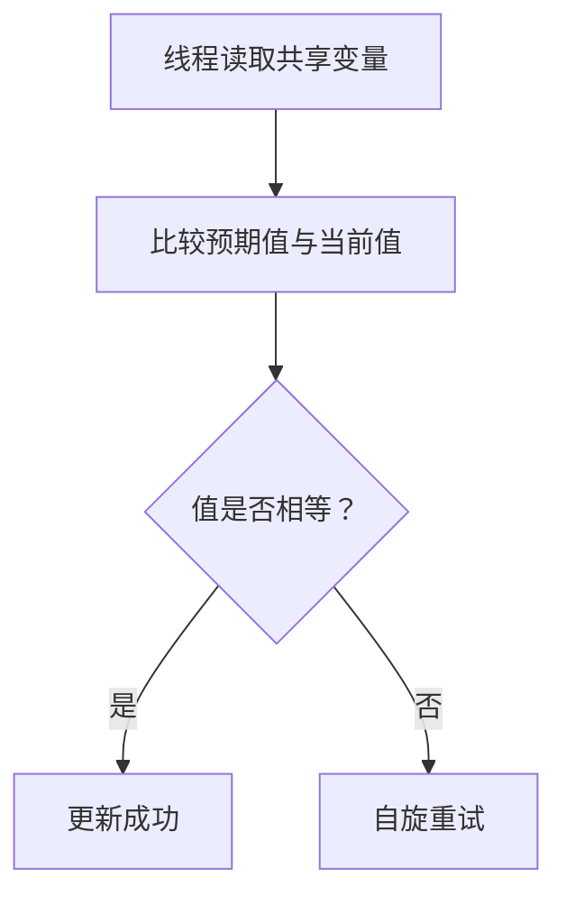

# 4. CAS

## 1. 概述与定义

在多线程并发环境中，如何高效地保证共享数据的安全性与一致性一直是重要的课题。CAS（Compare And Swap，比较并交换）是一种常用的无锁算法，用于实现原子变量的更新。它的基本思想是：当多个线程同时修改共享数据时，每个线程会先读取变量当前的值，再通过硬件支持的原子指令将该值与预期值进行比较，如果相同则更新为新值，否则重新尝试。CAS 是构建高并发无锁数据结构的重要基础技术，在 Java 中广泛应用于 AtomicInteger、AtomicReference、ConcurrentHashMap 等类的实现中。😊

CAS 的核心优势在于它能在不使用传统锁（synchronized 或 Lock）的情况下，实现线程安全的数据更新，从而减少上下文切换开销和阻塞等待，提升并发性能。然而，CAS 同时也存在 ABA 问题和自旋开销等潜在缺陷，因此在使用时需要综合考量应用场景与性能要求。&#x20;

## 2. 主要特点

CAS 在并发编程中的特点主要包括以下几点：

1. **无锁设计** &#x20;
   - CAS 通过硬件支持的原子指令实现数据更新，无需传统锁机制。 &#x20;
   - 这种无锁设计可以避免线程阻塞，提高系统吞吐量。 &#x20;
   - 例如，使用 AtomicInteger.incrementAndGet() 可在高并发情况下高效更新计数器。 ✅
2. **乐观锁思想** &#x20;
   - CAS 假设多线程冲突概率较低，直接更新共享数据，只有在检测到冲突时才重试。 &#x20;
   - 这种乐观锁的策略适合读操作远多于写操作的场景。 &#x20;
   - 但在写竞争激烈时，CAS 可能产生大量自旋重试，影响性能。 ⚠️
3. **硬件原子性** &#x20;
   - CAS 依赖于 CPU 提供的原子指令，如 x86 架构的 CMPXCHG 指令，保证了比较与更新操作的原子性。 &#x20;
   - 这使得 CAS 能在底层高效执行，并在并发场景下保持数据正确性。 🔧
4. **ABA 问题** &#x20;
   - CAS 的一个缺点是可能出现 ABA 问题，即变量的值虽然在比较时未变，但实际上可能经历了 A→B→A 的变化过程，导致更新错误。 &#x20;
   - 为了解决 ABA 问题，Java 提供了 AtomicStampedReference 和 AtomicMarkableReference 等工具。 &#x20;
   - 这是 CAS 机制需要特别注意的安全隐患。 🚨
5. **自旋等待** &#x20;
   - 如果 CAS 操作失败，线程会不断自旋重试直到成功，可能会导致 CPU 资源浪费。 &#x20;
   - 在竞争激烈的场景下，需要设置合适的重试机制或采用锁机制替代。 &#x20;
   - 自旋的时间不能过长，否则会影响系统性能。 🔄

下面的表格对 CAS 的主要特点进行了总结：

| 特点     | 详细说明                       | 适用场景及注意事项                    |
| ------ | -------------------------- | ---------------------------- |
| 无锁设计   | 依靠硬件原子指令实现数据更新，无需传统锁       | 高并发读多写少场景，减少线程阻塞             |
| 乐观锁    | 先读取数据，再尝试更新，失败后重试          | 适用于冲突概率较低的场景，但写竞争激烈时可能自旋过多   |
| 硬件原子性  | 依赖 CPU 的 CMPXCHG 指令，保证原子操作 | 高效实现原子操作                     |
| ABA 问题 | 变量值可能经历 A→B→A 的变化，导致更新错误   | 使用 AtomicStampedReference 解决 |
| 自旋等待   | 失败后自旋重试，但可能浪费 CPU 时间       | 自旋重试次数应适当控制                  |

## 3. 应用目标

CAS 的应用目标主要体现在以下几个方面：

1. **实现无锁并发** &#x20;
   - 通过 CAS 可以实现无锁算法，避免传统锁机制带来的阻塞和上下文切换开销。 &#x20;
   - 这种方式尤其适合高并发环境下的计数器、状态标记等简单共享变量更新。 &#x20;
2. **提高系统吞吐量与响应速度** &#x20;
   - 无锁机制能够让多个线程并发更新数据，不会因锁竞争而阻塞，大幅提升系统吞吐量。 &#x20;
   - 例如，使用 AtomicInteger 实现计数器可以在高并发环境中保持高效性能。 &#x20;
3. **简化并发编程模型** &#x20;
   - 利用 CAS 实现原子更新，使得代码逻辑更清晰，不必担心锁的获取与释放问题。 &#x20;
   - 这有助于降低编写并发代码的复杂性，提高代码可读性和维护性。 &#x20;
4. **解决 ABA 问题与改进数据安全** &#x20;
   - 通过使用带版本号或标记的 CAS 变体（如 AtomicStampedReference），可以有效防止 ABA 问题，增强数据更新的可靠性。 &#x20;
5. **适应不同并发场景** &#x20;
   - CAS 适合读操作远多于写操作的场景，而对于写操作竞争激烈的情况，则需要结合其他同步机制进行优化。 &#x20;
   - 根据业务特点，选择适当的无锁或有锁策略，实现系统最优性能。 &#x20;

总体来说，CAS 的目标在于实现高效、无锁的并发控制，既提高程序执行效率，又保障数据的一致性与正确性，为构建高并发系统提供坚实基础。🎯

## 4. 主要内容及其组成部分

这一部分详细介绍 CAS 的组成部分和实现内容，包括其基本操作、常见问题、优化手段和相关 API。

### 4.1 CAS 操作的基本原理

CAS 操作的基本步骤如下：

- **读取内存中的当前值**：线程首先读取共享变量的当前值。 &#x20;
- **比较当前值与预期值**：将当前值与线程预期的值进行比较。 &#x20;
- **更新值**：如果两者相等，则将变量更新为新值；如果不等，则说明有其他线程更新了变量，当前线程则重试。 &#x20;

这一过程在硬件层面以原子指令（如 CMPXCHG）实现，确保操作的原子性。

### 4.2 原子变量的应用

Java 中通过 java.util.concurrent.atomic 包提供了多种原子变量，如 AtomicInteger、AtomicLong、AtomicReference 等，这些类都使用 CAS 实现原子操作。

示例代码（AtomicInteger）：

```java 
import java.util.concurrent.atomic.AtomicInteger;

public class AtomicCounter {
    private AtomicInteger counter = new AtomicInteger(0);
    
    public void increment() {
        counter.incrementAndGet();
    }
    
    public int getCounter() {
        return counter.get();
    }
    
    public static void main(String[] args) {
        AtomicCounter ac = new AtomicCounter();
        ac.increment();
        System.out.println("计数值：" + ac.getCounter());
    }
}
```


通过 AtomicInteger，可以实现高效无锁的计数操作，适用于高并发计数器等场景。

### 4.3 ABA 问题及解决方案

CAS 的一个重要缺陷是 ABA 问题，即变量值虽然在比较时未发生变化，但可能经历了 A→B→A 的变化过程，从而导致 CAS 操作错误。解决方案包括使用 AtomicStampedReference 或 AtomicMarkableReference，这些类引入版本号或标记来区分变量变化。

示例代码（AtomicStampedReference）：

```java 
import java.util.concurrent.atomic.AtomicStampedReference;

public class ABADemo {
    public static void main(String[] args) {
        Integer initialRef = 100;
        int initialStamp = 0;
        AtomicStampedReference<Integer> asr = new AtomicStampedReference<>(initialRef, initialStamp);
        
        // 模拟线程1修改数据
        boolean result = asr.compareAndSet(100, 101, asr.getStamp(), asr.getStamp() + 1);
        System.out.println("线程1更新结果：" + result + "，当前值：" + asr.getReference());
    }
}
```


这种方式可以有效防止 ABA 问题，确保 CAS 操作的准确性。

### 4.4 自旋与重试机制

在 CAS 操作中，如果当前线程检测到预期值与内存中的值不一致，通常会采用自旋重试的方式不断尝试更新。 &#x20;

- **自旋等待**：线程不会进入阻塞状态，而是忙等待，直到更新成功。 &#x20;
- **重试次数**：在竞争激烈时，自旋可能导致 CPU 占用率上升，因此需要合理控制重试次数或采用适当的退避策略。 &#x20;

这种机制适用于高并发场景下的快速更新，但在写操作频繁时可能引起性能问题。

### 4.5 CAS 与其他同步机制的对比

CAS 是一种无锁并发控制机制，与 synchronized、Lock 等传统锁机制相比，具有更高的性能和更低的延迟，但也存在 ABA 问题和自旋开销。 &#x20;

- synchronized 采用互斥锁，能自动释放锁，但在高并发时可能引起阻塞； &#x20;
- Lock 提供灵活锁控制和可中断性，但编码复杂； &#x20;
- CAS 基于硬件指令实现无锁操作，效率高，但需要额外解决 ABA 问题。 &#x20;

下表总结了 CAS 与传统同步机制的比较：

| 同步机制         | 实现方式        | 优点                 | 缺点                   |
| ------------ | ----------- | ------------------ | -------------------- |
| synchronized | 内置关键字、对象监视器 | 简单、自动释放锁、内存屏障保证可见性 | 高并发时锁竞争开销大、不可中断      |
| Lock         | 显式加锁与解锁     | 灵活、支持公平锁、可中断锁等待    | 编码复杂、手动释放锁容易出错       |
| CAS（原子变量）    | 基于硬件 CAS 指令 | 高效、无锁操作、适用于单变量更新   | ABA 问题、自旋重试开销，适用范围有限 |

## 5. 原理剖析

在这一部分，我们深入探讨 CAS 的底层原理和实现细节，从硬件指令到 JVM 内部机制，全面解析其工作原理。

### 5.1 CAS 的硬件实现

CAS 操作依赖于 CPU 提供的原子指令，如 CMPXCHG。其基本流程是： &#x20;

1. 读取内存中的当前值； &#x20;
2. 比较该值与预期值； &#x20;
3. 如果相等，则将内存值更新为新值，否则返回当前值。 &#x20;

这种操作在 CPU 层面以原子方式完成，保证在多线程并发更新时数据不会被破坏。

### 5.2 JVM 中的原子变量实现

Java 中的原子变量类（例如 AtomicInteger）内部封装了 CAS 操作。它们调用底层的 Unsafe 类方法实现 CAS 更新。例如，在 AtomicInteger 中，incrementAndGet() 方法内部调用 CAS 指令实现自增操作。 &#x20;
这种无锁设计能够在高并发场景下提高效率，避免了线程阻塞和上下文切换带来的开销。

### 5.3 ABA 问题及内存屏障

- **ABA 问题**：CAS 操作仅比较内存中的当前值与预期值，如果数值先后变化后又恢复原值，CAS 仍认为无变化。 &#x20;
- **解决方案**：通过引入版本号，AtomicStampedReference 记录变量的值及其版本号，确保每次更新都检查版本号，从而避免 ABA 问题。 &#x20;
- **内存屏障**：在 CAS 操作中，内存屏障用于确保操作的有序性和可见性，防止编译器和 CPU 的重排优化导致数据不一致。

### 5.4 自旋锁与 CAS 重试机制

CAS 操作失败后，线程通常采用自旋方式重试更新操作。这种机制被称为自旋锁。 &#x20;

- 在自旋过程中，线程不会阻塞，而是不断重试直到成功。 &#x20;
- 自旋锁在竞争较轻的情况下非常高效，但在竞争激烈时可能导致 CPU 资源浪费。 &#x20;
- 通过合理控制自旋次数和采用退避算法，可以平衡性能和资源利用。

### 5.5 并发安全性与无锁设计的比较

- 无锁设计（如 CAS）在多线程读操作较多的场景下具有显著优势，因为它避免了传统锁机制的阻塞和上下文切换。 &#x20;
- 但是，在写操作频繁或竞争激烈的场景下，CAS 的重试自旋可能引起高 CPU 占用，甚至导致活锁。 &#x20;
- 因此，实际应用中需要综合考虑使用无锁 CAS、锁机制或两者结合的方式，达到最佳并发性能。

下面使用 Mermaid 图表展示 CAS 自旋重试与锁机制的对比流程：




图中展示了 CAS 操作的基本流程：线程读取变量，比较预期值与当前值，若相等则更新成功，否则进入自旋重试，直到更新成功。

## 6. 应用与拓展

理解 CAS 的原理及实现，为我们在实际项目中优化并发控制提供了理论基础。以下是几种典型的应用与扩展方向：

### 6.1 并发计数器与状态管理

- 使用 AtomicInteger、AtomicLong 等原子变量实现高并发计数器，适用于网站访问统计、库存管理等场景。 &#x20;
- 利用 AtomicReference 实现原子更新操作，实现线程安全的状态管理。

### 6.2 无锁数据结构

- 通过 CAS 实现的无锁数据结构（如无锁队列、无锁栈）在高并发环境下具有极高性能。 &#x20;
- 例如，Java 的 ConcurrentLinkedQueue 就采用了无锁算法，利用 CAS 实现高效入队和出队操作。

### 6.3 自旋锁与退避策略

- 在高并发情况下，通过自旋锁可以减少线程阻塞，但需要合理设置自旋次数和退避算法，避免过度自旋浪费 CPU。 &#x20;
- 应用场景包括高频率更新的共享变量，需根据实际情况调优自旋策略。

### 6.4 解决 ABA 问题的改进

- 在容易出现 ABA 问题的场景中，使用 AtomicStampedReference 或 AtomicMarkableReference 来记录变量的版本信息。 &#x20;
- 这种方案在实现线程安全更新的同时，能有效避免 ABA 带来的数据错误。

### 6.5 并发集合与无锁设计的结合

- 大量并发集合类（如 ConcurrentHashMap）内部都使用了 CAS 来实现无锁更新，提高数据访问效率。 &#x20;
- 结合 CAS 与细粒度锁机制，设计出更高效的数据共享方案，是现代高并发系统的关键。

下面的表格展示了 CAS 在实际应用中的一些典型场景与替代方案：

| 应用场景  | 主要用途            | 典型实现或方案                                |
| ----- | --------------- | -------------------------------------- |
| 并发计数器 | 高效统计数据，避免锁竞争    | AtomicInteger、AtomicLong               |
| 无锁队列  | 高并发任务调度和数据传输    | ConcurrentLinkedQueue                  |
| 状态管理  | 线程安全状态更新        | AtomicReference、AtomicStampedReference |
| 数据共享  | 构建并发集合，实现高效数据访问 | ConcurrentHashMap                      |
| 自旋锁优化 | 减少线程阻塞，提高并发性能   | 自旋锁结合退避算法                              |

## 7. 面试问答

下面是从面试者角度整理的五个常见问题及详细回答，帮助你在面试中从容应对有关 CAS 及其实现原理的问题。

### 问题1：请简述 CAS 的基本原理及其在无锁编程中的作用？

答： &#x20;
CAS（Compare And Swap）是一种无锁算法，其基本原理是先读取共享变量的当前值，然后将其与预期值比较，如果一致则更新为新值，否则重试。CAS 操作在硬件层面通过原子指令实现，可以避免传统锁机制带来的阻塞和上下文切换，适用于高并发场景中实现无锁更新，从而提高程序效率。

### 问题2：什么是 ABA 问题？你如何解决这一问题？

答： &#x20;
ABA 问题是 CAS 操作中的一个潜在缺陷，即变量值虽然在比较时没有变化，但可能经历了 A→B→A 的过程，导致 CAS 误认为数据未改变。解决方案是使用 AtomicStampedReference 或 AtomicMarkableReference，通过增加版本号或标记，确保每次更新都检查变量的状态，从而避免 ABA 问题。

### 问题3：CAS 与传统的锁机制相比，有哪些优势和不足？

答： &#x20;
CAS 的优势在于它是无锁设计，避免了线程阻塞和上下文切换，适合读多写少的场景，具有更高的性能；但不足在于可能会引起 ABA 问题以及自旋等待开销，在竞争激烈时可能浪费 CPU 资源。相比之下，传统锁虽然简单，但在高并发下容易导致阻塞和性能瓶颈。

### 问题4：请解释原子变量如何利用 CAS 实现无锁操作，并举例说明 AtomicInteger 的使用场景？

答： &#x20;
原子变量（如 AtomicInteger）内部封装了 CAS 操作，通过调用底层的 Unsafe 类方法实现原子更新，例如 AtomicInteger.incrementAndGet() 方法。它在高并发环境下能高效实现计数、状态更新等操作。常见使用场景包括高并发计数器、缓存更新以及状态标记等。

### 问题5：请讨论在高并发场景下如何合理使用 CAS 以及自旋等待机制来优化性能？如何避免自旋带来的资源浪费？

答： &#x20;
在高并发环境下，CAS 能实现无锁更新，但当竞争激烈时会产生大量自旋等待。为优化性能，应合理设置自旋重试次数和采用退避算法，避免长时间自旋浪费 CPU。可以结合锁机制（如 ReentrantLock）或分段锁方案，如 ConcurrentHashMap 采用分段锁实现数据共享，减少单一变量 CAS 自旋的压力，从而达到最佳性能。

## 总结

本文从概述与定义、主要特点、应用目标、主要内容及其组成部分、原理剖析、应用与拓展以及面试问答七个部分，全面解析了 Java 并发安全中 CAS 机制的相关知识。我们详细介绍了 CAS 的基本原理、原子变量的实现、ABA 问题与解决方案、自旋等待机制以及 CAS 与传统同步机制的对比，并结合代码示例、详细表格和 Mermaid 图表展示了 CAS 操作在硬件和 JVM 内部的实现流程。通过这些内容，你可以理解如何利用 CAS 实现无锁并发控制，如何在高并发场景中进行性能调优，并为面试中回答关于并发安全和无锁设计的问题提供有力支持。希望这篇文章能够为你的面试复习和实际开发提供充分的理论依据和实践指导，助你构建出高效、稳定且线程安全的并发系统。加油！🚀
