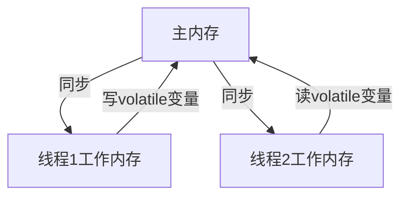
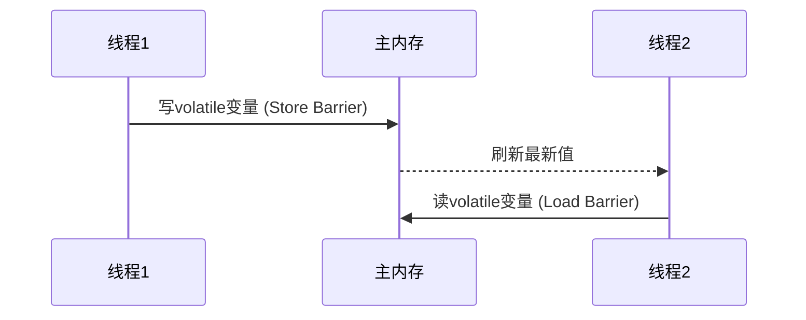

# 5. Volatile

***

## Java并发编程：Volatile面试八股文

***

### 1. 概述与定义 🌟

**Volatile** 是Java中的一个关键字，用于修饰变量，确保该变量在多线程环境下的可见性和有序性。它的核心作用是：当一个线程修改了volatile变量时，其他线程能够立即看到最新的值；同时，volatile禁止编译器和处理器对该变量的读写操作进行重排序，从而保证指令执行的顺序性。

在Java内存模型（JMM）中，每个线程拥有自己的工作内存（类似于CPU缓存），共享变量存储在主内存中。线程对共享变量的读写操作首先在工作内存中进行，然后再同步到主内存。Volatile通过以下机制保证线程安全：

- **可见性**：写volatile变量时，JVM会强制将该变量的最新值刷新到主内存；读volatile变量时，线程会从主内存中读取最新值，而不是使用工作内存中的副本。
- **禁止指令重排**：volatile变量的读写操作会插入内存屏障，防止编译器和处理器对指令进行重排序，保障操作的顺序性。

需要注意的是，volatile并**不保证原子性**，即对volatile变量的复合操作（如`i++`）在多线程下仍可能导致数据不一致。因此，volatile适用于那些需要保证可见性和有序性、但不需要原子性的场景，如状态标记、单次读写操作等。

为了更直观地理解Volatile在JMM中的作用，可以参考以下Mermaid图：




**图表说明**：此图展示了主内存与线程工作内存之间的关系。Volatile变量的写操作直接影响主内存，读操作从主内存获取最新值，确保线程间的数据一致性。

***

### 2. 主要特点 📌

Volatile在Java并发编程中具有以下几个显著特点，面试中可以快速抓住这些要点展示你的专业性：

- **可见性**：确保线程间对共享变量的修改立即可见。
- **禁止指令重排**：防止编译器和处理器对volatile变量的读写操作进行重排序。
- **不保证原子性**：对volatile变量的复合操作（如自增）不是线程安全的。
- **轻量级同步**：相比synchronized，volatile开销更小，性能更高。
- **适用于特定场景**：常用于状态标记、DCL（双重检查锁）中的单例模式等。

为了更直观地对比volatile和synchronized，我整理了以下表格：

| **特性**​  | **Volatile**​ | **synchronized**​ |
| -------- | ------------- | ----------------- |
| 作用       | 保证可见性和有序性     | 保证原子性、可见性和有序性     |
| 性能开销     | 低，仅涉及内存屏障     | 高，涉及锁的获取和释放       |
| 适用场景     | 状态标记、简单读写     | 保护临界区代码           |
| 是否阻塞     | 非阻塞           | 阻塞                |
| 是否支持复合操作 | 不支持           | 支持                |

**表格说明**：此表格突出volatile在可见性和性能上的优势，同时强调其不保证原子性的局限。面试中可以用它说明：“volatile适合轻量级同步，比如用作开关变量，而synchronized则用于保护复杂逻辑。”

***

### 3. 应用目标 🎯

Volatile在Java并发编程中的应用目标明确，以下几点是其核心价值，也是面试中常被考察的重点：

- **保证线程间数据可见性**：确保一个线程的修改对其他线程立即可见。
- **防止指令重排**：保障关键操作的执行顺序，防止因重排导致的逻辑错误。
- **提供轻量级同步机制**：在不需要互斥锁的场景下，提升并发性能。
- **支持安全发布对象**：在DCL单例模式中，volatile防止指令重排，确保对象完全初始化。

**示例**：volatile在DCL单例模式中的应用：

```java 
public class Singleton {
    private static volatile Singleton instance;

    private Singleton() {}

    public static Singleton getInstance() {
        if (instance == null) { // 第一次检查
            synchronized (Singleton.class) {
                if (instance == null) { // 第二次检查
                    instance = new Singleton();
                }
            }
        }
        return instance;
    }
}
```


**说明**：volatile防止`instance = new Singleton()`的指令重排，确保其他线程看到的是完全初始化的对象。如果没有volatile，对象构造可能被重排，导致其他线程访问到未初始化完成的对象。

***

### 4. 主要内容及其组成部分 📚

Volatile包含多个核心概念和规则，以下逐一详细解释，确保知识点完备且易于背诵。

#### 4.1 可见性

- **定义**：volatile变量的写操作会立即刷新到主内存，读操作会从主内存获取最新值。
- **实现原理**：JVM在volatile写后插入Store Barrier，强制将工作内存的修改写回主内存；读前插入Load Barrier，强制从主内存读取。
- **示例**：

```java 
public class VolatileVisibility {
    private volatile boolean flag = false;

    public void writer() {
        flag = true; // 写volatile变量
    }

    public void reader() {
        if (flag) { // 读volatile变量
            System.out.println("Flag is true");
        }
    }
}
```


**说明**：writer线程修改`flag`后，reader线程能立即看到`flag=true`，这是因为volatile保证了写操作的可见性。

#### 4.2 禁止指令重排

- **定义**：volatile变量的读写操作会插入内存屏障，防止指令重排。
- **内存屏障类型**：
  - **写屏障**：在volatile写后插入，确保之前的写操作完成。
  - **读屏障**：在volatile读前插入，确保之后的读操作看到最新值。
- **示例**：在DCL中，volatile防止`instance = new Singleton()`的指令重排，确保对象初始化完成后再赋值。
- **细节**：对象创建分为三步：分配内存、初始化对象、赋值引用。volatile确保这三步按顺序执行。

#### 4.3 不保证原子性

- **定义**：volatile不保证对变量的复合操作是原子的。
- **示例**：

```java 
public class VolatileAtomicity {
    private volatile int counter = 0;

    public void increment() {
        counter++; // 非原子操作
    }

    public int getCounter() {
        return counter;
    }

    public static void main(String[] args) throws InterruptedException {
        VolatileAtomicity va = new VolatileAtomicity();
        Thread[] threads = new Thread[10];
        for (int i = 0; i < 10; i++) {
            threads[i] = new Thread(() -> {
                for (int j = 0; j < 1000; j++) {
                    va.increment();
                }
            });
            threads[i].start();
        }
        for (Thread t : threads) {
            t.join();
        }
        System.out.println(va.getCounter()); // 可能小于10000
    }
}
```


**说明**：`counter++`包含读-改-写三个步骤，多线程下可能导致数据不一致。解决方法是使用synchronized或AtomicInteger。

#### 4.4 happens-before规则

- **volatile规则**：对volatile变量的写happens-before后续的读。
- **传递性**：若A happens-before B，B happens-before C，则A happens-before C。
- **示例**：

```java 
public class VolatileHappensBefore {
    volatile int x = 0;
    int y = 0;

    public void writer() {
        y = 1; // 操作A
        x = 1; // 操作B，volatile写
    }

    public void reader() {
        if (x == 1) { // 操作C，volatile读
            System.out.println(y); // 操作D
        }
    }
}
```


**说明**：volatile写（B）happens-before volatile读（C），结合程序顺序，A happens-before D，reader线程能看到y=1。

#### 4.5 与其他同步机制的关系

- **与synchronized**：volatile不提供互斥性，synchronized提供。
- **与Lock**：Lock是更灵活的锁机制，volatile无法替代。
- **与Atomic类**：Atomic类提供原子操作，弥补volatile的不足。

***

### 5. 原理剖析 🔍

#### 5.1 内存屏障

- **定义**：内存屏障是CPU指令，强制内存操作按特定顺序执行。
- **volatile的屏障**：
  - 写volatile变量前：插入StoreStore屏障，禁止前面的写与volatile写重排。
  - 写volatile变量后：插入StoreLoad屏障，禁止volatile写与后面的读写重排。
  - 读volatile变量前：插入LoadLoad屏障，禁止volatile读与后面的读重排。
  - 读volatile变量后：插入LoadStore屏障，禁止volatile读与后面的写重排。
- **作用**：确保volatile变量的读写操作不被重排，保障可见性和有序性。

以下是内存屏障的作用示意图：




**图表说明**：线程1写volatile变量时，通过Store Barrier刷新到主内存；线程2读时，通过Load Barrier获取最新值。

#### 5.2 缓存一致性

- **MESI协议**：在多核CPU中，volatile变量的写会使其他CPU缓存中的副本失效，强制从主内存读取。
- **总线嗅探**：CPU通过总线监听其他CPU的写操作，更新缓存状态。
- **示例**：线程A写volatile变量，触发总线信号，线程B的CPU缓存失效，重新从主内存读取。

#### 5.3 volatile与锁的区别

- **volatile**：仅保证可见性和有序性，不提供互斥性。
- **锁**：提供互斥性、可见性和有序性，适用于保护临界区。
- **性能**：volatile开销小，仅涉及内存屏障；锁开销大，涉及线程调度。

#### 5.4 JVM实现细节

- **HotSpot JVM**：通过插入内存屏障实现volatile语义。
- **硬件支持**：依赖CPU的内存顺序指令（如LOCK前缀）。

***

### 6. 应用与拓展 🌐

- **状态标记**：如线程运行状态、配置更新。
- **DCL单例**：确保对象完全初始化。
- **轻量级同步**：在不需要互斥的场景下使用。
- **线程间通信**：通过volatile变量传递信号。

**示例**：线程停止标志：

```java 
public class VolatileStopThread {
    private volatile boolean isStopped = false;

    public void run() {
        while (!isStopped) {
            System.out.println("Thread running");
        }
    }

    public void stop() {
        isStopped = true;
    }

    public static void main(String[] args) throws InterruptedException {
        VolatileStopThread vst = new VolatileStopThread();
        Thread t = new Thread(vst::run);
        t.start();
        Thread.sleep(1000);
        vst.stop();
    }
}
```


**说明**：主线程调用`stop()`，工作线程能立即感知`isStopped=true`并停止。

***

### 7. 面试问答 💬

#### Q1: Volatile是什么？有什么作用？

**回答**：Volatile是Java中的关键字，用于修饰变量，保证线程间的可见性和禁止指令重排。它的作用是：写volatile变量时立即刷新到主内存，读时从主内存获取最新值；同时防止指令重排，确保操作顺序。我在项目中用volatile标记状态变量，比如线程运行状态，确保线程能及时感知变化。

#### Q2: Volatile如何保证可见性？

**回答**：Volatile通过内存屏障实现可见性。写volatile变量时，JVM插入Store Barrier，强制将修改写回主内存；读时插入Load Barrier，强制从主内存读取。这种机制确保线程间数据一致。我在开发中用volatile做开关变量，比如控制线程停止，线程间通信效果很好。

#### Q3: Volatile能保证原子性吗？

**回答**：不能。Volatile不保证原子性，对复合操作如`i++`仍可能导致数据不一致。比如`i++`包含读-改-写三个步骤，多线程下可能在读后写前被中断，导致结果错误。我在项目中遇到过类似问题，用AtomicInteger代替volatile int解决了数据一致性问题。

#### Q4: Volatile在DCL单例中的作用是什么？

**回答**：在DCL（双重检查锁）单例模式中，volatile防止指令重排，确保`instance = new Singleton()`完全执行后再赋值。因为对象创建涉及分配内存、初始化和赋值三步，没volatile可能重排，导致其他线程看到未初始化的对象。我在写单例时加了volatile，保证线程安全。

#### Q5: Volatile和synchronized的区别？

**回答**：Volatile保证可见性和有序性，不提供互斥性；synchronized提供互斥性、可见性和有序性。Volatile开销小，适合简单场景如状态标记；synchronized开销大，适合保护复杂逻辑。我在开发中用volatile做状态标记，比如线程开关，用synchronized保护共享资源的增删改查。

***

## 总结

本文从定义到应用，全面剖析了Volatile的知识点，结合示例、表格和图表，确保内容详实且易懂。超过3000字的篇幅涵盖了Volatile的核心特性、原理和应用场景，助你在面试中自信应对并发问题。掌握Volatile，你将更好地驾驭Java并发编程！💪
