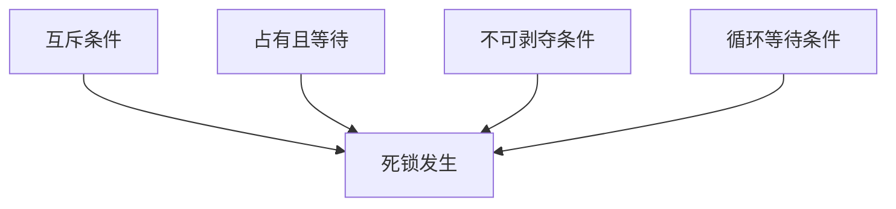
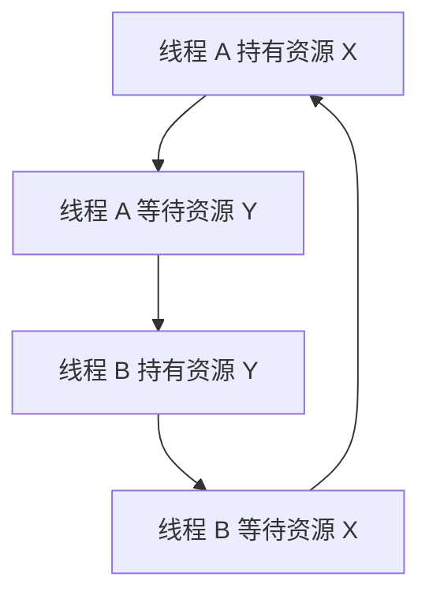

# 6. 死锁

## 1. 概述与定义

在多线程并发编程中，当多个线程因争夺共享资源而相互等待对方释放锁，导致彼此都无法继续执行时，就会发生**死锁**（Deadlock）。死锁是并发安全中的一种严重问题，它会导致程序永久挂起，无法继续进行下去。死锁通常发生在存在多个同步资源的场景中，线程在持有一个锁的同时，还等待获取另一个已被其他线程占用的锁，从而形成一个“循环等待”的闭环。

例如，在一个银行转账系统中，如果线程 A 锁住账户 X，同时等待账户 Y 的锁；而线程 B 锁住账户 Y，同时等待账户 X 的锁，就会导致双方互相等待，永远无法完成转账操作，这就是典型的死锁现象。😊

## 2. 主要特点

死锁作为并发编程中的一种问题，其主要特点包括：

1. **互斥条件** &#x20;
   - 共享资源在同一时刻只能由一个线程占用； &#x20;
   - 这是死锁产生的前提条件之一。 &#x20;
2. **占有且等待** &#x20;
   - 一个线程至少持有一个资源，并等待获取其他被其他线程占有的资源； &#x20;
   - 线程在等待过程中不主动释放自己已占有的资源。 &#x20;
3. **不可剥夺条件** &#x20;
   - 线程已获得的资源在未使用完之前，不能被其他线程强行剥夺，只能由自己主动释放。 &#x20;
4. **循环等待条件** &#x20;
   - 存在一个线程等待链，每个线程都在等待下一个线程所占有的资源，最终形成一个闭环； &#x20;
   - 这是死锁最典型的标志。

通过上述四个必要条件（互斥、占有且等待、不可剥夺、循环等待），系统才能出现死锁。下表对死锁条件进行了简要总结：

| 条件     | 说明                 | 举例                       |
| ------ | ------------------ | ------------------------ |
| 互斥条件   | 同一资源不能被多个线程同时占用    | 一个账户只能被一个线程修改            |
| 占有且等待  | 线程持有部分资源且等待其他资源    | 线程 A 持有资源 X 等待资源 Y       |
| 不可剥夺条件 | 已分配的资源在未释放前不能被强制剥夺 | 线程在获取资源后，只有主动释放才能让其他线程获得 |
| 循环等待条件 | 存在闭环的等待关系          | 线程 A 等待线程 B，线程 B 又等待线程 A |

## 3. 应用目标

理解死锁问题的核心目的是在多线程并发程序中保证系统的稳定性和高效性。具体应用目标包括：

1. **保障数据一致性和系统可靠性** &#x20;
   - 死锁一旦发生，程序将无法继续执行，严重影响业务流程。 &#x20;
   - 理解死锁的产生机制有助于预防和设计安全的并发程序，确保数据一致性。 &#x20;
2. **提高系统并发性能** &#x20;
   - 通过合理设计锁的获取顺序和同步策略，避免死锁，提高系统响应速度。 &#x20;
   - 使用诸如 tryLock、锁超时等技术，可以有效降低死锁风险。 &#x20;
3. **降低开发和维护成本** &#x20;
   - 了解死锁成因，能在开发过程中写出健壮、易于维护的并发代码，避免因死锁导致的系统故障。 &#x20;
   - 在调试过程中，通过分析线程堆栈及锁等待情况迅速定位问题。 &#x20;
4. **支持高并发与分布式系统设计** &#x20;
   - 在高并发和分布式系统中，锁管理和资源共享尤为关键，避免死锁是构建高可用系统的基础。 &#x20;
   - 通过死锁检测与恢复机制，确保系统在异常情况下也能自动恢复。 &#x20;
5. **面试考察与理论实践结合** &#x20;
   - 死锁是面试中常见考点，理解其理论和实际应用，有助于在面试中展示扎实的并发知识和问题解决能力。 &#x20;

## 4. 主要内容及其组成部分

本部分详细介绍死锁问题的各个组成部分，涵盖死锁产生的必要条件、检测方法、避免策略和恢复机制等内容。

### 4.1 死锁产生的必要条件

死锁产生必须满足以下四个必要条件：

1. **互斥条件** &#x20;
   - 资源只能被一个线程占用，其他线程必须等待。 &#x20;
2. **占有且等待** &#x20;
   - 线程在持有一个资源的同时，申请其他被占用的资源，且不主动释放已占有资源。 &#x20;
3. **不可剥夺条件** &#x20;
   - 线程获得资源后，除非主动释放，否则其他线程不能强制剥夺。 &#x20;
4. **循环等待条件** &#x20;
   - 存在一个循环等待关系，每个线程等待的资源都被另一个线程持有，形成闭环。 &#x20;

这四个条件同时成立时，死锁必然发生。下面的图表展示了死锁产生的四个必要条件：




### 4.2 死锁检测

死锁检测是指在系统中主动或被动检测到死锁情况的方法。常见方法包括：

- **定时检查** &#x20;
  - 系统周期性生成线程堆栈信息，分析是否存在线程间循环等待。 &#x20;
- **工具支持** &#x20;
  - 使用 jconsole、VisualVM 等工具，可以实时监控线程状态，查看哪些线程处于 BLOCKED 状态并查找死锁痕迹。 &#x20;

示例代码（利用 ThreadMXBean 检测死锁）：

```java 
import java.lang.management.ManagementFactory;
import java.lang.management.ThreadInfo;
import java.lang.management.ThreadMXBean;

public class DeadlockDetector {
    public static void main(String[] args) {
        ThreadMXBean bean = ManagementFactory.getThreadMXBean();
        long[] threadIds = bean.findDeadlockedThreads();
        if (threadIds != null) {
            ThreadInfo[] infos = bean.getThreadInfo(threadIds);
            System.out.println("发现死锁线程：");
            for (ThreadInfo info : infos) {
                System.out.println(info.getThreadName() + " 被锁住");
            }
        } else {
            System.out.println("没有检测到死锁");
        }
    }
}
```


### 4.3 死锁预防与避免

预防死锁的策略主要包括：

- **资源排序** &#x20;
  - 规定所有线程必须按照统一顺序请求资源，避免循环等待。 &#x20;
- **一次性申请** &#x20;
  - 线程一次性申请所有所需资源，若无法全部获得则释放所有资源后重试。 &#x20;
- **锁超时机制** &#x20;
  - 在获取锁时设置超时时间，超时后放弃，防止长时间阻塞。 &#x20;
- **避免嵌套锁** &#x20;
  - 尽量避免在一个 synchronized 块中再嵌套获取其他锁，从设计上减少死锁发生可能性。 &#x20;

### 4.4 死锁恢复

死锁恢复是指在检测到死锁后采取措施解除死锁的方法。常见策略包括：

- **主动中断** &#x20;
  - 在检测到死锁后，主动中断部分线程，迫使它们释放锁，从而打破循环等待。 &#x20;
- **资源回收** &#x20;
  - 强制释放部分资源或重置相关状态，恢复系统正常运行。 &#x20;
- **日志记录与报警** &#x20;
  - 在死锁发生时记录详细日志，并触发报警，由运维人员介入排查和手动干预。 &#x20;

### 4.5 死锁模拟案例

为了更直观地理解死锁的产生，下面给出一个简单的模拟死锁案例：

```java 
public class DeadlockDemo {
    private static final Object lock1 = new Object();
    private static final Object lock2 = new Object();
    
    public static void main(String[] args) {
        Thread t1 = new Thread(() -> {
            synchronized (lock1) {
                System.out.println("线程1：获得 lock1");
                try {
                    Thread.sleep(100);
                } catch (InterruptedException e) {
                    e.printStackTrace();
                }
                System.out.println("线程1：等待获得 lock2");
                synchronized (lock2) {
                    System.out.println("线程1：获得 lock2");
                }
            }
        });
        
        Thread t2 = new Thread(() -> {
            synchronized (lock2) {
                System.out.println("线程2：获得 lock2");
                try {
                    Thread.sleep(100);
                } catch (InterruptedException e) {
                    e.printStackTrace();
                }
                System.out.println("线程2：等待获得 lock1");
                synchronized (lock1) {
                    System.out.println("线程2：获得 lock1");
                }
            }
        });
        
        t1.start();
        t2.start();
    }
}
```


在上述代码中，线程 t1 先锁住 lock1 后等待 lock2，而线程 t2 刚好相反，从而形成循环等待，导致死锁。😊

## 5. 原理剖析

深入理解死锁产生的原理，是防止和调试并发安全问题的重要基础。以下是详细剖析：

### 5.1 死锁四个必要条件

死锁必须同时满足下列四个条件：

- **互斥条件**：每个资源在任一时刻只能被一个线程占有。 &#x20;
- **占有且等待**：线程已持有至少一个资源，同时请求其他被其他线程占有的资源。 &#x20;
- **不可剥夺条件**：已获得的资源在未使用完之前，不能被强制剥夺。 &#x20;
- **循环等待条件**：存在一个线程等待链，每个线程等待的资源都被另一个线程占用，形成闭环。 &#x20;

只有当这四个条件同时满足时，死锁才会发生。

### 5.2 内存模型与同步机制

- **Java 内存模型（JMM）** 定义了线程如何与内存交互，而 synchronized 以及 Lock 等同步机制都会在进入和退出同步区域时插入内存屏障，保证数据的可见性。 &#x20;
- 虽然内存屏障保证了数据一致性，但在设计锁机制时，若锁获取顺序不当仍容易造成死锁。

### 5.3 线程状态与等待队列

- 当线程因资源不足而无法获得锁时，会进入阻塞状态，并排入等待队列中。 &#x20;
- 如果多个线程互相等待对方持有的锁，则等待队列形成循环等待，从而导致死锁。 &#x20;
- 通过线程堆栈和锁监控工具，我们可以分析哪些线程处于 BLOCKED 状态，从而判断是否发生死锁。

### 5.4 死锁检测原理

- 死锁检测通常依靠操作系统或 JVM 提供的线程管理接口，如 ThreadMXBean。 &#x20;
- 这些工具会扫描所有线程的锁等待关系，构造等待图，如果存在环路，则判定为死锁。 &#x20;
- 理解死锁检测原理有助于在实际开发中及时发现问题，并采取措施恢复系统运行。

### 5.5 死锁预防与恢复机制

- **预防机制**：通过资源排序、一次性申请所有资源以及限制嵌套锁使用，设计时防止死锁条件同时满足。 &#x20;
- **恢复机制**：当检测到死锁后，主动中断部分线程或强制释放资源，以打破循环等待。 &#x20;
- 这些机制均依赖于对线程锁状态和等待队列的深入理解，为系统设计提供理论依据。

下面使用 Mermaid 图表展示死锁的等待关系及其检测流程：




图中展示了线程 A 持有资源 X 但等待资源 Y，而线程 B 持有资源 Y 却等待资源 X，形成闭环，从而产生死锁。

## 6. 应用与拓展

理解死锁产生与预防的原理后，在实际项目中可采用多种策略避免死锁问题，同时结合并发工具进行优化。以下是一些应用与拓展方向：

### 6.1 锁顺序控制

- 设计时统一规定线程请求多个锁的顺序，确保所有线程以相同顺序申请资源，从而避免循环等待。 &#x20;
- 例如，在数据库更新操作中，先获取资源 A，再获取资源 B，所有线程必须遵循该顺序。

### 6.2 尝试获取锁与超时

- 使用 Lock 接口的 tryLock(timeout) 方法，在无法获取锁时放弃等待，避免无限期阻塞。 &#x20;
- 这种方式可以避免长时间等待导致的死锁风险，提升系统响应性。

### 6.3 分离资源与细粒度锁设计

- 将大资源拆分为多个细粒度资源，各自加锁，降低锁竞争和死锁风险。 &#x20;
- 例如，设计订单系统时，将库存和订单信息分别锁定，避免多个线程同时申请同一把锁。

### 6.4 死锁检测与报警

- 集成 JVM 提供的死锁检测工具（如 ThreadMXBean），周期性检查线程状态，及时发现并报告死锁问题。 &#x20;
- 自动报警和日志记录可以帮助运维人员迅速介入并解决问题。

### 6.5 替代方案与优化

- 在某些场景下，可以采用无锁数据结构和 CAS 技术替代传统锁，降低死锁风险。 &#x20;
- 例如，使用 ConcurrentHashMap 替代 Hashtable，可以利用无锁算法提高并发性能，同时避免锁竞争引发的死锁问题。

下面的表格展示了防止死锁的主要策略及其适用场景：

| 策略       | 说明                            | 应用场景           |
| -------- | ----------------------------- | -------------- |
| 锁顺序控制    | 统一规定锁获取顺序，避免循环等待              | 多资源同时申请的复杂业务场景 |
| 尝试获取锁与超时 | 使用 tryLock(timeout) 获取锁，超时后放弃 | 高并发场景下避免无限等待   |
| 细粒度锁设计   | 拆分大锁为多个小锁，降低竞争风险              | 大型系统中共享资源访问    |
| 死锁检测与报警  | 利用 ThreadMXBean 等工具定期检查死锁     | 分布式系统、关键业务场景   |
| 无锁算法     | 采用 CAS 和原子变量实现数据更新，避免使用锁      | 高并发计数器、状态标记    |

## 7. 面试问答

下面从面试者角度出发，整理了五个常见问题及详细回答，帮助你在面试中从容应对有关死锁及其预防策略的考察问题。

### 问题1：请解释什么是死锁？它的产生必须满足哪些条件？

答： &#x20;
死锁是指多个线程在并发执行过程中，由于每个线程都持有某些资源并等待其他线程释放其所需的资源，最终形成循环等待而导致所有线程都无法继续执行的现象。死锁产生必须满足四个必要条件：互斥条件、占有且等待、不剥夺条件和循环等待条件。只有这四个条件同时满足，死锁才会发生。

### 问题2：在 Java 中，synchronized 是如何导致死锁的？请举例说明。

答： &#x20;
使用 synchronized 实现同步时，如果线程在嵌套锁中以不一致的顺序申请多个锁，就可能导致死锁。例如，线程 A 锁住对象 X 后等待对象 Y，而线程 B 锁住对象 Y 后等待对象 X，双方互相等待，最终形成死锁。示例代码已在前文给出，这种情况在涉及多个共享资源时尤为常见。

### 问题3：你如何检测 Java 程序中的死锁问题？请说明使用哪些工具和方法。

答： &#x20;
检测死锁问题可以使用 JVM 提供的 ThreadMXBean 接口，通过 findDeadlockedThreads() 方法扫描线程等待关系，查找循环等待链。另外，还可以使用 jconsole、VisualVM 等工具实时监控线程状态，从线程堆栈中分析 BLOCKED 状态的线程，判断是否存在死锁现象。

### 问题4：请讨论几种常见的死锁预防策略，并说明各自的优缺点。

答： &#x20;

常见的死锁预防策略包括： &#x20;

- **锁顺序控制**：规定线程获取多个锁的顺序，避免循环等待；优点简单直接，但在复杂系统中实施较困难。 &#x20;
- **一次性申请所有资源**：线程在开始操作前申请所有资源，如果不能全部获得，则放弃操作；优点能彻底避免死锁，但可能导致资源浪费和降低并发性能。 &#x20;
- **锁超时机制**：使用 tryLock(timeout) 等方法在无法及时获得锁时放弃等待；优点能防止长时间阻塞，但可能导致部分操作失败，需要额外的重试机制。 &#x20;
- **无锁算法**：采用原子变量和 CAS 技术替代传统锁，避免死锁风险；优点性能高，但适用范围有限，复杂数据结构难以实现。 &#x20;

### 问题5：请结合实际项目，谈谈你如何预防和解决死锁问题，以及你对未来并发控制的看法。

答： &#x20;

在实际项目中，我通常通过以下措施预防死锁： &#x20;

- 设计时严格规定资源获取顺序，确保所有线程按相同顺序申请锁。 &#x20;
- 在高并发场景下使用 tryLock(timeout) 方法，设置合理超时时间避免长时间阻塞。 &#x20;
- 使用分离锁和细粒度同步，尽可能降低锁竞争。 &#x20;
- 集成线程监控工具，定期检查线程状态，及时发现和处理死锁问题。 &#x20;

总体来看，随着无锁算法和并发框架的发展，我认为未来并发控制将更多依赖于原子变量、CAS 以及更高级的并发数据结构，以减少传统锁机制的性能瓶颈，提高系统吞吐量和稳定性。

## 总结

本文从概述与定义、主要特点、应用目标、主要内容及其组成部分、原理剖析、应用与拓展以及面试问答七个部分，全面详细地解析了 Java 并发安全中死锁的相关知识。我们介绍了死锁的定义及其产生的四个必要条件，详细讲解了死锁检测、预防、恢复等方法，并结合代码示例、表格归纳和 Mermaid 图表展示了死锁产生的条件、检测流程以及预防策略。文章还讨论了如何在实际项目中通过锁顺序控制、锁超时和无锁设计来避免死锁，同时提供了面试问答部分，帮助你在面试中从容回答关于死锁及其解决方案的问题。

希望这篇文章能为你的面试复习和项目开发提供充分的理论依据和实践指导，助你构建出高效、稳定、并发安全的系统。加油！🚀
