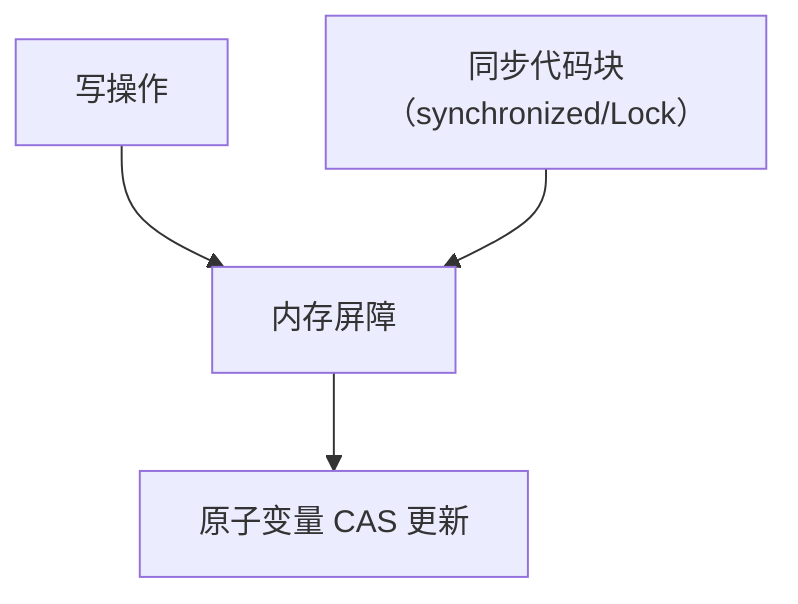

# 二. 并发安全

## 1. 概述与定义

在多线程并发程序中，由于多个线程同时访问共享资源，很容易出现数据竞争、内存不一致以及死锁等问题。**并发安全**（也称线程安全）指的是在多线程环境下，程序能够正确地执行并返回正确结果，即使多个线程同时访问和修改共享数据，也不会导致数据错误或程序异常崩溃。

Java 为实现并发安全提供了丰富的手段，包括关键字（synchronized、volatile）、原子变量（AtomicInteger、AtomicReference 等）、锁机制（ReentrantLock、ReadWriteLock）、线程安全的集合（ConcurrentHashMap、CopyOnWriteArrayList 等）以及各种并发工具类（CountDownLatch、Semaphore、CyclicBarrier 等）。理解这些技术和工具的原理和使用场景，对构建高效可靠的并发程序至关重要。😊

例如，在银行转账系统中，多个线程同时更新账户余额时，如果没有良好的并发安全保障，可能会出现账户金额计算错误。通过使用同步机制，确保每次转账操作都是原子性的，才能保证数据一致性和业务正确性。

## 2. 主要特点

Java 并发安全的实现具有以下几个主要特点，这些特点也是面试中常被深入讨论的重点：

1. **数据一致性保障** &#x20;
   - 并发安全保证在多个线程同时访问共享数据时，数据始终处于一致状态。 &#x20;
   - 通过同步机制和内存屏障等技术，确保线程间的修改对其他线程可见，避免“脏读”等问题。 &#x20;
   - 例如，使用 synchronized 或 Lock 来保护关键代码区，使得操作具有原子性。 ✅
2. **避免竞态条件** &#x20;
   - 当多个线程并发访问共享变量时，可能会发生竞态条件，导致数据错误。 &#x20;
   - 并发安全通过加锁、使用原子操作等方式防止多个线程同时修改数据，从而避免数据竞争。 &#x20;
   - 使用原子变量（如 AtomicInteger）可以无锁实现线程安全的累加操作。 🔒
3. **可见性与有序性** &#x20;
   - Java 内存模型（JMM）规定了线程之间共享变量的可见性和指令执行顺序。 &#x20;
   - 通过 volatile 关键字，可以保证变量在多线程间的可见性；synchronized 及 Lock 也会提供内存屏障效果，确保指令有序执行。 &#x20;
   - 这些特性防止了因编译器优化和 CPU 指令重排带来的线程安全隐患。 🌐
4. **高效并发性能** &#x20;
   - 并发安全的实现需要在确保正确性的同时，尽量减少同步开销，提高系统性能。 &#x20;
   - 例如，ConcurrentHashMap 通过分段锁和无锁算法，在多线程环境下能高效实现数据共享。 &#x20;
   - 采用合适的同步策略，能在保证线程安全的前提下，实现高并发数据访问。 ⚡
5. **灵活性与扩展性** &#x20;
   - Java 提供的并发工具和锁机制十分灵活，如 Lock、Condition 以及各种并发集合，支持不同场景下的需求。 &#x20;
   - 可以根据业务需求选择粗粒度或细粒度的锁机制，实现更高效的并发控制。 &#x20;
   - 同时，JDK 还提供了 Fork/Join 框架和 CompletableFuture 等高级并发工具，进一步提高了编程效率。 🔧

下面的表格总结了 Java 并发安全主要技术的特点和应用场景：

| 技术/工具                            | 主要特点                                     | 适用场景           |
| -------------------------------- | ---------------------------------------- | -------------- |
| synchronized                     | 简单、内置关键字，保证方法或代码块原子性                     | 低并发场景、简单同步需求   |
| volatile                         | 保证变量可见性与有序性，不提供原子性                       | 状态标记、简单计数器     |
| Lock（如 ReentrantLock）            | 提供更灵活的锁机制，支持公平锁、可中断锁等待                   | 高并发场景、复杂同步控制   |
| 原子变量（AtomicXXX）                  | 基于 CAS 无锁算法，效率高                          | 高并发计数、状态更新     |
| 并发集合                             | 如 ConcurrentHashMap、CopyOnWriteArrayList | 多线程环境下的数据共享与访问 |
| 并发工具（CountDownLatch、Semaphore 等） | 实现线程间协作与调度，保证并发任务协调执行                    | 多线程协同、任务调度     |

## 3. 应用目标

理解并实现 Java 并发安全技术的主要目标在于解决以下问题：

1. **确保数据正确性与一致性** &#x20;
   - 多线程环境下，正确处理共享数据，防止数据竞争、脏读和不可预期的错误。 &#x20;
   - 例如，在电商系统中，多个线程同时修改库存数据时，必须保证库存更新的原子性和一致性。
2. **提高系统并发性能** &#x20;
   - 采用合适的同步策略和并发工具，在保证线程安全的前提下，尽可能减少同步开销，提高系统吞吐量。 &#x20;
   - 例如，使用 ConcurrentHashMap 替代 Hashtable 或同步包装的 HashMap 能在高并发环境下提升性能。
3. **降低资源竞争与死锁风险** &#x20;
   - 设计合理的线程同步策略，避免因锁粒度过大或不当的同步机制引发死锁或性能瓶颈。 &#x20;
   - 使用 Lock、Condition 等工具，可以更精细地控制线程协作，减少资源竞争。
4. **增强代码的灵活性与可维护性** &#x20;
   - 通过面向接口编程和并发工具的使用，将业务逻辑与同步机制分离，提升代码的扩展性和可测试性。 &#x20;
   - 例如，通过原子变量和并发集合实现无锁设计，使代码结构更清晰，维护成本更低。
5. **支持高并发和分布式系统** &#x20;
   - 在现代应用中，系统常常需要处理大量并发请求和分布式数据，通过合理的并发安全设计，可以确保系统在高负载下稳定运行。 &#x20;
   - 例如，使用线程池、并发集合和异步编程模式，实现分布式缓存和高效数据处理。

## 4. 主要内容及其组成部分

下面详细介绍实现 Java 并发安全所涉及的主要内容及其各个组成部分，包括内置关键字、同步机制、原子类、并发集合以及高级并发工具。

### 4.1 synchronized 关键字

**定义与使用** &#x20;

- synchronized 是 Java 内置的同步机制，用于修饰方法或代码块。 &#x20;
- 保证在同一时刻只有一个线程可以访问被 synchronized 修饰的代码区域，从而实现互斥访问。 &#x20;
- 示例代码（修饰方法）：

```java 
public synchronized void increment() {
    count++;
}
```


- 示例代码（同步代码块）：

```java 
public void increment() {
    synchronized (this) {
        count++;
    }
}
```


**关键点** &#x20;

- synchronized 会在进入同步块前获取对象锁，退出时释放锁。 &#x20;
- 它提供了内存屏障，确保线程之间的可见性与有序性。 &#x20;
- 适用于数据量较小、线程竞争不激烈的场景。

### 4.2 volatile 关键字

**定义与使用** &#x20;

- volatile 用于声明变量，使得对该变量的写操作对所有线程可见，并防止指令重排。 &#x20;
- 主要用于状态标识、简单计数器等不涉及复合操作的场景。 &#x20;
- 示例代码：

```java 
private volatile boolean flag = false;

public void setFlag(boolean flag) {
    this.flag = flag;
}
```


**关键点** &#x20;

- volatile 不能保证复合操作（如 i++）的原子性。 &#x20;
- 适用于状态标记、开关控制等场景。

### 4.3 Lock 与 Condition

**定义与使用** &#x20;

- Lock 接口提供了比 synchronized 更灵活的锁机制，ReentrantLock 是常用实现。 &#x20;
- Condition 接口与 Lock 结合，实现线程间等待与通知，比 wait/notify 更灵活。 &#x20;
- 示例代码（使用 ReentrantLock 与 Condition）：

```java 
import java.util.concurrent.locks.Condition;
import java.util.concurrent.locks.ReentrantLock;

public class LockExample {
    private final ReentrantLock lock = new ReentrantLock();
    private final Condition condition = lock.newCondition();
    private boolean ready = false;
    
    public void awaitReady() throws InterruptedException {
        lock.lock();
        try {
            while (!ready) {
                condition.await();
            }
        } finally {
            lock.unlock();
        }
    }
    
    public void signalReady() {
        lock.lock();
        try {
            ready = true;
            condition.signalAll();
        } finally {
            lock.unlock();
        }
    }
}
```


**关键点** &#x20;

- Lock 提供更细粒度的锁控制，如可中断、定时等待。 &#x20;
- Condition 可以创建多个等待队列，支持更加复杂的同步需求。

### 4.4 原子变量（AtomicXXX）

**定义与使用** &#x20;

- Java.util.concurrent.atomic 包提供了一系列原子变量（如 AtomicInteger、AtomicLong），基于 CAS（比较并交换）算法实现线程安全的操作。 &#x20;
- 示例代码（AtomicInteger）：

```java 
import java.util.concurrent.atomic.AtomicInteger;

public class AtomicExample {
    private AtomicInteger counter = new AtomicInteger(0);
    
    public void increment() {
        counter.incrementAndGet();
    }
    
    public int getCounter() {
        return counter.get();
    }
}
```


**关键点** &#x20;

- 原子变量支持单一变量的原子更新，无需加锁，效率高。 &#x20;
- 适用于计数器、状态标记等简单操作。

### 4.5 并发集合

**定义与使用** &#x20;

- Java 并发集合类（如 ConcurrentHashMap、CopyOnWriteArrayList）提供了线程安全的数据结构，实现多线程环境下的数据共享。 &#x20;
- 示例代码（ConcurrentHashMap）：

```java 
import java.util.concurrent.ConcurrentHashMap;

public class ConcurrentMapExample {
    private ConcurrentHashMap<String, Integer> concurrentMap = new ConcurrentHashMap<>();
    
    public void putValue(String key, Integer value) {
        concurrentMap.put(key, value);
    }
    
    public Integer getValue(String key) {
        return concurrentMap.get(key);
    }
}
```


**关键点** &#x20;

- 并发集合通过细粒度锁或无锁算法实现高并发数据访问。 &#x20;
- 常用于缓存、数据共享和高并发环境下的场景。

## 5. 原理剖析

深入理解 Java 并发安全的实现，需要掌握以下关键原理和概念：

### 5.1 Java 内存模型（JMM）

- JMM 定义了线程如何与内存交互，规定了变量在多个线程间的可见性、原子性和有序性。 &#x20;
- 关键概念：**happens-before 关系**，保证在一个线程中的写操作对另一个线程中的读操作可见。 &#x20;
- 例如，synchronized、volatile 都在 JMM 中定义了特定的内存屏障，确保数据一致性。

### 5.2 同步机制原理

- synchronized 和 Lock 机制都依赖于操作系统的互斥锁，但实现方式不同。 &#x20;
- synchronized 是 JVM 内建实现，锁进入和释放通过 monitorenter 与 monitorexit 实现； &#x20;
- ReentrantLock 提供更灵活的锁控制，如公平锁和可中断锁等待，其底层基于 CAS 和阻塞队列实现。

### 5.3 CAS 算法

- CAS（Compare-And-Swap）是一种无锁机制，主要用于实现原子变量操作。 &#x20;
- 核心思想：比较当前值与预期值是否一致，若一致则将其替换为新值，否则返回当前值。 &#x20;
- CAS 的缺点在于可能存在 ABA 问题，但 Java 通过 AtomicStampedReference 等工具进行改进。

### 5.4 锁分离与细粒度锁

- 为了提高并发性能，很多并发集合采用了分段锁策略，如 ConcurrentHashMap，将整个数据结构分为多个段，每个段独立加锁，降低锁竞争。 &#x20;
- 此外，细粒度锁设计可以使得锁的竞争范围缩小，从而提高整体系统吞吐量。

### 5.5 线程调度与上下文切换

- 线程调度由操作系统负责，采用时间片轮转、优先级调度等策略。 &#x20;
- 线程上下文切换需要保存和恢复线程状态，虽然线程切换比进程切换开销小，但频繁切换仍会带来性能损耗，因此应尽量减少不必要的切换。

下面使用 Mermaid 图表展示并发安全机制中 CAS、锁与内存屏障之间的关系：




图中展示了在写操作中，内存屏障保证可见性，然后通过 CAS 或同步机制进行原子更新，从而实现并发安全。

## 6. 应用与拓展

理解 Java 并发安全的原理后，可以在实际项目中针对不同场景选择合适的解决方案。下面列举几种典型应用与扩展方向：

### 6.1 线程安全设计

- 设计线程安全类时，需要考虑共享数据的同步与互斥。 &#x20;
- 可以通过封装共享变量、使用原子变量和并发集合，实现线程安全的数据结构。 &#x20;
- 示例：实现线程安全的计数器、线程安全的缓存数据结构等。

### 6.2 高并发场景优化

- 在高并发环境中，通过使用 ConcurrentHashMap、CopyOnWriteArrayList 等并发集合，降低锁竞争与上下文切换的开销。 &#x20;
- 利用线程池和异步编程模式，优化任务调度和资源利用率。 &#x20;
- 结合 JMM 和 CAS 算法，可以实现高效的无锁并发控制。

### 6.3 多线程工具的应用

- 使用 CountDownLatch、Semaphore、CyclicBarrier 等并发工具，实现线程间协调与任务同步。 &#x20;
- 这些工具在分布式系统和并发处理时，能大幅提高任务执行的稳定性和效率。

### 6.4 并发设计模式

- 常用的并发设计模式包括生产者–消费者模式、工作者模式、读写锁模式等。 &#x20;
- 通过合理的设计模式，能够将复杂的并发逻辑拆分为易于管理和扩展的模块，降低系统维护难度。 &#x20;
- 例如，在消息处理系统中，采用生产者–消费者模式可以将任务生产与消费解耦，实现高效并发处理。

### 6.5 框架与中间件支持

- 现代 Java 框架（如 Spring Boot、Netty）均内置了线程池、并发集合和同步工具。 &#x20;
- 理解底层并发安全原理有助于更好地使用这些框架，实现高并发和分布式系统的构建。 &#x20;
- 例如，通过使用 Spring 的异步方法和 TaskExecutor，可以轻松实现业务逻辑的异步处理。

下面的表格总结了并发安全技术在实际项目中的应用场景：

| 应用场景    | 主要用途                          | 常用技术/工具                                |
| ------- | ----------------------------- | -------------------------------------- |
| 线程安全设计  | 构建线程安全类，实现共享数据正确更新            | synchronized、Lock、原子变量、并发集合            |
| 高并发数据处理 | 优化大规模并发访问，降低锁竞争               | ConcurrentHashMap、线程池、无锁编程             |
| 任务同步与调度 | 实现多线程任务间协调，保证任务按预期执行          | CountDownLatch、Semaphore、CyclicBarrier |
| 并发设计模式  | 结构化分离复杂并发逻辑，提升系统可维护性          | 生产者–消费者、读写锁、工作者模式                      |
| 框架应用    | 利用 Spring、Netty 等框架实现高并发及异步处理 | TaskExecutor、@Async、CompletableFuture  |

## 7. 面试问答

下面列举了五个常见的面试问题及详细回答，从面试者角度出发，帮助你更有底气地回答有关并发安全的考察问题。

### 问题1：请解释 Java 中并发安全的概念，并说明为什么在多线程环境下需要特别关注数据一致性？

答： &#x20;
Java 并发安全指的是在多线程环境下，多个线程同时访问共享资源时，能够确保数据始终保持正确和一致。由于线程之间存在竞争条件，如果不加以同步，可能导致数据更新丢失、脏读或其他不可预期的错误。例如，在银行转账中，如果多个线程同时修改账户余额而未加同步，可能会导致金额计算错误。因此，保证并发安全对于构建健壮的多线程应用至关重要。

### 问题2：请详细说明 synchronized 关键字和 volatile 关键字在实现并发安全中的作用和区别？

答： &#x20;
synchronized 是 Java 内置的互斥锁机制，用于保护临界区，确保同一时刻只有一个线程进入同步代码块，并提供内存屏障保证线程间数据可见性。volatile 关键字则用于声明变量，使得对该变量的写操作立即对其他线程可见，并防止指令重排，但它不保证操作的原子性。synchronized 适合保护复合操作，而 volatile 适用于状态标记等简单场景。二者各有优缺点，通常根据业务需求进行选择。

### 问题3：请解释原子变量（如 AtomicInteger）如何利用 CAS 算法实现无锁并发安全？

答： &#x20;
原子变量（如 AtomicInteger）使用 CAS（Compare-And-Swap）算法实现无锁更新。CAS 会将当前变量值与预期值进行比较，如果一致则更新为新值，否则不更新。该操作在硬件层面支持原子性，从而避免使用锁机制带来的额外开销。虽然可能存在 ABA 问题，但一般情况下 CAS 能够显著提高并发性能，适合高并发计数、状态更新等场景。

### 问题4：在多线程环境下，如何选择合适的并发集合类？请举例说明 ConcurrentHashMap 相对于 HashMap 的优势。

答： &#x20;
在多线程环境下，由于 HashMap 不是线程安全的，所以应选择并发集合类，如 ConcurrentHashMap。ConcurrentHashMap 采用分段锁或基于 CAS 的机制，实现了高并发访问，允许多个线程同时读写而不会出现数据不一致。相比之下，HashMap 在并发访问时可能导致数据竞争和死锁问题。使用 ConcurrentHashMap 可以大幅提高系统性能和安全性。

### 问题5：请谈谈你在实际项目中如何利用并发工具（如 CountDownLatch、Semaphore）实现线程间的协作与同步？

答： &#x20;
在实际项目中，为了协调多个线程的执行顺序，我通常会使用 CountDownLatch 来等待多个线程完成任务，然后统一触发后续操作；而 Semaphore 则用于控制同时访问共享资源的线程数量，防止资源过载。例如，在批量处理任务中，可以使用 CountDownLatch 等待所有子任务执行完毕后，再进行结果整合；在限制数据库连接数时，可以使用 Semaphore 限制同时访问连接池的线程数量，从而保证系统稳定性。

## 总结

本文从概述与定义、主要特点、应用目标、主要内容及其组成部分、原理剖析、应用与拓展到面试问答七个部分，全面解析了 Java 并发安全的相关知识。 &#x20;
我们详细讨论了实现并发安全的关键技术，如 synchronized、volatile、Lock、原子变量、并发集合等，并通过代码示例、表格归纳和 Mermaid 图表展示了它们的内部工作原理与性能特点。通过对 Java 内存模型、CAS 算法、上下文切换等原理的剖析，帮助你深入理解并发安全机制的核心思想。 &#x20;
同时，文章还针对实际项目中的应用场景和扩展方案进行了讨论，为你在系统设计和性能优化中提供了理论支持和实践经验。最后，通过面试问答部分，模拟了常见面试问题和详细解答，助你在面试中从容应对关于并发安全的各项考察。 &#x20;

希望这篇文章能为你的面试复习和项目开发提供充分支持，帮助你构建出高效、稳定且线程安全的并发系统。加油！🚀

| 方案            | 原理              | 适用场景               | 性能损耗 | 可扩展性       |
| ------------- | --------------- | ------------------ | ---- | ---------- |
| synchronized  | 对象监视器锁（Monitor） | 简单同步，竞争不激烈         | 中等   | 较差（膨胀后不可逆） |
| ReentrantLock | AQS队列同步器        | 需要高级功能（可中断、超时、公平锁） | 较高   | 好          |
| volatile      | 内存屏障            | 单变量可见性保证，禁止重排序     | 最低   | 仅限可见性场景    |
| Atomic原子类     | CAS+volatile    | 简单原子操作，低竞争场景       | 低    | 高          |
| ThreadLocal   | 线程隔离存储          | 线程上下文传递，避免共享       | 低    | 需注意内存泄漏    |
| CopyOnWrite容器 | 写时复制            | 读多写少场景（白名单、黑名单）    | 写操作高 | 适合低频写场景    |

### 1. 集合线程安全

- **ConcurrentHashMap**：分段锁（JDK7） vs CAS+synchronized（JDK8+）
- **CopyOnWriteArrayList**：适用于遍历操作远多于修改操作的场景

### 2. 线程池参数配置

```java 
// 标准线程池构造参数
new ThreadPoolExecutor(
    corePoolSize,    // 核心线程数（常驻）
    maximumPoolSize, // 最大线程数（临时工）
    keepAliveTime,   // 空闲线程存活时间
    TimeUnit,        // 时间单位
    workQueue,       // 任务队列（ArrayBlockingQueue等）
    threadFactory,   // 线程创建工厂
    handler          // 拒绝策略（AbortPolicy等）
);
```


### 3. 死锁检测与预防

- **必要条件**：互斥、占有且等待、不可抢占、循环等待
- **诊断工具**：
  - `jstack`查看线程栈
  - `Arthas`的thread -b命令

[1. JMM](<1. JMM/1. JMM.md> "1. JMM")

[2. 内存屏障](<2. 内存屏障/2. 内存屏障.md> "2. 内存屏障")

[3. Unsafe](<3. Unsafe/3. Unsafe.md> "3. Unsafe")

[4. CAS](<4. CAS/4. CAS.md> "4. CAS")

[5. Volatile](<5. Volatile/5. Volatile.md> "5. Volatile")

[6. 死锁](<6. 死锁/6. 死锁.md> "6. 死锁")
