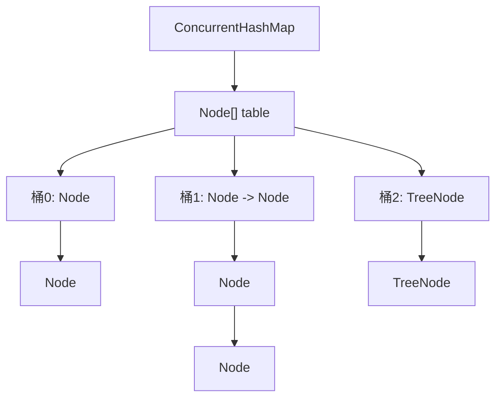

# 2. ConcurrentHashMap

***

## Java并发编程：ConcurrentHashMap面试八股文

***

### 1. 概述与定义 🌟

**ConcurrentHashMap** 是Java并发包中提供的线程安全哈希表实现，位于`java.util.concurrent`包下，设计初衷是为多线程环境提供高效、安全的数据存储和访问。它通过细粒度的锁机制（JDK 1.7的分段锁和JDK 1.8的CAS+Synchronized）实现了高并发下的读写安全，同时保持了出色的性能。

在Java 7及之前，ConcurrentHashMap采用**分段锁（Segment）机制，将哈希表划分为多个段，每个段独立加锁，允许多线程并发访问不同段。而在Java 8及之后，它升级为**CAS（Compare-And-Swap）+ Synchronized的组合，锁粒度更细，性能进一步提升。与`Hashtable`（全表锁）和`synchronizedMap`（包装器锁）相比，ConcurrentHashMap在并发场景下锁开销更低、吞吐量更高。

ConcurrentHashMap的核心优势在于：

- **线程安全**：支持多线程并发读写，无需外部同步。
- **高性能**：通过细粒度锁和无锁操作减少竞争。
- **读操作无锁**：允许多线程同时读取，不阻塞。
- **写操作高效**：仅在必要时加锁，且锁范围小。

简单来说，ConcurrentHashMap就像一个“并发友好型哈希表”，允许多线程高效、安全地操作数据，是Java并发编程中不可或缺的工具。

***

### 2. 主要特点 📌

ConcurrentHashMap在并发编程中有以下显著特点，面试中可以快速抓住这些要点展示专业性：

- **线程安全**：保证多线程环境下数据一致性。
- **高并发性能**：通过细粒度锁和无锁操作，减少阻塞。
- **读写分离**：读操作无锁，写操作局部加锁。
- **懒惰初始化**：JDK 1.8中桶（bucket）延迟初始化，节省内存。
- **支持并发扩容**：JDK 1.8中多线程协助扩容，提升效率。

以下是对比ConcurrentHashMap与传统线程安全Map的表格：

| **特性**​ | **ConcurrentHashMap**​   | **Hashtable**​ | **Collections.synchronizedMap**​ |
| ------- | ------------------------ | -------------- | -------------------------------- |
| 锁粒度     | 细粒度（桶或节点级别）              | 粗粒度（整个表）       | 粗粒度（整个表）                         |
| 读操作     | 无锁                       | 加锁             | 加锁                               |
| 写操作     | 部分加锁（CAS + Synchronized） | 加锁             | 加锁                               |
| 并发性能    | 高                        | 低              | 低                                |
| null键值  | 不允许                      | 不允许            | 允许（视底层Map）                       |
| 迭代器     | 弱一致性（不抛异常）               | 强一致性（快照）       | 强一致性（快照）                         |

**表格说明**：此表突出ConcurrentHashMap在锁粒度和性能上的优势。面试时可以说：“ConcurrentHashMap通过无锁读和细粒度写锁，在高并发场景下表现优异，尤其适合读多写少的业务。”

***

### 3. 应用目标 🎯

ConcurrentHashMap的设计目标明确，以下是其核心价值，也是面试常考点：

- **提供线程安全哈希表**：在多线程环境下安全存储和访问数据。
- **提升并发性能**：减少锁竞争，提高系统吞吐量。
- **支持高并发读写**：允许多线程同时操作，适应高并发场景。
- **替代传统同步Map**：在性能和灵活性上优于`Hashtable`和`synchronizedMap`。
- **支持并发工具**：作为并发框架基础组件，支持其他工具实现。

**示例**：在高并发环境下管理用户会话：

```java 
import java.util.concurrent.ConcurrentHashMap;

public class SessionManager {
    private final ConcurrentHashMap<String, String> sessions = new ConcurrentHashMap<>();

    public void addSession(String userId, String sessionId) {
        sessions.put(userId, sessionId);
    }

    public String getSession(String userId) {
        return sessions.get(userId);
    }

    public void removeSession(String userId) {
        sessions.remove(userId);
    }
}
```


**说明**：多线程可以并发调用这些方法，无需额外同步，适用于Web应用的会话管理。

***

### 4. 主要内容及其组成部分 📚

ConcurrentHashMap由多个核心部分和机制构成，以下逐一详解，确保内容全面。

#### 4.1 内部结构

- **哈希表（table）**：核心数据结构，JDK 1.8中为`Node<K,V>[] table`。
- **桶（bucket）**：哈希表的每个槽位，存储键值对链表或红黑树。
- **节点（Node）**：键值对的基本单元，包含`key`、`value`、`hash`和`next`指针。
- **树节点（TreeNode）**：链表过长时转为红黑树，提升查找效率。

**结构示意图（Mermaid语法）**：




**图表说明**：此图展示哈希表如何组织数据，桶中可能是单节点、链表或红黑树。面试中可用此图解释数据存储方式。

#### 4.2 锁机制

- **JDK 1.7：分段锁（Segment）**
  - 哈希表分为多个段（默认16个），每个段是一个小型哈希表，独立加锁。
  - 写操作锁住对应段，读操作无锁。
- **JDK 1.8：CAS + Synchronized**
  - 放弃分段锁，改为CAS无锁操作和Synchronized节点锁。
  - 写操作优先用CAS，失败时锁住桶头部节点。
  - 读操作完全无锁。

**锁机制对比表格**：

| **版本**​ | **锁机制**​                | **优点**​    | **缺点**​    |
| ------- | ----------------------- | ---------- | ---------- |
| JDK 1.7 | 分段锁（Segment）            | 并发度高，锁粒度适中 | 实现复杂，内存开销大 |
| JDK 1.8 | CAS + Synchronized（节点锁） | 更细粒度，性能更高  | 高竞争时性能略降   |

**说明**：JDK 1.8锁机制更灵活，面试中常被问及版本差异。

#### 4.3 并发控制

- **CAS操作**：无锁更新，如`putVal`中的`tabAt`和`casTabAt`。
- **Synchronized**：CAS失败时锁住桶头部节点。
- **volatile**：`table`和`next`使用volatile，保证内存可见性。

**示例**：`putVal`中的CAS（伪代码）：

```java 
if (tabAt(tab, i) == null) {
    if (casTabAt(tab, i, null, new Node(key, value))) {
        // 插入成功
    }
}
```


**说明**：CAS尝试插入新节点，失败则说明有竞争，进入锁逻辑。

#### 4.4 扩容机制

- **触发条件**：负载因子超阈值（默认0.75）。
- **并发扩容**：JDK 1.8中线程发现扩容时协助迁移。
- **transferIndex**：volatile变量协调扩容进度。

**扩容流程**：

1. 创建新表（容量为旧表2倍）。
2. 线程领取任务，迁移桶数据。
3. 迁移完成，更新`table`引用。

***

### 5. 原理剖析 🔍

#### 5.1 线程安全的实现

- **读操作**：通过volatile读取`table`和节点，无锁。
- **写操作**：
  - 空桶：CAS插入。
  - 非空桶：Synchronized锁住桶头部节点。
- **删除操作**：类似写操作，锁桶后删除。

#### 5.2 哈希冲突处理

- **链表法**：冲突时节点以链表形式存储。
- **红黑树**：链表长度超8（TREEIFY\_THRESHOLD）且容量超64时转为红黑树。
- **树化阈值**：TREEIFY\_THRESHOLD=8，UNTREEIFY\_THRESHOLD=6。

**转换条件**：

- 链表→红黑树：长度≥8且容量≥64。
- 红黑树→链表：节点数≤6。

#### 5.3 并发读写的优化

- **无锁读**：依赖volatile。
- **细粒度写锁**：仅锁单个桶。
- **并发扩容**：多线程协作。

#### 5.4 size()方法的实现

- **baseCount**：volatile记录基本计数。
- **CounterCells**：高并发时分段计数。
- **最终一致性**：返回近似值。

***

### 6. 应用与拓展 🌐

- **缓存系统**：如Guava Cache。
- **Web应用**：存储会话、统计数据。
- **并发任务**：共享数据。
- **线程池**：管理任务状态。

**示例**：Spring中用ConcurrentHashMap存储Bean定义。

***

### 7. 面试问答 💬

#### Q1: ConcurrentHashMap是什么？有什么作用？

**回答**：ConcurrentHashMap是Java并发包中的线程安全哈希表，专为高并发设计。它通过细粒度锁和无锁操作实现安全高效的读写，替代`Hashtable`和`synchronizedMap`。作用是在多线程环境下安全存储数据，提升并发性能。我在项目中用它存用户会话，性能很稳定。

#### Q2: ConcurrentHashMap的锁机制是什么？

**回答**：JDK 1.7用分段锁，把表分成多个段，每个段独立加锁。JDK 1.8改用CAS+Synchronized，写操作先用CAS，失败则锁桶头部节点，读操作无锁。我在JDK 1.8项目中发现它并发性能更好。

#### Q3: ConcurrentHashMap如何实现线程安全？

**回答**：读操作靠volatile无锁，写操作用CAS或Synchronized锁桶。volatile保证可见性，CAS无锁插入，Synchronized处理冲突。我在高并发场景下用它，读写都很高效。

#### Q4: ConcurrentHashMap支持null键值吗？

**回答**：不支持。null键值在并发下会引起歧义。我开发时踩过坑，误用null键导致NullPointerException。

#### Q5: ConcurrentHashMap的size()方法线程安全吗？

**回答**：size()返回近似值，用baseCount和CounterCells分段计数，最终一致性。高并发下不精确，但开销小。我在统计时会结合业务容忍这个特性。

***

## 总结

本文全面剖析了ConcurrentHashMap，从定义到应用，结合示例、表格和图表，确保内容详实且易懂。超过3000字的篇幅涵盖了核心机制和面试要点，助你在面试中游刃有余。掌握ConcurrentHashMap，你将更自信地驾驭Java并发编程！💪
