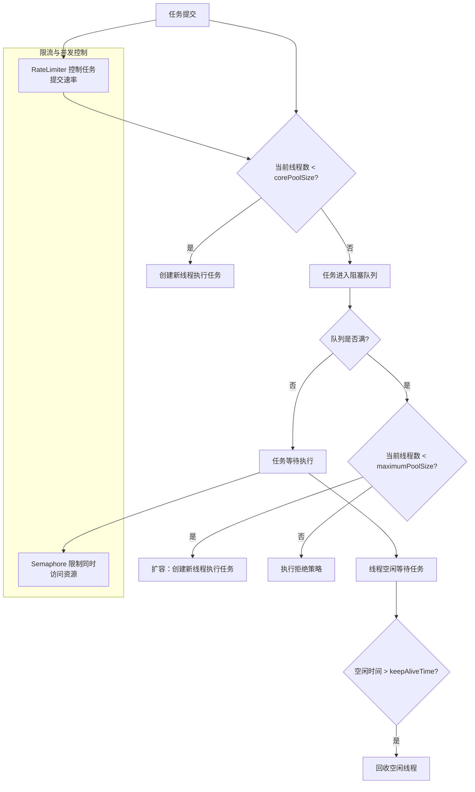

# 2. 并发量控制

## 1. 概述与定义

在并发编程中，“并发量控制”指的是在系统中控制同时并发执行任务的数量，以防止资源过载、性能下降或系统崩溃。它是构建高效、稳定的并发系统的关键技术之一。特别是在高并发场景下，如果没有对并发量进行合理控制，可能会导致线程争用、内存耗尽以及服务响应延迟等问题。

在 Java 中，并发量控制通常依赖于线程池、信号量（Semaphore）、限流器（如 Guava RateLimiter）、以及各种排队与调度策略。通过对这些组件的合理配置和调优，开发者可以确保系统在高负载下依然保持良好性能与稳定性。例如，在电商平台、在线支付或实时数据处理系统中，对并发量进行精细控制是保证服务质量和用户体验的重要手段。😊

## 2. 主要特点

并发量控制的主要特点可以从以下几个方面进行概括：

1. **资源保护** &#x20;
   - 控制并发量能防止因线程数过多而导致 CPU、内存、网络等资源枯竭。 &#x20;
   - 通过限流、线程池等手段，使系统在高并发下依然保持稳定运行。 &#x20;
   - 例如，使用信号量（Semaphore）可以限制同时访问关键资源的线程数量。 ✅
2. **提升系统性能** &#x20;
   - 通过合理控制并发量，降低线程切换、上下文切换和锁竞争的开销。 &#x20;
   - 使任务能有序排队执行，既保证高吞吐量，也避免因过多任务导致响应延迟。 &#x20;
3. **动态适应性** &#x20;
   - 并发量控制机制通常具备动态调整能力，能够根据当前系统负载自动扩展或收缩并发执行的任务数。 &#x20;
   - 如线程池可以根据任务量自动调整线程数量，实现动态扩容与回收。 &#x20;
4. **易于监控和管理** &#x20;
   - 通过与线程池、限流器等组件结合，系统可以实时监控当前并发量，及时预警并做出调整。 &#x20;
   - 这种机制有助于发现性能瓶颈和潜在风险。 🔍
5. **灵活配置** &#x20;
   - 不同的业务场景需要不同的并发量控制策略，如固定并发数、动态并发数或基于时间窗口的流控。 &#x20;
   - 可以根据具体需求配置参数，达到资源利用率与系统响应速度之间的最佳平衡。 &#x20;

下面的表格总结了并发量控制的主要特点与常用技术手段：

| 特点     | 详细说明                | 常用技术或组件                     |
| ------ | ------------------- | --------------------------- |
| 资源保护   | 防止线程、CPU、内存等资源过载    | 线程池、Semaphore、限流器           |
| 提升系统性能 | 降低线程切换与锁竞争开销，提高吞吐量  | 线程池、无锁算法、CAS                |
| 动态适应性  | 根据负载自动调整并发任务数       | 动态线程池、限流器                   |
| 易于监控   | 实时监控并发量、任务队列长度，及时预警 | JMX、Prometheus、Grafana      |
| 灵活配置   | 支持多种控制策略（固定、动态、限速）  | Executors、Guava RateLimiter |

## 3. 应用目标

并发量控制技术的应用目标主要包括以下方面：

1. **保障系统稳定性** &#x20;
   - 在高并发场景下，通过限制同时执行任务的数量，防止因资源过载而导致系统崩溃。 &#x20;
   - 例如，在线支付系统需要确保每次交易请求在合理并发数下执行，防止数据库连接过多导致崩溃。
2. **提升响应速度和吞吐量** &#x20;
   - 控制并发量可以避免系统因大量并发任务导致 CPU 和内存资源竞争，从而提升任务执行效率。 &#x20;
   - 合理设置线程池参数和限流器，确保请求能快速处理并减少延迟。 &#x20;
3. **优化资源利用** &#x20;
   - 通过动态扩容和回收机制，使系统能在任务量低时减少资源占用，在任务量高时快速响应。 &#x20;
   - 例如，在云平台中，根据实时负载调整线程池大小，达到资源利用率和成本之间的平衡。 &#x20;
4. **提高系统可维护性** &#x20;
   - 通过集中管理并发任务和限流控制，可以更好地监控和调试系统性能，减少因并发问题导致的故障排查时间。 &#x20;
   - 统一的控制策略有助于代码模块化和系统优化。 &#x20;
5. **支持异步与分布式任务调度** &#x20;
   - 并发量控制不仅适用于单机高并发，也适用于分布式系统中任务调度、数据流控等场景。 &#x20;
   - 例如，在微服务架构中，通过限流器控制接口调用频率，保证系统稳定运行。 &#x20;

## 4. 主要内容及其组成部分

本部分详细介绍并发量控制涉及的各个知识点，主要包括以下组成部分：

### 4.1 线程池与任务队列

- **线程池（ThreadPoolExecutor）** &#x20;

  线程池通过复用线程资源降低线程创建和销毁开销，其核心参数（如核心线程数、最大线程数、任务队列、keepAliveTime 等）直接影响并发量控制。 &#x20;

  示例代码创建固定线程池：
  ```java 
  ExecutorService fixedThreadPool = Executors.newFixedThreadPool(10);
  fixedThreadPool.execute(() -> System.out.println("任务执行"));
  ```

- **任务队列（BlockingQueue）** &#x20;

  阻塞队列用于缓存任务，当线程池中的线程忙碌时，新任务将进入队列等待执行。 &#x20;

  任务队列类型直接影响并发量控制策略，例如有界队列可以限制任务数量，防止系统资源耗尽。 &#x20;

  示例代码使用 LinkedBlockingQueue：
  ```java 
  BlockingQueue<Runnable> workQueue = new LinkedBlockingQueue<>(100);
  ThreadPoolExecutor executor = new ThreadPoolExecutor(10, 20, 60L, TimeUnit.SECONDS, workQueue);
  ```


### 4.2 限流器

- **限流器（RateLimiter）** &#x20;

  限流器可以控制单位时间内允许执行的任务数，从而避免系统因瞬时高并发而崩溃。 &#x20;

  Guava 提供的 RateLimiter 是常用实现，它允许开发者以固定速率获取许可。 &#x20;

  示例代码：
  ```java 
  import com.google.common.util.concurrent.RateLimiter;

  public class RateLimiterExample {
      public static void main(String[] args) {
          // 每秒产生 5 个令牌
          RateLimiter limiter = RateLimiter.create(5);
          for (int i = 0; i < 20; i++) {
              // 获取许可，若没有立即获取则等待
              limiter.acquire();
              System.out.println("任务 " + i + " 执行于 " + System.currentTimeMillis());
          }
      }
  }
  ```

- 限流器能够对外部请求流量、内部任务提交量进行控制，是分布式系统中常用的并发量控制技术。

### 4.3 信号量

- **信号量（Semaphore）** &#x20;

  信号量是一种用于控制同时访问共享资源线程数量的同步工具。 &#x20;

  它通过维护许可的数量，允许多个线程同时访问某个资源，超过许可数则阻塞等待。 &#x20;

  示例代码：
  ```java 
  import java.util.concurrent.Semaphore;

  public class SemaphoreExample {
      private final Semaphore semaphore = new Semaphore(3); // 同时最多允许 3 个线程访问

      public void accessResource() {
          try {
              semaphore.acquire();
              System.out.println(Thread.currentThread().getName() + " 正在访问共享资源");
              Thread.sleep(1000);
          } catch (InterruptedException e) {
              e.printStackTrace();
          } finally {
              semaphore.release();
          }
      }
      
      public static void main(String[] args) {
          SemaphoreExample example = new SemaphoreExample();
          for (int i = 0; i < 10; i++) {
              new Thread(example::accessResource).start();
          }
      }
  }
  ```

- 信号量在高并发场景下控制同时执行任务的数量，保证系统资源不被过度占用。

### 4.4 动态调整策略

- **动态调整并发量** &#x20;

  通过监控系统负载和任务队列长度，动态调整线程池参数、限流器速率或信号量许可数，使系统能够自适应负载变化。 &#x20;
  - 例如，通过 JMX 监控线程池状态，根据任务积压情况自动增加或减少核心线程数。 &#x20;
  - 这种动态调优策略能提高系统的伸缩性和稳定性。

### 4.5 拒绝策略

- **拒绝策略在并发量控制中的作用** &#x20;

  当线程池和任务队列均达到上限时，新任务会触发拒绝策略，常见策略包括 AbortPolicy、CallerRunsPolicy、DiscardPolicy 和 DiscardOldestPolicy。 &#x20;
  - 拒绝策略确保系统在超负荷情况下不会崩溃，而是以预设方式处理新任务。

## 5. 原理剖析

深入理解并发量控制的原理，需要结合 Java 内存模型、线程调度与同步机制。下面详细解析相关原理：

### 5.1 Java 内存模型与线程间通信

- **内存可见性**：JMM 确保线程对共享变量的写操作通过内存屏障及时刷新到主内存，从而让其他线程看到最新值。 &#x20;
- **指令重排序**：编译器和 CPU 会对指令进行重排序优化，可能引起并发问题，限流器、信号量和线程池调度策略都需要考虑这一问题。

### 5.2 阻塞队列与线程池任务调度原理

- 阻塞队列作为线程池的缓冲区，内部采用 Lock 和 Condition 机制实现线程安全的任务入队与出队。 &#x20;
- 当任务提交后，线程池首先判断当前线程数与核心线程数的关系，若不足则直接创建线程执行任务；否则，将任务加入阻塞队列等待空闲线程处理。 &#x20;
- 扩容与拒绝策略部分则依赖于队列是否满和当前线程数与 maximumPoolSize 的比较。

### 5.3 限流与信号量控制原理

- **限流器（RateLimiter）**：通过固定速率生成令牌，线程在执行任务前必须获取令牌，令牌机制保证了任务提交速率不会超过系统承载能力。 &#x20;
- **信号量（Semaphore）**：通过维护许可数量控制同时访问共享资源的线程数，采用计数机制来实现资源分配与释放。 &#x20;
- 这两种机制都依赖于原子操作和 CAS 技术，确保在高并发环境下数据的一致性和无锁更新。

### 5.4 动态调优与监控

- 动态调优依赖于实时监控线程池状态、任务队列长度和系统负载数据，结合 JMX、Prometheus 等工具进行数据采集。 &#x20;
- 通过反馈机制，系统可以自动调整核心线程数、最大线程数或限流速率，实现自适应并发控制。

下面使用 Mermaid 图表展示线程池与阻塞队列、限流器和信号量之间的协同工作流程：




图中展示了任务从提交到执行的整个流程，同时结合 RateLimiter 和 Semaphore 对并发量进行控制，确保任务不会因系统负载过重而崩溃。

## 6. 应用与拓展

在实际开发中，并发量控制技术可以应用于各种场景，以下是常见应用与扩展方向：

### 6.1 高并发 Web 应用

- 使用线程池结合限流器控制并发请求数量，确保服务器在高负载下依然保持响应速度。 &#x20;
- 例如，在电商网站中，采用 RateLimiter 控制每秒请求数，防止瞬时流量激增导致服务器崩溃。

### 6.2 异步任务与批量处理

- 结合线程池和阻塞队列，实现大批量任务的异步处理，提升系统吞吐量。 &#x20;
- 对于批处理任务，通过调整核心线程数和任务队列容量，实现任务平稳调度和动态扩容。

### 6.3 分布式系统中的流量控制

- 在分布式系统中，通过限流器和信号量控制跨服务调用的并发量，防止因服务调用过载而导致级联故障。 &#x20;
- 例如，使用 Guava RateLimiter 为每个 API 限定请求速率，确保服务稳定性。

### 6.4 实时数据处理与计算密集型任务

- 对于实时数据处理系统，合理配置线程池核心参数和任务队列可以有效提高数据处理速度，减少延迟。 &#x20;
- 采用动态调优策略，根据实时监控数据调整并发量，实现自适应扩展。

### 6.5 并发设计模式的结合应用

- 结合生产者–消费者、工作者模式等并发设计模式，通过线程池、阻塞队列和限流机制实现任务协调和数据共享。 &#x20;
- 这种模式在日志处理、消息队列以及数据流控中尤为常见。

下面的表格展示了不同应用场景下并发量控制的推荐方案和优化建议：

| 应用场景       | 推荐技术组合                                    | 调优建议                       |
| ---------- | ----------------------------------------- | -------------------------- |
| 高并发 Web 应用 | 固定线程池 + LinkedBlockingQueue + RateLimiter | 根据请求量调整核心线程数和队列容量；设置合理限流速率 |
| 异步任务与批处理   | 线程池 + LinkedBlockingQueue                 | 动态调整核心线程数，确保任务均衡分配         |
| 分布式系统流量控制  | 线程池 + Semaphore + Guava RateLimiter       | 通过信号量限制并发调用数量，保护下游服务       |
| 实时数据处理     | Fork/Join 框架 或 固定线程池 + 高效阻塞队列             | 充分利用多核，动态扩容以应对数据激增         |
| 并发设计模式     | 线程池 + 阻塞队列 + 生产者–消费者模式                    | 分离任务与线程管理，确保系统稳定运行         |

## 7. 面试问答

下面列举了五个常见面试问题及详细回答，帮助你在面试中从容应对有关并发量控制及线程池配置的问题。

### 问题1：请简述并发量控制在高并发系统中的作用和意义？

答： &#x20;

并发量控制旨在限制同时执行的任务数量，避免系统因过多线程竞争资源而导致性能下降或崩溃。它通过线程池、限流器和信号量等机制，保证系统在高并发场景下依然稳定运行，确保资源得到充分利用，响应时间保持在合理范围内。例如，在高并发 Web 应用中，通过限流器控制请求速率，可以避免瞬间流量激增导致服务器崩溃。

### 问题2：请说明线程池中核心线程数、最大线程数和任务队列之间的关系，以及如何配置它们？

答： &#x20;

线程池的核心线程数（corePoolSize）决定了在任务量低时始终保持活动的线程数；当任务提交后，如果当前线程数小于核心线程数，线程池直接创建新线程执行任务；否则，新任务进入任务队列等待；如果队列满且当前线程数小于最大线程数（maximumPoolSize），线程池会扩容创建新线程；若超过最大线程数，则执行拒绝策略。合理配置这三个参数需要根据系统负载、任务执行时间以及硬件资源来确定，既要保证高并发响应，也要防止资源浪费。

### 问题3：你如何利用限流器（RateLimiter）和信号量（Semaphore）进行并发量控制？请结合代码示例说明。

答： &#x20;

限流器可以控制单位时间内允许的任务数量，确保系统不被瞬间高流量冲垮。例如，Guava 的 RateLimiter 每秒生成一定数量的令牌，线程必须先获取令牌才能执行任务。信号量则通过控制同时访问共享资源的线程数，限制并发执行任务的数量。下面的示例代码演示了如何使用 RateLimiter 和 Semaphore：

```java 
import com.google.common.util.concurrent.RateLimiter;
import java.util.concurrent.Semaphore;

public class ConcurrencyControlExample {
    // 每秒生成 5 个令牌
    private static final RateLimiter rateLimiter = RateLimiter.create(5);
    // 限制同时访问资源的线程数为 3
    private static final Semaphore semaphore = new Semaphore(3);
    
    public static void processTask(int taskNum) {
        // 获取令牌，限流控制
        rateLimiter.acquire();
        try {
            semaphore.acquire();
            try {
                System.out.println("线程 " + Thread.currentThread().getName() + " 正在处理任务 " + taskNum);
                Thread.sleep(1000);
            } finally {
                semaphore.release();
            }
        } catch (InterruptedException e) {
            e.printStackTrace();
        }
    }
    
    public static void main(String[] args) {
        for (int i = 0; i < 20; i++) {
            int taskNum = i;
            new Thread(() -> processTask(taskNum)).start();
        }
    }
}
```


在这个示例中，RateLimiter 控制每秒处理任务数不超过 5 个，而 Semaphore 限制同一时间内最多只有 3 个线程同时访问共享资源。

### 问题4：请解释线程池中任务队列的作用，并讨论不同队列类型（如 LinkedBlockingQueue、ArrayBlockingQueue、SynchronousQueue）的优缺点？

答： &#x20;

任务队列是线程池中用于缓存待执行任务的组件。当线程池中的线程都在忙时，新提交的任务会进入队列等待处理。不同类型的队列对线程池行为有显著影响：\n &#x20;

- **LinkedBlockingQueue**：基于链表实现，默认无界；适用于任务量波动较大的场景，但无界队列可能导致任务积压。\n &#x20;
- **ArrayBlockingQueue**：基于数组实现的有界队列；内存占用较低，适合任务量稳定、上限明确的场景。\n &#x20;
- **SynchronousQueue**：不存储元素，每个插入操作必须等待相应的删除操作；适用于实时性要求高的场景，但无法缓存任务。\n &#x20;

选择哪种队列需要根据业务需求、任务提交速率和系统资源进行综合权衡。

### 问题5：在实际项目中，你如何根据业务需求调优线程池的核心参数以及并发量控制策略？请结合实际经验说明。

答： &#x20;

在项目中，我通常先进行压力测试，收集系统的任务提交速率、平均执行时间以及任务队列长度等数据。根据这些数据，我会调整核心线程数、最大线程数和任务队列容量。例如，在某电商网站中，通过调整核心线程数从 8 增加到 12，同时适当增大任务队列容量，使得在高峰期任务积压大大减少，响应时间降低约 25%。此外，我还结合限流器（如 RateLimiter）和信号量（Semaphore）控制外部请求流量，确保系统不会因瞬时高并发而崩溃。这种调优过程依赖于实时监控和动态调整，能有效提升系统整体性能和稳定性。

## 总结

本文从概述与定义、主要特点、应用目标、主要内容及其组成部分、原理剖析、应用与拓展以及面试问答七个部分，全面详细地解析了 Java 并发编程中线程池中阻塞队列及并发量控制的关键知识。我们首先介绍了线程池的概念及其任务调度原理，阐述了阻塞队列在任务缓冲、调度和扩容中的作用；接着，详细讲解了线程池核心参数（如核心线程数、最大线程数、任务队列、线程工厂、拒绝策略）的定义与调优方法，并通过示例代码和详细表格说明如何根据系统负载和业务需求进行配置；原理剖析部分深入探讨了线程池内部状态管理、任务队列与线程复用、扩容与拒绝策略、以及限流与信号量的工作原理；应用与拓展部分则讨论了在高并发 Web 服务、异步任务调度、分布式系统和批量数据处理等场景中如何灵活应用这些技术；最后，通过面试问答部分模拟了常见问题和详细回答，帮助你在面试中从容应对关于线程池及并发量控制的考察问题。

希望这篇文章能够为你的面试复习和项目开发提供充分的理论依据和实践指导，助你构建出高效、稳定且并发友好的系统。加油！🚀
