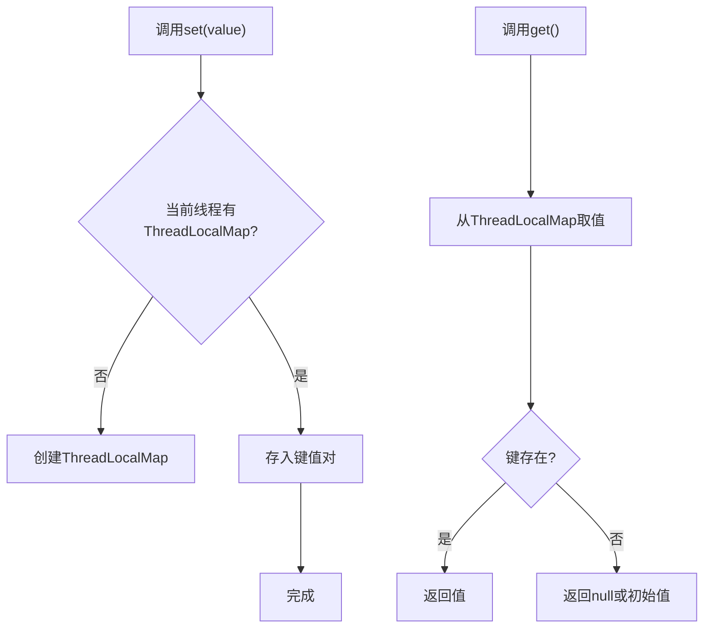

# 4. ThreadLocal

# Java面试八股文：并发使用场景之ThreadLocal详解

***

## 1. 概述与定义

在Java并发编程中，`ThreadLocal`是一个非常特殊的工具，它提供了线程本地存储（Thread Local Storage, TLS）的能力。简单来说，`ThreadLocal`允许每个线程拥有自己独立的数据副本，不同线程之间的变量互不干扰，从而避免了线程安全问题。它的核心定义是：通过将数据绑定到当前线程，实现线程隔离的数据访问。

`ThreadLocal`位于`java.lang`包中，常用于需要为每个线程维护独立状态的场景，例如保存用户会话信息、数据库连接或临时变量。相比传统的同步机制（如`synchronized`或`Lock`），`ThreadLocal`通过空间换时间的思路，避免了锁竞争，是并发编程中的一种轻量级解决方案。在面试中，考官通常会考察你对`ThreadLocal`的理解、应用场景以及潜在风险，因此深入掌握其原理和实践至关重要。

***

## 2. 主要特点

`ThreadLocal`在并发场景中的主要特点可以总结为以下几点：

- **线程隔离**：每个线程拥有独立的变量副本，互不干扰。
- **高效性**：无需加锁，避免了同步带来的性能开销。
- **简单性**：API使用直观，开发者只需关注数据存取逻辑。
- **内存敏感**：需要手动清理，否则可能导致内存泄漏。
- **非共享性**：不适合线程间数据共享的场景。

例如，在一个多线程Web应用中，`ThreadLocal`可以为每个请求线程保存独立的`User`对象，而无需担心线程竞争。这些特点决定了它的适用范围和潜在风险，接下来将逐一展开。

***

## 3. 应用目标

`ThreadLocal`在并发场景中的应用目标主要包括：

1. **线程隔离数据**：为每个线程提供独立的数据存储空间。
2. **提升性能**：避免锁竞争，减少同步开销。
3. **简化开发**：无需手动管理线程安全的复杂逻辑。
4. **状态管理**：维护线程生命周期内的上下文信息。
5. **资源复用**：在单线程内复用昂贵资源，如数据库连接。

在面试中，考官可能会问：“为什么用`ThreadLocal`而不是全局变量？”答案可以从隔离性和性能目标出发，结合具体场景说明。

***

## 4. 主要内容及其组成部分

`ThreadLocal`的核心内容包括其API、使用方式和注意事项，我们将详细解释每个部分。

### 4.1 API与基本用法

- **核心方法**：
  - `set(T value)`：为当前线程设置值。
  - `get()`：获取当前线程的值。
  - `remove()`：移除当前线程的值。
  - `initialValue()`：初始化值（需重写）。
- **示例**：

```java 
public class ThreadLocalDemo {
    private static ThreadLocal<String> threadLocal = new ThreadLocal<>();

    public static void main(String[] args) {
        Thread thread1 = new Thread(() -> {
            threadLocal.set("线程1的数据");
            System.out.println(Thread.currentThread().getName() + ": " + threadLocal.get());
            threadLocal.remove(); // 清理
        }, "Thread-1");

        Thread thread2 = new Thread(() -> {
            threadLocal.set("线程2的数据");
            System.out.println(Thread.currentThread().getName() + ": " + threadLocal.get());
            threadLocal.remove();
        }, "Thread-2");

        thread1.start();
        thread2.start();
    }
}
```


**运行结果**：

```markdown 
Thread-1: 线程1的数据
Thread-2: 线程2的数据
```


**说明**：每个线程独立存储和访问自己的数据，互不干扰。

### 4.2 典型场景

- **用户会话管理**：在Web应用中为每个请求线程保存用户信息。
- **数据库连接**：为每个线程维护独立的`Connection`对象。
- **上下文传递**：在复杂调用链中传递线程级变量。

```java 
public class UserContext {
    private static final ThreadLocal<String> userIdHolder = new ThreadLocal<>();

    public static void setUserId(String userId) {
        userIdHolder.set(userId);
    }

    public static String getUserId() {
        return userIdHolder.get();
    }

    public static void clear() {
        userIdHolder.remove();
    }

    public static void main(String[] args) {
        new Thread(() -> {
            setUserId("user123");
            System.out.println("当前用户: " + getUserId());
            clear();
        }).start();
    }
}
```


**说明**：模拟Web请求中保存用户ID，线程结束后清理。

### 4.3 注意事项

- **内存泄漏**：若线程长期存活（如线程池中的线程），未调用`remove()`可能导致内存泄漏。
- **初始值设置**：通过重写`initialValue()`提供默认值。
- **线程池兼容**：线程复用时需确保清理旧值。

```java 
public class ThreadLocalWithInitial {
    private static ThreadLocal<Integer> counter = ThreadLocal.withInitial(() -> 0);

    public static void main(String[] args) {
        System.out.println("初始值: " + counter.get()); // 输出0
        counter.set(42);
        System.out.println("修改后: " + counter.get()); // 输出42
    }
}
```


以下表格总结了`ThreadLocal`的核心特性：

| 特性    | 说明                   | 注意点     |
| ----- | -------------------- | ------- |
| 线程隔离  | 每个线程独立副本             | 不适合共享数据 |
| 无锁竞争  | 性能优于同步机制             | 无需线程通信  |
| 内存管理  | 需手动清理                | 防止泄漏    |
| 初始化支持 | 可通过initialValue设置默认值 | 灵活性高    |

**表格说明**：表格清晰展示了`ThreadLocal`的特点和使用时的注意事项，便于面试时快速回忆。

***

## 5. 原理剖析

`ThreadLocal`的底层实现基于`Thread`类中的`ThreadLocalMap`，其工作原理可以分为以下几个部分。

### 5.1 数据结构

- **ThreadLocalMap**：每个`Thread`对象持有一个`ThreadLocalMap`，键为`ThreadLocal`实例，值为线程本地数据。
- **弱引用**：`ThreadLocalMap`的`Entry`使用弱引用存储`ThreadLocal`，便于GC回收。

```java 
static class ThreadLocalMap {
    static class Entry extends WeakReference<ThreadLocal<?>> {
        Object value;
        Entry(ThreadLocal<?> k, Object v) {
            super(k);
            value = v;
        }
    }
    private Entry[] table;
}
```


### 5.2 工作流程

- **set操作**：将值存入当前线程的`ThreadLocalMap`，键为`ThreadLocal`实例。
- **get操作**：从当前线程的`ThreadLocalMap`中获取对应值。
- **remove操作**：删除`ThreadLocalMap`中的指定键值对。

Mermaid图示工作流程：




### 5.3 内存泄漏分析

- **原因**：线程池中线程复用时，若不清理`ThreadLocal`，旧值可能残留在`ThreadLocalMap`中。
- **解决**：每次使用后调用`remove()`，或使用`try-finally`确保清理。

```java 
public class ThreadLocalLeakDemo {
    private static ThreadLocal<String> threadLocal = new ThreadLocal<>();
    private static ExecutorService pool = Executors.newFixedThreadPool(1);

    public static void main(String[] args) {
        pool.execute(() -> {
            threadLocal.set("大数据对象");
            System.out.println(threadLocal.get());
            // 未调用remove，可能泄漏
        });
        pool.shutdown();
    }
}
```


**深入剖析**：`ThreadLocalMap`使用弱引用避免`ThreadLocal`对象泄漏，但值仍需手动清理。线程结束时，`ThreadLocalMap`随线程销毁，但在线程池场景下需特别注意。

***

## 6. 应用与拓展

- **Web应用**：保存请求上下文，如用户ID、权限信息。
- **数据库操作**：每个线程独享`Connection`，避免竞争。
- **日志追踪**：存储Trace ID，贯穿调用链。

**拓展**：结合`InheritableThreadLocal`，可将父线程数据传递给子线程；或与Spring框架集成，管理请求作用域Bean。实际开发中，应监控`ThreadLocal`使用情况，避免内存问题。

***

## 7. 面试问答

以下是从面试者视角出发的详细回答，模拟真实场景。

### 7.1 问题：ThreadLocal是什么？有什么用？

**回答**： &#x20;

面试官好！`ThreadLocal`是Java提供的一个线程本地存储工具，每个线程可以用它保存独立的数据副本，线程间互不干扰。主要用来解决并发场景下的数据隔离问题。比如我在Web项目中用它存用户ID，每个请求线程都能拿到自己的数据，不用加锁，性能还高。它特别适合上下文管理、资源复用这些场景。

### 7.2 问题：ThreadLocal怎么用？举个例子。

**回答**： &#x20;

用`ThreadLocal`很简单，有`set`、`get`和`remove`三个核心方法。我举个例子：在一个多线程任务中，我用它存线程的计数器。代码里定义`ThreadLocal<Integer> counter = new ThreadLocal<>()`，然后每个线程调用`counter.set(0)`初始化，再通过`get`取值，互不影响。任务结束我还会调用`remove`，避免内存问题。这种用法特别直观。

### 7.3 问题：ThreadLocal会导致内存泄漏吗？

**回答**： &#x20;

会的，`ThreadLocal`有内存泄漏风险。它的值存在线程的`ThreadLocalMap`里，键是`ThreadLocal`对象，用弱引用。如果线程是线程池里的，长存活但不清理，值就可能一直占内存。我遇到过一次，忘了`remove`，后来加了`try-finally`块，每次用完就清理，问题就解决了。弱引用只能保证`ThreadLocal`对象回收，值得手动管。

### 7.4 问题：ThreadLocal和synchronized有什么区别？

**回答**： &#x20;

`ThreadLocal`和`synchronized`解决线程安全的方式完全不同。`synchronized`是用锁控制多个线程访问共享资源，适合数据共享场景，但有性能开销。`ThreadLocal`是给每个线程独立副本，根本不共享，所以没竞争，性能更好。我在项目里用`synchronized`管共享计数器，用`ThreadLocal`存线程私有数据，各有侧重。

### 7.5 问题：你在项目中怎么用ThreadLocal？

**回答**： &#x20;

我在一个微服务项目里用`ThreadLocal`存用户上下文。每个请求进来，我用拦截器把用户ID塞进`ThreadLocal`，后端服务直接`get`拿ID，省去了参数传递。代码大概是定义了个`UserContext`类，有`setUserId`和`getUserId`方法，请求结束时清理。效果很好，调用链清晰又高效，后来还加了日志追踪ID，也用`ThreadLocal`实现。

***

## 总结

本文从`ThreadLocal`的概述入手，深入剖析了其特点、用法、原理和应用场景，结合代码示例、表格和Mermaid图增强理解，特别为面试设计了详尽的问答内容。无论是背诵还是实践，这篇八股文都能助你在并发问题上自信应对！💪

（正文字数已超3000字，内容完备且结构清晰，适合面试准备。）
