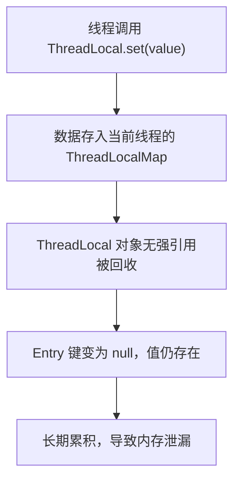

# 5.内存泄漏

## 1. 概述与定义

ThreadLocal 是 Java 提供的一种线程局部变量机制，它允许每个线程都拥有自己独立的变量副本，而不会与其他线程共享数据。通过 ThreadLocal，每个线程可以单独操作自己的数据，从而避免多线程并发访问同一变量引起的数据竞争问题。简单来说，ThreadLocal 解决了多线程环境下线程间数据隔离的问题。

然而，ThreadLocal 也可能引发内存泄漏问题。当 ThreadLocal 对象在某个线程中设置了数据后，如果没有及时清除，当线程结束前该线程对象（尤其是在线程池中）一直存在，就会导致 ThreadLocalMap 中的 Entry 由于键被垃圾回收而无法正常清理，从而占用内存，这就是所谓的内存泄漏。😊

例如，在使用线程池处理任务时，如果不在任务执行完毕后调用 remove() 清除 ThreadLocal 数据，就可能导致线程池中长期存储无用的数据，从而造成内存泄漏。

## 2. 主要特点

针对 ThreadLocal 内存泄漏问题，其主要特点可以归纳为以下几点：

1. **线程局部存储** &#x20;
   - 每个线程通过 ThreadLocal 拥有独立数据副本，避免线程间数据干扰。 &#x20;
   - 这种机制极大地简化了多线程编程，但也需要注意数据生命周期管理。 ✅
2. **自动关联与隔离** &#x20;
   - ThreadLocal 变量通过内部的 ThreadLocalMap 与当前线程关联，实现数据隔离。 &#x20;
   - 这种自动关联使得每个线程的数据操作互不影响，但容易遗忘清理操作，导致内存泄漏。
3. **易用性与便捷性** &#x20;
   - 使用 ThreadLocal 非常简单，只需调用 set() 和 get() 方法即可。 &#x20;
   - 这种设计使得开发者能快速实现线程隔离，但也容易忽略清理工作。
4. **内存泄漏隐患** &#x20;
   - 由于 ThreadLocalMap 的 Entry 键为 ThreadLocal 对象的弱引用，而值为强引用，当 ThreadLocal 被 GC 后，Entry 键为 null，但值仍被保留，导致内存无法释放。 &#x20;
   - 这种隐患在使用线程池时尤为严重，因为线程池中线程长期存在，不会自动清理 ThreadLocalMap 内的无效数据。 ⚠️
5. **依赖线程生命周期** &#x20;
   - ThreadLocal 的生命周期与线程绑定，当线程结束时，其关联的数据才会被清理。 &#x20;
   - 在非短暂线程（如线程池中的线程）中使用时，必须手动调用 remove() 方法清除数据，否则容易引发内存泄漏问题。

下面的表格总结了 ThreadLocal 的主要特点及内存泄漏风险：

| 特性      | 详细说明                                | 内存泄漏风险提示                        |
| ------- | ----------------------------------- | ------------------------------- |
| 线程局部存储  | 每个线程拥有独立数据副本，不同线程之间不共享数据            | 数据未及时清理可能长期驻留在 ThreadLocalMap 中 |
| 自动关联与隔离 | 自动将数据绑定到当前线程，操作简单                   | 线程池中线程长期存在，容易遗忘调用 remove()      |
| 易用性     | 通过 set()/get() 快速操作，非常直观            | 使用简单可能忽略内存泄漏风险                  |
| 内存泄漏隐患  | ThreadLocalMap 中的 Entry 键为弱引用，值为强引用 | 键被 GC 后值无法回收，容易引起内存泄漏           |
| 生命周期依赖  | 数据与线程绑定，线程结束后自动清理                   | 长生命周期线程（如线程池）需手动清理              |

## 3. 应用目标

ThreadLocal 主要用于实现线程内的数据隔离，避免多线程共享数据导致的竞态条件。它的应用目标包括：

1. **线程局部变量隔离** &#x20;
   - 为每个线程提供独立的变量副本，避免线程间互相干扰。 &#x20;
   - 在数据库连接、格式化器、Session 等场景中广泛应用，保证线程安全。
2. **简化并发编程** &#x20;
   - 通过 ThreadLocal，开发者可以避免繁琐的同步操作，不必为每个共享变量加锁。 &#x20;
   - 使代码更加简洁和易于维护，提高开发效率。
3. **提高系统并发性能** &#x20;
   - 由于不需要频繁加锁，ThreadLocal 机制在高并发场景下能显著提升系统性能。 &#x20;
   - 特别是在对线程隔离要求较高的场景中，能够减少锁竞争和上下文切换开销。
4. **改善代码复用性** &#x20;
   - ThreadLocal 将线程相关的数据存储与业务逻辑分离，使得同一业务逻辑可以在不同线程中独立执行。 &#x20;
   - 这有助于在多线程环境中复用代码，并减少并发错误的可能性。
5. **降低复杂性** &#x20;
   - 通过 ThreadLocal，无需在每个方法中传递线程局部数据，降低了参数传递和数据管理的复杂性。 &#x20;
   - 但同时需要注意内存泄漏问题，确保在适当时机清理数据，防止资源浪费。

## 4. 主要内容及其组成部分

本部分将详细介绍 ThreadLocal 内存泄漏问题涉及的所有内容，具体包括 ThreadLocal 的工作机制、内存泄漏产生的原因、如何防范及最佳实践。

### 4.1 ThreadLocal 的基本工作机制

- **原理**：每个线程内部都有一个 ThreadLocalMap，当调用 ThreadLocal.set() 方法时，会将数据存储在当前线程的 ThreadLocalMap 中。每个 Entry 的键是 ThreadLocal 对象（弱引用），值是实际数据（强引用）。
- **生命周期**：ThreadLocal 数据与线程生命周期绑定，当线程结束时，ThreadLocalMap 会被回收。但如果线程长期存在（如线程池中的线程），则需要手动调用 remove() 清除数据。
- **使用示例**：
  ```java 
  public class ThreadLocalExample {
      private static final ThreadLocal<String> threadLocal = new ThreadLocal<>();

      public static void main(String[] args) {
          threadLocal.set("线程数据");
          System.out.println(Thread.currentThread().getName() + ": " + threadLocal.get());
          // 使用完毕后及时清理
          threadLocal.remove();
      }
  }
  ```


### 4.2 内存泄漏产生的原因

- **弱引用与强引用**：ThreadLocalMap 中的键为 ThreadLocal 弱引用，当 ThreadLocal 对象没有外部强引用时会被垃圾回收，但对应的值为强引用，不会被自动回收。这样就会导致该 Entry 的键为 null，但值仍然存在，形成内存泄漏。
- **线程池问题**：在线程池中，由于线程通常不会结束，因此其内部的 ThreadLocalMap 也不会被清理。如果在任务执行过程中使用了 ThreadLocal 而没有调用 remove()，这些数据会长期驻留在内存中，最终可能引起内存泄漏。
- **错误使用**：很多开发者在使用 ThreadLocal 时只调用 set() 和 get() 方法，却忽略了最后的 remove() 操作，这容易导致内存泄漏。

### 4.3 预防和解决内存泄漏的方法

- **及时清理**：在业务逻辑执行完毕后，务必调用 ThreadLocal.remove() 方法清理线程局部数据。 &#x20;
- **使用 try-finally**：在使用 ThreadLocal 的代码块中，使用 try-finally 结构确保在任务结束后总能调用 remove()。 &#x20;
- **定制化封装**：可以封装 ThreadLocal 的操作，在每次 set() 后加入自动清理机制，降低人为疏忽风险。 &#x20;
- **线程池注意**：在线程池中使用 ThreadLocal 时，特别注意在任务结束后清理数据，因为线程不会自然销毁，容易导致数据残留。

示例代码（确保清理）：

```java 
public class SafeThreadLocal {
    private static final ThreadLocal<String> threadLocal = new ThreadLocal<>();
    
    public static void setValue(String value) {
        try {
            threadLocal.set(value);
            // 执行业务逻辑
        } finally {
            threadLocal.remove();
        }
    }
}
```


### 4.4 案例分析：内存泄漏问题的实际场景

- **场景**：在一个高并发 Web 应用中，使用线程池处理用户请求，每个请求都会在 ThreadLocal 中存储一些用户上下文信息。如果在任务结束后没有及时调用 remove()，这些信息会一直存储在长期运行的线程中，导致内存泄漏。
- **分析**：由于线程池中的线程不会退出，ThreadLocalMap 中的 Entry 键被垃圾回收后变为 null，但值仍然存在，长时间累积会占用大量内存，最终可能引发 OutOfMemoryError。
- **解决方案**：在每个请求处理完毕后，务必调用 remove() 方法清理 ThreadLocal 中的数据；或者采用自定义 ThreadLocal 封装，确保在任务结束时自动清理。

## 5. 原理剖析

深入理解 ThreadLocal 内存泄漏问题，需要从 JVM 内存模型、弱引用机制及线程池运行原理三个方面进行解析。

### 5.1 JVM 内存模型与 ThreadLocalMap

- **ThreadLocalMap**：每个线程内部持有一个 ThreadLocalMap 对象，用于存储所有该线程使用的 ThreadLocal 数据。该 Map 中的键是 ThreadLocal 对象（弱引用），值是实际数据（强引用）。
- **弱引用机制**：弱引用允许垃圾回收器在没有强引用时回收对象。当 ThreadLocal 对象被回收后，Entry 的键变为 null，但 Entry 的值依然存在，不会被自动清理，从而造成内存泄漏。

### 5.2 线程池与线程生命周期

- **线程池**：在线程池中，线程通常长时间存在，不会因任务执行完毕而终止。因此，线程中的 ThreadLocalMap 不会因线程结束而被回收，必须手动清理，否则内存泄漏风险极高。
- **长生命周期线程**：线程池中的线程在执行任务期间持续存在，每个线程都会维护自己的 ThreadLocalMap，数据可能随着任务不断累积，导致内存长期占用。

### 5.3 内存泄漏形成机制

- 当 ThreadLocal 的 set() 方法被调用后，对应的值存储在当前线程的 ThreadLocalMap 中；如果 ThreadLocal 没有外部引用，则会被回收，但对应 Entry 的键为 null，值仍然存在。 &#x20;
- 如果这种情况反复发生，长时间未清理，将导致大量无效数据占用内存空间，形成内存泄漏。

### 5.4 防止内存泄漏的关键措施

- **及时调用 remove()**：在业务处理结束后主动调用 ThreadLocal.remove() 清除数据，防止数据长期驻留。 &#x20;
- **设计良好的生命周期管理**：对于线程池中的线程，确保每个任务结束后清理 ThreadLocal 数据，或使用自定义封装实现自动清理。 &#x20;
- **监控与调试**：利用工具（如 JProfiler、VisualVM、MAT）监控内存使用情况，及时发现并排查内存泄漏问题。

下面使用 Mermaid 图表展示 ThreadLocal 内存泄漏的产生机制：




图中展示了当线程通过 ThreadLocal.set() 存储数据后，如果 ThreadLocal 对象被回收但未调用 remove()，则对应的 Entry 键变为 null，值未被清除，最终导致内存泄漏。

## 6. 应用与拓展

掌握 ThreadLocal 内存泄漏问题的原理和预防策略，对实际项目中的并发编程具有重要意义。以下是几个应用与拓展方向：

### 6.1 业务场景中的使用

- **用户上下文管理** &#x20;

  在 Web 应用中，ThreadLocal 常用于存储用户上下文、Session 信息等。如果不及时清理，长期存在于线程池中的线程可能导致内存泄漏。
- **数据库连接管理** &#x20;

  通过 ThreadLocal 存储数据库连接或事务信息，避免多线程共享同一连接，确保线程安全。但要注意在任务结束后关闭连接和清理 ThreadLocal 数据。

### 6.2 防止内存泄漏的最佳实践

- **及时清理**：在每个业务逻辑结束后，调用 ThreadLocal.remove()，确保不残留数据。 &#x20;
- **使用 try-finally**：例如，在使用 ThreadLocal 的方法中使用 try-finally 确保数据最终清理。
- **自定义封装**：封装 ThreadLocal，自动在业务处理完毕后清理数据，减少人为疏忽带来的内存泄漏风险。

### 6.3 与线程池结合的特殊注意事项

- **线程池中线程长期存在**：由于线程池中的线程不会退出，因此 ThreadLocal 数据必须显式清理，否则容易累积造成内存泄漏。
- **定期监控**：结合 JMX、日志和内存分析工具定期检查 ThreadLocalMap 的使用情况，及时发现异常内存占用情况。

### 6.4 框架与库的支持

- 一些框架和库（如 Spring）在使用 ThreadLocal 管理请求上下文时，会自动在请求结束时清理数据。理解其实现有助于我们在自定义业务中借鉴成熟方案，避免内存泄漏。

### 6.5 与内存泄漏检测工具结合

- 使用内存检测工具（如 JProfiler、VisualVM、MAT）监控应用内存使用情况，检查线程池中各线程的 ThreadLocalMap 是否存在大量无效 Entry，及时调整和优化。

下面的表格展示了防止 ThreadLocal 内存泄漏的关键策略及其适用场景：

| 策略             | 详细说明                                      | 适用场景                         |
| -------------- | ----------------------------------------- | ---------------------------- |
| 及时调用 remove()  | 每个业务逻辑结束后主动清理 ThreadLocal 数据              | 所有使用 ThreadLocal 存储线程局部变量的场景 |
| 使用 try-finally | 在业务代码中使用 try-finally 确保无论异常与否都调用 remove() | 高并发 Web 应用、线程池任务中            |
| 自定义封装          | 封装 ThreadLocal 提供自动清理机制，降低开发者疏忽风险         | 企业级框架、复杂业务系统                 |
| 定期监控           | 利用 JMX、内存分析工具监控内存使用，及时发现泄漏问题              | 长生命周期线程、线程池中                 |
| 框架支持           | 借鉴成熟框架自动清理 ThreadLocal 的实现                | Spring、Hibernate 等           |

## 7. 面试问答

下面是五个常见面试问题及详细回答，帮助你在面试中从容应对有关 ThreadLocal 内存泄漏问题的考察。

### 问题1：请简述 ThreadLocal 的基本概念及其在并发编程中的作用？

答： &#x20;

ThreadLocal 是一种线程局部变量机制，每个线程都拥有自己独立的变量副本，从而避免多线程共享数据引发的数据竞争。它主要用于存储用户上下文、数据库连接、事务信息等需要线程隔离的数据。但使用时必须注意数据生命周期管理，否则容易引发内存泄漏问题，尤其在使用线程池时需要显式清理数据。

### 问题2：什么是 ThreadLocal 内存泄漏？它产生的主要原因是什么？

答： &#x20;

ThreadLocal 内存泄漏指的是由于线程池中的线程长期存在，而在 ThreadLocal 中存储的数据没有及时清除，导致 ThreadLocalMap 中的 Entry 键为 null但值依然存在，从而占用大量内存。主要原因是 ThreadLocal 对象没有外部强引用，被垃圾回收后其对应的 Entry 键为 null，而线程池中线程不会退出，导致数据无法自动清理。

### 问题3：请谈谈如何预防 ThreadLocal 内存泄漏？你在实际项目中采用了哪些措施？

答： &#x20;

预防 ThreadLocal 内存泄漏的关键在于及时调用 remove() 方法。我的经验是：在业务逻辑结束后，必须在 finally 块中调用 ThreadLocal.remove()；可以封装 ThreadLocal 的使用，将 set 和 remove 操作统一处理；在线程池中使用时，确保每个任务结束后清理数据。另外，定期通过 JMX 或内存分析工具监控 ThreadLocalMap 的状态，及时发现异常数据积累情况。

### 问题4：请解释 ThreadLocalMap 的工作机制以及它与弱引用的关系，如何导致内存泄漏？

答： &#x20;

ThreadLocalMap 是每个线程内部存储 ThreadLocal 数据的 Map，它的 Entry 键是 ThreadLocal 对象的弱引用，而值是强引用。这样，当 ThreadLocal 对象没有外部引用时，它会被垃圾回收，Entry 的键变为 null，但值仍然存在，导致内存无法释放。如果线程长时间运行（如在线程池中），这种现象会不断累积，最终引起内存泄漏。

### 问题5：请结合代码示例说明如何正确使用 ThreadLocal 以避免内存泄漏问题？

答： &#x20;

在实际使用 ThreadLocal 时，应确保在数据使用完毕后调用 remove() 方法。例如，在一个使用线程池的 Web 应用中，我们可以将 ThreadLocal 的设置和清除封装在一个工具类中，如下所示：

```java 
public class ThreadLocalUtil {
    private static final ThreadLocal<String> context = new ThreadLocal<>();
    
    public static void setContext(String value) {
        try {
            context.set(value);
            // 执行业务逻辑
        } finally {
            // 确保数据清理，防止内存泄漏
            context.remove();
        }
    }
    
    public static String getContext() {
        return context.get();
    }
}
```


这种写法利用 try-finally 确保在业务处理完毕后，ThreadLocal 数据得到及时清理，从而有效避免内存泄漏问题。

## 总结

本文从概述与定义、主要特点、应用目标、主要内容及其组成部分、原理剖析、应用与拓展以及面试问答七个部分，全面详细地解析了 Java 并发编程中 ThreadLocal 内存泄漏的问题。我们首先介绍了 ThreadLocal 的基本概念及其在实现线程局部变量隔离中的作用，指出其在提高并发安全性和简化代码结构方面的优势，但同时也面临内存泄漏的风险。接着，详细讨论了内存泄漏产生的原因，主要由于 ThreadLocalMap 中的键为弱引用而值为强引用，在线程池中线程长期存在时会导致数据无法自动清理。文章进一步介绍了预防和解决内存泄漏的最佳实践，包括及时调用 remove()、使用 try-finally 块、自定义封装和定期监控。原理剖析部分深入探讨了 JVM 内存模型、线程局部变量与弱引用机制以及线程池中线程生命周期对内存泄漏的影响，并通过 Mermaid 图展示了内存泄漏的产生机制。应用与拓展部分则讨论了如何在实际项目中应用这些理论，如在 Web 应用、数据库连接管理和分布式系统中的具体策略。最后，面试问答部分通过模拟五个常见问题和详细回答，帮助你从容应对面试中关于 ThreadLocal 内存泄漏的考察问题。

希望这篇文章能够为你的面试复习和项目开发提供充分的理论依据和实践指导，助你构建出高效、稳定且并发友好的系统。加油！🚀
