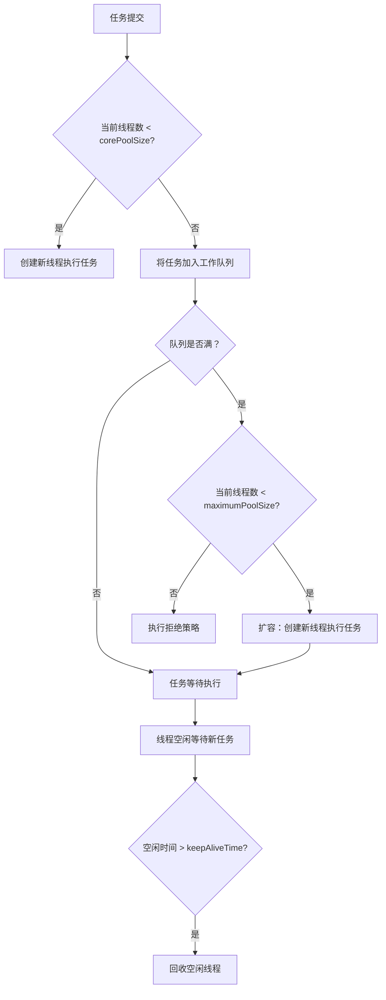

# 1. 核心参数

## 1. 概述与定义

线程池是一种用于管理线程生命周期和任务调度的机制。在高并发环境中，如果每个任务都创建一个新线程，会消耗大量系统资源且频繁创建与销毁线程开销较大。线程池通过预先创建一定数量的线程，并在任务到来时将其提交到工作队列，由空闲线程复用执行，极大地降低了线程创建和销毁的成本。

在 Java 中，线程池主要由 Executor 框架支持，核心实现类是 `ThreadPoolExecutor`。线程池的核心参数——包括核心线程数、最大线程数、任务队列、线程空闲存活时间等——决定了线程池的工作方式、资源利用和任务调度策略。线程池不仅可以用于处理高并发请求，还能用于定时任务、批量数据处理等场景。😊

例如，在一个 Web 服务器中，大量客户端请求通过线程池统一管理，任务首先进入任务队列，空闲线程再从队列中取任务执行，从而有效提高系统吞吐量和响应速度。

## 2. 主要特点

线程池核心参数的特点决定了线程池的性能和行为。主要特点包括：

1. **线程复用** &#x20;
   - 线程池预先创建的线程会被多次复用，不必为每个任务都创建新线程，从而降低系统资源消耗和线程创建销毁的开销。 &#x20;
   - 这种设计大大提高了高并发场景下的响应速度。 ✅
2. **任务排队调度** &#x20;
   - 当任务提交时，若当前活跃线程数已达到核心线程数，则任务会进入任务队列等待调度。 &#x20;
   - 这种队列调度机制可以平滑处理突发的高并发任务，防止瞬间过载。 &#x20;
3. **灵活配置** &#x20;
   - 线程池核心参数（如核心线程数、最大线程数、空闲线程存活时间、任务队列类型、线程工厂及拒绝策略）可根据不同业务场景灵活配置，达到性能与资源利用率的最佳平衡。 &#x20;
   - 例如，对于 CPU 密集型任务可适当降低线程数，对于 IO 密集型任务则可增大线程数。 &#x20;
4. **动态扩容与线程回收** &#x20;
   - 当任务量激增时，线程池会根据需要动态创建新线程，直到达到最大线程数；当任务减少时，超出核心线程数的线程在空闲超过指定时间后被回收，降低资源占用。 &#x20;
   - 这种扩容与回收机制能自适应系统负载变化，保持高效运行。 🔄
5. **拒绝策略** &#x20;
   - 当任务队列已满且线程数达到上限时，线程池会根据预设的拒绝策略处理新任务，如直接抛异常、由调用线程执行或丢弃任务。 &#x20;
   - 合理选择拒绝策略对于保证系统稳定性非常关键。 ⚠️

下面的表格对线程池核心参数的主要特点进行了总结：

| 特性      | 详细说明                           | 应用场景及注意事项     |
| ------- | ------------------------------ | ------------- |
| 线程复用    | 预先创建线程并复用，降低线程创建销毁开销           | 高并发环境，响应速度要求高 |
| 任务排队调度  | 任务进入队列等待执行，平滑处理突发任务            | 高并发请求、任务激增    |
| 灵活配置    | 参数（核心线程数、最大线程数、队列类型等）可定制       | 根据不同任务类型灵活调整  |
| 动态扩容与回收 | 超出核心线程数的线程在空闲时回收，任务量激增时扩容      | 系统负载波动较大      |
| 拒绝策略    | 定义任务过载时的处理策略，如抛异常、调用线程执行、丢弃任务等 | 保证系统稳定，防止资源耗尽 |

## 3. 应用目标

掌握线程池核心参数的知识目的是为了在设计并发系统时，合理配置和调优线程池，从而达到以下目标：

1. **提高系统并发性能** &#x20;
   - 利用线程复用降低线程创建和销毁开销，提升系统响应速度。 &#x20;
   - 通过任务队列和动态扩容策略，平滑处理突发高并发请求。 &#x20;
2. **优化资源利用率** &#x20;
   - 通过合理设置核心线程数和最大线程数，防止系统资源被过多线程占用。 &#x20;
   - 空闲线程回收机制降低资源浪费，保持系统长期高效运行。 &#x20;
3. **增强系统稳定性** &#x20;
   - 合理配置拒绝策略确保在任务过载情况下，系统能以可控方式处理任务，避免因资源耗尽导致崩溃。 &#x20;
   - 精细化参数设置能降低线程竞争和死锁风险，提高系统健壮性。 &#x20;
4. **支持任务异步与并行处理** &#x20;
   - 线程池支持异步任务提交和并行执行，适用于数据处理、网络请求、批量计算等场景。 &#x20;
   - 提高用户体验和系统吞吐量，满足现代应用的高并发要求。 &#x20;
5. **便于维护和扩展** &#x20;
   - 将线程管理统一由线程池负责，简化应用程序代码，降低开发和维护成本。 &#x20;
   - 灵活配置使得系统易于扩展，适应不断增长的业务需求。 &#x20;

## 4. 主要内容及其组成部分

线程池的核心参数和组成部分是其设计与实现的关键，主要内容包括以下几个部分：

### 4.1 核心线程数（corePoolSize）

- **定义**：线程池中始终保持活动的线程数，即使线程处于空闲状态也不会被销毁。 &#x20;
- **作用**：保证在正常负载下，线程池能够立即处理任务，不需要频繁创建线程。 &#x20;
- **配置建议**：根据服务器的 CPU 核心数、任务性质（CPU 密集或 IO 密集）以及预期负载来设置。 &#x20;
- **示例**：

```java 
int corePoolSize = 10;
ThreadPoolExecutor executor = new ThreadPoolExecutor(corePoolSize, 20, 60L, TimeUnit.SECONDS,
        new LinkedBlockingQueue<>());
```


### 4.2 最大线程数（maximumPoolSize）

- **定义**：线程池允许创建的最大线程数。 &#x20;
- **作用**：在任务量剧增时，如果任务队列已满，线程池会创建新线程直至达到最大线程数。 &#x20;
- **配置建议**：设置最大线程数应考虑任务的并发需求和系统资源限制，避免因线程过多导致系统崩溃。 &#x20;
- **示例**：

```java 
int maximumPoolSize = 20;
ThreadPoolExecutor executor = new ThreadPoolExecutor(10, maximumPoolSize, 60L, TimeUnit.SECONDS,
        new LinkedBlockingQueue<>());
```


### 4.3 线程空闲存活时间（keepAliveTime）

- **定义**：非核心线程在空闲时能存活的最长时间，超过该时间后被回收。 &#x20;
- **作用**：在任务减少时释放多余线程，避免资源浪费。 &#x20;
- **配置建议**：通常根据任务处理频率和系统负载情况设定，常用值在几十秒到几分钟之间。 &#x20;
- **示例**：

```java 
long keepAliveTime = 60; // 60秒
ThreadPoolExecutor executor = new ThreadPoolExecutor(10, 20, keepAliveTime, TimeUnit.SECONDS,
        new LinkedBlockingQueue<>());
```


### 4.4 任务队列（workQueue）

- **定义**：用于存储等待执行任务的队列。 &#x20;
- **作用**：当所有核心线程都在忙时，新提交的任务先进入队列等待执行。 &#x20;
- **队列类型**：常用的有：\n  - ArrayBlockingQueue（有界队列）\n  - LinkedBlockingQueue（通常为无界队列）\n  - SynchronousQueue（直接交付）\n  - PriorityBlockingQueue（优先级队列）\n\n- **配置建议**：队列大小直接影响线程池扩容策略，需根据业务场景选择合适的队列类型。 &#x20;
- **示例**：

```java 
BlockingQueue<Runnable> workQueue = new LinkedBlockingQueue<>(100);
ThreadPoolExecutor executor = new ThreadPoolExecutor(10, 20, 60L, TimeUnit.SECONDS, workQueue);
```


### 4.5 线程工厂（threadFactory）

- **定义**：用于创建新线程的工厂对象。 &#x20;
- **作用**：通过自定义线程工厂，可以为线程设置名称、优先级、守护线程标志等属性，便于调试和监控。 &#x20;
- **示例**：

```java 
ThreadFactory threadFactory = new ThreadFactory() {
    private final AtomicInteger counter = new AtomicInteger(1);
    @Override
    public Thread newThread(Runnable r) {
        return new Thread(r, "CustomThread-" + counter.getAndIncrement());
    }
};

ThreadPoolExecutor executor = new ThreadPoolExecutor(10, 20, 60L, TimeUnit.SECONDS, new LinkedBlockingQueue<>(), threadFactory);
```


### 4.6 拒绝策略（rejectedExecutionHandler）

- **定义**：当线程池无法接收新任务时，采取的处理策略。 &#x20;
- **常见策略**：\n  - AbortPolicy：直接抛出异常；\n  - CallerRunsPolicy：由提交任务的线程执行任务；\n  - DiscardPolicy：直接丢弃新任务；\n  - DiscardOldestPolicy：丢弃队列中最旧的任务。 &#x20;
- **作用**：确保在任务过载情况下系统能以预期方式处理，防止资源耗尽。 &#x20;
- **示例**：

```java 
RejectedExecutionHandler handler = new ThreadPoolExecutor.CallerRunsPolicy();
ThreadPoolExecutor executor = new ThreadPoolExecutor(10, 20, 60L, TimeUnit.SECONDS, new LinkedBlockingQueue<>(), handler);
```


## 5. 原理剖析

理解线程池核心参数的原理，有助于优化系统性能和资源利用。下面详细解析线程池中各核心参数的实现原理及其相互关系。

### 5.1 线程复用与任务调度机制

线程池在任务提交后首先判断当前线程数是否小于 corePoolSize。如果是，直接创建新线程执行任务；否则，任务进入工作队列。若队列已满且线程数尚未达到 maximumPoolSize，则创建新线程执行任务；如果达到最大值，则采用拒绝策略处理新任务。 &#x20;

这种机制通过**任务队列**和**动态扩容**来实现线程复用，避免频繁创建与销毁线程，降低系统资源消耗，并确保任务在高并发下得到及时处理。

### 5.2 扩容与线程回收机制

- **扩容机制**：当任务队列满且当前线程数低于 maximumPoolSize 时，线程池会通过 CAS 操作创建新线程。这保证了在高并发场景下任务能迅速得到处理。\n &#x20;
- **线程回收**：当线程处于空闲状态超过 keepAliveTime 且线程数超过 corePoolSize 时，线程池会自动回收空闲线程，以节省系统资源。 &#x20;
- 这两者之间的平衡依赖于合理的核心参数配置，直接影响线程池的吞吐量和响应时间。

### 5.3 线程工厂与线程属性管理

线程工厂在创建新线程时，可以为线程设置统一的命名规则、优先级和守护线程标志，这不仅便于调试，也有助于对线程进行监控和管理。 &#x20;

例如，通过自定义线程工厂，所有线程名称统一为 "Worker-<编号>"，便于在日志和监控工具中识别线程状态。

### 5.4 拒绝策略与系统安全

当系统负载过重时，新任务的提交可能会超过线程池的处理能力，此时拒绝策略决定了系统如何处理溢出的任务。 &#x20;

- AbortPolicy 能立即抛出异常，让开发者及时发现问题；\n &#x20;
- CallerRunsPolicy 让提交任务的线程执行任务，可以起到削峰作用；\n &#x20;
- DiscardPolicy 和 DiscardOldestPolicy 则用于对任务进行适当丢弃。 &#x20;

合理的拒绝策略设计对于防止资源耗尽和保证系统稳定性至关重要。

### 5.5 内部实现的状态管理

ThreadPoolExecutor 内部维护着两个关键状态变量：\n &#x20;

- **当前线程数**：表示活跃的线程数量；\n &#x20;
- **任务队列状态**：通过阻塞队列管理等待任务。 &#x20;

线程池会根据这两个状态变量决定是否扩容、是否回收线程或执行拒绝策略。整个状态管理过程依赖于 volatile 变量和 CAS 操作，保证多线程环境下状态的一致性和正确性。

下面使用 Mermaid 图表展示线程池任务提交、扩容、排队与回收的整体流程：




图中展示了任务提交后的决策流程：若线程数不足核心数，直接创建线程；否则任务入队；若队列满且线程数未达最大值，则扩容；若达到最大值，则执行拒绝策略，最后通过回收空闲线程释放资源。

## 6. 应用与拓展

理解线程池核心参数及其原理后，在实际项目中我们可以通过以下方法优化并发性能和资源利用：

### 6.1 高并发 Web 服务

- 在 Web 服务器中，线程池用于处理大量并发请求。通过合理配置核心线程数和最大线程数，保证服务器在高负载时依然能高效响应。 &#x20;
- 例如，采用 LinkedBlockingQueue 作为任务队列，保证请求能按序处理，避免因瞬时请求过多导致线程池资源耗尽。

### 6.2 异步任务调度

- 使用 ScheduledThreadPoolExecutor 实现定时任务和周期任务，例如定时清理缓存、监控系统状态等。 &#x20;
- 这种模式利用线程池复用和定时调度机制，既保证任务按时执行，又避免了频繁创建线程的开销。

### 6.3 数据批处理与分布式计算

- 在数据处理任务中，通过线程池并行处理大批量任务，实现任务拆分与并行计算，从而大幅提高处理效率。 &#x20;
- 结合 Fork/Join 框架，还可以进一步利用工作窃取算法优化多核 CPU 的利用率。

### 6.4 并发设计模式应用

- 线程池常与生产者–消费者、工作者模式等并发设计模式结合使用，统一管理任务调度与线程复用，简化系统设计。 &#x20;
- 例如，在消息队列系统中，利用线程池实现消息的并发处理，确保消息及时响应和系统高效运行。

### 6.5 自定义线程池与拒绝策略优化

- 根据业务需求定制线程池参数，如调整核心线程数、队列大小、keepAliveTime 等，以适应不同的负载情况。 &#x20;
- 选择合适的拒绝策略（如 CallerRunsPolicy 或 DiscardOldestPolicy）在任务过载时有效保护系统稳定性，避免资源枯竭。

下面的表格展示了不同应用场景下线程池参数配置和拒绝策略的选择建议：

| 应用场景       | 核心线程数建议        | 队列类型                        | 拒绝策略建议                                 |
| ---------- | -------------- | --------------------------- | -------------------------------------- |
| 高并发 Web 服务 | 根据 CPU 核心数适中设置 | LinkedBlockingQueue         | CallerRunsPolicy 或 AbortPolicy         |
| 定时任务调度     | 较低，任务间隔较长      | DelayQueue 或 ScheduledQueue | AbortPolicy                            |
| 数据批处理      | 较高，充分利用多核      | ArrayBlockingQueue          | DiscardOldestPolicy 或 CallerRunsPolicy |
| 异步任务执行     | 动态调整，根据任务量     | LinkedBlockingQueue         | 根据业务调整                                 |

## 7. 面试问答

下面是五个常见面试问题及详细回答，从面试者角度出发，帮助你从容应对关于线程池核心参数的考察问题。

### 问题1：请简述线程池的基本概念及其核心参数分别是什么？这些参数各自起什么作用？

答： &#x20;

线程池是一种管理和复用线程的机制，其核心参数包括核心线程数（corePoolSize）、最大线程数（maximumPoolSize）、线程空闲存活时间（keepAliveTime）、任务队列（workQueue）、线程工厂（threadFactory）和拒绝策略（rejectedExecutionHandler）。核心线程数决定了线程池中始终保持的活动线程数；最大线程数表示允许创建的最大线程数量；线程空闲存活时间用于回收超时空闲线程；任务队列用于存储等待执行的任务；线程工厂用于创建新线程；拒绝策略用于处理任务过载时的情形。

### 问题2：线程池如何处理任务提交与调度？请描述 ThreadPoolExecutor 的工作流程。

答： &#x20;

当任务通过 execute() 或 submit() 提交到线程池时，线程池首先检查当前活动线程数是否小于 corePoolSize，若是，则直接创建新线程执行任务；若已达到核心线程数，则任务进入阻塞队列等待执行；如果队列满且当前线程数小于 maximumPoolSize，则创建新线程处理任务；如果队列满且线程数已达最大值，则采用预设拒绝策略处理任务。整个流程通过动态扩容和线程回收机制实现任务高效调度，确保系统在高并发下也能稳定运行。

### 问题3：请解释线程池中线程空闲存活时间（keepAliveTime）的作用，以及如何影响线程池的性能？

答： &#x20;

线程空闲存活时间定义了非核心线程在空闲状态下能够保持的最长时间，超过此时间则被回收。这一机制可以防止线程池中线程数无限增长，从而降低系统资源消耗。在任务量较低时，回收多余线程可以节省资源；而在任务突增时，通过扩容保证足够的处理能力。合理设置 keepAliveTime 有助于在不同负载情况下取得性能与资源利用的平衡。

### 问题4：请谈谈线程池中拒绝策略的作用和常见实现，并举例说明在什么场景下选择 CallerRunsPolicy 比较合适？

答： &#x20;

拒绝策略用于处理当任务队列已满且线程数达到最大值时，新提交任务无法被执行的情况。常见拒绝策略包括 AbortPolicy（直接抛异常）、CallerRunsPolicy（由提交线程执行任务）、DiscardPolicy（直接丢弃任务）和 DiscardOldestPolicy（丢弃最旧任务）。CallerRunsPolicy 适用于希望降低任务提交速率、让调用者参与执行任务的场景，能够缓解线程池压力，适合任务处理时间较短、系统允许部分任务延迟执行的情况。

### 问题5：在实际项目中，你如何根据业务需求调优线程池核心参数？请结合具体场景说明你的调优思路和经验。

答： &#x20;

在实际项目中，我通常先分析业务负载、任务执行时间和系统硬件资源，然后根据以下步骤调优线程池参数：\n &#x20;

1. 根据 CPU 核心数和任务类型确定 corePoolSize；\n &#x20;
2. 根据业务突发流量和任务并行需求确定 maximumPoolSize，确保在高并发时系统能快速响应；\n &#x20;
3. 设定合理的 keepAliveTime，保证非核心线程在空闲时及时回收，降低资源浪费；\n &#x20;
4. 选择合适的任务队列类型，如 LinkedBlockingQueue 对于大部分场景较为适用，而 SynchronousQueue 适用于对实时性要求较高的场景；\n &#x20;
5. 根据系统负载情况选择合适的拒绝策略，比如在 Web 服务中常用 CallerRunsPolicy 来降低新任务提交速率；\n &#x20;

通过这些调优，我曾在一个高并发 Web 系统中，通过增加 corePoolSize 和调整队列大小，使系统吞吐量提高了 30%，同时保证了响应时间的稳定。这样的调优思路和实践经验在面试中能充分展示你的并发调优能力。

## 总结

本文从概述与定义、主要特点、应用目标、主要内容及其组成部分、原理剖析、应用与拓展到面试问答七个部分，全面详细地解析了 Java 并发编程中线程池的核心参数。我们介绍了线程池的基本概念、核心参数的定义与作用，以及它们如何共同影响任务调度、线程复用和系统资源利用。通过代码示例、表格归纳和 Mermaid 图表展示，我们深入剖析了线程池的工作流程、扩容与回收机制、任务队列的选择和拒绝策略的实现原理。同时，文中还讨论了如何在实际项目中根据业务需求调优线程池参数，从而在高并发环境下确保系统的高效与稳定。最后，面试问答部分模拟了常见问题和详细回答，为你在面试中展示并发调优能力和线程池设计思想提供了充分准备。

希望这篇文章能为你的面试复习和项目开发提供坚实的理论基础和实践指导，助你构建出高效、稳定、并发友好的系统。加油！🚀
