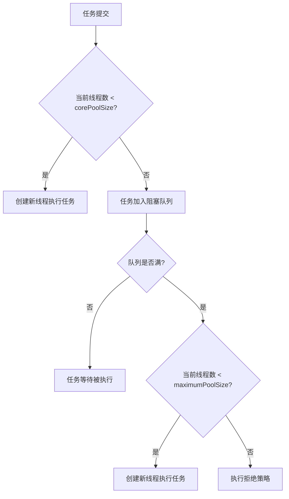

# 2. 阻塞队列

## 1. 概述与定义

在 Java 并发编程中，线程池（ThreadPool）用于高效管理线程资源，避免频繁创建和销毁线程所带来的开销。任务提交到线程池后，并不会立即创建新线程执行，而是先进入任务队列中等待调度。在这里，**阻塞队列**（BlockingQueue）起到了至关重要的作用：它既作为任务缓存区，又作为线程之间协调的桥梁。

阻塞队列是一种特殊的队列，它支持在插入元素或删除元素时，当队列满或为空时让调用线程等待，直到条件满足后再继续执行。这种机制避免了忙等待（Busy Waiting），提高了 CPU 利用率和系统响应速度。阻塞队列在 Java 中有多种实现，如 ArrayBlockingQueue、LinkedBlockingQueue、PriorityBlockingQueue、DelayQueue、SynchronousQueue 等，每种实现各有特点，适用于不同业务场景。😊

例如，在一个高并发 Web 服务中，请求任务提交到线程池后，若所有工作线程正忙，新任务会被放入阻塞队列等待空闲线程处理，从而避免系统资源耗尽。

## 2. 主要特点

阻塞队列在线程池中的主要特点包括：

1. **自动阻塞与唤醒** &#x20;
   - 当队列满时，插入操作自动阻塞，直到有空间；当队列为空时，删除操作自动阻塞，直到有新任务到来。 &#x20;
   - 这种机制避免了循环检查（busy-waiting），节省了 CPU 资源。 ✅
2. **线程安全** &#x20;
   - 阻塞队列内部采用了多种并发控制机制（如 ReentrantLock、CAS 等）保证数据操作的原子性和线程安全。 &#x20;
   - 即使在高并发环境下，也能确保任务的正确入队与出队。 🔒
3. **多种实现方式** &#x20;
   - Java 提供了多种阻塞队列实现，如有界队列（ArrayBlockingQueue）、无界队列（LinkedBlockingQueue）、优先级队列（PriorityBlockingQueue）以及特殊用途的 DelayQueue 和 SynchronousQueue。 &#x20;
   - 不同实现适应不同场景，如任务排队、优先级排序、定时任务调度等。 ⚙️
4. **与线程池的无缝集成** &#x20;
   - 线程池通过阻塞队列实现任务排队与调度，阻塞队列的选择直接影响线程池的性能和行为。 &#x20;
   - 例如，采用 LinkedBlockingQueue 时，任务可以无限排队，而使用 SynchronousQueue 则要求任务必须直接交由线程执行。 ⏳
5. **支持并发控制与扩展** &#x20;
   - 阻塞队列不仅能控制任务数量，还能根据实际业务需求动态调整容量，结合拒绝策略保障系统稳定性。 &#x20;
   - 这使得系统在负载变化时，既能保持高吞吐量，又能避免资源枯竭。 🔄

下面的表格总结了阻塞队列的主要特点和不同实现的应用场景：

| 特点      | 详细说明                                                              | 应用场景                    |
| ------- | ----------------------------------------------------------------- | ----------------------- |
| 自动阻塞与唤醒 | 队列满时插入操作阻塞，队列空时删除操作阻塞                                             | 任务排队、生产者-消费者模型          |
| 线程安全    | 内部通过锁机制和原子操作确保数据一致性                                               | 高并发环境下任务入队和出队           |
| 多种实现方式  | 提供 ArrayBlockingQueue、LinkedBlockingQueue、PriorityBlockingQueue 等 | 适应不同业务需求，如有界/无界队列、定时任务等 |
| 与线程池集成  | 作为线程池的任务缓存区，实现任务调度和线程复用                                           | Web 服务器、异步任务处理、分布式计算    |
| 扩展性     | 支持动态调整队列容量，结合拒绝策略应对任务过载                                           | 高负载系统、资源受限场景            |

## 3. 应用目标

了解阻塞队列在线程池中的应用目标，主要是为了实现高效、稳定的任务调度和线程复用，同时保障系统在高并发场景下不会因任务过载而崩溃。具体目标包括：

1. **提高并发处理效率** &#x20;
   - 阻塞队列使得任务提交与执行解耦，线程可以在任务队列中等待新任务，降低线程创建销毁开销，从而提高系统吞吐量。 &#x20;
   - 高效的任务排队机制能保证任务在高并发情况下被及时调度执行。 🚀
2. **平衡系统负载** &#x20;
   - 通过设置适当的队列容量，既能防止系统因瞬时任务激增而崩溃，又能保持足够的线程处理能力。 &#x20;
   - 队列容量与核心线程数、最大线程数协同作用，实现动态负载平衡。 🎯
3. **降低系统资源消耗** &#x20;
   - 阻塞队列自动阻塞插入或删除操作，避免了 CPU 的无谓循环检查，提高资源利用率。 &#x20;
   - 合理的队列设计可以减少上下文切换，提高系统整体性能。 ⚡
4. **确保系统稳定性与健壮性** &#x20;
   - 阻塞队列与线程池结合使用，通过拒绝策略在任务超载时安全地处理溢出任务，保证系统不会因资源耗尽而崩溃。 &#x20;
   - 在高负载下，能够及时将任务排队等待，确保系统稳定运行。 🔒
5. **支持灵活扩展与动态调优** &#x20;
   - 阻塞队列的选择和配置能够根据业务需求灵活调整，适应不同场景下的任务提交速率和执行时间。 &#x20;
   - 动态调优机制使得系统能在负载变化时自动优化性能，保证长时间稳定运行。 🔄

## 4. 主要内容及其组成部分

本部分详细介绍阻塞队列在线程池中的主要内容及其组成部分，主要包括队列的实现方式、特性、参数配置及使用示例。

### 4.1 阻塞队列的基本概念

阻塞队列是一种支持阻塞操作的队列，主要提供以下功能：

- 当队列为空时，获取元素的操作会阻塞当前线程直到有元素可取；
- 当队列满时，插入元素的操作会阻塞当前线程直到队列有空间；
- 阻塞队列通过 put()、take() 等方法实现阻塞读写，帮助协调线程间的任务传递。

### 4.2 阻塞队列的主要实现

Java 中常用的阻塞队列实现有以下几种，每种都有不同特点和应用场景：

1. **ArrayBlockingQueue** &#x20;
   - 基于数组实现的有界阻塞队列，固定容量。 &#x20;
   - 适用于任务量有上限、需要严格控制内存占用的场景。
2. **LinkedBlockingQueue** &#x20;
   - 基于链表实现的阻塞队列，默认无界，但可以设置容量上限。 &#x20;
   - 适合任务量较大或波动较大的场景，能够提供较好的吞吐量。
3. **PriorityBlockingQueue** &#x20;
   - 支持优先级排序的无界阻塞队列，任务按照优先级顺序出队。 &#x20;
   - 适用于对任务执行顺序有排序要求的场景，如按紧急程度调度任务。
4. **DelayQueue** &#x20;
   - 用于定时任务的阻塞队列，队列中元素只有在延迟期满后才能出队。 &#x20;
   - 常用于调度任务、超时任务等场景。
5. **SynchronousQueue** &#x20;
   - 不存储元素的阻塞队列，每个 put 操作必须等待相应的 take 操作，适用于任务直接交付的场景。 &#x20;
   - 常用于任务提交与线程直接交付之间的桥梁。

下面的表格对常用阻塞队列进行了对比说明：

| 队列类型                  | 数据结构  | 是否有界 | 主要特点                     | 适用场景            |
| --------------------- | ----- | ---- | ------------------------ | --------------- |
| ArrayBlockingQueue    | 数组    | 有界   | 固定容量，内存占用均衡，适用于稳定任务量     | 系统负载较稳定、任务量有限   |
| LinkedBlockingQueue   | 链表    | 默认无界 | 动态扩展，可设置上限，吞吐量高          | 任务量波动较大、高并发场景   |
| PriorityBlockingQueue | 堆     | 无界   | 支持优先级排序，任务按优先级出队         | 需要任务排序、紧急任务调度   |
| DelayQueue            | 链表    | 无界   | 元素只能在延迟期满后出队，适用于定时任务     | 定时任务、超时控制       |
| SynchronousQueue      | 无存储结构 | 无界   | 每个插入操作必须等待对应的删除操作，直接交付任务 | 任务直接交付、高并发、缓存设计 |

### 4.3 阻塞队列在线程池中的作用

在线程池（ThreadPoolExecutor）中，阻塞队列起着以下关键作用：

- **任务缓冲** &#x20;

  当核心线程已满时，提交的新任务会进入阻塞队列等待空闲线程处理。任务队列的大小和类型直接影响线程池的行为和性能。
- **平滑负载** &#x20;

  阻塞队列可以平衡任务提交和任务处理之间的速率，避免因瞬间大量任务提交而导致线程池过载或频繁扩容。
- **拒绝策略触发依据** &#x20;

  如果任务队列达到设定的上限，同时线程数已达 maximumPoolSize，新任务则会触发拒绝策略，从而保护系统资源不被耗尽。

### 4.4 参数配置与调优

在实际项目中，配置阻塞队列时需考虑以下方面：

- 队列容量：有界队列可以限制任务数量，防止系统资源被占满；无界队列则可能导致任务无限堆积。
- 队列类型：根据任务特性选择适合的队列，如 IO 密集型任务适合使用无界队列，实时性要求高的任务适合使用 SynchronousQueue。
- 拒绝策略：当队列满时，选择合适的拒绝策略确保系统稳定运行。

## 5. 原理剖析

理解阻塞队列的底层实现原理对于优化线程池性能和解决并发问题具有重要意义，下面详细剖析其关键原理。

### 5.1 阻塞与唤醒机制

- 阻塞队列内部通过 Lock 和 Condition 实现同步控制。当队列为空时，调用 take() 的线程会进入等待状态，直到有新任务入队；当队列满时，调用 put() 的线程会等待队列有空间。 &#x20;
- Condition 的 await() 与 signal()/signalAll() 方法实现了线程间的等待与唤醒，确保线程在条件不满足时阻塞，条件满足后被唤醒并重新竞争锁。

### 5.2 内部实现机制

以 LinkedBlockingQueue 为例，其内部采用链表结构存储任务，并使用 ReentrantLock 实现同步控制。其基本实现逻辑为：

- **入队操作（put）**：获取锁后检查队列是否满，若满则调用 Condition.await() 进入等待状态；否则，将任务节点加入链表末尾，调用 Condition.signal() 唤醒等待的线程。
- **出队操作（take）**：获取锁后检查队列是否为空，若为空则调用 Condition.await() 进入等待状态；否则，从链表头部取出任务节点，调用 Condition.signal() 唤醒等待的入队线程。

### 5.3 内存可见性与线程安全

- 阻塞队列中的所有同步操作均在内部锁保护下执行，保证了多线程对队列操作的原子性和内存可见性。 &#x20;
- 同时，通过使用 volatile 关键字和内存屏障机制，确保对队列状态的修改能在所有线程间及时生效。

### 5.4 任务队列与线程池扩容

- 当任务提交到线程池时，首先尝试将任务加入阻塞队列。如果队列未满，任务直接排队；若队列满且线程数尚未达到 maximumPoolSize，则线程池创建新线程执行任务。 &#x20;
- 这一过程利用了阻塞队列的边界条件判断和线程池扩容策略，两者之间紧密耦合，共同决定了任务调度的效率和系统的吞吐量。

下面使用 Mermaid 图表展示线程池中阻塞队列与扩容的工作流程：

图中展示了任务提交后，线程池如何依据当前线程数和队列状态决定是否直接执行、排队等待、扩容或触发拒绝策略。

## 6. 应用与拓展

掌握阻塞队列的使用和原理后，可以在实际项目中灵活应用并进行优化。以下是常见的应用与拓展方向：

### 6.1 高并发任务调度

- 在高并发场景中，线程池结合阻塞队列可以有效管理大量任务请求。通过合理配置队列容量和核心线程数，确保任务能及时执行且不会因瞬时高负载而导致系统崩溃。

### 6.2 异步与定时任务

- 使用 ScheduledThreadPoolExecutor 结合 DelayQueue 等阻塞队列实现定时任务调度，如缓存刷新、任务超时处理等。 &#x20;
- 这种机制既能保证任务在预定时间内执行，也能在任务过载时通过队列缓冲实现平滑调度。

### 6.3 生产者–消费者模型

- 阻塞队列是实现生产者–消费者模型的核心组件。生产者将任务放入队列，消费者从队列中取任务执行。 &#x20;
- 这种模式能有效协调线程间的生产与消费，避免忙等待，提高资源利用率。

### 6.4 自定义阻塞队列

- 根据业务需求，可以定制自己的阻塞队列，例如增加统计信息、优先级调度或结合特殊拒绝策略。 &#x20;
- 通过对现有阻塞队列（如 LinkedBlockingQueue）的扩展，可以满足更复杂的业务场景需求。

### 6.5 与其他并发工具结合

- 阻塞队列可以与 CountDownLatch、Semaphore、CyclicBarrier 等并发工具结合使用，实现更复杂的线程协调和任务调度。 &#x20;
- 例如，在分布式系统中，阻塞队列与这些工具结合使用，可以实现任务的统一调度和流量控制。

下面的表格展示了阻塞队列在不同场景下的应用示例与拓展方向：

| 应用场景      | 主要用途                                 | 队列类型及建议                                  |
| --------- | ------------------------------------ | ---------------------------------------- |
| 高并发任务调度   | 统一管理大量并发任务，保证及时调度                    | LinkedBlockingQueue 或 ArrayBlockingQueue |
| 定时任务与超时处理 | 实现任务定时执行、超时重试                        | DelayQueue                               |
| 生产者–消费者模型 | 协调任务生产与消费，平衡系统负载                     | SynchronousQueue 或 LinkedBlockingQueue   |
| 自定义队列     | 根据业务需求扩展队列功能，实现优先级调度                 | 自定义扩展 ArrayBlockingQueue                 |
| 并发工具结合    | 与 CountDownLatch、Semaphore 等协同实现任务调度 | 结合使用现有阻塞队列和并发工具                          |

## 7. 面试问答

下面是五个常见面试问题及详细回答，帮助你在面试中从容应对有关线程池中阻塞队列的考察问题：

### 问题1：请简述阻塞队列的基本概念和在线程池中的作用是什么？

答： &#x20;

阻塞队列是一种支持在队列空时阻塞读取、队列满时阻塞写入的线程安全队列。在线程池中，阻塞队列起到缓冲任务的作用，当所有线程都忙时，新任务会被放入队列等待执行。这样既能平滑处理突发高并发任务，又能避免系统因线程频繁创建而浪费资源。

### 问题2：请说明 ArrayBlockingQueue 与 LinkedBlockingQueue 的区别及各自的优缺点？

答： &#x20;

ArrayBlockingQueue 基于数组实现，容量固定，内存占用较小，适合任务量相对稳定的场景；而 LinkedBlockingQueue 基于链表实现，默认容量无界，能够动态扩展，适用于任务量波动较大的场景，但可能会因无限制增长导致内存耗尽。面试时我会说明在高并发 Web 应用中，通常选择 LinkedBlockingQueue，并设置上限以防止资源耗尽。

### 问题3：什么是 SynchronousQueue？它在任务调度中的作用和特点是什么？

答： &#x20;

SynchronousQueue 是一种特殊的阻塞队列，不存储元素，每个 put 操作必须等待一个 take 操作。它常用于任务直接交付的场景，在某些线程池中可以用来实现无缓冲的任务传递。优点是任务传递延迟低，适用于实时性要求高的场景；缺点是队列不具备缓存功能，任务提交必须立即有线程接收。

### 问题4：请解释阻塞队列如何实现线程间的自动阻塞与唤醒机制？

答： &#x20;

阻塞队列内部通常使用 Lock 与 Condition 实现同步控制。当线程调用 put() 方法时，如果队列已满，调用线程会进入等待状态（await()）；当有线程调用 take() 并从队列中取出元素后，会调用 signal() 唤醒等待线程。同理，当队列为空时，调用 take() 的线程会等待，直到有新元素加入后被唤醒。这个自动阻塞与唤醒机制有效避免了忙等待，提高了资源利用率。

### 问题5：在实际项目中，你如何根据业务需求选择合适的阻塞队列实现，并调优相关参数？

答： &#x20;

在实际项目中，我会根据业务需求选择阻塞队列的实现。例如：\n &#x20;

- 如果任务量稳定且对内存要求严格，可以选择 ArrayBlockingQueue；\n &#x20;
- 如果任务波动较大，且需要较高吞吐量，则选择 LinkedBlockingQueue，并设置合理上限；\n &#x20;
- 对于定时任务和超时任务，则使用 DelayQueue；\n &#x20;
- 同时，我会根据系统负载、任务提交速率和响应时间进行调优，监控任务队列长度和线程池状态，动态调整队列容量和线程池参数，确保系统稳定性和高效响应。\n\n这种调优过程通常依赖于压力测试和实际运行监控，调优经验能充分展示你对并发系统设计的深入理解。

## 总结

本文从概述与定义、主要特点、应用目标、主要内容及其组成部分、原理剖析、应用与拓展以及面试问答七个部分，全面详细地解析了 Java 并发编程中线程池阻塞队列的相关知识。我们首先介绍了阻塞队列的概念及其在线程池中的作用，指出它能够有效缓解任务高并发时的压力，并保证任务能够有序排队与调度。接着，详细讨论了 ArrayBlockingQueue、LinkedBlockingQueue、PriorityBlockingQueue、DelayQueue 和 SynchronousQueue 等主要实现的特点、优缺点以及适用场景，并通过表格直观展示不同队列的对比。文章还从原理角度深入剖析了阻塞队列的内部实现，包括其如何利用 Lock 与 Condition 实现自动阻塞与唤醒机制、内存可见性以及与线程池扩容、任务调度之间的关系，通过 Mermaid 图展示了任务提交、排队、扩容和拒绝策略的整个流程。最后，面试问答部分从面试者角度模拟了常见问题和详细回答，涵盖了阻塞队列的基本概念、不同队列实现的区别、自动阻塞与唤醒机制、以及如何根据业务需求调优线程池参数等内容，帮助你在面试中从容应对考察问题。

希望这篇文章能为你的面试复习和项目开发提供充分的理论依据和实践指导，助你构建出高效、稳定、并发友好的系统。加油！🚀
