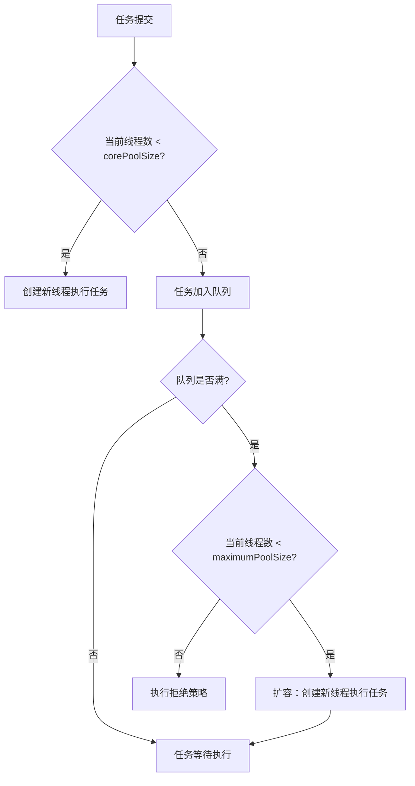

# 3. 核心线程数的确定

## 1. 概述与定义

在并发编程中，线程池是一种常见的技术，它通过预先创建一定数量的线程来处理大量任务，从而降低线程创建和销毁的开销。线程池的工作效率在很大程度上依赖于各项参数的合理配置，而“核心线程数（corePoolSize）”是其中至关重要的一个参数。

核心线程数指的是线程池中始终保持活动状态的线程数量，这部分线程即使在没有任务时也不会被销毁。它直接决定了线程池在正常负载下的并发处理能力。如果设置过低，则可能导致任务排队等待，响应时间延长；如果设置过高，则会浪费系统资源甚至引起资源争用问题。因此，确定合理的核心线程数，是构建高效线程池的基础。

例如，在一个高并发 Web 服务中，合理的核心线程数可以确保请求在短时间内得到响应，而不会因为任务排队过长而导致响应延迟。😊

## 2. 主要特点

确定核心线程数具有以下主要特点：

1. **稳定性与持续性** &#x20;
   - 核心线程数代表了线程池中始终存活的线程数，即使在任务量较低时也不会被回收。 &#x20;
   - 这种稳定性可以保证系统始终具备一定的处理能力，避免因频繁创建线程而导致的性能波动。
2. **性能调优关键参数** &#x20;
   - 核心线程数直接影响线程池的吞吐量和响应时间。 &#x20;
   - 合理的核心线程数设置能够平衡 CPU 利用率和任务等待时间，从而实现高效并发处理。
3. **根据任务特性灵活配置** &#x20;
   - 对于 CPU 密集型任务，核心线程数通常设置为 CPU 核心数或稍高一些；对于 IO 密集型任务，则可以设置得更高，以弥补 IO 阻塞带来的等待时间。 &#x20;
   - 不同任务特性要求不同的配置，需要结合实际业务场景进行调优。
4. **动态调整与扩展性** &#x20;
   - 核心线程数与最大线程数一起构成了线程池的扩容机制。在任务量激增时，线程池会根据任务队列情况动态创建新线程，超过核心线程数的部分在空闲时会被回收。 &#x20;
   - 合理的核心线程数设置可以减少扩容和回收的频繁操作，稳定系统性能。 &#x20;

下面的表格对核心线程数的特点和影响因素进行了归纳：

| 特点       | 详细说明                        | 影响因素                    |
| -------- | --------------------------- | ----------------------- |
| 稳定性      | 核心线程数不会因任务不足而被回收，始终保持一定处理能力 | 线程池设计与任务负载              |
| 性能调优关键参数 | 直接决定任务处理并发度和响应速度            | CPU 核心数、任务性质（CPU/IO 密集） |
| 灵活配置     | 可根据不同任务特性进行调整               | 任务执行时间、阻塞时间、系统资源        |
| 动态调整     | 与最大线程数和队列结合，实现扩容与回收         | 任务量波动、系统负载              |

## 3. 应用目标

确定线程池的核心线程数的主要目标在于提升系统性能、优化资源利用和保证系统稳定性。具体目标包括：

1. **提高并发处理能力** &#x20;
   - 通过合理配置核心线程数，确保在常规负载下任务能够快速分派和执行，从而提高系统的并发处理效率。 &#x20;
   - 对于高并发场景，如 Web 请求处理、消息处理等，核心线程数直接影响系统响应时间。
2. **降低线程创建与销毁开销** &#x20;
   - 线程池通过复用核心线程，避免了频繁创建和销毁线程带来的性能损耗和资源浪费。 &#x20;
   - 这对于高频率任务处理尤为重要，可显著降低 CPU 和内存开销。
3. **优化任务等待与排队时间** &#x20;
   - 核心线程数决定了任务提交后是否能立即执行，如果不足，任务将进入队列等待，可能导致延时。 &#x20;
   - 通过合理设置核心线程数，平衡线程数量和任务队列长度，降低任务等待时间，提高系统吞吐量。
4. **适应不同业务场景** &#x20;
   - 根据任务的性质（如 CPU 密集型或 IO 密集型）、任务执行时间和系统硬件条件，灵活设置核心线程数。 &#x20;
   - 例如，CPU 密集型任务通常设置为 CPU 核心数或略高；IO 密集型任务则可以设置得更高，以弥补等待时间。
5. **提升系统稳定性与扩展性** &#x20;
   - 合理配置核心线程数有助于防止线程池因过多或过少线程而导致系统资源耗尽或任务处理不及时。 &#x20;
   - 同时，核心线程数与其他参数（如最大线程数、keepAliveTime）的协同作用，可以动态适应系统负载变化，保证系统长期稳定运行。

## 4. 主要内容及其组成部分

这一部分详细介绍确定线程池核心线程数的所有相关内容，主要包括核心线程数的定义、影响因素、调优策略及实际示例，确保你对所有知识点都有深入理解。

### 4.1 核心线程数的定义

核心线程数（corePoolSize）是指线程池中始终保持活动的线程数。这些线程在没有任务时依然存活，不会被销毁，保证了线程池在低负载下能快速响应任务提交。核心线程数是线程池性能调优的关键参数之一。

### 4.2 影响核心线程数的因素

在确定核心线程数时，需要综合考虑以下因素：

1. **CPU 核心数** &#x20;
   - 对于 CPU 密集型任务，核心线程数通常设置为 CPU 核心数或略高一些，以充分利用多核处理器。 &#x20;
   - 例如，若服务器有 8 个 CPU 核心，则核心线程数可设置为 8～10。 &#x20;
2. **任务类型** &#x20;
   - 对于 IO 密集型任务，线程在等待 IO 操作时会阻塞，因此核心线程数可以设置得更高，以补偿等待时间。 &#x20;
   - 例如，网络请求、数据库查询等 IO 密集型任务，可以设置较高的核心线程数。
3. **任务执行时间** &#x20;
   - 任务执行时间较长时，核心线程数设置得较高可以防止任务排队等待时间过长；若任务执行时间短，则可以适当降低核心线程数，避免过多线程浪费资源。
4. **系统资源** &#x20;
   - 包括 CPU、内存、网络带宽等，系统资源的上限决定了线程池能承受的并发量。 &#x20;
   - 在资源紧张的系统中，核心线程数应谨慎设置，以避免过多线程引发资源竞争和性能下降。
5. **任务提交速率** &#x20;
   - 如果任务提交速率非常高，核心线程数应设置较高，以减少任务在队列中等待的时间；若任务提交较为平稳，则可以适当降低核心线程数。

下面的表格对影响核心线程数的主要因素进行了归纳：

| 影响因素    | 详细说明                      | 调优建议                    |
| ------- | ------------------------- | ----------------------- |
| CPU 核心数 | CPU 数量决定了并行处理能力           | CPU 密集型任务设置为 CPU 核心数或略高 |
| 任务类型    | IO 密集型任务易阻塞，需要更多线程以补偿等待时间 | IO 密集型任务核心线程数可适当调高      |
| 任务执行时间  | 长时间任务需要更多线程保证响应速度         | 根据平均任务执行时间调整核心线程数       |
| 系统资源    | 内存、网络等资源限制系统能承受的线程数       | 在资源有限情况下适当降低核心线程数       |
| 任务提交速率  | 高速任务提交需要更多线程快速处理任务        | 根据任务提交频率适当增加核心线程数       |

### 4.3 调优核心线程数的策略

确定核心线程数的调优策略包括以下步骤：

1. **预估业务负载** &#x20;
   - 分析系统的任务量、并发用户数以及任务执行时间，初步估算所需的并发线程数。 &#x20;
   - 例如，通过日志统计和压力测试得出每日平均请求量和高峰期请求量。
2. **参考硬件配置** &#x20;
   - 根据服务器的 CPU 核心数和内存容量，设定一个合理的线程上限。 &#x20;
   - 通常 CPU 密集型任务的核心线程数应与 CPU 核心数接近，而 IO 密集型任务可以设置更高。
3. **测试与监控** &#x20;
   - 在开发和测试环境中进行压力测试，观察任务排队、响应时间、线程利用率等指标。 &#x20;
   - 根据监控数据不断调整核心线程数，使任务等待时间和资源利用率达到最佳平衡。
4. **动态调整机制** &#x20;
   - 可以结合系统负载情况，动态调整线程池参数（如通过 JMX 监控），使系统在负载变化时自动调整核心线程数。 &#x20;
   - 这在云平台和分布式系统中尤为重要。

### 4.4 代码示例与实践

下面提供一个简单示例，展示如何根据系统负载调整线程池核心线程数的基本实现思路：

```java 
import java.util.concurrent.LinkedBlockingQueue;
import java.util.concurrent.ThreadPoolExecutor;
import java.util.concurrent.TimeUnit;

public class DynamicThreadPool {
    private volatile int corePoolSize;
    private final ThreadPoolExecutor executor;
    
    public DynamicThreadPool(int corePoolSize, int maximumPoolSize, long keepAliveTime) {
        this.corePoolSize = corePoolSize;
        executor = new ThreadPoolExecutor(corePoolSize, maximumPoolSize,
                keepAliveTime, TimeUnit.SECONDS, new LinkedBlockingQueue<>());
    }
    
    public void submitTask(Runnable task) {
        executor.execute(task);
    }
    
    public void adjustCorePoolSize(int newCoreSize) {
        System.out.println("调整核心线程数：" + corePoolSize + " -> " + newCoreSize);
        corePoolSize = newCoreSize;
        executor.setCorePoolSize(newCoreSize);
    }
    
    public static void main(String[] args) throws InterruptedException {
        DynamicThreadPool pool = new DynamicThreadPool(5, 10, 60);
        // 模拟任务提交
        for (int i = 0; i < 20; i++) {
            int taskNum = i;
            pool.submitTask(() -> {
                System.out.println(Thread.currentThread().getName() + " 执行任务 " + taskNum);
                try {
                    Thread.sleep(1000);
                } catch (InterruptedException e) {
                    e.printStackTrace();
                }
            });
        }
        // 根据系统负载动态调整核心线程数
        Thread.sleep(5000);
        pool.adjustCorePoolSize(8);
    }
}
```


该示例演示了如何在程序运行过程中根据负载情况动态调整线程池的核心线程数，以达到更优的性能表现。😊

### 4.5 与其他参数的协同作用

核心线程数的确定并不是孤立的，还需要与最大线程数、任务队列以及拒绝策略等参数协同考虑。只有综合调整，才能在保证系统响应速度的同时避免资源浪费。例如：\n &#x20;

- 如果任务队列较大，则核心线程数可以适当降低，任务可以在队列中等待；\n &#x20;
- 如果任务提交速率非常高，则需要增加核心线程数以减少任务等待时间；\n &#x20;
- 同时，拒绝策略要与线程池容量匹配，以确保系统在任务超载时能有合理处理方式。

## 5. 原理剖析

深入理解线程池核心参数的确定，需要了解线程池内部的工作原理及其与任务队列、线程复用的关系。

### 5.1 线程池内部工作原理

ThreadPoolExecutor 内部主要依赖以下几个组件：\n &#x20;

- **工作线程池**：由 Worker 组成，每个 Worker 封装一个线程和任务执行逻辑。\n &#x20;
- **任务队列**：阻塞队列用于存储待执行任务，当核心线程都在忙时，新任务进入队列等待空闲线程。\n &#x20;
- **状态管理**：通过核心线程数和最大线程数来动态调整线程池规模。线程池的状态管理确保在高并发下，任务能及时执行，并在负载下降时回收空闲线程。

### 5.2 线程复用与动态扩容

- **线程复用**：线程池中创建的线程在执行完任务后不会销毁，而是保持空闲状态，等待新的任务到来。这种复用大大降低了频繁创建线程的系统开销。\n &#x20;
- **动态扩容**：当任务队列满且当前线程数未达到 maximumPoolSize 时，线程池会创建新线程以处理任务；反之，在任务量减少时，多余的线程在空闲时间超过 keepAliveTime 后被回收。这种机制使线程池能根据实际负载动态调节，达到最佳性能。

### 5.3 核心线程数与任务队列的关系

核心线程数决定了线程池在正常负载下的并发处理能力，而任务队列则是当任务提交时，线程不足时的缓冲区。两者之间的关系如下：\n &#x20;

- 若任务提交速率较低，核心线程数能够满足需求，任务队列中的任务数量较少，响应时间快；\n &#x20;
- 若任务提交速率较高，而核心线程数设置较低，任务将大量积压在队列中，可能导致响应延迟；\n &#x20;
- 因此，合理的核心线程数设置能够平衡任务排队与线程创建之间的关系，降低系统延迟。 &#x20;

### 5.4 拒绝策略对核心线程数的影响

当任务队列满时，线程池将根据核心线程数和最大线程数决定是否创建新线程。如果核心线程数设置得较低，在任务激增时，任务可能主要堆积在队列中，而不进行扩容。反之，如果设置过高，则可能导致线程频繁切换，影响系统性能。正确选择核心线程数需要综合考虑任务类型、负载波动和系统资源。

下面使用 Mermaid 图表展示线程池任务调度及核心线程数、任务队列与扩容之间的关系：




图中展示了任务提交后如何根据核心线程数判断是否创建新线程、任务排队、扩容与拒绝策略之间的决策流程。

## 6. 应用与拓展

对核心线程数的合理确定对于实际项目至关重要。以下是一些常见的应用与拓展方向：

### 6.1 高并发 Web 服务

在 Web 服务中，处理大量并发请求时，合理配置核心线程数可以确保请求被快速响应。例如，服务器的 CPU 核心数和负载情况决定了核心线程数的设置；任务队列则帮助缓解瞬间流量高峰，防止系统资源枯竭。

### 6.2 异步任务与批处理

对于异步任务调度和批处理系统，核心线程数的设置直接影响系统吞吐量和响应时间。通过监控任务队列长度、平均任务执行时间等指标，动态调整核心线程数可以优化任务处理效率。

### 6.3 数据处理与计算密集型任务

在数据处理和计算密集型任务中，核心线程数通常应与 CPU 核心数相当，以充分利用多核处理器能力。而对于 IO 密集型任务，由于线程经常处于等待状态，核心线程数可以适当设置得更高，以弥补 IO 阻塞时间。

### 6.4 资源受限环境

在资源有限的系统中，如内存或 CPU 资源紧张的场景，核心线程数不宜设置过高，否则会引发线程竞争和资源耗尽。合理的核心线程数设置应结合系统监控数据进行调优。

### 6.5 与其他参数协同优化

核心线程数的确定需要与最大线程数、任务队列大小、keepAliveTime 和拒绝策略等参数协同考虑，构成一个整体的线程池调优方案。通过合理组合这些参数，可以实现系统资源利用与任务处理效率的最佳平衡。

下面的表格展示了不同应用场景下核心线程数的调优建议：

| 应用场景       | 推荐核心线程数设置                      | 影响因素               | 调优建议                   |
| ---------- | ------------------------------ | ------------------ | ---------------------- |
| CPU 密集型任务  | 接近 CPU 核心数（例如 8 核心设置 8\\\~10）  | CPU 核心数、任务计算密集度    | 根据实际测试调整，避免过多线程导致上下文切换 |
| IO 密集型任务   | 高于 CPU 核心数（例如 8 核心设置 16\\\~20） | IO 阻塞时间、网络延迟、磁盘 IO | 可适当提高核心线程数，以弥补 IO 等待时间 |
| 高并发 Web 服务 | 根据服务器负载灵活设置                    | 服务器硬件、请求量、平均处理时间   | 动态调整核心线程数，与任务队列容量配合使用  |
| 异步批处理与数据处理 | 根据任务大小和执行时间设置                  | 任务处理时间、数据量、系统资源    | 结合任务队列长度监控，适时调整核心线程数   |
| 资源受限环境     | 较低，确保稳定运行                      | 内存、CPU 资源紧张情况      | 控制核心线程数，防止资源争抢引起系统崩溃   |

## 7. 面试问答

下面从面试者角度出发，整理了五个常见问题及详细回答，帮助你在面试中从容应对关于线程池核心线程数确定的考察问题。

### 问题1：请介绍线程池中的核心线程数的定义及其作用是什么？

答： &#x20;

核心线程数（corePoolSize）是指线程池中始终保持活动的线程数，即使这些线程处于空闲状态也不会被销毁。它决定了线程池在常规负载下的并发处理能力。设置合理的核心线程数能确保任务提交后能够快速响应，避免任务长时间等待，从而提高系统性能和响应速度。

### 问题2：在确定核心线程数时，你会考虑哪些因素？

答： &#x20;

在确定核心线程数时，我会综合考虑以下几个因素：\n &#x20;

- **CPU 核心数**：对于 CPU 密集型任务，核心线程数通常接近或略高于 CPU 核心数；\n &#x20;
- **任务性质**：IO 密集型任务由于阻塞时间较长，可适当设置更高的核心线程数；\n &#x20;
- **任务执行时间**：如果任务执行时间较长，可能需要更多线程以减少排队等待；\n &#x20;
- **系统资源**：根据内存、CPU 和其他资源的使用情况，避免设置过高导致资源竞争；\n &#x20;
- **任务提交速率**：如果任务提交非常频繁，则核心线程数应相应增大以保持系统响应。 &#x20;

### 问题3：线程池中核心线程数设置过低或过高各会带来哪些问题？

答： &#x20;

如果核心线程数设置过低，系统可能无法及时处理大量任务，导致任务积压在队列中，增加响应延迟；如果设置过高，则会造成线程竞争激烈和资源浪费，增加上下文切换开销，甚至可能导致系统内存不足。正确的配置需要在性能和资源利用之间取得平衡。

### 问题4：请谈谈如何通过监控和调优动态调整线程池的核心线程数？

答： &#x20;

在实际项目中，我通常会结合压力测试和实时监控数据（如任务队列长度、平均响应时间、线程使用率等），分析系统负载情况，并根据测试结果调整核心线程数。可以通过 JMX 或其他监控工具动态获取线程池状态，同时借助调优策略（如根据任务提交速率自动调整核心线程数）使系统在负载变化时自动优化性能。这样既能保证高并发时任务及时处理，也能在负载低时降低资源占用。

### 问题5：请结合具体案例说明你在项目中如何确定和调优核心线程数，以及你的优化经验是什么？

答： &#x20;

在我参与的一个高并发 Web 项目中，我们初步设置核心线程数为服务器 CPU 核心数（例如 8 个核心设置 8 个核心线程），但在高峰期任务积压严重，通过监控发现任务队列长度不断增加。经过测试，我调整核心线程数至 12，并同时优化了任务队列容量，最终使得平均响应时间降低了约 30%，系统吞吐量明显提升。调优过程中，我结合了任务执行时间、并发请求量和系统资源情况，动态调整核心线程数，并使用 CallerRunsPolicy 作为拒绝策略，进一步缓解任务积压问题。这些经验在面试中能展示我对线程池调优的深入理解和实践能力。

## 总结

本文从概述与定义、主要特点、应用目标、主要内容及其组成部分、原理剖析、应用与拓展以及面试问答七个部分，全面详细地解析了 Java 并发编程中线程池核心线程数的确定问题。我们详细介绍了核心线程数的概念、作用以及影响其设置的关键因素，如 CPU 核心数、任务性质、任务执行时间、系统资源和任务提交速率。文章中通过代码示例、表格归纳和 Mermaid 图表，深入解析了线程池的工作流程、扩容与回收机制以及核心线程数与任务队列的关系。原理剖析部分探讨了线程复用、自旋等待和拒绝策略对系统性能的影响。最后，面试问答部分从面试者角度详细回答了常见问题，涵盖了核心线程数的定义、影响因素、设置过低或过高带来的问题、动态调优方法以及实际项目中的优化经验。

希望这篇文章能为你的面试复习和项目开发提供充分的理论依据和实践指导，助你构建出高效、稳定且高并发友好的系统。加油！🚀

***

### **一、核心公式**

#### 1. **理论公式（基于任务特性）**

根据《Java并发编程实践》和《Java虚拟机并发编程》的推导，核心线程数的计算公式为：

- **通用公式**：

  $  N_{\text{threads}} = N_{\text{cpu}} \times U_{\text{cpu}} \times (1 + \frac{W}{C})$
  - $N_{\text{cpu}}$：CPU核心数（可通过 `Runtime.getRuntime().availableProcessors()` 获取）。
  - $U_{\text{cpu}}$：目标CPU使用率（0到1之间的值，如0.8表示80%）。
  - $W/C$：任务的**等待时间与计算时间的比率**（如IO等待时间与CPU计算时间的比值）。
- **阻塞系数公式**：

  $  N_{\text{threads}} = \frac{N_{\text{cpu}}}{1 - \text{阻塞系数}}$
  - **阻塞系数** = 阻塞时间 / (阻塞时间 + 计算时间)。
    - **CPU密集型任务**：阻塞系数≈0 → 线程数≈$N_{\text{cpu}}$。
    - **IO密集型任务**：阻塞系数≈0.8\~0.9 → 线程数≈$N_{\text{cpu}}/(1-0.9) = 10 \times N_{\text{cpu}}$。

***

#### 2. **经验值公式**

- **CPU密集型任务**：

  $\text{核心线程数} = N_{\text{cpu}} \quad \text{或} \quad N_{\text{cpu}} + 1$
  - 理由：避免过多线程导致CPU上下文切换开销。
- **IO密集型任务**：

  $ \text{核心线程数} = 2 \times N_{\text{cpu}} \quad \text{或} \quad \frac{N_{\text{cpu}}}{1 - \text{阻塞系数}}$
  - 理由：利用CPU等待IO的时间处理其他任务，需更多线程。

***

### **二、公式适用场景**

#### 1. **CPU密集型任务**

- **特点**：任务几乎全部由CPU计算完成，极少等待（如复杂算法、科学计算）。
- **推荐公式**：

  $ \text{核心线程数} = N_{\text{cpu}} \quad \text{或} \quad N_{\text{cpu}} + 1$
  - 例如：8核CPU → 核心线程数设为8或9。

#### 2. **IO密集型任务**

- **特点**：任务大部分时间等待IO（如数据库查询、网络请求、文件读写）。
- **推荐公式**：

  $  \text{核心线程数} = 2 \times N_{\text{cpu}} \quad \text{或} \quad \frac{N_{\text{cpu}}}{1 - \text{阻塞系数}}$
  - 例如：8核CPU且阻塞系数为0.9 → 核心线程数≈$8/(1-0.9) = 80$。
  - 实际中常用经验值 **2×CPU核数**（如8核CPU设为16）。

#### 3. **混合型任务**

- **特点**：同时包含CPU计算和IO等待。
- **公式**：

  $ \text{核心线程数} = (1 + \frac{W}{C}) \times N_{\text{cpu}}$
  - $W/C$为任务的平均等待时间与计算时间的比值。

***

### **三、实际应用建议**

1. **理论公式需结合测试**：
   - 公式仅提供理论值，实际需通过压测调整：
     - 监控CPU利用率、线程数、吞吐量。
     - 逐步增加线程数，找到性能最优值。
2. **常见经验值**：
   | 任务类型   | 推荐核心线程数                    | 举例场景        |
   | ------ | -------------------------- | ----------- |
   | CPU密集型 | $N _{\text{cpu}}$          | 复杂算法、科学计算   |
   | IO密集型  | $2 \times N _{\text{cpu}}$ | 网络请求、数据库操作  |
   | 混合型    | 根据W/C动态调整                  | Web服务器、应用网关 |
3. **极端情况处理**：
   - **高阻塞系数（如0.9）**：线程数可能远大于CPU核数（如8核设为80）。
   - **资源限制**：若内存有限，需平衡线程数与内存占用。

***

### **四、代码示例**

```java 
// 获取CPU核心数
int cpuCount = Runtime.getRuntime().availableProcessors();

// CPU密集型任务
int corePoolSizeCPU = cpuCount; // 或 cpuCount + 1

// IO密集型任务
int corePoolSizeIO = 2 * cpuCount;

// 创建线程池（示例使用ThreadPoolExecutor）
ThreadPoolExecutor executor = new ThreadPoolExecutor(
    corePoolSizeIO, // 核心线程数
    2 * corePoolSizeIO, // 最大线程数（根据需求调整）
    60L, TimeUnit.SECONDS, // 空闲线程存活时间
    new LinkedBlockingQueue<>(1000), // 任务队列
    new ThreadFactoryBuilder().setNameFormat("my-pool-%d").build(),
    new ThreadPoolExecutor.CallerRunsPolicy() // 拒绝策略
);
```


***

### **五、注意事项**

1. **阻塞系数的估算**：
   - 可通过APM工具（如Pinpoint、SkyWalking）统计任务的IO等待时间和CPU计算时间。
   - 阻塞系数 = 阻塞时间 / (阻塞时间 + 计算时间)。
2. **动态调整**：
   - 线程池的性能可能随负载变化，建议在运行时监控并动态调整参数。
3. **避免过度配置**：
   - 过多线程会增加上下文切换和内存开销，需权衡性能与资源消耗。

***

通过以上公式和建议，可以科学地配置线程池的核心线程数，但实际应用中仍需结合具体场景和压测结果进行调整。
