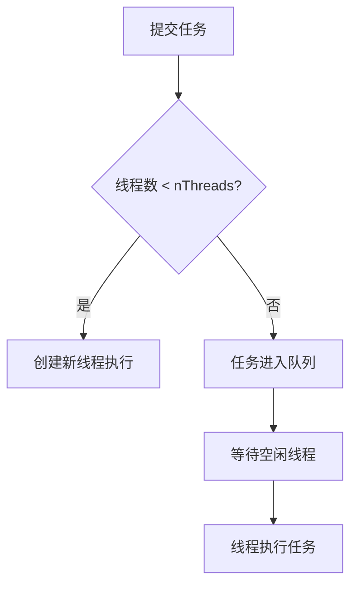

# 4. 线程池的种类

# Java面试八股文：线程池种类详解

***

## 1. 概述与定义

线程池（Thread Pool）是Java并发编程中用于管理和复用线程的核心工具。简单来说，它是一个线程的容器，通过预先创建一定数量的线程并加以管理，避免频繁创建和销毁线程带来的性能开销。在Java中，线程池的核心实现基于`java.util.concurrent`包下的`ThreadPoolExecutor`类，而常见的线程池种类则通过`Executors`工具类提供了一些预定义的实现。

线程池种类的定义可以概括为：根据任务处理需求和线程管理策略的不同，Java提供了多种线程池实现，每种线程池适用于特定的场景。例如，固定大小线程池适合稳定任务负载，缓存线程池适合短时任务爆发式增长，而单线程池则适合严格的任务顺序执行。

在面试中，考官通常会关注你对线程池种类及其适用场景的理解，因此掌握每种线程池的定义和特性至关重要。接下来，我们将从主要特点入手，逐步展开。

***

## 2. 主要特点

线程池种类各有千秋，其主要特点可以总结为以下几点：

- **线程复用**：所有线程池都通过复用已有线程减少创建和销毁的开销。
- **任务管理**：通过队列机制管理任务，控制任务的执行顺序和并发度。
- **灵活性与场景适配**：不同线程池种类针对不同任务负载提供了优化方案。
- **资源控制**：通过核心线程数、最大线程数、队列容量等参数限制资源占用。
- **异常处理**：线程池内部提供机制捕获任务执行中的异常，避免线程崩溃。

例如，`FixedThreadPool`以固定线程数为核心特点，适合长期运行的任务；而`CachedThreadPool`则以动态线程创建为特点，适合短生命周期任务。这些特点将在后续内容中结合实例详细展开。

***

## 3. 应用目标

线程池种类的应用目标主要集中在以下几个方面：

1. **提升性能**：通过线程复用减少资源消耗，适合高并发场景。
2. **任务调度**：合理分配任务执行顺序，避免线程竞争或资源耗尽。
3. **简化开发**：屏蔽底层线程管理细节，让开发者专注于业务逻辑。
4. **资源优化**：根据业务需求动态调整线程数量，防止OOM（Out of Memory）等问题。

在面试中，考官可能会问：“为什么不用`new Thread`而要用线程池？”答案可以从这些目标出发，强调性能和资源管理的优势。

***

## 4. 主要内容及其组成部分

Java中常见的线程池种类主要由`Executors`类提供，包括以下几种实现。我们将逐一详细解释其构造、参数和适用场景。

### 4.1 FixedThreadPool（固定线程池）

- **构造方式**：`Executors.newFixedThreadPool(int nThreads)`
- **核心参数**：线程数固定为`nThreads`，任务队列为`LinkedBlockingQueue`（无界队列）。
- **特点**：线程数量固定，不会动态扩展，任务超出线程数时进入队列等待。
- **适用场景**：任务负载稳定且可预测的场景，如Web服务器处理请求。

```java 
import java.util.concurrent.ExecutorService;
import java.util.concurrent.Executors;

public class FixedThreadPoolDemo {
    public static void main(String[] args) {
        ExecutorService pool = Executors.newFixedThreadPool(2); // 固定2个线程
        for (int i = 0; i < 5; i++) {
            pool.execute(() -> {
                System.out.println(Thread.currentThread().getName() + " 执行任务");
                try { Thread.sleep(1000); } catch (Exception e) {}
            });
        }
        pool.shutdown();
    }
}
```


运行结果：只有2个线程交替执行5个任务，多余任务在队列中等待。

### 4.2 CachedThreadPool（缓存线程池）

- **构造方式**：`Executors.newCachedThreadPool()`
- **核心参数**：核心线程数为0，最大线程数为`Integer.MAX_VALUE`，队列为`SynchronousQueue`。
- **特点**：线程数动态增长，空闲线程60秒后回收，适合短时高并发任务。
- **适用场景**：大量短生命周期任务，如异步事件处理。

```java 
ExecutorService pool = Executors.newCachedThreadPool();
for (int i = 0; i < 10; i++) {
    pool.execute(() -> {
        System.out.println(Thread.currentThread().getName() + " 执行");
    });
}
pool.shutdown();
```


运行时，线程数会根据任务量动态增加，任务完成后线程可能被回收。

### 4.3 SingleThreadExecutor（单线程池）

- **构造方式**：`Executors.newSingleThreadExecutor()`
- **核心参数**：线程数固定为1，队列为`LinkedBlockingQueue`。
- **特点**：任务顺序执行，保证单一线程处理所有任务。
- **适用场景**：需要严格顺序执行的任务，如日志记录。

```java 
ExecutorService pool = Executors.newSingleThreadExecutor();
for (int i = 0; i < 3; i++) {
    pool.execute(() -> System.out.println(Thread.currentThread().getName() + " 执行"));
}
pool.shutdown();
```


运行结果：任务按提交顺序逐一执行，线程始终为同一个。

### 4.4 ScheduledThreadPool（定时线程池）

- **构造方式**：`Executors.newScheduledThreadPool(int corePoolSize)`
- **核心参数**：核心线程数为`corePoolSize`，支持定时和周期性任务。
- **特点**：支持延迟执行和定时循环执行。
- **适用场景**：定时任务，如心跳检测。

```java 
import java.util.concurrent.ScheduledExecutorService;
import java.util.concurrent.TimeUnit;

ScheduledExecutorService pool = Executors.newScheduledThreadPool(1);
pool.scheduleAtFixedRate(() -> System.out.println("定时任务"), 0, 2, TimeUnit.SECONDS);
```


运行结果：每2秒执行一次任务。

### 4.5 WorkStealingPool（工作窃取线程池）

- **构造方式**：`Executors.newWorkStealingPool()`
- **核心参数**：基于Fork/Join框架实现，线程数默认与CPU核心数相关。
- **特点**：线程间任务窃取，适合任务分解场景。
- **适用场景**：递归、分治算法，如并行计算。

以下表格总结了线程池种类的特性：

| 线程池类型                | 核心线程数 | 最大线程数                | 队列类型                | 适用场景    |
| -------------------- | ----- | -------------------- | ------------------- | ------- |
| FixedThreadPool      | 固定    | 固定                   | LinkedBlockingQueue | 稳定任务负载  |
| CachedThreadPool     | 0     | Integer.MAX\\\_VALUE | SynchronousQueue    | 短时高并发任务 |
| SingleThreadExecutor | 1     | 1                    | LinkedBlockingQueue | 顺序执行任务  |
| ScheduledThreadPool  | 固定    | 固定                   | DelayedWorkQueue    | 定时任务    |
| WorkStealingPool     | 可调    | 可调                   | 无显式队列               | 并行任务分解  |

**表格说明**：表格清晰展示了每种线程池的核心参数和适用场景，面试时可直接引用这些特性回答问题。

***

## 5. 原理剖析

线程池种类的底层实现基于`ThreadPoolExecutor`，其构造函数为：

```java 
ThreadPoolExecutor(int corePoolSize, int maximumPoolSize, long keepAliveTime, 
                   TimeUnit unit, BlockingQueue<Runnable> workQueue)
```


### 5.1 FixedThreadPool原理

- **核心线程数和最大线程数相等**：`corePoolSize = maximumPoolSize = nThreads`。
- **无界队列**：使用`LinkedBlockingQueue`，任务超出线程数时排队。
- **运行流程**：提交任务时，若线程数未达上限，则创建新线程；否则任务进入队列等待。

Mermaid图示运行流程：




### 5.2 CachedThreadPool原理

- **核心线程数为0**：无预创建线程，任务到来时动态创建。
- **SynchronousQueue**：无容量，任务直接交给线程执行，若无空闲线程则创建新线程。
- **线程回收**：空闲线程超过60秒（`keepAliveTime`）被回收。

### 5.3 SingleThreadExecutor原理

- **单一线程**：`corePoolSize = maximumPoolSize = 1`。
- **任务顺序性**：队列存储任务，单一线程按序执行。

### 5.4 ScheduledThreadPool原理

- **延迟队列**：使用`DelayedWorkQueue`，任务按时间排序。
- **定时调度**：线程不断从队列中获取到期任务执行。

### 5.5 WorkStealingPool原理

- **Fork/Join框架**：每个线程维护独立的任务队列，空闲线程可从其他线程队列“窃取”任务。
- **并行优化**：减少线程竞争，提升多核CPU利用率。

**深入剖析**：线程池的核心在于任务分配与线程管理的平衡。例如，`CachedThreadPool`的`SynchronousQueue`要求任务立即执行，若无线程可用则创建新线程，可能导致线程数失控。而`FixedThreadPool`的无界队列则可能引发任务积压，内存溢出风险需注意。

***

## 6. 应用与拓展

线程池种类在实际开发中应用广泛，以下是一些典型场景：

- **Web服务**：使用`FixedThreadPool`处理HTTP请求，控制并发度。
- **批量任务**：`CachedThreadPool`处理突发性短任务，如批量文件上传。
- **日志系统**：`SingleThreadExecutor`确保日志顺序写入。
- **定时任务**：`ScheduledThreadPool`实现定时数据同步。
- **并行计算**：`WorkStealingPool`优化递归算法，如快速排序。

**拓展**：在生产环境中，建议直接使用`ThreadPoolExecutor`自定义线程池，而非`Executors`，因为预定义线程池可能隐藏参数调整的灵活性。例如，手动设置队列容量和拒绝策略可避免资源耗尽。

***

## 7. 面试问答

以下是从面试者视角出发的详细回答，模拟真实场景。

### 7.1 问题：线程池有哪些种类？分别适用于什么场景？

**回答**： &#x20;

面试官好！Java中常见的线程池种类由`Executors`提供，主要有五种： &#x20;

1. **`FixedThreadPool`**：固定线程数的线程池，适合任务负载稳定的场景，比如Web服务器处理请求。我用过它来控制并发数，避免线程过多。 &#x20;
2. **`CachedThreadPool`**：动态线程数的线程池，适合短时高并发任务，比如异步事件处理。它线程数可以无限增长，但空闲60秒会回收。 &#x20;
3. **`SingleThreadExecutor`**：单线程池，保证任务顺序执行，适合日志系统或需要严格顺序的场景。 &#x20;
4. **`ScheduledThreadPool`**：支持定时任务，我在项目中用它做过心跳检测，每隔5秒检查一次服务状态。 &#x20;
5. **`WorkStealingPool`**：基于Fork/Join框架，适合并行分解任务，比如大数据计算。 &#x20;

每种线程池都有针对性，实际开发中我会根据任务特点选择合适的类型。

### 7.2 问题：CachedThreadPool有什么风险？

**回答**： &#x20;

`CachedThreadPool`的风险主要在于它的线程数没有上限，最大线程数是`Integer.MAX_VALUE`。如果任务量突然激增，比如大量用户同时请求，就会创建大量线程，可能导致内存溢出或CPU占用过高。我在项目中遇到过这种情况，后来改用`ThreadPoolExecutor`，设置了最大线程数和有界队列，解决了问题。另外，它用的是`SynchronousQueue`，任务必须立即执行，积压任务时会加剧线程创建。

### 7.3 问题：FixedThreadPool和SingleThreadExecutor有什么区别？

**回答**： &#x20;

两者的区别主要在线程数和使用场景上。`FixedThreadPool`可以指定多个线程，比如`newFixedThreadPool(3)`，有3个线程并行处理任务，适合多任务并发。而`SingleThreadExecutor`固定只有一个线程，所有任务按顺序执行，适合需要严格顺序的场景，比如日志写入。底层实现上，它们都用`LinkedBlockingQueue`，但线程数的不同决定了并发能力的差异。

### 7.4 问题：如何选择线程池？

**回答**： &#x20;

选择线程池要看任务特点。如果任务量稳定，我就选`FixedThreadPool`，控制线程数；如果任务短且突发性强，我用`CachedThreadPool`；如果需要顺序执行，就选`SingleThreadExecutor`；定时任务用`ScheduledThreadPool`；并行计算选`WorkStealingPool`。实际项目中，我更倾向于自定义`ThreadPoolExecutor`，因为可以精确设置核心线程数、最大线程数和队列容量，还能定义拒绝策略，灵活性更高。

### 7.5 问题：线程池种类底层是怎么实现的？

**回答**： &#x20;

线程池种类的底层都是基于`ThreadPoolExecutor`实现的。比如`FixedThreadPool`的核心线程数和最大线程数相等，用无界队列存储任务；`CachedThreadPool`核心线程数为0，最大线程数无上限，用`SynchronousQueue`直接分配任务；`ScheduledThreadPool`用`DelayedWorkQueue`支持定时调度。参数不同决定了它们的行为差异，核心逻辑是任务分配和线程复用，面试官如果有具体种类想深入聊，我可以再展开讲讲！

***

## 总结

本文从线程池种类的概述开始，详细剖析了五种常见线程池的特点、原理和应用场景，结合代码示例、表格和Mermaid图增强理解，特别为面试场景设计了详尽的问答内容。无论是背诵还是实际应用，这篇文章都能帮助Java工程师在面试中脱颖而出！🚀
